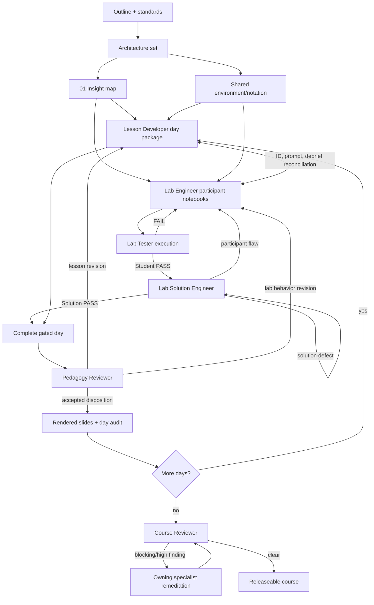

# Artifact Generation and Ownership Plan

## Purpose

This plan turns the canonical architecture into a controlled multi-agent production workflow. It assigns one accountable owner to every artifact, makes dependencies explicit, prevents participant/instructor leakage, and defines the execution and review gates required before release.

The Course Orchestrator treats workspace files as durable shared state. Every delegation must name its inputs, exact outputs, constraints, acceptance criteria, and require a short summary plus files changed.

## Controlling Inputs

All producers must read the files relevant to their task in this order:

1. `neural-networks-outline.md` - authoritative scope and sequence.
2. `.github/copilot-instructions.md` - repository-wide content and separation rules.
3. `standards/content-contract.md`, `standards/pedagogy-rubric.md`, `standards/quality-rubric.md`.
4. `courseware/00-course-blueprint.md` - canonical IDs, scope decisions, paths, and time budgets.
5. The relevant split design file under `courseware/00-course-design/`.
6. `courseware/01-insight-map.md` after it is produced.
7. Existing artifacts from earlier prerequisite days where terminology or code contracts are reused.

No downstream agent may rename IDs, alter a canonical notebook path, add a primary lab, or move an objective between days without a Course Architect/Orchestrator reconciliation in the blueprint and all affected design files.

## Ownership Matrix

| Role | Accountable outputs | Required inputs | Acceptance responsibility |
|---|---|---|---|
| Course Architect | `00-course-blueprint.md` and all files in `00-course-design/` | Outline, standards, repository instructions | Objective coverage, pacing, lab density, paths, scope labels, dependency coherence |
| Insight Generator | `courseware/01-insight-map.md` | Outline and architecture set | Explanations, analogies, visuals, misconceptions, modern connections, prediction opportunities, source-check flags |
| Lesson Developer | Daily Student Guides, day-local challenge/check prompts, daily instructor guides, central instructor challenge/check rationales, slide sources, shared glossary/notation contributions | Architecture, objectives, flow, lab map, insight map | Instructor-ready narrative, lab integration, active-learning rhythm, no solution leakage, exact timing/IDs/paths |
| Lab Engineer | 15 day-local participant notebooks, canonical `courseware/capstone/capstone-starter.ipynb`, pre-course readiness notebook, participant-safe shared lab helpers | Lab map, objective map, Student Guide integration contract, insight map | Runnable starter state, focused TODOs, prediction-before-run, visible evidence, troubleshooting, CPU/Colab practicality, no answers |
| Lab Tester | Participant execution reports under `courseware/reviews/` and `courseware/validation/student-lab-test-report.md` | Final participant notebook candidates and environment contract | Fresh execution, TODO solvability, outputs, ranges, deliberate failures, runtime, Colab/CPU, interestingness, Student PASS decisions and consolidated status |
| Lab Solution Engineer | 15 central solution notebooks, canonical instructor-only `courseware/capstone/capstone-solution.ipynb`, capstone case key, detailed solution reports, and `courseware/validation/instructor-solution-test-report.md` | Student-PASS notebooks and participant validation reports | Complete answers/reasoning, clean execution, expected evidence, recovery notes, leakage scan, Solution PASS decisions and consolidated status |
| Pedagogy Reviewer | `pedagogy-day-1.md` through `pedagogy-day-4.md` and `courseware/validation/pedagogy-review.md` | Complete day packages with both lab gates | Progression, load, activity quality, visual reasoning, transfer, assessment alignment, pacing, dispositions, and consolidated status |
| Course Reviewer | `courseware/99-final-quality-report.md` and `courseware/validation/final-course-review.md` | Complete course, validation ledger, pedagogy dispositions, rendered slides | Independent detailed review plus consolidated release decision |
| Course Orchestrator | Delegation order, conflict resolution, artifact ledger/audit, revision loops, slide/render completion, final release state | Every artifact and report | Dependency enforcement, gate status, cross-file consistency, unresolved-finding disposition |

## Planned Artifact Tree and Owners

### Architecture and shared contracts

| Path | Owner | Depends on | Gate |
|---|---|---|---|
| `courseware/00-course-blueprint.md` | Course Architect | Outline + standards | Architecture audit |
| `courseware/00-course-design/course-architecture.md` | Course Architect | Canonical blueprint | Architecture audit |
| `courseware/00-course-design/learning-objectives.md` | Course Architect | Outline objective set | Objective equality audit |
| `courseware/00-course-design/course-flow.md` | Course Architect | Blueprint timing/IDs | 450-minute and ID audit |
| `courseware/00-course-design/lab-map.md` | Course Architect | Objective/flow map | 16-lab schema/path audit |
| `courseware/00-course-design/artifact-generation-plan.md` | Course Architect | All architecture files | Ownership/dependency audit |
| `courseware/01-insight-map.md` | Insight Generator | Complete architecture set | Orchestrator relevance/source-flag review |
| `courseware/shared/environment.md` | Lab Engineer, approved by Lab Tester | Lab dependency/runtime plan | Clean environment smoke test |
| `courseware/shared/glossary.md` | Lesson Developer | All objectives/lessons | Cross-day terminology audit |
| `courseware/shared/notation-and-style.md` | Lesson Developer + Lab Engineer | Architecture technical contract | Lesson/notebook consistency audit |
| `courseware/shared/pre-course-readiness.ipynb` | Lab Engineer | Environment contract | Lab Tester setup PASS; not a primary lab |
| `courseware/shared/assets/` | Owning producer per asset | Lesson/lab/slide need | Link, license/source, and render audit |

### Participant day packages

| Day | Student Guide | Participant challenge | Participant assessment | Lab placement | Owner and gate dependencies |
|---|---|---|---|---|---|
| 1 | `courseware/day-1/student-guide/day-1-student-guide.md` | `courseware/day-1/challenges/day-1-challenges.md` | `courseware/day-1/assessments/day-1-checks.md` | Four `courseware/day-1/labs/LAB-D1-*.ipynb` paths from the lab map | Lesson Developer owns guide/challenge/check after architecture + insight map; Lab Engineer owns labs after shared contract; Orchestrator link/ID check precedes Student testing |
| 2 | `courseware/day-2/student-guide/day-2-student-guide.md` | `courseware/day-2/challenges/day-2-challenges.md` | `courseware/day-2/assessments/day-2-checks.md` | Four `courseware/day-2/labs/LAB-D2-*.ipynb` paths from the lab map | Same owners/gates, plus stable Day 1 terminology and interfaces |
| 3 | `courseware/day-3/student-guide/day-3-student-guide.md` | `courseware/day-3/challenges/day-3-challenges.md` | `courseware/day-3/assessments/day-3-checks.md` | Four `courseware/day-3/labs/LAB-D3-*.ipynb` paths from the lab map | Same owners/gates, plus stable Day 2 training contracts and data/cache preflight |
| 4 | `courseware/day-4/student-guide/day-4-student-guide.md` | `courseware/day-4/challenges/day-4-challenges.md` | `courseware/day-4/assessments/day-4-checks.md` | Three `courseware/day-4/labs/LAB-D4-0[1-3]-*.ipynb` paths plus canonical `courseware/capstone/capstone-starter.ipynb` | Same owners/gates, plus stable Day 3 evidence contracts; capstone Student PASS gates its solution |

### Instructor packages

| Path | Owner | Depends on | Separation rule |
|---|---|---|---|
| `courseware/instructor-guide/day-1-instructor-guide.md` through `day-4-instructor-guide.md` | Lesson Developer | Matching Student Guide, flow, lab map | Never linked from participant files |
| `courseware/instructor-solutions/day-1/day-1-challenges-SOLUTION.md` and `courseware/instructor-solutions/day-1/day-1-checks-SOLUTION.md` | Lesson Developer | Day 1 participant challenge/check drafts + lesson integration gate | Rationales/answers remain instructor-only |
| `courseware/instructor-solutions/day-2/day-2-challenges-SOLUTION.md` and `courseware/instructor-solutions/day-2/day-2-checks-SOLUTION.md` | Lesson Developer | Day 2 participant challenge/check drafts + stable Day 1 contract | Rationales/answers remain instructor-only |
| `courseware/instructor-solutions/day-3/day-3-challenges-SOLUTION.md` and `courseware/instructor-solutions/day-3/day-3-checks-SOLUTION.md` | Lesson Developer | Day 3 participant challenge/check drafts + stable Day 2 contract | Rationales/answers remain instructor-only |
| `courseware/instructor-solutions/day-4/day-4-challenges-SOLUTION.md` and `courseware/instructor-solutions/day-4/day-4-checks-SOLUTION.md` | Lesson Developer | Day 4 participant challenge/check drafts + capstone rubric | Rationales/answers remain instructor-only |
| The 15 non-capstone solution paths under `courseware/instructor-solutions/day-*/` from the lab map | Lab Solution Engineer | Corresponding Student PASS notebook + participant validation report | One solution per non-capstone primary lab; never embedded or hidden in participant notebook |
| `courseware/instructor-solutions/day-4/capstone-case-key.md` | Lab Solution Engineer | All capstone case runs | Anonymous profile diagnosis, acceptable interventions, calibrated ranges |

### Capstone support package

| Path | Owner | Audience | Depends on | Gate/function |
|---|---|---|---|---|
| `courseware/capstone/capstone-student-guide.md` | Lesson Developer | Participant | Day 4 flow, objectives, challenge/check contracts | Orchestrator ID/link review; contains problem, constraints, evidence board, defense, and deliverables without diagnosis |
| `courseware/capstone/capstone-starter.ipynb` | Lab Engineer | Participant | Lab map, shared environment, Student Guide integration point | Canonical `LAB-D4-04` participant notebook; must earn Student PASS |
| `courseware/capstone/capstone-solution.ipynb` | Lab Solution Engineer | Instructor only | `LAB-D4-04` Student PASS + participant validation report | Canonical `LAB-D4-04` solution; clean run + leakage scan required for Solution PASS |
| `courseware/capstone/capstone-rubric.md` | Lesson Developer | Participant | Outline weights, `OBJ-D4-01` through `OBJ-D4-08` | Assessment alignment and scoring audit; contains no answer key |
| `courseware/capstone/capstone-instructor-guide.md` | Lesson Developer | Instructor only | Capstone starter candidate, rubric, case design | Instructor integration/pedagogy gate; contains cases, pacing, hints, reveal, calibration, and recovery |
| `courseware/instructor-solutions/day-4/capstone-case-key.md` | Lab Solution Engineer | Instructor only | All canonical capstone solution case runs | Supplements the canonical solution with causes, alternatives, and calibrated ranges |

The top-level solution and instructor guide are required names but remain instructor-only: participant files must not link to them, and participant release packaging must exclude them. No mirror of the solution notebook is produced under `courseware/instructor-solutions/`; the case key is supplementary rather than executable duplication.

### Slides

| Source and render | Owner | Depends on | Required checks |
|---|---|---|---|
| `courseware/slides/day-1-see-it.md` and `.pdf` | Lesson Developer; Orchestrator coordinates render | Day 1 Student/Instructor Guides and final lab visuals | IDs, timing, alt text/notes, clipping, links, readability |
| `courseware/slides/day-2-train-it.md` and `.pdf` | Lesson Developer; Orchestrator coordinates render | Day 2 package | Same checks; NumPy/PyTorch comparison consistency |
| `courseware/slides/day-3-scale-it.md` and `.pdf` | Lesson Developer; Orchestrator coordinates render | Day 3 package | Same checks; images/assets/source notes and attention caveat |
| `courseware/slides/day-4-think-like-an-ml-engineer.md` and `.pdf` | Lesson Developer; Orchestrator coordinates render | Day 4/capstone package | Same checks; capstone brief/rubric agreement |

Slide directories may not be treated as placeholders. A day package is incomplete until editable source and a render-checked delivery artifact both exist.

### Reviews and release records

| Path pattern | Owner | Count/trigger |
|---|---|---|
| `courseware/reviews/participant-validation-LAB-Dx-yy.md` | Lab Tester | 16, after each participant candidate |
| `courseware/reviews/solution-validation-LAB-Dx-yy.md` | Lab Solution Engineer | 16, only after Student PASS |
| `courseware/reviews/pedagogy-day-x.md` | Pedagogy Reviewer | 4, after complete gated day package |
| `courseware/reviews/source-verification.md` | Course Orchestrator consolidates producer evidence | Before final review; current APIs/claims/weights checked against primary sources |
| `courseware/reviews/slide-render-validation.md` | Course Orchestrator | After four source decks render |
| `courseware/reviews/artifact-audit.md` | Course Orchestrator | Updated at each day gate and before final review |
| `courseware/99-final-quality-report.md` | Course Reviewer | Initial final review and final confirmation after remediation |

### Consolidated validation deliverables

These files summarize and link the detailed reports above; they do not replace them.

| Path | Accountable owner | Gate dependencies | Completion gate |
|---|---|---|---|
| `courseware/validation/student-lab-test-report.md` | Lab Tester | All 16 `courseware/reviews/participant-validation-LAB-Dx-yy.md` reports dispositioned | Lists every Student PASS/PASS WITH NOTES status, environment/runtime evidence, unresolved notes, and detailed-report links |
| `courseware/validation/instructor-solution-test-report.md` | Lab Solution Engineer | All 16 Student gates plus all 16 `courseware/reviews/solution-validation-LAB-Dx-yy.md` reports dispositioned | Lists every Solution PASS/PASS WITH NOTES status, clean-run/leakage evidence, unresolved notes, and detailed-report links |
| `courseware/validation/pedagogy-review.md` | Pedagogy Reviewer | Four gated day packages and four `courseware/reviews/pedagogy-day-x.md` dispositions | Consolidates cross-day progression, load, assessment, visual, and transfer findings with detailed-report links |
| `courseware/validation/final-course-review.md` | Course Reviewer | Student, solution, and pedagogy validation rollups; artifact/source/slide audits; detailed `courseware/99-final-quality-report.md` | Records final release decision and links all controlling evidence; no unresolved blocking/high finding for `RELEASE PASS` |

## Production Dependency Graph

## Generation Waves

### Wave 0 - Architecture: complete in this phase

**Owner:** Course Architect.

- Produce the six required Phase 1 artifacts.
- Audit objective equality, four 450-minute budgets, 16 path pairs, required lab fields, and ownership coverage.
- Stop before lesson prose or notebook implementation.

**Exit gate:** `ARCHITECTURE PASS` recorded by the Orchestrator after cross-file audit.

### Wave 1 - Insight and shared conventions

**Owners:** Insight Generator, Lesson Developer, Lab Engineer; coordinated by Orchestrator.

- Insight Generator creates `courseware/01-insight-map.md` and flags time-sensitive claims.
- Lesson Developer and Lab Engineer agree on notation, terminology, seeds, dataset split names, plotting conventions, and reusable helper boundaries.
- Lab Engineer creates environment/readiness artifacts; Lab Tester validates setup.

**Exit gate:** `SHARED CONTRACT PASS`: insight map reviewed, environment smoke-tested, notation/path contracts stable.

### Waves 2-5 - Build Days 1 through 4 in sequence

For each day, Lesson Developer and Lab Engineer may draft in parallel after receiving the same architecture/insight package. They must not assume access to each other's conversation; integration happens through files and an Orchestrator reconciliation.

1. Lesson Developer creates Student Guide, instructor guide, checks/rationales, and initial slide source.
    The participant challenge and check files use the day-local paths; completed responses and rationales use the central instructor solution paths.
2. Lab Engineer creates the day's four participant notebooks only.
    On Day 4, this means three day-local lab notebooks plus the canonical capstone starter.
3. Orchestrator verifies IDs, links, prerequisites, launch/debrief pairing, terminology, and participant/instructor separation.
4. Lab Tester executes all four participant paths and writes four reports.
5. Failed participant labs return to Lab Engineer until **Student PASS**.
6. Lab Solution Engineer creates and executes each separate solution only after its Student PASS.
7. Solution or participant contradictions loop to the responsible owner and reset affected gates.
8. Once all four labs have **Student PASS + Solution PASS**, Pedagogy Reviewer reviews the full day.
9. Orchestrator routes labeled findings, records disposition, and requires re-execution for behavior-changing lab revisions.
10. Lesson Developer reconciles/render-prepares slides; Orchestrator performs render validation and day artifact audit.

Day 2 starts after Day 1 terminology and interface decisions are stable. Later days may be researched in parallel, but final production proceeds sequentially to preserve prerequisite and retrieval integrity.

### Wave 6 - Cross-course consolidation

**Owner:** Course Orchestrator with relevant specialists.

- Audit glossary, notation, dataset/split reuse, metric definitions, code helper versions, objective references, links, asset licenses/sources, and duplicate explanation.
- Verify all daily schedules still match the canonical flow after pedagogy revisions.
- Confirm capstone assumes only evidence taught in Days 1-4 and retains the required Day 4 topics.
- Render and validate all slide decks.
- Consolidate current-source evidence for framework APIs, pretrained weights, and modern-practice claims.
- Produce `courseware/validation/student-lab-test-report.md`, `courseware/validation/instructor-solution-test-report.md`, and `courseware/validation/pedagogy-review.md` from their detailed reports and dispositions.

**Exit gate:** `COURSE INTEGRATION PASS` with no missing artifact or broken cross-reference.

### Wave 7 - Independent final review and remediation

**Owners:** Course Reviewer and Course Orchestrator.

- Course Reviewer writes `courseware/99-final-quality-report.md` against the outline and quality rubric.
- Course Reviewer writes `courseware/validation/final-course-review.md` after the three prerequisite validation rollups and audit evidence are complete.
- Orchestrator assigns every blocking/high finding to its accountable owner.
- Lab behavior/output changes restart Student PASS and Solution PASS for affected labs.
- Course Reviewer runs a final confirmation review after remediation.

**Exit gate:** `RELEASE PASS`: no unresolved blocking/high finding, all artifact and lab gates green.

## Per-Lab State Machine

| State | Owner/action | Required evidence to advance |
|---|---|---|
| `PLANNED` | Course Architect | Exact paths and complete lab-map specification |
| `PARTICIPANT BUILT` | Lab Engineer | Notebook candidate, no answers, internal smoke check |
| `STUDENT TESTING` | Lab Tester | Fresh participant-style execution and validation report |
| `STUDENT PASS` | Lab Tester + Orchestrator disposition | PASS, or PASS WITH NOTES whose blocking notes are closed/accepted |
| `SOLUTION BUILT` | Lab Solution Engineer | Every TODO, question, diagnosis, and challenge answered in the canonical separate solution path |
| `SOLUTION TESTING` | Lab Solution Engineer | Clean restart/run, range/runtime check, leakage scan |
| `SOLUTION PASS` | Lab Solution Engineer + Orchestrator disposition | PASS, or accepted PASS WITH NOTES with no blocker |
| `PEDAGOGY REVIEWED` | Pedagogy Reviewer | Day report and finding dispositions |
| `RELEASEABLE` | Course Orchestrator | **Student PASS + Solution PASS**, no reset-triggering revision, links/integration valid |

`NOT EXECUTABLE` does not satisfy either PASS. The Orchestrator must provide a tested fallback or explicitly classify the lab as non-core and revise the architecture; required core objectives cannot be left behind an external limitation.

## Revision Routing and Gate Reset Rules

| Finding | Route | Gates reset |
|---|---|---|
| Participant setup, TODO, data, output, runtime, or deliberate-failure defect | Lab Engineer -> Lab Tester | Student and Solution |
| Solution completion/reasoning defect with sound participant prompt | Lab Solution Engineer | Solution only |
| Solution exposes contradiction or impossible participant task | Lab Engineer -> Lab Tester -> Lab Solution Engineer | Student and Solution |
| Student Guide explanation or transition issue, no notebook contract change | Lesson Developer | Lesson integration/pedagogy only |
| Lab link, expected range, prompt, or checkpoint changes participant behavior | Lab Engineer + Lesson Developer -> Lab Tester | Student and Solution |
| Pedagogy change adds/removes/reorders a lab task | Lab Engineer -> Lab Tester -> Lab Solution Engineer | Student and Solution |
| Current API/weights change affects execution or outputs | Lab Engineer/Lab Solution Engineer -> both testers | Student and Solution |
| Slide-only wording/layout issue | Lesson Developer -> render validation | Slide gate only |
| Canonical ID/path/timing conflict | Course Architect + Orchestrator reconciliation | All affected integration/review gates |

No producer may "fix" an instructor solution by weakening or silently changing a participant requirement without routing through the participant gate.

## Agent Handoff Packages

### Lesson Developer handoff

Provide the day outline section, canonical daily rows, objective/evidence rows, lab specifications, relevant insight entries, Student Guide/instructor/assessment/slide target paths, and explicit core/optional labels. Require lab launch/debrief links and no instructor answers in participant files.

### Lab Engineer handoff

Provide one lab specification at a time, exact participant path, objective prerequisites, Student Guide integration point, environment contract, runtime/range ceiling, and intended failure. Explicitly forbid solution creation and require valid notebook JSON/cell metadata.

### Lab Tester handoff

Provide participant path, objectives, lab-map range/runtime criteria, environment contract, and exact report path. Require actual ordered execution, learner-path TODO completion, deliberate-failure/recovery verification, CPU and Colab assessment, prediction-order check, and a status.

### Lab Solution Engineer handoff

Provide Student-PASS notebook, participant validation report, exact solution/report paths, and objective/range criteria. For `LAB-D4-04`, name `courseware/capstone/capstone-solution.ipynb` as the sole solution path and reiterate its instructor-only release rule. Require every TODO/question/challenge answer, reasoning, alternatives, clean run, runtime, and participant-tree leakage scan.

### Pedagogy Reviewer handoff

Provide complete day package, four participant validation reports, four solution validation reports, timing map, objective rows, and rubric. Require `KEEP / CUT / SHORTEN / MOVE / ADD ACTIVITY / ADD VISUAL / ADD PRACTICE / CLARIFY` findings with exact artifact/ID targets.

### Course Reviewer handoff

Provide entire `courseware/` tree, outline, standards, architecture set, artifact audit, source verification, slide validation, and all gate reports. Require findings first, severity, exact artifact references, and final release status.

Every handoff asks the agent to return a concise summary, status, unresolved risks, and exact files changed.

## Artifact Audit Ledger

`courseware/reviews/artifact-audit.md` should contain one row per required artifact with:

- Path and canonical ID(s).
- Accountable owner.
- Dependency state.
- Draft/review status.
- Student PASS report link where applicable.
- Solution PASS report link where applicable.
- Pedagogy finding disposition.
- Current-source verification need/status.
- Last behavior-changing revision identifier/date.
- Release blocker and owner.

The ledger also links each detailed report to its controlling file under `courseware/validation/` once that rollup exists.

The Orchestrator updates rows incrementally. It does not mark all items complete only at the end.

## Definition of Production Complete

- Architecture remains coherent with the outline and all split design files.
- Every `OBJ` has lesson, practice, and assessment evidence in released artifacts.
- Four Student Guides, four instructor guides, four participant check sets, and four instructor rationale sets exist.
- Four day-local participant challenge sets and four central instructor challenge solution/rationale sets exist.
- All 16 participant notebooks are executable, engaging, CPU/Colab-practical, and answer-free.
- All 16 separate solution notebooks are complete and independently executed.
- All 16 labs have **Student PASS + Solution PASS** reports with no unresolved FAIL.
- Four slide sources and four render-checked PDFs exist and match canonical timing/IDs.
- Four pedagogy reviews are dispositioned; affected lab gates were rerun.
- Capstone team, notebook, instructor, case-key, solution, scoring, and defense artifacts agree.
- The capstone starter and solution are the only executable `LAB-D4-04` pair; participant release artifacts contain no links to the capstone solution or instructor guide.
- All four consolidated validation deliverables exist, link their detailed review evidence, and satisfy their dependency gates.
- Current technical claims and APIs are source-checked where flagged.
- Final Course Reviewer confirmation has no unresolved blocking/high-severity finding.