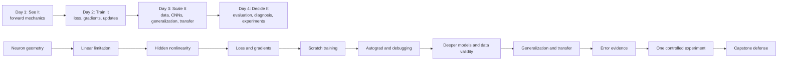

# Course Architecture

## Architectural Intent

This course teaches neural networks as an evidence-driven engineering practice. Its instructional rhythm is:

**Explain -> Visualize -> Predict -> Experiment -> Observe -> Diagnose -> Explain Why**

The rhythm is a contract, not a slogan. Every substantial concept must produce visible evidence, every important run must be preceded by a prediction or decision, and every lab must end with a mechanism-level explanation. The sequence progresses from a transparent NumPy forward pass to a defended model investigation without treating framework fluency as proof of understanding.

The canonical IDs, paths, scope labels, and 450-minute daily budgets are defined in `courseware/00-course-blueprint.md`. This document explains the design choices behind them.

## Course Promise

After four days, participants can inspect a neural-network problem, identify what evidence matters, form a plausible hypothesis, run a controlled experiment, diagnose what happened, and defend the next engineering decision. They can connect the behavior they observe in a small CPU model to the same families of decisions made in larger training, evaluation, data, and serving systems.

## Audience and Entry Contract

### Audience

- Python-capable software engineers and technical practitioners entering ML.
- Analysts or data practitioners who have used predictive models but lack a mechanistic model of neural networks.
- Early-career ML engineers who need a disciplined experimentation and diagnosis workflow.

### Required prerequisites

- Basic Python functions, control flow, collections, and notebook execution.
- Ability to read a 2D plot and basic summary statistics.
- Familiarity with NumPy is helpful but not assumed beyond a pre-course primer.

### Explicitly not required

- Prior calculus or formal linear algebra.
- Prior PyTorch experience.
- A local GPU or paid hosted runtime.
- Knowledge of CNN, Transformer, or distributed-training implementation.

### Pre-course readiness artifact

`courseware/shared/pre-course-readiness.ipynb` is a short, non-primary setup check planned for production. It verifies Python, NumPy indexing, matrix shapes, plotting, package imports, and device detection. It is not counted among the 16 primary labs and has no instructor-answer content beyond deterministic environment checks.

## Learning Design Principles

1. **Intuition before notation.** Boundary movement precedes the dot product; a loss landscape precedes derivative notation; colored gradient flow precedes chain-rule arithmetic.
2. **Limitation creates the next concept.** XOR earns hidden units, error earns loss, parameter responsibility earns backpropagation, invalid validation earns pipeline discipline, and hidden aggregate failures earn error analysis.
3. **Evidence before intervention.** Participants must identify what observation would support or falsify a hypothesis before changing a model.
4. **From-scratch work has a bounded purpose.** NumPy implementation exposes what the framework automates; it does not become a general-purpose framework project.
5. **Failure is designed, not accidental.** Deliberate failures have known symptoms, a diagnostic purpose, a recovery path, and an explicit debrief.
6. **Competition rewards reasoning.** Scoreboards include prediction quality, experimental control, diagnosis, reproducibility, efficiency, and explanation.
7. **Scaffolding fades.** Day 1 supplies narrow TODOs; Day 2 requires completing mechanics; Day 3 asks participants to choose remedies; Day 4 constrains the outcome but not the diagnosis.
8. **Core and reference depth remain visible.** Overloaded topics are labeled `SHORTEN`, `MOVE`, or `OPTIONAL`; no outline objective silently vanishes.

## Narrative and Dependency Architecture

### Day 1: See It

**Narrative question:** How can simple mathematical operations produce intelligent-looking behavior?

The day starts with model-choice context, then makes one neuron's parameters geometric. A linear classifier is allowed to succeed before XOR reveals its limitation. Hidden units and nonlinear activations are introduced as a response to evidence. Shapes, matrices, output heads, and forward propagation culminate in a forward-only network whose correct and incorrect predictions must be explained.

**End state:** Participants can trace a prediction and describe why a fixed network succeeds or fails, but cannot yet make it learn. That productive gap launches Day 2.

### Day 2: Train It

**Narrative question:** When a network makes a mistake, how does it know what to change?

The training loop gives the day its state-flow spine. Scalar loss makes optimization possible; visual learning-rate paths expose update behavior; one tiny computational graph gives each parameter a responsibility signal. Vectorization then scales the same mechanics across examples. Participants build the NumPy training loop before PyTorch reveals the automation. Deliberate framework failures test whether the mechanism survived the abstraction jump.

**End state:** Participants can train, inspect, and repair a small network and can distinguish mathematical behavior from framework syntax.

### Day 3: Scale It

**Narrative question:** How do the fundamentals become modern deep learning?

Depth and feature hierarchy motivate richer models, but a data-leak investigation establishes that architecture cannot rescue invalid evidence. CNNs make parameter sharing and spatial locality visible. Participants then create overfitting before choosing a rescue, followed by a constrained scratch-versus-pretrained comparison. Attention, Transformers, foundation models, and systems scale form a bounded conceptual bridge from the day's concrete image workflow.

**End state:** Participants can explain a modern image workflow, distinguish valid improvement from misleading validation, and reason about reusable representations and resource constraints.

### Day 4: Think Like an ML Engineer

**Narrative question:** The model trained successfully, but is it good, and what should change next?

Asymmetric consequences undermine accuracy as a universal answer. Mystery curves and error buckets force diagnosis from evidence. A one-experiment lab makes tracking, reproducibility, and quality/resource trade-offs operational. A short frontier case gallery transfers the same loop to capability, evaluation, regression, data, efficiency, safety, and interpretability work. The capstone removes most scaffolding and requires a defended intervention.

**End state:** Participants can make and defend a targeted ML engineering decision rather than report a metric without context.

## Daily Experience Contract

Each day includes:

- Four primary Jupyter labs, each with a separate instructor solution.
- Four shorter prediction, visual, diagnostic, or trade-off activities.
- At least one retrieval prompt from an earlier day.
- At least one deliberate failure or mystery evidence set.
- A visible before/after or baseline/intervention comparison.
- Four stable `CHECK` assessments, including a next-day readiness gate.
- A protected lunch, two protected breaks, and a 10-minute recovery buffer.

The 450-minute schedules appear in the canonical blueprint and `course-flow.md`.

## Student Guide Architecture

### Paths

- `courseware/day-1/student-guide/day-1-student-guide.md`
- `courseware/day-2/student-guide/day-2-student-guide.md`
- `courseware/day-3/student-guide/day-3-student-guide.md`
- `courseware/day-4/student-guide/day-4-student-guide.md`

Each participant day package also has one challenge brief and one daily check artifact:

| Day | Challenge path | Assessment path | Central instructor answer paths |
|---|---|---|---|
| 1 | `courseware/day-1/challenges/day-1-challenges.md` | `courseware/day-1/assessments/day-1-checks.md` | `courseware/instructor-solutions/day-1/day-1-challenges-SOLUTION.md`; `courseware/instructor-solutions/day-1/day-1-checks-SOLUTION.md` |
| 2 | `courseware/day-2/challenges/day-2-challenges.md` | `courseware/day-2/assessments/day-2-checks.md` | `courseware/instructor-solutions/day-2/day-2-challenges-SOLUTION.md`; `courseware/instructor-solutions/day-2/day-2-checks-SOLUTION.md` |
| 3 | `courseware/day-3/challenges/day-3-challenges.md` | `courseware/day-3/assessments/day-3-checks.md` | `courseware/instructor-solutions/day-3/day-3-challenges-SOLUTION.md`; `courseware/instructor-solutions/day-3/day-3-checks-SOLUTION.md` |
| 4 | `courseware/day-4/challenges/day-4-challenges.md` | `courseware/day-4/assessments/day-4-checks.md` | `courseware/instructor-solutions/day-4/day-4-challenges-SOLUTION.md`; `courseware/instructor-solutions/day-4/day-4-checks-SOLUTION.md` |

### Required shape of each guide

1. Daily question and tangible outcome.
2. Retrieval prompt using prior evidence.
3. Lesson sections using canonical `LESSON` IDs.
4. Purposeful visual with an observation prompt.
5. Prediction or decision before the linked activity.
6. Explicit lab launch with objectives, prerequisites, and notebook path.
7. Debrief that asks what happened, why, and what transfers.
8. Misconception and failure note.
9. Daily check links and exit reflection.
10. Optional/reference depth clearly separated from the live path.

### Lesson/lab integration rules

- A primary lab may not appear without a preceding conceptual question and a following debrief in the Student Guide.
- The guide links to the participant notebook only. It never links to instructor solutions or rationales.
- Lab notebooks identify prerequisite `LESSON` IDs; guides identify the exact `LAB` and `CHECK` IDs that provide evidence.
- Expected numeric ranges may appear as sanity checks in participant labs, but completed TODOs, prediction answers, and interpretation answers may not.
- Terminology, notation, seeds, dataset splits, and task framing follow `courseware/shared/notation-and-style.md` once produced.

## Instructor Experience Architecture

Four daily instructor guides mirror the exact timed schedule. They include:

- Core outcome, "must land" concept, and cut line for every timed block.
- Questions to ask before revealing a visual or running a cell.
- Expected predictions and misconception-based follow-ups.
- Lab launch, observation, debrief, and recovery scripts.
- Precomputed screenshot/metric fallback for live-demo or download failure.
- Signals for extending, shortening, or moving optional depth.
- Exit-check interpretation and next-day retrieval adaptation.

`courseware/capstone/capstone-instructor-guide.md` additionally defines team roles, case assignment, reveal timing, evidence-board format, scoring anchors, alternative valid diagnoses, and procedures for a failed training run. It is instructor-only and must not be linked from participant artifacts.

## Assessment Architecture

Assessment is a continuous evidence system rather than a final quiz.

- **Prediction commitments:** reveal the participant's initial model before evidence appears.
- **Notebook checkpoints:** verify shapes, ranges, curves, and reproducibility without revealing answers.
- **Daily `CHECK` tasks:** sample mechanism, diagnosis, and transfer; the fourth check gates the next day.
- **Capstone team evidence:** evaluates performance, generalization, experimental design, diagnosis, efficiency, and explanation using the outline's weights.
- **Final individual transfer:** asks each participant to select evidence and a next experiment in an unfamiliar scenario.

Participant prompts are day-local at `courseware/day-1/assessments/day-1-checks.md` through `courseware/day-4/assessments/day-4-checks.md`. Instructor rationales are physically separated at `courseware/instructor-solutions/day-1/day-1-checks-SOLUTION.md` through `courseware/instructor-solutions/day-4/day-4-checks-SOLUTION.md`.

## Capstone Architecture

### Canonical package and `LAB-D4-04` pairing

| Path | Contract |
|---|---|
| `courseware/capstone/capstone-student-guide.md` | Participant brief and deliverable instructions |
| `courseware/capstone/capstone-starter.ipynb` | Sole participant implementation of `LAB-D4-04` |
| `courseware/capstone/capstone-solution.ipynb` | Sole instructor solution for `LAB-D4-04`; instructor-only |
| `courseware/capstone/capstone-rubric.md` | Participant-visible scoring criteria |
| `courseware/capstone/capstone-instructor-guide.md` | Instructor-only facilitation, case, hint, and recovery guidance |

There is no duplicate `LAB-D4-04` notebook under a Day 4 lab or central solution directory. Participant artifacts may link to the Student Guide, starter, and rubric only. Release packaging must exclude the solution and instructor guide, and no participant-facing file may link to either instructor-only path. `courseware/instructor-solutions/day-4/capstone-case-key.md` is a supplementary case key, not a second solution notebook.

### Problem frame

Teams investigate a handwritten routing-code recognizer based on `sklearn.datasets.load_digits`. The dataset is lightweight, local, multiclass, visually inspectable, and fast enough for controlled CPU experiments. The framing introduces asymmetric class/slice costs without pretending the dataset itself is a production benchmark.

### Case design

The same notebook can assign one of three seeded case profiles:

- **DATA:** imbalanced training examples and a weak worst-class recall.
- **VARIANCE:** a high-capacity model trained on a constrained sample, with a visible generalization gap.
- **OPTIMIZATION:** an unstable or ineffective learning-rate/configuration choice.

Each profile includes a baseline configuration, fixed split manifest, curves, predictions, confusion matrix, error examples, runtime/size measurements, and a case-specific target. Teams do not receive the diagnosis.

### Required evidence chain

1. Inspect data, metrics, curves, slices, and errors.
2. State the likely primary limitation and disconfirming evidence.
3. Commit to one primary intervention and expected observable effect.
4. Execute through a supplied harness and record configuration, seed, metrics, runtime, and result.
5. Compare against baseline and decide whether the hypothesis survived.
6. Run one bounded follow-up only if the primary experiment is fully recorded.
7. Defend the diagnosis, result, mechanism, trade-off, and next experiment.

### Scoring

- Model performance: 25%.
- Generalization: 20%.
- Experimental design: 20%.
- Diagnosis: 15%.
- Efficiency: 10%.
- Explanation: 10%.

## Technical Architecture

### Dependency policy

- NumPy and matplotlib carry Days 1 and the from-scratch portions of Day 2.
- scikit-learn supplies deterministic local datasets, splits, preprocessing, and evaluation utilities.
- PyTorch supplies autograd, train/eval behavior, modules, and compact CPU training from late Day 2 onward.
- torchvision is justified only for Fashion-MNIST, CIFAR-10, transforms, and MobileNet V3 Small in Day 3.
- pandas, seaborn, experiment-tracking services, and additional visualization packages are excluded from the core dependency set unless production proves a concrete need.

### Compute policy

- Every core notebook has a tested CPU path and a runtime ceiling.
- Data subsets and epoch caps are deliberate teaching constraints, not claims about production recipes.
- GPU branches may reduce runtime but may not change required tasks or expected conceptual evidence.
- Day 3 download-dependent labs require cache preflight and a course-supplied offline fallback such as precomputed feature embeddings or a reduced data bundle.

### Reproducibility policy

- Each lab records Python/package versions, seed, device, sample counts, split strategy, and expected nondeterministic tolerance.
- Dataset splits are fixed and reusable across connected labs.
- Training curves and metrics are compared as ranges, not exact floating-point promises.
- Saved checkpoints are instructor/recovery artifacts; participants learn both best-checkpoint and final-checkpoint distinctions on Day 4.

## Scope and Overload Decisions

### Core live path

- Day 1: neuron geometry, linear limitation, nonlinearity, layers/shapes, forward NumPy network.
- Day 2: loss, learning rate, practical backprop, vectorization, NumPy training, PyTorch automation, debugging.
- Day 3: valid pipeline, CNN, overfit/rescue, transfer comparison, bounded attention/scale bridge.
- Day 4: consequence-aware evaluation, curve/error diagnosis, controlled tracking, efficiency trade-offs, capstone.

### Preserved reference depth

- Detailed AI taxonomy, additional output heads, Leaky-ReLU nuance.
- Extended derivative algebra, optimizer internals, deeper vanishing/exploding-gradient theory.
- Transformer equations, full fine-tuning, distributed implementation, hardware communication details.
- Mixed precision implementation, model parallelism, quantization, deep interpretability, and safety-system design.

These topics remain attached to their original day and objective as optional/reference sections. They are not promoted to unplanned implementation outcomes.

## Architecture Success Criteria

- All 31 `OBJ` IDs have explicit instruction, practice, and assessment evidence.
- All four days total exactly 450 minutes with recovery space.
- All 16 primary labs are notebook-based, CPU-practical, and paired with separate solution paths.
- Every lab follows prediction -> experiment -> observation -> diagnosis -> explanation.
- Day 4 capstone retains required evaluation, error analysis, experiment, reproducibility, efficiency, and frontier connections.
- Slides, Student Guides, instructor guides, assessments, solutions, validation reports, pedagogy reviews, and final review are production-owned artifacts.
- Detailed per-lab/day reports remain under `courseware/reviews/`; `courseware/validation/student-lab-test-report.md`, `courseware/validation/instructor-solution-test-report.md`, `courseware/validation/pedagogy-review.md`, and `courseware/validation/final-course-review.md` consolidate and link their gate evidence.
- No lab is releaseable without **Student PASS + Solution PASS**.