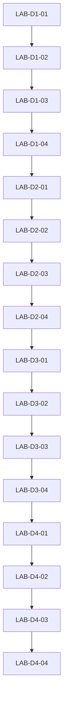

# Primary Lab Map

## Lab Contract

The course contains 16 substantial participant-facing Jupyter notebooks, four per day. Every notebook must:

1. State purpose, objectives, time, prerequisites, environment, dataset, and expected runtime.
2. Establish a runnable baseline before participant TODOs.
3. Require a written prediction before any revealing run.
4. Use starter code and focused TODOs rather than completed copy/run solutions.
5. Produce observable evidence: boundaries, shapes, curves, feature maps, metrics, errors, or trade-off tables.
6. Ask participants to diagnose and explain mechanism, not merely report a number.
7. Include a concrete checkpoint, troubleshooting table, and optional extension.
8. Keep answers, completed TODOs, expected interpretations, and instructor notes out of participant artifacts.
9. Pair one-to-one with a separate instructor-only notebook: 15 solutions live under `courseware/instructor-solutions/`, while the required canonical `LAB-D4-04` solution lives at `courseware/capstone/capstone-solution.ipynb`.
10. Pass both execution gates: **Student PASS + Solution PASS**.

When notebooks are generated, their `.ipynb` documents must be valid JSON. Every cell must include `metadata.language`; existing cells must retain unique `metadata.id` values. Participant notebook text refers to visible cell numbers/section names, never internal cell IDs.

Planning metric ranges are sanity bands, not grading cutoffs. Lab Tester must calibrate them against clean CPU and Colab runs before release.

## Shared Technical Baseline

- Python 3.11+ target, with a supported Colab Python runtime as the hosted reference.
- Core: NumPy, matplotlib, scikit-learn.
- Day 2 late labs and Days 3-4: PyTorch.
- torchvision only for Fashion-MNIST, CIFAR-10, transforms, and MobileNet V3 Small.
- Fixed NumPy, Python, and PyTorch seeds where applicable; deterministic tolerance documented when exact determinism is not practical.
- `courseware/shared/environment.md` owns version bounds and installation checks.
- CPU is mandatory. Optional GPU branches may shorten execution but cannot change required evidence.

## Day 1 Labs: See It

### `LAB-D1-01` - One-Neuron Boundary Workshop

- **Student notebook:** `courseware/day-1/labs/LAB-D1-01-neuron-boundary.ipynb`
- **Instructor solution:** `courseware/instructor-solutions/day-1/LAB-D1-01-neuron-boundary-SOLUTION.ipynb`
- **Purpose:** Make weights, bias, weighted sum, activation, probability, threshold, and decision-boundary geometry directly observable.
- **Objectives:** `OBJ-D1-01`, `OBJ-D1-02`, `OBJ-D1-03`.
- **Prerequisites:** `LESSON-D1-01`, `LESSON-D1-02`, `ACT-D1-01`; basic NumPy indexing and 2D plotting.
- **Live time:** 40 minutes; completed execution under 2 minutes.
- **Dataset:** Twelve fixed, labeled 2D points plus a seeded 40-point linearly separable extension; generated in-notebook, no download.
- **Software and artifact dependencies:** NumPy, matplotlib; shared plotting-style helper may be copied into the notebook to keep it standalone.
- **Starter state and TODOs:** Data and plotting helper supplied. TODOs implement `weighted_sum`, sigmoid, probability-to-class threshold, boundary coefficients, and a short manual parameter search. Shape assertions and six probe examples are provided without answers.
- **Prediction/experiment/visualization/diagnosis flow:** Sketch the effect of increasing `w1`, `w2`, or `b` -> implement one neuron -> vary one parameter at a time -> redraw boundary/probability shading -> manually separate points -> inspect two stubborn points -> explain which parameter changed orientation, location, or confidence.
- **Intended broken behavior:** Initial parameters classify a visible majority but miss two points near the boundary. An optional "change everything" attempt produces ambiguous evidence and motivates one-variable experiments.
- **Expected evidence:** Weighted sums shape `(n_examples,)`; probabilities remain in `[0, 1]`; the `0.5` contour matches `w dot x + b = 0`; changing only bias translates but does not rotate the line; a reasonable manual setting classifies at least 10 of 12 fixed points.
- **Runtime/Colab practicality:** CPU-only, no install or network, less than 50 MB memory, expected full run under 10 seconds excluding participant interaction.
- **Validation criteria:** Fresh ordered run reaches baseline; all TODOs are solvable from preceding material; boundary handles vertical/near-vertical cases without division failure; predictions and contour agree; seed reproduces points; checkpoint tolerates multiple valid manual weights; no answer values or instructor hints leak.

### `LAB-D1-02` - The Linear Limit

- **Student notebook:** `courseware/day-1/labs/LAB-D1-02-linear-limit.ipynb`
- **Instructor solution:** `courseware/instructor-solutions/day-1/LAB-D1-02-linear-limit-SOLUTION.ipynb`
- **Purpose:** Let a one-neuron classifier succeed, then visibly fail on XOR so hidden nonlinear transformations become necessary rather than arbitrary.
- **Objectives:** `OBJ-D1-04`, `OBJ-D1-05`, reinforcement of `OBJ-D1-03`.
- **Prerequisites:** `LESSON-D1-03`, `LAB-D1-01`.
- **Live time:** 45 minutes; completed execution under 2 minutes.
- **Dataset:** Seeded linearly separable blobs and a noisy four-cluster XOR dataset generated with NumPy/scikit-learn.
- **Software and artifact dependencies:** NumPy, matplotlib, scikit-learn `LogisticRegression`; uses the Day 1 boundary vocabulary but not notebook state from `LAB-D1-01`.
- **Starter state and TODOs:** Dataset generators and mesh helper supplied. TODOs fit a logistic classifier, calculate accuracy, plot both decision regions, predict XOR failure, implement a fixed two-hidden-unit nonlinear forward function from supplied parameter shapes, and compare regions.
- **Prediction/experiment/visualization/diagnosis flow:** Predict linear-data outcome -> train/plot -> predict XOR outcome -> train/plot -> identify inseparable regions -> pass XOR through fixed nonlinear hidden units -> inspect hidden coordinates and output region -> explain why hidden nonlinear composition succeeds.
- **Intended broken behavior:** The logistic classifier remains around chance on balanced XOR even when trained longer. A supplied comparison with the hidden activation replaced by identity collapses back to a linear boundary.
- **Expected evidence:** Linear-data accuracy generally `0.95-1.00`; balanced XOR logistic accuracy generally `0.45-0.60`; the fixed nonlinear network classifies clean XOR corners at `1.00` and noisy samples typically above `0.90`; identity-activation comparison returns to roughly chance.
- **Runtime/Colab practicality:** CPU-only, no download, under 20 seconds.
- **Validation criteria:** Ranges hold across documented seed; meshes match classifier predictions; no training of a neural network is implied; nonlinear and identity comparisons use the same parameters/data; debrief explicitly distinguishes adding layers from adding nonlinear transformations.

### `LAB-D1-03` - Shape and Activation Observatory

- **Student notebook:** `courseware/day-1/labs/LAB-D1-03-shapes-activations.ipynb`
- **Instructor solution:** `courseware/instructor-solutions/day-1/LAB-D1-03-shapes-activations-SOLUTION.ipynb`
- **Purpose:** Make dense-layer shapes, parameter counts, broadcasting, hidden/output activation choices, saturation, and dead regions inspectable before a complete network is assembled.
- **Objectives:** `OBJ-D1-02`, `OBJ-D1-05`, `OBJ-D1-06`.
- **Prerequisites:** `LESSON-D1-04`, `LESSON-D1-05`, `ACT-D1-03`, `ACT-D1-04`.
- **Live time:** 40 minutes; completed execution under 2 minutes.
- **Dataset:** Five fixed four-feature examples plus a dense scalar input range for activation plots; generated locally.
- **Software and artifact dependencies:** NumPy, matplotlib; no cross-notebook state.
- **Starter state and TODOs:** Architecture `4 -> 8 -> 3`, seeded matrices, and plotting shells supplied. Core TODOs calculate 67 parameters, implement a dense step with bias broadcasting, implement sigmoid, tanh, ReLU, and numerically stable softmax, assert intermediate shapes, and compare extreme pre-activation ranges. Leaky ReLU is an independently skippable optional comparison only; no later core TODO or checkpoint depends on it.
- **Prediction/experiment/visualization/diagnosis flow:** Predict output shapes and parameter count -> implement dense operation -> visualize activation curves -> send the same values through each required activation -> inspect saturation/dead regions -> apply softmax -> diagnose intentionally wrong-axis normalization -> explain hidden vs. output choices.
- **Intended broken behavior:** A softmax computed across the batch axis does not produce per-example row sums of one; a strongly negative ReLU input creates all-zero hidden output; extreme sigmoid inputs visibly saturate.
- **Expected evidence:** `X @ W1 + b1` and hidden activation shape `(5, 8)`; logits/softmax shape `(5, 3)`; correct softmax row sums equal `1` within `1e-6`; wrong-axis version fails that assertion; parameter count is 67; saturation/dead-region plots match function definitions.
- **Runtime/Colab practicality:** CPU-only, no network, under 10 seconds.
- **Validation criteria:** Stable softmax avoids overflow; assertions identify wrong axes with understandable messages; all required activation implementations preserve shape; plots label axes/zero lines; the optional Leaky-ReLU comparison is independently skippable and no later core cell depends on it.

### `LAB-D1-04` - Build a Network That Thinks Forward

- **Student notebook:** `courseware/day-1/labs/LAB-D1-04-forward-network-mystery.ipynb`
- **Instructor solution:** `courseware/instructor-solutions/day-1/LAB-D1-04-forward-network-mystery-SOLUTION.ipynb`
- **Purpose:** Assemble a vectorized forward-only NumPy network and explain its correct and incorrect predictions using its decision region and hidden representation.
- **Objectives:** `OBJ-D1-06`, `OBJ-D1-07`, retrieval of `OBJ-D1-04` and `OBJ-D1-05`.
- **Prerequisites:** `LESSON-D1-06`, `LAB-D1-02`, `LAB-D1-03`.
- **Live time:** 60 minutes; completed execution under 3 minutes.
- **Dataset:** Seeded `make_moons` data with six named probe examples; supplied fixed parameters from an offline-trained `2 -> 6 -> 1` network. No training occurs in the participant notebook.
- **Software and artifact dependencies:** NumPy, matplotlib, scikit-learn dataset generator; reuses function signatures from `LAB-D1-03` but defines them locally.
- **Starter state and TODOs:** Data split, fixed parameter dictionary, mesh helper, and probe table supplied. TODOs implement hidden/output forward steps, batch forward function, predictions, shape/range checks, hidden-representation plot, decision region, and an evidence table for six probes.
- **Prediction/experiment/visualization/diagnosis flow:** Predict which probes will fail from raw geometry -> complete forward pass -> inspect probabilities -> plot region -> project hidden activations -> compare initial predictions with evidence -> perturb one weight/bias -> explain why fixed parameters, not "intelligence," produced behavior.
- **Intended broken behavior:** The supplied network predicts four named probes correctly and two boundary/noise probes incorrectly. A deliberate matrix-transpose variant raises a clear shape mismatch for diagnosis.
- **Expected evidence:** Hidden shape `(n, 6)`, output shape `(n, 1)`, probabilities in `[0, 1]`; supplied parameters generally yield `0.82-0.92` accuracy; six-probe table contains both correct and incorrect cases; hidden plot separates most classes more clearly than raw input.
- **Runtime/Colab practicality:** CPU-only, no download, under 20 seconds.
- **Validation criteria:** Fixed parameters and dataset seed reproduce the intended mystery; participant path never trains or mutates canonical parameters unless in a copied perturbation; mesh and batch forward outputs agree; shape-error recovery works; final explanation cites activation/boundary evidence.

## Day 2 Labs: Train It

### `LAB-D2-01` - Loss Landscapes and Learning-Rate Roulette

- **Student notebook:** `courseware/day-2/labs/LAB-D2-01-loss-learning-rate.ipynb`
- **Instructor solution:** `courseware/instructor-solutions/day-2/LAB-D2-01-loss-learning-rate-SOLUTION.ipynb`
- **Purpose:** Connect scalar loss and local slope to visible parameter-update trajectories and learning-rate behavior.
- **Objectives:** `OBJ-D2-02`, `OBJ-D2-03`.
- **Prerequisites:** `LESSON-D2-01`, `LESSON-D2-02`, `ACT-D2-01`, Day 1 weighted sums.
- **Live time:** 40 minutes; completed execution under 2 minutes.
- **Dataset:** A deterministic one-parameter quadratic objective plus four binary prediction/target vectors for BCE confidence comparisons; no download.
- **Software and artifact dependencies:** NumPy, matplotlib.
- **Starter state and TODOs:** Loss-curve plotting and learning-rate cards supplied. TODOs implement clipped BCE, quadratic gradient, update rule, trajectory recorder, and summary table.
- **Prediction/experiment/visualization/diagnosis flow:** Rank prediction losses -> calculate/reconcile -> predict trajectories for four learning rates -> run fixed update budget -> overlay paths and loss curves -> classify crawl/converge/oscillate/diverge -> explain from the update multiplier rather than curve labels alone.
- **Intended broken behavior:** A `1.10` learning rate on the chosen quadratic diverges; `0.90` oscillates while converging; omitting BCE clipping produces `log(0)` for a deliberate extreme prediction.
- **Expected evidence:** BCE ranking reflects confidence even when class accuracy ties; learning rate `0.01` makes little progress in the fixed budget, `0.10` converges smoothly, `0.90` alternates sides with shrinking distance, and `1.10` grows; clipped loss remains finite.
- **Runtime/Colab practicality:** CPU-only, under 10 seconds.
- **Validation criteria:** Update paths are deterministic; axes do not hide divergence; finite-loss implementation handles `0/1` probabilities; prompts appear before trajectories; explanations connect sign/magnitude to observed movement.

### `LAB-D2-02` - Backpropagation and Gradient Check

- **Student notebook:** `courseware/day-2/labs/LAB-D2-02-backprop-gradient-check.ipynb`
- **Instructor solution:** `courseware/instructor-solutions/day-2/LAB-D2-02-backprop-gradient-check-SOLUTION.ipynb`
- **Purpose:** Turn backpropagation from an incantation into a trace of local sensitivities that can be checked independently.
- **Objectives:** `OBJ-D2-04`, reinforcement of `OBJ-D2-02` and `OBJ-D2-03`.
- **Prerequisites:** `LESSON-D2-03`, `ACT-D2-02`, `LAB-D2-01`.
- **Live time:** 45 minutes; completed execution under 2 minutes.
- **Dataset:** One fixed two-feature binary example and a tiny `2 -> 2 -> 1` sigmoid network.
- **Software and artifact dependencies:** NumPy, matplotlib optional for computational-graph color trace.
- **Starter state and TODOs:** Values, graph diagram, forward cache structure, and finite-difference harness supplied. TODOs compute selected local derivatives, propagate upstream gradients, calculate weight/bias gradients, and compare analytic with numerical values.
- **Prediction/experiment/visualization/diagnosis flow:** Predict gradient signs -> run forward/cache -> trace output-to-hidden responsibility -> fill gradient table -> run finite differences -> diagnose a supplied sign bug and a missing sigmoid derivative -> repair -> explain why backprop reuses local work.
- **Intended broken behavior:** Two selectable faulty backward functions produce relative errors above `1e-2`; the correct implementation should agree closely with finite differences.
- **Expected evidence:** Analytic/numerical relative error below `1e-5` for selected parameters under float64; gradient shapes match parameters; one update in the negative-gradient direction reduces loss for the fixed example.
- **Runtime/Colab practicality:** CPU-only, no download, under 10 seconds.
- **Validation criteria:** Finite-difference epsilon is calibrated; no saturated inputs make the check misleading; sign-bug and missing-factor symptoms are distinct; all expected gradients and reasoning remain solution-only.

### `LAB-D2-03` - Train a Neural Network with NumPy

- **Student notebook:** `courseware/day-2/labs/LAB-D2-03-numpy-training.ipynb`
- **Instructor solution:** `courseware/instructor-solutions/day-2/LAB-D2-03-numpy-training-SOLUTION.ipynb`
- **Purpose:** Integrate initialization, vectorized forward propagation, stable loss, backpropagation, updates, batching, metrics, and curves into one trainable network.
- **Objectives:** `OBJ-D2-01`, `OBJ-D2-03`, `OBJ-D2-04`, `OBJ-D2-05`, `OBJ-D2-06`.
- **Prerequisites:** `LAB-D1-04`, `LAB-D2-01`, `LAB-D2-02`, `LESSON-D2-04`, `ACT-D2-03`.
- **Live time:** 70 minutes; completed reference execution under 5 minutes.
- **Dataset:** Seeded `make_moons`, stratified train/validation split, approximately 800 examples.
- **Software and artifact dependencies:** NumPy, matplotlib, scikit-learn dataset/split utilities.
- **Starter state and TODOs:** Data/split/plot helpers and training-loop skeleton supplied. TODOs implement scaled initialization, `2 -> 8 -> 1` forward cache, clipped BCE, vectorized gradients, parameter update, mini-batch iterator, metric collection, and boundary/curve plots.
- **Prediction/experiment/visualization/diagnosis flow:** Predict initial loss -> implement and assert each stage -> train a short baseline -> inspect loss/accuracy/boundary -> change only learning rate or hidden width -> compare curves -> explain why the chosen change affected optimization or capacity.
- **Intended broken behavior:** A deliberately selectable too-large learning rate makes loss unstable; a no-activation variant cannot match the nonlinear boundary. Accidental NaNs trigger a bounded diagnostic message rather than running silently.
- **Expected evidence:** Initial BCE near `0.69` within a broad initialization band; training loss generally below `0.35`; train/validation accuracy generally `0.85-0.95`; a visibly nonlinear decision region; mini-batch and full-dataset shapes pass assertions.
- **Runtime/Colab practicality:** CPU-only, no download, full baseline under 60 seconds on typical Colab CPU; hard epoch cap and vectorized operations.
- **Validation criteria:** Stable loss, no hidden global-state dependency, reproducible split, gradient shapes, decreasing baseline loss, range calibration across two CPU environments, optional experiment isolated from baseline, and TODOs focused on mechanics rather than plotting boilerplate.

### `LAB-D2-04` - PyTorch Autograd: Break It and Fix It

- **Student notebook:** `courseware/day-2/labs/LAB-D2-04-pytorch-break-fix.ipynb`
- **Instructor solution:** `courseware/instructor-solutions/day-2/LAB-D2-04-pytorch-break-fix-SOLUTION.ipynb`
- **Purpose:** Rebuild the NumPy workflow with PyTorch, map automated operations to mechanics, and diagnose common training-loop failures from evidence.
- **Objectives:** `OBJ-D2-01`, `OBJ-D2-02`, `OBJ-D2-05`, `OBJ-D2-07`, `OBJ-D2-08`.
- **Prerequisites:** `LESSON-D2-06`, `LESSON-D2-07`, `LAB-D2-03`; no prior PyTorch assumed.
- **Live time:** 55 minutes; completed reference execution under 6 minutes.
- **Dataset:** Same seeded moons task and split specification as `LAB-D2-03` for direct comparison.
- **Software and artifact dependencies:** PyTorch, NumPy, matplotlib, scikit-learn; CPU baseline.
- **Starter state and TODOs:** Tensor conversion, model shell, evaluation helper, and mystery evidence cards supplied. TODOs define `nn.Module`, choose compatible logits/loss, implement optimizer sequence including gradient reset, switch train/eval modes, inspect gradient norms, and repair assigned defect.
- **Prediction/experiment/visualization/diagnosis flow:** Map NumPy stages to framework calls -> predict baseline range -> train/plot -> receive mystery curve before faulty code -> state likely cause/discriminating check -> inspect code -> repair one of wrong output/loss pairing, missing nonlinearity, omitted gradient reset, or mode misuse -> compare before/after -> explain mechanism.
- **Intended broken behavior:** Broken presets produce chance-like/stalled learning, accumulated/unstable gradients, linear-limit behavior, or inconsistent evaluation. Shape-mismatch case is a short optional diagnostic, not a time-consuming blocker.
- **Expected evidence:** Correct baseline validation accuracy typically `0.85-0.95`; loss decreases without NaN; gradient-reset preset shows growing/erratic gradient norms; missing-nonlinearity version underperforms nonlinear baseline; repaired run returns to the sanity band.
- **Runtime/Colab practicality:** CPU under 2 minutes per baseline/broken pair and under 6 minutes total; no external download; optional GPU device check is informational.
- **Validation criteria:** Framework code uses logits with the matched loss; `optimizer.zero_grad`, `backward`, and `step` ordering is correct; train/eval transitions are exercised; mystery evidence precedes faulty source; each preset has a reproducible symptom and recovery; no deprecated API patterns.

## Day 3 Labs: Scale It

### `LAB-D3-01` - Find the Data Leak

- **Student notebook:** `courseware/day-3/labs/LAB-D3-01-find-data-leak.ipynb`
- **Instructor solution:** `courseware/instructor-solutions/day-3/LAB-D3-01-find-data-leak-SOLUTION.ipynb`
- **Purpose:** Demonstrate that suspiciously strong validation can come from invalid data provenance rather than model quality.
- **Objectives:** `OBJ-D3-02`, reinforcement of `OBJ-D2-08`.
- **Prerequisites:** `LESSON-D3-02`, `ACT-D3-02`, training/validation distinction from Day 2.
- **Live time:** 45 minutes; completed reference execution under 4 minutes.
- **Dataset:** Seeded `make_classification` case records with feature names/provenance, including a disguised post-outcome feature; no download.
- **Software and artifact dependencies:** NumPy, matplotlib, scikit-learn split/preprocessing/pipeline/metrics; optional PyTorch `TensorDataset`/`DataLoader` shape inspection.
- **Starter state and TODOs:** Suspicious metric report, schema/provenance table, leaky split/preprocessing code, and audit checklist supplied. TODOs inspect correlations/provenance, identify leakage, create stratified splits, fit transformations on training only, remove post-outcome data, build loaders, and compare valid evidence.
- **Prediction/experiment/visualization/diagnosis flow:** Decide whether near-perfect score is plausible -> inspect slices/provenance -> name two leak paths -> repair split/transformation order -> rerun same simple model -> compare metrics/confusion matrices -> explain why a lower score is more trustworthy.
- **Intended broken behavior:** `case_resolution_code` is created after the target outcome and nearly reveals it; preprocessing is initially fit before the split. The leaky pipeline reports implausibly high validation performance.
- **Expected evidence:** Leaky ROC AUC generally `0.99-1.00`; valid pipeline generally `0.78-0.90` depending on calibrated generator; class proportions remain close after stratification; training-only scaler means near zero on train but not exactly on validation.
- **Runtime/Colab practicality:** CPU-only, generated data, under 30 seconds.
- **Validation criteria:** Leak is discoverable from evidence without hidden solution text; valid pipeline prevents transformation fit on validation/test; score bands calibrated; target proxy removed from every split; loader batch shapes and shuffle policy are correct; debrief emphasizes validity over score.

### `LAB-D3-02` - Compact CNN and Feature Maps

- **Student notebook:** `courseware/day-3/labs/LAB-D3-02-cnn-feature-maps.ipynb`
- **Instructor solution:** `courseware/instructor-solutions/day-3/LAB-D3-02-cnn-feature-maps-SOLUTION.ipynb`
- **Purpose:** Train a compact image classifier while making channels, convolutions, pooling, feature-map shapes, parameter sharing, and mistakes visible.
- **Objectives:** `OBJ-D3-01`, `OBJ-D3-03`.
- **Prerequisites:** `LESSON-D3-01`, `LESSON-D3-03`, `ACT-D3-03`, `LAB-D3-01` data-validity principles.
- **Live time:** 60 minutes; completed reference execution under 12 minutes CPU.
- **Dataset:** Fashion-MNIST, fixed reduced split (approximately 10,000 train, 2,000 validation, 2,000 test sampled by seeded stratification); approximately 30 MB download.
- **Software and artifact dependencies:** PyTorch, torchvision, NumPy, matplotlib; cached-data preflight and packaged small fallback sample required.
- **Starter state and TODOs:** Download/cache check, transform shell, loaders, training/evaluation utilities, and image grid supplied. TODOs define a two-block compact CNN and classifier head, calculate feature-map shapes/parameters, complete forward pass, train bounded epochs, capture hooks/activations, and inspect misclassifications.
- **Prediction/experiment/visualization/diagnosis flow:** Predict output shapes and an edge-like filter response -> assert layer shapes -> train 2-3 epochs -> plot loss/validation accuracy -> visualize early/late maps -> inspect confident mistakes -> explain locality, sharing, and emerging hierarchy.
- **Intended broken behavior:** A short shape-detective checkpoint supplies an incorrect flattened dimension or channel order and asks participants to use printed shapes to repair it before training.
- **Expected evidence:** Input `(batch, 1, 28, 28)`; documented intermediate shapes match architecture; compact model parameter count remains below a planned ceiling of 250,000; reduced-split validation accuracy typically `0.80-0.88` after bounded training; early maps retain spatial detail and later maps are more selective.
- **Runtime/Colab practicality:** CPU target under 12 minutes including training after data cache; GPU target under 5 minutes; hard subset/epoch cap; precomputed checkpoint and feature-map fallback for class recovery only.
- **Validation criteria:** Download and offline fallback both work; train normalization is also applied consistently to validation/test without augmentation leakage; CPU range/runtime tested; hooks are removed after capture; shape bug is deliberate and recoverable; misclassification display uses true/predicted labels correctly.

### `LAB-D3-03` - Make It Overfit, Then Rescue It

- **Student notebook:** `courseware/day-3/labs/LAB-D3-03-overfit-and-rescue.ipynb`
- **Instructor solution:** `courseware/instructor-solutions/day-3/LAB-D3-03-overfit-and-rescue-SOLUTION.ipynb`
- **Purpose:** Create a memorable generalization failure, diagnose it from curves, and test one justified regularization/data intervention with before/after evidence.
- **Objectives:** `OBJ-D3-04`, `OBJ-D3-05`, reinforcement of `OBJ-D3-01`.
- **Prerequisites:** `LESSON-D3-04`, `LESSON-D3-05`, `LAB-D3-02` model/data cache.
- **Live time:** 55 minutes; completed reference execution under 10 minutes CPU.
- **Dataset:** Fashion-MNIST cache from `LAB-D3-02`; deliberately tiny stratified training subset (about 256-500 examples) with a fixed validation subset.
- **Software and artifact dependencies:** PyTorch, torchvision, NumPy, matplotlib; reuses shared architecture/training helper signatures but notebook remains independently runnable.
- **Starter state and TODOs:** High-capacity baseline config, curve recorder, and intervention cards supplied. TODOs train to overfit, calculate generalization gap, select one of smaller model, weight decay, dropout, augmentation, or early stopping, declare expected evidence, implement it, and compare aligned curves.
- **Prediction/experiment/visualization/diagnosis flow:** Predict train/validation trajectories -> run high-capacity/tiny-data baseline -> mark onset of overfit -> choose one remedy and predicted mechanism -> rerun under matched budget -> overlay curves -> decide whether evidence supports the hypothesis.
- **Intended broken behavior:** The baseline intentionally reaches near-perfect training performance while validation stalls or declines. A "combine all remedies" route is disallowed in the core path because it destroys causal attribution.
- **Expected evidence:** Baseline training accuracy commonly above `0.98`; validation commonly `0.65-0.82`; generalization gap at least `0.15` under calibrated seed/config. A successful rescue should reduce the gap by roughly `0.05` or improve validation by `0.03` without relying on exact targets; no improvement is acceptable if correctly diagnosed.
- **Runtime/Colab practicality:** CPU target under 10 minutes for baseline plus one intervention; GPU under 4 minutes; cached data, tiny subset, hard epoch/patience caps.
- **Validation criteria:** Baseline reliably overfits across reference environments; intervention changes one major factor; curves share axes/epoch budget; early stopping restores best checkpoint; augmentation applies only to training; "failed" intervention still yields assessable evidence.

### `LAB-D3-04` - Transfer-Learning Race

- **Student notebook:** `courseware/day-3/labs/LAB-D3-04-transfer-learning-race.ipynb`
- **Instructor solution:** `courseware/instructor-solutions/day-3/LAB-D3-04-transfer-learning-race-SOLUTION.ipynb`
- **Purpose:** Compare training a small image model from scratch with frozen pretrained features under the same limited-data/time budget.
- **Objectives:** `OBJ-D3-06`, reinforcement of `OBJ-D3-01`, `OBJ-D3-05`, and `OBJ-D3-08`.
- **Prerequisites:** `LESSON-D3-06`, `LAB-D3-02`, `LAB-D3-03`.
- **Live time:** 55 minutes; completed reference execution under 15 minutes CPU with cached embeddings.
- **Dataset:** Seeded CIFAR-10 subset (approximately 2,400 train, 800 validation, 800 test), resized for MobileNet V3 Small; cached download plus course-supplied precomputed-embedding fallback.
- **Software and artifact dependencies:** PyTorch, torchvision, NumPy, matplotlib; torchvision MobileNet V3 Small default pretrained weights, exact current API verified during production.
- **Starter state and TODOs:** Data/cache preflight, equal-budget scoreboard, small scratch CNN shell, pretrained model loader, embedding-cache helper, and classifier-head shell supplied. TODOs predict winner, train scratch baseline, freeze backbone correctly, apply matching pretrained normalization, extract/cache features, train head, and compare quality/time/trainable parameters.
- **Prediction/experiment/visualization/diagnosis flow:** Predict scratch vs. transfer under limited data -> inspect domain match -> run scratch -> run frozen-feature path -> compare curves, wall time, sample efficiency, and trainable parameters -> diagnose optional wrong-normalization/random-backbone case -> explain why reuse helped or did not.
- **Intended broken behavior:** A short diagnostic variant uses `weights=None` while frozen or omits pretrained normalization, substantially weakening transfer; participants identify that "frozen" is not equivalent to "pretrained."
- **Expected evidence:** With calibrated subsets/budgets, scratch validation accuracy broadly `0.25-0.50`; pretrained frozen features/head broadly `0.45-0.70`; frozen path has far fewer trainable parameters and embedding cache makes head experiments fast. Exact winner is validated, not promised if upstream weights/runtime change.
- **Runtime/Colab practicality:** First CPU feature extraction target under 12 minutes, cached reruns under 2 minutes, total under 15 minutes; GPU under 7 minutes. CIFAR download is about 170 MB; fallback embeddings permit full conceptual workflow offline.
- **Validation criteria:** Current torchvision weights/transforms API source-checked; licenses/source recorded; scratch and transfer use the same split and comparable budget; freeze verified by gradient/parameter counts; cache key includes weights/transforms/split; online and fallback metric bands calibrated; optional unfreezing is clearly outside core time.

## Day 4 Labs: Think Like an ML Engineer

The first three Day 4 participant notebooks remain under `courseware/day-4/labs/`. The fourth is the canonical top-level capstone pair, preserving four Day 4 labs and 16 primary lab IDs without a duplicate notebook.

### `LAB-D4-01` - Accuracy Is Not Enough

- **Student notebook:** `courseware/day-4/labs/LAB-D4-01-accuracy-is-not-enough.ipynb`
- **Instructor solution:** `courseware/instructor-solutions/day-4/LAB-D4-01-accuracy-is-not-enough-SOLUTION.ipynb`
- **Purpose:** Choose metrics and thresholds from asymmetric error costs and expose how high accuracy can hide total failure on a rare class.
- **Objectives:** `OBJ-D4-01`.
- **Prerequisites:** `LESSON-D4-01`, `ACT-D4-01`, `OBJ-D2-02`, valid split principles from Day 3.
- **Live time:** 40 minutes; completed reference execution under 3 minutes.
- **Dataset:** Seeded imbalanced synthetic fraud-like binary classification (`95-97%` majority), with a fixed cost table; no download.
- **Software and artifact dependencies:** NumPy, matplotlib, scikit-learn model/metrics.
- **Starter state and TODOs:** Majority baseline, train/validation split, probability-producing baseline model, and cost scenarios supplied. TODOs compute confusion matrix/precision/recall/F1, plot threshold sweep and precision-recall curve, calculate scenario cost, choose threshold, and defend metric set.
- **Prediction/experiment/visualization/diagnosis flow:** Predict majority-baseline usefulness -> reveal accuracy and zero recall -> choose costly error -> sweep thresholds -> inspect confusion/cost trade-off -> select operating point -> explain why ROC/AUC overview alone does not choose a threshold.
- **Intended broken behavior:** The all-majority classifier scores roughly `0.95-0.97` accuracy while minority recall and F1 are zero, making it operationally useless for the rare-class objective. Later, an accuracy-only comparison selects `probability@0.5`, a non-cost-optimal model/threshold for the miss-dominant scenario, while consequence-aware selection repairs the evaluation rule by choosing `probability@0.19`.
- **Expected evidence:** Majority baseline minority recall `0`; useful model has minority recall broadly `0.55-0.85` depending on threshold; lowering threshold increases recall and false positives; cost-minimizing threshold differs across supplied business/safety scenarios.
- **Runtime/Colab practicality:** CPU-only, generated data, under 30 seconds.
- **Validation criteria:** Positive class is labeled consistently; no zero-division warnings obscure learning; threshold candidates include default `0.5`; cost calculation matches confusion-matrix orientation; participant can choose different valid thresholds if justified by stated costs.

### `LAB-D4-02` - Model Detective: Curves and Error Buckets

- **Student notebook:** `courseware/day-4/labs/LAB-D4-02-model-detective.ipynb`
- **Instructor solution:** `courseware/instructor-solutions/day-4/LAB-D4-02-model-detective-SOLUTION.ipynb`
- **Purpose:** Diagnose fit/optimization patterns from hidden learning curves, then turn individual prediction failures into prioritized error categories.
- **Objectives:** `OBJ-D4-02`, `OBJ-D4-03`.
- **Prerequisites:** `LESSON-D4-02`, `LESSON-D4-03`, `ACT-D4-02`, Day 3 generalization evidence.
- **Live time:** 40 minutes; completed reference execution under 4 minutes.
- **Dataset:** Four deterministic mystery curve bundles plus scikit-learn digits images, labels, probabilities, and metadata from a fixed baseline artifact.
- **Software and artifact dependencies:** NumPy, matplotlib, scikit-learn metrics/dataset; PyTorch only if regenerating baseline predictions, not required for core analysis.
- **Starter state and TODOs:** Unlabeled curve cards, baseline predictions, confusion matrix helper, confidence/error table, and bucket schema shell supplied. TODOs label curve patterns with evidence, identify top confusion pairs, inspect high-confidence errors, define at least two meaningful slices, estimate payoff, and propose one next experiment.
- **Prediction/experiment/visualization/diagnosis flow:** Diagnose curves before config reveal -> justify from train/validation shape -> inspect aggregate metric -> drill into confusion pairs/images/confidence -> create buckets -> quantify prevalence/severity -> choose next experiment and disconfirming evidence.
- **Intended broken behavior:** Hidden bundles represent healthy training, underfitting/high bias, overfitting/high variance, and unstable optimization. Some digits errors include ambiguous/noisy examples so "bigger model" is not automatically correct.
- **Expected evidence:** Curve diagnoses cite at least two observations; baseline digits accuracy generally `0.90-0.96`; confusion matrix shape `(10, 10)`; error buckets account for all selected errors without double-counting unless explicitly multi-label; prioritized intervention is tied to bucket size/cost.
- **Runtime/Colab practicality:** Core analysis is CPU-only and under 30 seconds; baseline regeneration under 3 minutes if needed; no download.
- **Validation criteria:** Mystery cards do not leak config labels; provided artifacts match regeneration seed/version; image indices align with labels/probabilities; bucket calculations are reproducible; multiple plausible diagnoses have solution scoring guidance.

### `LAB-D4-03` - You Get One Experiment

- **Student notebook:** `courseware/day-4/labs/LAB-D4-03-one-experiment.ipynb`
- **Instructor solution:** `courseware/instructor-solutions/day-4/LAB-D4-03-one-experiment-SOLUTION.ipynb`
- **Purpose:** Practice a falsifiable, one-major-change experiment with a complete record and a quality/runtime/size comparison.
- **Objectives:** `OBJ-D4-04`, `OBJ-D4-05`, `OBJ-D4-06`.
- **Prerequisites:** `LESSON-D4-04`, `LESSON-D4-05`, `LESSON-D4-06`, `ACT-D4-03`, `LAB-D4-02`.
- **Live time:** 50 minutes; completed reference execution under 8 minutes CPU.
- **Dataset:** Fixed, stratified scikit-learn digits split and compact PyTorch MLP baseline.
- **Software and artifact dependencies:** PyTorch, NumPy, matplotlib, scikit-learn; optional standard-library CSV/JSON record export, no external tracker.
- **Starter state and TODOs:** Baseline config/results, deterministic train/evaluate/benchmark harness, experiment-record schema, and intervention menu supplied. TODOs state hypothesis/expected evidence, change exactly one major factor, run, record seed/data/config/metrics/runtime/model bytes, rerun for tolerance, and plot quality vs. resource point.
- **Prediction/experiment/visualization/diagnosis flow:** Inspect baseline evidence -> choose one of learning rate, width, weight decay, class weighting/data sampling, or optimizer -> predict metric/curve/resource effect -> run -> benchmark -> reproduce -> accept/reject hypothesis -> name next experiment without running it.
- **Intended broken behavior:** A "change three things" draft record cannot support attribution and fails the design checkpoint. One optional configuration exceeds a parameter/latency budget despite small quality gain.
- **Expected evidence:** Baseline validation accuracy broadly `0.88-0.94`; repeated seeded result within `0.02` absolute accuracy/macro-F1 tolerance; intervention may improve, tie, or hurt, but record must be complete; parameter bytes and median batch-1 latency are reported with warm-up and repeated measurements.
- **Runtime/Colab practicality:** CPU-only reference under 8 minutes including two bounded runs; GPU optional but benchmark device must be recorded; no network.
- **Validation criteria:** Harness resets model/optimizer/seeds between runs; split is unchanged; one-major-change rule is machine/checklist verifiable; timing methodology includes warm-up/repeats; output record is serializable; success is evidence quality, not mandatory metric gain.

### `LAB-D4-04` - Capstone: The Neural Network Investigation

- **Student notebook:** `courseware/capstone/capstone-starter.ipynb`
- **Instructor solution:** `courseware/capstone/capstone-solution.ipynb` (canonical and instructor-only despite its required top-level location)
- **Participant support:** `courseware/capstone/capstone-student-guide.md` and `courseware/capstone/capstone-rubric.md`
- **Instructor support:** `courseware/capstone/capstone-instructor-guide.md` and `courseware/instructor-solutions/day-4/capstone-case-key.md`
- **Purpose:** Synthesize model evaluation, error analysis, diagnosis, controlled experimentation, reproducibility, efficiency, and explanation in a realistic constrained investigation.
- **Objectives:** `OBJ-D4-01` through `OBJ-D4-08`, with primary evidence for `OBJ-D4-08`.
- **Prerequisites:** All prior core labs; especially `LAB-D4-01`, `LAB-D4-02`, `LAB-D4-03`; capstone briefing in `LESSON-D4-08`.
- **Live time:** 95 minutes work plus 20-minute shared defense block; completed single-case reference execution under 12 minutes CPU.
- **Dataset:** Scikit-learn digits framed as handwritten routing-code recognition, fixed train/validation/test manifests, class/slice cost table, selected error images, and three seeded anonymous case profiles (`A`, `B`, `C`).
- **Software and artifact dependencies:** PyTorch, NumPy, matplotlib, scikit-learn; reuses the Day 4 experiment harness through a shared module copied/versioned into the notebook; no network.
- **Starter state and TODOs:** Business/problem statement, case assignment, baseline architecture/config, existing curves/metrics/confusion matrix, runtime/size report, fixed split hash, experiment ledger, evidence-board template, and intervention budget supplied. TODOs audit evidence, create error slices, state primary limitation and disconfirming evidence, select one intervention, predict observable changes, run/record, compare, inspect test only at authorized stage, and prepare defense.
- **Prediction/experiment/visualization/diagnosis flow:** Investigate dataset/baseline -> categorize evidence -> commit diagnosis -> predict intervention effect -> execute one primary run -> visualize aligned curves/confusion/slices -> compare quality/generalization/efficiency -> accept or revise diagnosis -> optional bounded follow-up -> defend wrong/evidence/change/result/why/next.
- **Intended broken behavior:** Anonymous profiles encode different primary limitations without naming them to participants: `A` has training-data imbalance and weak worst-class recall; `B` has high capacity on constrained data and a generalization gap; `C` has an ineffective/unstable optimization configuration. Teams must separate primary from secondary symptoms.
- **Expected evidence:** Profile `A` baseline macro-F1 broadly `0.72-0.84` with worst-class recall below `0.55`; a data/loss intervention should target at least `+0.05` worst-class recall without more than `0.02` overall degradation. Profile `B` commonly has training accuracy above `0.98` and validation `0.82-0.90`; a justified rescue should reduce the gap by around `0.03` or improve validation. Profile `C` commonly has oscillatory/stalled loss and validation `0.65-0.85`; a justified optimization change should stabilize loss and often improve at least `0.05`. Exact calibrated targets are finalized by Lab Tester.
- **Runtime/Colab practicality:** CPU single baseline/experiment under 6 minutes and complete case under 12 minutes; hard run budget, cached baseline artifacts, no download; optional GPU does not grant extra experiments.
- **Validation criteria:** All three case profiles independently execute and remain diagnosable; case names/configs do not reveal diagnoses; fixed split hash prevents test contamination; test set is locked until decision point; each intervention path has at least one achievable target but no single universal answer; evidence board and serialized ledger complete; score calculation matches 25/20/20/15/10/10 outline weights; defense can proceed from cached outputs if training fails; individual transfer response is separate from team score.

No alternate `LAB-D4-04` participant or solution notebook is produced. Participant files may link to the capstone Student Guide, starter notebook, and rubric, but never to the solution or capstone instructor guide. Participant release packaging must exclude both instructor-only capstone files.

## Lab Dependency Map

The diagram shows conceptual progression, not a requirement that notebook kernel state carry forward. Every notebook must start from a clean kernel and define or import versioned dependencies explicitly.

## Execution and Release Gates

For every `LAB-Dx-yy`:

1. Lab Engineer creates only the participant notebook.
2. Lab Tester executes the participant path as a learner, tests setup, TODO solvability, outputs, ranges, deliberate failures, recovery, runtime, CPU, and Colab, then writes `courseware/reviews/participant-validation-LAB-Dx-yy.md`.
3. `FAIL` returns to Lab Engineer. Any participant behavior change requires retest.
4. After **Student PASS** or accepted **PASS WITH NOTES**, Lab Solution Engineer creates and clean-runs the paired canonical instructor solution notebook.
5. Lab Solution Engineer writes `courseware/reviews/solution-validation-LAB-Dx-yy.md`, including TODO/question coverage and a participant-tree leakage scan.
6. Solution defects return to Lab Solution Engineer. Participant contradictions return to Lab Engineer, then restart both execution gates.
7. Release status requires **Student PASS + Solution PASS** and no unresolved blocking note.

`NOT EXECUTABLE` is not equivalent to PASS. It requires a documented external limitation and Course Orchestrator disposition; a required core lab should receive a tested fallback path rather than remain unexecutable.

Detailed participant and solution reports remain at `courseware/reviews/participant-validation-LAB-Dx-yy.md` and `courseware/reviews/solution-validation-LAB-Dx-yy.md`. After all 16 corresponding gates are dispositioned, Lab Tester consolidates participant results in `courseware/validation/student-lab-test-report.md`, and Lab Solution Engineer consolidates solution results in `courseware/validation/instructor-solution-test-report.md`; both rollups link rather than replace the detailed reports.