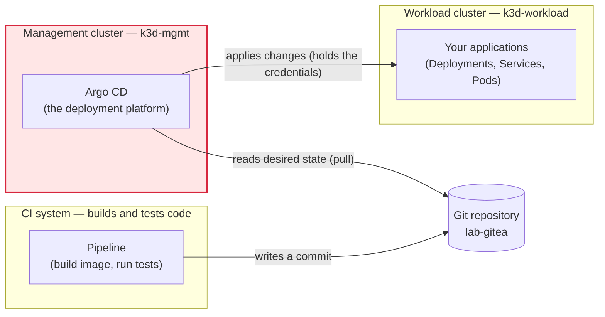
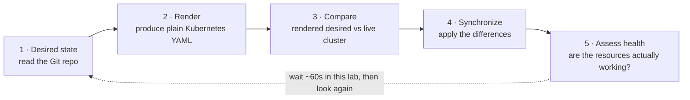
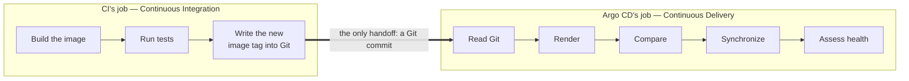

# GitOps and the Argo CD Topology

> **Day 1 · Session 1 · Concept guide · ~45 minutes**
> **Argo CD version this course targets: `v3.5.2`.**
> **What you need open:** nothing yet. This is a read-and-think session. You will run one optional two-command exercise at the end. Guide 02 and Lab 1 are where you drive the tools.

**Where this sits in the course.** This is the very first session. Its whole job is to give you the *mental model* everything else hangs on: what Argo CD is for, what it owns, what it deliberately does **not** own, and the shape of the production system you will operate for the next two days. Get this model right and the machinery in Session 2 will feel obvious. Skip it and every later lab will feel like memorizing commands.

---

## 1. Why this matters

It is 2 a.m. A production service is throwing errors. An on-call engineer does the fastest thing that works: they run `kubectl edit deployment` against the live cluster, bump the container image to a known-good version by hand, and the errors stop. They go back to bed. The fix worked.

The next morning, the errors are back — and the hand-edited image is gone, silently replaced by the old one. Nobody touched it. No alert fired. The engineer swears they fixed it. The dashboard swears nothing changed.

Both are telling the truth. The engineer *did* fix the live cluster. And a piece of software named **Argo CD** *did* quietly undo the fix — on purpose, because the fix never existed in the one place Argo CD trusts: **Git**.

This session is about understanding that machine well enough that the story above stops being a mystery and becomes a predictable, designed behavior. By the end you will be able to say precisely **who was right** (both of them), **why the change reverted** (it was never committed), and **how a platform team is supposed to make that hotfix stick** (change Git, not the cluster).

> **Term check — Git.** Git is the version-control system that stores your files as a series of committed snapshots, each with an author, a message, a timestamp, and a unique identifier called a **commit hash** (often shown as a short **SHA**, a 7-to-40 character fingerprint). Git is where teams already keep application source and Kubernetes configuration. Argo CD adds one idea to the Git you already know: *the cluster should look like the repo, always.*

---

## 2. Plain-language mental model: a thermostat, not a light switch

Before any Argo CD vocabulary, hold one picture in your head.

A **light switch** is a one-time action. You flip it, the light turns on, and then the switch stops caring. If someone else turns the light off a minute later, the switch does nothing. It already did its one job.

Running `kubectl apply` by hand is a light switch. You send a change to the cluster, the cluster accepts it, and after that moment nobody is watching. If the change gets overwritten, deleted, or drifts, `kubectl apply` will not notice, because it already finished.

A **thermostat** is completely different. You do not "turn on" a thermostat. You give it a *target* — "hold this room at 21 °C" — and then it never stops working. It reads the target, reads the actual temperature, acts if they differ, waits a moment, and checks again. Forever. Nobody calls a thermostat "a heating event." It is a **standing instruction**.

**Argo CD is the thermostat.** You do not "deploy" with Argo CD the way you flip a switch. You give it a target — "this cluster should match this Git repository" — and it reads the target, reads the actual cluster, acts if they differ, waits, and checks again. Continuously.

That single shift — from *one-time action* to *standing instruction* — is the whole reason the 2 a.m. hotfix reverted. The engineer flipped a switch (`kubectl edit`). But a thermostat was running the whole time, set to a target that still said "old image." The next time it checked, it saw a mismatch and corrected it — exactly as designed.

Hold this picture. We are about to name its parts.

---

## 3. Vocabulary, grounded before we use it

Each term below gets a plain-language definition first, then its role. These are the words this file **introduces to the whole course** — later guides will use them freely, so it is worth getting them solid now.

- **GitOps.** A way of operating systems where a **Git repository is the single source of truth for what should be running**, and an automated agent continuously makes the real system match the repo. "Ops" (operations) driven by Git. The 2 a.m. story failed because the engineer operated the *cluster* directly instead of operating *Git* — that is the anti-pattern GitOps exists to remove.

- **Desired state.** What the system is *supposed* to look like. In GitOps, the desired state lives in Git — the manifests, Helm values, and configuration you have committed. It is the thermostat's *target*.

- **Live state** (also called *actual* state). What is *really* running in the cluster right now — the real Deployments, Services, and Pods as they currently exist. It is the thermostat's *current room temperature*. (Session 2 splits this further into rendered state and target state; for now, "live = what's actually in the cluster.")

- **Drift.** Any difference between desired state (Git) and live state (cluster). The 2 a.m. hand-edit *created* drift: the cluster no longer matched Git. Drift is not automatically bad or broken — it is simply "the room is not at the target temperature yet." Detecting and reacting to drift is the entire point.

- **Reconciliation.** The continuous loop Argo CD runs to *reduce drift*: read desired state, read live state, compare them, and bring live state back toward desired state. Reconciliation is the thermostat *doing its job*, over and over, on a timer.

- **CI vs CD boundary.** **CI** stands for **Continuous Integration** — the automated building and testing of your code (compile, run tests, produce a container image). **CD** stands for **Continuous Delivery / Continuous Deployment** — getting an approved change *out to the running environment*. The "boundary" is the exact line where one stops and the other begins. Argo CD is a **CD** tool. As you will see, that boundary is a single Git commit.

- **Management cluster.** The Kubernetes cluster where **Argo CD itself runs**. It does not host your applications; it hosts the deployment platform. In this course its lab name is `k3d-mgmt`.

- **Workload cluster.** A *separate* Kubernetes cluster where your **applications actually run**. Argo CD is *registered* with it (given credentials to reach it) and pushes desired state into it from the outside. In this course its lab name is `k3d-workload`.

> **One-line forward references (defined fully in Session 2, used lightly here):** *render* = turn a Helm chart or manifests into plain Kubernetes YAML; *sync / synchronize* = apply the rendered desired state to the cluster; *health* = "is the running resource actually working?"; *sync status* = "does the cluster match Git?". Session 2 gives each of these its own careful treatment — here we only need their everyday sense.

---

## 4. Visuals

Four pictures carry this session. Read each one *before* the paragraph under it, and try to answer its prediction question in your head first.

### V-01 · The production topology (and how the lab maps to it)

**Predict first:** In a well-designed GitOps platform, how many arrows point *from* the CI system *into* the clusters where your apps run? Guess before you read.



The same topology as a plain text sketch, in case the diagram does not render:

```text
   CI pipeline ---- writes a commit ----> [ Git repo: lab-gitea ]
                                                  ^
                                                  | reads (pull)
                                                  |
                            +---------------------------------------+
                            |  MANAGEMENT CLUSTER  (k3d-mgmt)        |
                            |  runs Argo CD                          |   <-- most sensitive cluster you own
                            +---------------------------------------+
                                                  |
                                                  | applies changes (Argo CD holds the credentials)
                                                  v
                            +---------------------------------------+
                            |  WORKLOAD CLUSTER  (k3d-workload)      |
                            |  runs your applications                |
                            +---------------------------------------+
```

**The answer to the prediction: zero.** No arrow runs from CI into any cluster. That is the entire idea. CI's reach ends at the Git repository. Argo CD, running on the **management cluster**, *pulls* the desired state out of Git and then *applies* it to the **workload cluster**. The clusters reach out; nothing reaches in with cluster credentials except Argo CD itself.

**What to notice:**
1. There are **two clusters on purpose.** Argo CD lives on the *management* cluster; your apps live on a *separate registered workload* cluster. This mirrors real production, where the deployment platform is isolated from the things it deploys.
2. The **only thing that ever enters Git is a commit** — from CI, from an engineer, from anywhere. Git is the meeting point.
3. **Argo CD holds the workload cluster's credentials**, not CI. This is why the management cluster is shaded red: it can change *every* cluster it manages, so its blast radius is the union of all of them. Treat it as the most security-sensitive cluster you own. (Sessions 3, 6, and 7 all exist partly to protect it.)

**How the lab maps to production** (`RKE2` = Rancher Kubernetes Engine 2, the production Kubernetes distribution this course is modeled on):

| In your lab | Stands in for, in production |
|---|---|
| `k3d-mgmt` (management cluster) | A Rancher-managed RKE2 **management** cluster running Argo CD |
| `k3d-workload` (workload cluster) | A registered RKE2 **downstream workload** cluster |
| `lab-gitea` (Git service) | Your organization's Git service (GitHub, GitLab, Bitbucket, self-hosted) |

> **Honest lab detail you will meet in Lab 1.** To let you learn the reconciliation loop *before* cluster registration exists, the very first sample application in this course (`hello-reconcile`) is pointed at the *management* cluster itself. That is a teaching shortcut, not a production pattern — Lab 2 registers the real workload cluster and Lab 3 deploys to it. Production never runs your apps on the Argo CD cluster.

### V-02 · The reconciliation loop

This is the single most important diagram in the whole course. You will see it again in Session 2, walk it live in Lab 1, and use it to hunt failures in Session 7 and the Capstone. Learn it here.

**Predict first:** After you push a commit, does Argo CD change the cluster *instantly*? If not instantly, then when?



This is the thermostat loop from Section 2, now wearing Argo CD's real labels. Read desired (Git), render it, compare against live, synchronize the difference, assess health — then wait and repeat. The dashed arrow is the *wait*.

**What to notice:**
1. **Each stage leaves distinct evidence.** A change can leave stage 1 fine but stall at stage 2 (bad chart), stage 3 (nothing to do), stage 4 (apply rejected), or stage 5 (applied but crashing). Naming the stage that failed *is* troubleshooting — this loop is your map.
2. **The loop never ends.** Even when everything matches, Argo CD keeps checking. That is why the 2 a.m. hotfix reverted: the loop kept running and corrected the drift.
3. **It is not instant by default.** Argo CD re-checks each application on a timer. **In this course's environment that timer is tuned to about 60 seconds**, so after you push a commit you may wait up to a minute before the loop notices — unless you press **Refresh** or **Sync** by hand, which forces an immediate pass.

> **Prediction answer + a heads-up for Lab 1.** Not instant. Argo CD's *product default* re-check interval is **180 seconds (3 minutes)**; this classroom has it lowered to **~60 seconds** so labs move faster. Either way, a short stretch of "nothing appears to be happening" after a push is **normal, not broken** — it is the loop waiting for its next pass. (Webhooks, covered in Session 3, exist to remove that wait entirely.)

### V-03 · The CI / CD responsibility boundary

**Predict first:** When a build pipeline finishes producing a new image, does it *deploy* that image? Draw the line where CI's job ends.



**Argo CD does not deploy your code — it deploys your *repository*.** Argo CD never talks to your CI system, never sees your build logs, and never knows a pipeline ran. The handoff between CI and CD is a **commit**: CI builds and tests an artifact, then writes a new version into a Git repo; Argo CD notices the repo changed. That commit is the *entire* integration surface between the two systems.

**What to notice:**
1. Most people, asked to "draw the line where CI stops," draw it **too far to the right** — they assume CI hands the image straight to the cluster. It does not. CI stops at the commit.
2. Because the handoff is a commit, **CI needs no cluster credentials at all.** In an older "push" style of deployment, the CI system would hold cluster-admin access to every environment — meaning the highest-privilege secret in the company lived in its most-integrated, most-plugin-heavy system. In the GitOps "pull" model, that credential *does not exist in CI*: the cluster reaches out to Git, and CI's blast radius shrinks to "can write to a Git repo."
3. This is the honest, non-hype reason platform teams adopt GitOps. Note the caveat, though: the risk does not vanish, it **moves and concentrates** — onto the management cluster (V-01), which now holds the credentials to every workload cluster. That is exactly why we shaded it red.

### V-04 · Argo CD vs Argo Workflows (the one and only comparison)

The Argo project has several tools with similar names. You only need to place **one** of them relative to Argo CD, so you are never confused about which one this course is about. This table and the two paragraphs under it are the *entire* treatment — this is an Argo CD operations course, not an Argo Workflows course.

| | **Argo CD** (this course) | **Argo Workflows** (not this course) |
|---|---|---|
| **What it manages** | A *state*: "the cluster should look like this Git repo" | A *sequence of steps*: "run these tasks in this order" |
| **When it finishes** | Never — it keeps converging, continuously | When the last step completes, then it stops |
| **Mental model** | A **state engine** (a thermostat holding a target) | A **step engine** (a recipe run start-to-finish) |
| **Typical use** | Deploy and continuously reconcile applications | Run CI jobs, batch/data pipelines, one-off automation |
| **"Done" looks like** | Live cluster matches Git (and stays matched) | All steps ran to completion, exit successfully |

**Argo CD is a state engine.** Its job never finishes: it *describes a state the cluster should be in* and keeps converging on it. "Deploy this app and keep it matching Git" is a state — there is no natural moment when the job is "done," because the cluster could drift at any time.

**Argo Workflows is a step engine.** It *describes a sequence of steps* that runs, completes, and stops. "Extract this data, transform it, load it into the warehouse, then finish" is a workflow — it has a clear start, a clear end, and no reason to keep running afterward. If your task has a finish line, it is workflow-shaped; if your task is "hold this true forever," it is Argo CD–shaped. That is the whole distinction, and we will not mention Argo Workflows again.

---

## 5. Worked walkthrough: one change, all the way through

Let us trace a single, realistic change through every stage of V-02, using the actual sample application you will meet in Lab 1: **`hello-reconcile`**. It is a tiny web server whose displayed message comes from a value in Git. Nothing here is copy-and-paste homework — read it as a narrated tour so the loop becomes concrete.

**The starting point.** In Git, the repository `hello-reconcile` (in the `course` organization on `lab-gitea`) has a file `chart/values.yaml` containing:

```yaml
message: "Hello from Git, revision one"
```

Argo CD is already watching this repo through an **Application** — a small Kubernetes object (a **CRD**, a *Custom Resource Definition*, which is just Kubernetes' way of letting a tool add its own object types) that says "here is a repo, a path, and a destination; keep them matched." Right now the live cluster is showing the message from revision one. Desired state and live state agree. The loop is quietly idling.

**Stage 0 — someone changes Git.** An engineer edits one line and commits it:

```yaml
message: "Hello from Git, revision two"
```

They push the commit. **Notice what did *not* happen:** nobody ran `kubectl apply`, nobody touched the cluster, no pipeline "deployed." The only event in the world so far is *a new commit in Git*. This is the CI/CD boundary from V-03, made real.

**Stage 1 — read desired state.** On its next pass (up to ~60 seconds later in this lab, or immediately if someone clicks **Refresh**), Argo CD reads the newest commit on the `main` branch of `hello-reconcile`. Desired state is now "revision two."

**Stage 2 — render.** Argo CD turns the Helm chart plus its values into plain Kubernetes YAML — the same thing `helm template` would produce. The rendered ConfigMap now carries `"Hello from Git, revision two"`. (This is *rendering*, not a `helm upgrade`; Session 4 makes the difference precise. For now: chart in, plain YAML out.)

**Stage 3 — compare.** Argo CD compares the freshly rendered desired state against the live cluster. The live ConfigMap still says "revision one." They differ. Argo CD marks the application **OutOfSync** — its word for "detected drift between Git and the cluster." **OutOfSync does not mean broken.** It means "these two do not match yet." The app is still happily serving revision one.

**Stage 4 — synchronize.** Now the difference gets applied to the cluster. Depending on the application's **sync policy**, this happens one of two ways: **automatically** (Argo CD applies it on its own) or **manually** (a human reviews the diff and clicks **Sync**, or runs the CLI). `hello-reconcile` in Lab 1 is *manual* on purpose, so you can watch each stage deliberately. After the sync, the live ConfigMap holds "revision two," and the application returns to **Synced** — "cluster now matches Git."

**Stage 5 — assess health.** Applying YAML is not the same as *working*. Argo CD watches the affected resources roll out — the podinfo Pod restarts to pick up the new message and passes its readiness probe — and reports **Healthy** once they are actually running. "Synced" (matches Git) and "Healthy" (actually working) are **two separate questions**, and this walkthrough is the first place you feel why. Session 2 makes that separation its centerpiece.

**And then — the loop continues.** With desired and live states matched and healthy, Argo CD does not stop. It waits and checks again, forever. Which brings us all the way back to the 2 a.m. story: if an engineer now hand-edits the live ConfigMap back to "revision one," they create drift, the very next comparison flags it **OutOfSync**, and — if self-heal is on — the loop quietly restores "revision two" from Git. Not a bug. The thermostat, doing its one job.

---

## 6. Screenshots: seeing the two artifacts

You will not click anything yet, but here is what the two systems you just read about actually look like, so the vocabulary has a face.

<!-- CAPTURE-SPEC: SS-S1-01 — Argo CD Applications list.
State recipe: bring the environment to CP-baseline (reset-lab.sh), log in to the Argo CD UI at https://localhost:8443 as admin. Navigate to the Applications list (default landing page). The single `hello-reconcile` Application tile must show sync status = Synced and health status = Healthy, with its destination visible. Viewport 1440x900, light theme, 100% zoom, PNG. Highlight: outline the hello-reconcile tile and its Synced/Healthy badges and destination field. Capture per screenshot-manifest.yaml (id SS-S1-01) → assets/screenshots/day-1/s01-01-applications-list.png. -->


*Figure SS-S1-01 — The Argo CD Applications list (Argo CD `v3.5.2`), at the Day-1 baseline. If the image has not been captured yet, use the description below.*

**What to notice:**
1. There is **one** Application, named `hello-reconcile`. In Argo CD, an "Application" is the object that ties a Git source to a cluster destination — the thermostat's standing instruction.
2. It shows **two independent badges**: a *sync* status (**Synced** = matches Git) and a *health* status (**Healthy** = actually working). Two questions, two answers — remember this for Session 2.
3. The tile names its **destination**. At this Day-1 baseline the destination is the management cluster itself (the teaching shortcut noted under V-01); after Lab 2 you will see applications pointed at the registered workload cluster.

<!-- CAPTURE-SPEC: SS-S1-02 — Gitea commit history for hello-reconcile.
State recipe: CP-baseline. Open Gitea at http://localhost:3000, go to org `course`, repo `hello-reconcile`, branch `main`, Commits view. Show the commit history list with author, message, and abbreviated SHA columns visible. Viewport 1440x900, light theme, 100% zoom, PNG. Highlight: outline the author, message, and SHA columns of the top commit(s). Capture per screenshot-manifest.yaml (id SS-S1-02) → assets/screenshots/day-1/s01-02-gitea-commit-history.png. -->


*Figure SS-S1-02 — The Gitea commit history for `course/hello-reconcile` on `main`. If the image has not been captured yet, use the description below.*

**What to notice:**
1. Every row is a **commit**: an author, a message, a timestamp, and a short **SHA**. This is the audit trail — *who changed what desired state, and when*.
2. This list, not the cluster, is the **source of truth**. Argo CD reads the top commit on `main` to decide what the cluster *should* be.
3. Line up this page with SS-S1-01 in your mind: the commit history is the *desired state*, the Applications list is Argo CD's report on *how well live state matches it*. That pairing is GitOps in two screenshots.

---

## 7. Quick Checks

Answer each in your head (or on paper) **before** opening the collapsed answer. These are prediction and sorting questions, not vocabulary quizzes — that is the point.

### S1-QC1 — Who deploys it, and when?

A CI pipeline finishes building and testing a new image. As its final step, it commits a new image tag into the `main` branch of the deployment repository. The app's Argo CD Application uses **manual** sync.

**Question:** Does that commit reach the running cluster? If so, *who* applies it and *when*? If not, why not?

<details>
<summary>Show answer and rationale</summary>

**The CI pipeline does *not* deploy it.** CI's job ended at the commit (V-03). Whether and when the change reaches the cluster is entirely Argo CD's decision.

- **Who:** Argo CD — specifically its reconciliation loop — is the only thing that applies changes to the cluster. CI holds no cluster credentials.
- **When:** Because sync is **manual**, the answer is **not until a human (or automation) explicitly clicks Sync / runs `argocd app sync`.** Argo CD *will* notice the new commit on its next pass (≤ ~60 s here) and mark the app **OutOfSync**, but with a manual policy it *stops there* and waits. Detecting the drift and correcting the drift are separate steps, and manual sync deliberately keeps a human between them.
- **If the policy were automated instead:** Argo CD would apply it on its own at the next pass (≤ ~60 s), or immediately on a Refresh / webhook.

**Rationale:** This separates two ideas people often fuse — "CI made a commit" and "the cluster changed." They are connected only by Argo CD noticing Git, and *noticing* is not the same as *applying*.
</details>

### S1-QC2 — Sort the ten duties

Sort each duty into exactly one owner: **CI**, **Argo CD**, **Platform team**, or **Application team**.

1. Build a container image from application source.
2. Run unit tests on a pull request.
3. Commit the freshly built image tag into the deployment repository.
4. Notice that Git changed and bring the cluster back into line with it.
5. Continuously detect drift between Git and the live cluster.
6. Install, upgrade, and operate Argo CD itself on the management cluster.
7. Register a new workload cluster with least-privilege credentials.
8. Define the AppProject and RBAC guardrails that limit what each team can deploy.
9. Decide an application's replica count and resource requests in `values.yaml`.
10. Open a pull request to change the application's version or configuration.

<details>
<summary>Show answer and rationale</summary>

| # | Duty | Owner |
|---|---|---|
| 1 | Build a container image | **CI** |
| 2 | Run unit tests on a PR | **CI** |
| 3 | Commit the new image tag into the repo | **CI** (the automated final step) |
| 4 | Bring the cluster back in line with Git | **Argo CD** |
| 5 | Continuously detect drift | **Argo CD** |
| 6 | Install/upgrade/operate Argo CD itself | **Platform team** |
| 7 | Register a workload cluster (least privilege) | **Platform team** |
| 8 | Define AppProject / RBAC guardrails | **Platform team** |
| 9 | Choose replicas and resource requests | **Application team** |
| 10 | Open a PR to change the app | **Application team** |

**Rationale — the four owners split cleanly by *what kind of thing* they touch:**
- **CI** touches *artifacts and commits* — it never touches a cluster.
- **Argo CD** touches the *cluster*, but only to make it match Git — it never decides *what* the desired state should be.
- The **platform team** owns the *machine and its guardrails* — Argo CD itself, cluster registration, and the boundaries that say who may deploy what.
- The **application team** owns the *content of the desired state* for their app — versions, values, replicas — expressed as pull requests into Git.

If you put #6, #7, or #8 under "Argo CD," re-read: Argo CD is the tool; a **team** operates and constrains it. That distinction is the spine of Sessions 3 and 6.
</details>

### S1-QC3 — Order the flow and name the evidence

Put these five reconciliation stages in the correct order, and name one piece of evidence each stage leaves behind: *compare*, *assess health*, *read desired state (Git)*, *synchronize*, *render*.

<details>
<summary>Show answer and rationale</summary>

**Correct order (this is V-02):**

1. **Read desired state (Git)** — evidence: the target revision / commit SHA Argo CD is now tracking on `main`.
2. **Render** — evidence: the produced plain Kubernetes YAML (what `helm template` would output); a failure here shows as a rendering/`ComparisonError`.
3. **Compare** — evidence: the **sync status** (`Synced` or `OutOfSync`) and a **diff** showing exactly which fields differ.
4. **Synchronize** — evidence: a sync result (`Succeeded`/`Failed`) and a new live revision recorded in the app's history.
5. **Assess health** — evidence: the **health status** (`Healthy`, `Progressing`, `Degraded`) plus the underlying resource/Pod events.

**Rationale:** Each stage leaves a *different* signal, and that is what makes troubleshooting a lookup instead of a guess: "OutOfSync but never syncing" points at stage 4; "rendering error" points at stage 2; "Synced but Degraded" points at stage 5. Session 7's troubleshooting method is built directly on this ordering.
</details>

### S1-QC4 — Argo CD or Argo Workflows?

Classify each as a job for **Argo CD** or **Argo Workflows**:

- **A.** "Keep this set of Kubernetes Deployments matching what is in Git, forever."
- **B.** "Every night, extract yesterday's data, transform it, load it into the warehouse, then stop."
- **C.** "An operator hand-edited a live Deployment; put it back to the approved version in Git."

<details>
<summary>Show answer and rationale</summary>

- **A → Argo CD.** "Keep matching, forever" is a *state* with no finish line. State engine.
- **B → Argo Workflows.** A defined sequence of steps that runs to completion and stops. Step engine.
- **C → Argo CD.** Restoring drift back to the committed version is exactly the reconciliation loop — a *state* being held, not a *sequence* being run.

**Rationale:** The tell is the finish line. If the task is "hold this true indefinitely," it is Argo CD–shaped; if it is "run these steps and be done," it is Workflows-shaped. A and C are the *same* Argo CD job (converge to Git) wearing different clothes.
</details>

---

## 8. Try It Yourself (optional, ~5 minutes, outside the timebox)

This is optional and reads-only — it changes nothing. It just lets you *see* the audit trail you have been reading about.

1. On the lab VM, clone the sample repo and read its commit history from the command line:

   ```bash
   git clone http://localhost:3000/course/hello-reconcile.git
   cd hello-reconcile
   git log --oneline
   ```

   Each line is one commit: a short SHA followed by its message. This is the *desired-state history* — every change to what the cluster is supposed to look like.

2. Now open the **same** history in a browser. Point it at Gitea at `http://localhost:3000`, open the `course` organization, the `hello-reconcile` repository, and the **Commits** view on the `main` branch (this is the screen SS-S1-02 describes).

3. Compare the two views and answer for yourself: **who** changed the app, **what** they changed, and **when**. That "who/what/when," available for free, is the audit-trail half of GitOps — the same commits Argo CD reads to decide desired state are the record humans read to understand history.

---

## 9. Common misconceptions

**"Argo CD is a CI tool."** No. Argo CD is a **CD** (Continuous Delivery) tool. It never builds images, runs tests, or executes pipelines. It reads Git and reconciles a cluster to match. CI builds the artifact; Argo CD makes the cluster match the approved answer. The only thing crossing between them is a commit (V-03).

**"GitOps means the pipeline pushes to the cluster."** That is the *opposite* of GitOps — it is the older "push" model, where CI holds cluster credentials and applies changes directly. GitOps is a **pull** model: nobody pushes to the cluster; everybody commits to Git, and the cluster (via Argo CD) *pulls* the change and catches up. If a diagram shows an arrow from CI into a cluster, it is not GitOps.

**"Argo CD and Argo Workflows are the same product."** They share a project family and a naming style, and nothing else you need here. Argo CD is a **state engine** that continuously converges a cluster to Git. Argo Workflows is a **step engine** that runs a sequence of tasks to completion. This course is about Argo CD; that is the last you will hear of Workflows (V-04).

---

## 10. Key takeaways

Memorize these five one-liners — they are the whole session compressed, and later guides assume you can repeat them to a colleague:

- **"Git is the source of truth; the live cluster is just today's rendering of it."**
- **"CI proves the artifact is good. Argo CD proves the cluster matches the approved answer. The only thing that crosses between them is a commit."**
- **"Argo CD is a thermostat, not a light switch. `kubectl apply` happens once; reconciliation never stops."**
- **"Nobody deploys to the cluster. Everybody commits to Git, and the cluster catches up."**
- **"The management cluster can change every cluster it manages. Treat it as the most sensitive cluster you own, because it is."**

And the **key outcome** for this session: you can now say what Argo CD **owns** (making the cluster match Git, continuously), what it **does not own** (building code, choosing desired state, running steps to completion), and **where it sits** in a delivery platform (on an isolated management cluster, pulling from Git, pushing to registered workload clusters).

---

## 11. Transition — what's next

You now have the *purpose, boundaries, and topology*. You know Argo CD is a thermostat that pulls from Git and converges a workload cluster, and you can name who owns each duty around it.

What you do **not** yet have is the *machinery*: which internal components render, compare, and apply; where the four states (desired, target, rendered, live) actually live; and the crucial split between **sync status** ("does it match Git?") and **health status** ("is it working?") that you felt twice in this guide but did not pin down.

That is exactly Session 2, **Argo CD Architecture and the Application Model**. It opens with a puzzle this session set up: *the dashboard says "Synced," but users report errors — how can both be true?* Bring the thermostat and the reconciliation loop with you; Session 2 opens up the thermostat and names every part.
