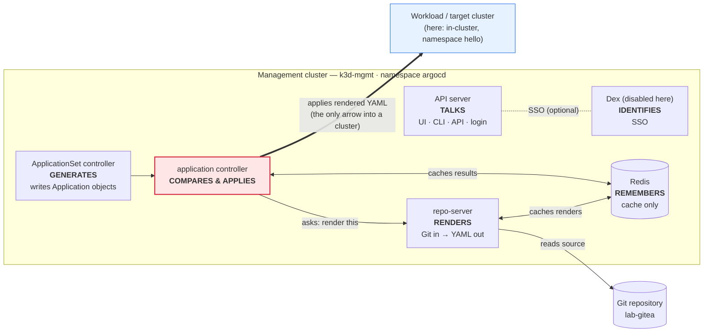
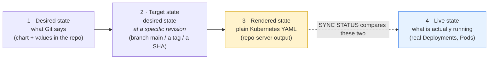
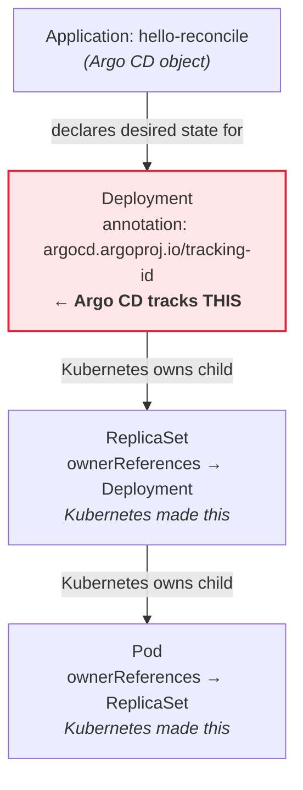

# Argo CD Architecture and the Application Model

> **Day 1 · Session 2 · Concept guide · ~60 minutes**
> **Argo CD version this course targets: `v3.5.2`** (Helm chart `10.8.4`).
> **What you need open:** nothing is required — this is a read-and-think session. There is one optional, read-only, two-command exercise at the end (Section 8). Lab 1 is where you drive the tools.

**Where this sits in the course.** Session 1 gave you the *purpose and shape* of Argo CD: a thermostat that pulls desired state from Git and converges a cluster onto it, running on an isolated management cluster. This session opens up that thermostat and names every part. By the end you will be able to point at any Argo CD symptom and say which component to suspect, and you will be able to read the two status words — **Synced** and **Healthy** — without ever confusing them again. That single skill is the backbone of every lab and the Capstone.

---

## 1. Why this matters

A platform engineer gets a message during business hours: *"Checkout is throwing 500 errors — customers can't pay."* They open the Argo CD dashboard, find the application, and see a calm green badge: **Synced**. Everything, according to the dashboard, matches Git perfectly. Nothing is out of place.

And yet customers really are getting errors. Both statements are true at the same time.

How? Because "Synced" answers a question that has *nothing to do* with whether the application works. "Synced" only means **the live cluster matches what is written in Git.** It is entirely possible to deploy exactly what you asked for — and for what you asked for to be broken. The dashboard is not lying; it is answering a different question than the one the engineer is panicking about.

The engineer needs to look one column over, at a **second, independent** status: **health**. That column, in this scenario, is **Degraded** — the running application is live but not working. `Synced` + `Degraded` together tell a precise story: *you shipped this bug on purpose, straight from Git.* The fix is not "re-sync." The fix is a new commit.

This session is about understanding the machine well enough that "Synced but broken" stops being a paradox and becomes a two-word diagnosis you can read at a glance. To get there, you need two things: a map of the **components** that do the work, and a firm grip on the **two independent status axes** those components report. We build both, in that order.

---

## 2. Plain-language mental model: one verb per component

Argo CD is not a single program. It is a small team of specialized programs — called **components** — that each run as one or more **pods** (a pod is the smallest deployable unit in Kubernetes: one or more containers running together). In this course they all run in a Kubernetes **namespace** (a named partition inside a cluster) called `argocd`, on the management cluster whose context name is `k3d-mgmt`.

The fastest way to hold six components in your head is to give each one exactly **one verb**. Name the verb, and you have named the suspect when something breaks.

- **repository server (repo-server) — *renders.*** You hand it a Git repository and a chart or a folder of manifests; it hands back plain Kubernetes YAML. That is its entire job. It never talks to a workload cluster. If your manifests come out wrong, look here.

- **application controller — *compares and applies.*** It takes the rendered YAML from the repo-server, compares it against what is actually running, and — when told to — applies the difference to the target cluster. It is the **only** component that touches a workload cluster. If a sync fails or drift is not corrected, look here.

- **API server — *talks.*** It is the front door: the web UI, the `argocd` command-line tool, the REST/gRPC API, and login all go through it. It does not deploy anything. If you cannot log in or the UI is down, look here.

- **ApplicationSet controller — *generates Applications.*** It takes one template and a list of inputs and writes many Application objects from them. It never touches a workload cluster either — it only produces Applications for the application controller to act on. (You meet this properly on Day 2.)

- **Redis — *remembers (temporarily).*** It is a cache. It holds rendered manifests and computed results so the other components do not redo expensive work. Deleting it costs performance, not data. If you are backing up Redis, you are backing up the wrong thing.

- **Dex — *identifies.*** An optional single-sign-on (SSO) helper that connects Argo CD to an external identity provider. **In this course Dex is turned off**, so you will not see a Dex pod — but it belongs on the map because you will meet it in production.

One more component runs in this environment but has no user-facing job in Day 1:

- **notifications controller — *announces.*** It watches applications and can send alerts (Slack, email, webhooks) when their state changes. It is present at baseline with no alerts configured; Session 7 returns to it.

> **The payoff, stated once so it sticks:** every symptom you will ever chase maps to one of these verbs. "Manifests are stale" → *renders* → repo-server. "The sync is stuck" → *compares/applies* → application controller. "I can't log in" → *talks* → API server. You are not memorizing a diagram; you are building a lookup table for future incidents.

> **Progressive-disclosure box (optional, safe to skip on a first read).** These one-verb labels are deliberate simplifications for teaching order. In reality the API server also serves the repository and cluster *configuration* surface, and Dex is optional because many organizations point Argo CD straight at an external OpenID Connect (OIDC) provider without Dex in the middle. The verbs are true enough to troubleshoot by; the nuance arrives in Session 7.

---

## 3. Vocabulary, grounded before we use it

Every term below gets a plain-language definition first, then its role. These are the words this file **introduces to the whole course** — later guides use them freely, so it is worth getting them solid now.

- **CRD (Custom Resource Definition).** A way to teach Kubernetes a brand-new kind of object beyond its built-in ones (Pods, Services, and so on). Argo CD installs CRDs so the cluster understands objects called `Application`, `AppProject`, and `ApplicationSet`. Once a CRD exists, you can create those objects with `kubectl` exactly like any native resource.

- **controller.** A program that runs a never-ending loop: read the desired state of some objects, look at the real world, and act to close the gap. Kubernetes is built from controllers. Argo CD's application controller is one, specialized for reconciling Applications.

- **Application.** The core Argo CD object. It is a small manifest that says *which* Git repository, *which* revision, *which* path or chart, *which* destination cluster and namespace, *which* project, and *what* sync policy. Critically, it contains **no workload YAML of its own** — it is a set of pointers (an address), not the thing being deployed (an artifact).

- **AppProject** *(introduced here, taught fully in Session 6).* A guardrail object that groups Applications and limits what they are allowed to do — which repositories they may pull from, which clusters and namespaces they may deploy to, and which kinds of resources they may create. Every Application belongs to exactly one project; `hello-reconcile` belongs to the built-in `default` project.

- **desired state.** What the system is *supposed* to look like, as committed in Git. Session 1's thermostat *target*.

- **rendered state (rendered manifests).** The plain Kubernetes YAML the **repo-server** produces from your Git source. If your source is a Helm chart, rendered state is the output of turning that chart plus its values into finished YAML. This is desired state *after* templating, and it is what Argo CD actually compares against the cluster.

- **target state (target revision).** The specific Git revision — a branch name, a tag, or a commit fingerprint (SHA) — that the Application is currently pointed at. `hello-reconcile` targets the branch `main`. "Target" answers *"desired state as of which commit?"*

- **live state.** What is *really* running in the cluster right now — the actual Deployments, Services, and Pods as they currently exist.

- **sync status.** The answer to one question: **does live state match the rendered desired state?** Its main values are `Synced` and `OutOfSync` (and `Unknown` when Argo CD cannot tell). It is a statement about **Git**, not about whether anything works.

- **health status.** The answer to a completely different question: **is the live resource actually working?** Its values include `Healthy`, `Progressing`, `Degraded`, `Missing`, `Suspended`, and `Unknown`. It looks only at live state.

- **refresh.** Ask Argo CD to **re-run the comparison now** instead of waiting for its timer. It re-reads Git and re-compares. It does **not** change the cluster.

- **hard refresh.** A refresh that *also* throws away the cached rendered manifests first, forcing the repo-server to render again from scratch. Use it when Argo CD seems to be ignoring a change you made in the repository. It still does **not** change the cluster.

- **compare.** The internal step where the application controller lines up rendered desired state against live state and produces the sync status and the diff.

- **sync (synchronize).** The step that **actually changes the cluster** — the application controller applies the rendered desired state so live state matches Git. This is the *only* one of these operations that touches a workload cluster.

- **resource tracking (the tracking-id annotation).** How Argo CD remembers which live resources it created and owns. In the 3.x line the default method is an **annotation** named `argocd.argoproj.io/tracking-id` that Argo CD stamps onto every top-level resource it manages. A resource without that stamp is invisible to Argo CD — not "extra," not "drift," merely not its concern.

> **One term deliberately held back.** *Repository credentials* and *cluster credentials* appear in the diagrams below only as **external dependencies** of an Application — what they are and where they live. Their internal format and how to scope them to least privilege belong to Session 3 and Lab 2. This session names them and moves on.

---

## 4. Visuals

Five pictures carry this session. Read each one *before* the paragraph under it, and try to answer its prediction question in your head first.

### V-05 · Component architecture — which component does what

**Predict first:** If the Argo CD UI loads fine but every application shows the *same* rendering error at once, which single component is the most likely culprit?



The same map as a plain-text sketch, in case the diagram does not render:

```text
              +---------------------------------------------------------+
              |  MANAGEMENT CLUSTER  (k3d-mgmt) · namespace argocd       |
              |                                                          |
              |  [API server]  TALKS ...... UI / CLI / API / login       |
              |  [ApplicationSet ctrl] GENERATES ... writes Applications |
              |  [application controller] COMPARES & APPLIES  <-- red    |
              |  [repo-server] RENDERS ..... Git in -> YAML out          |
              |  [Redis] REMEMBERS ......... cache only                  |
              |  [Dex] IDENTIFIES (disabled in this course)              |
              +----------------------|----------------------------------+
                     ^ reads source  |  ^ caches                | applies rendered YAML
                     |               |  |                       |  (the ONLY arrow into a cluster)
              [ Git: lab-gitea ]     +--+                       v
                                                        [ target cluster: namespace hello ]
```

**What to notice:**
1. **Only one arrow enters a cluster**, and it comes from the **application controller** (shaded red). No other component can change a workload. This is why "the sync did not happen" is almost always a controller or credential story, never a repo-server story.
2. The **repo-server is the only component that reads Git**, and it never reaches a cluster. So a *rendering* failure and a *sync* failure live in different places — a distinction that saves you minutes in every incident.
3. **Redis sits in the middle as a cache**, connected to both the repo-server and the controller. Nothing in this picture *depends* on Redis for correctness — pull it out and the system rebuilds the cache and keeps working, more slowly.

> **Prediction answer:** the **repo-server**. Rendering is its sole job, and "every application at once" points at the shared component they all rely on to render — not at any single application's Git source.

### V-06 · Four states: desired, target, rendered, live

**Predict first:** Sync status compares two of these four states against each other. Which two — and, importantly, which two does it *not* compare?



**What to notice:**
1. **Sync status compares rendered (3) against live (4).** It does **not** compare raw Git text against the cluster, and it does **not** compare *target revision* against the cluster directly. The comparison happens *after* templating, because templating is where a Helm chart becomes the concrete YAML a cluster can actually run.
2. **Target state is desired state pinned to a revision.** Pointing an Application at `main` versus at a fixed tag like `v1.4.0` changes *which* commit becomes the target — and therefore what gets rendered — without changing the machinery.
3. Because the comparison is **rendered-vs-live**, two different Git commits that render to *identical* YAML produce **no** difference in sync status. Sync status cares about the resulting manifests, not the commit message.

> **Prediction answer:** it compares **rendered (3)** and **live (4)**. It never directly compares desired Git text (1) or the raw target revision (2) against the cluster.

### V-07 · Sync × health — two independent axes

**Predict first:** Can an application be `OutOfSync` and `Healthy` at the same moment? Can it be `Synced` and `Degraded`? Decide yes/no for each before reading the grid.

Sync status and health status are **not** two grades of the same thing. They answer different questions and move independently. Reading them as one combined "is it OK?" light is the single most common Argo CD mistake. The grid below writes a real scenario into each cell so the independence is impossible to miss.

| | **Healthy** *(live works)* | **Progressing** *(live is coming up)* | **Degraded** *(live is broken)* |
|---|---|---|---|
| **Synced** *(matches Git)* | The boring, correct state. Nothing to do. | A normal deploy in flight: Pods are starting, probes not yet passing. Wait. | **You deployed exactly what Git says — and it is broken.** The bug is *in Git*. Fix forward with a new commit. |
| **OutOfSync** *(differs from Git)* | Serving users fine, but the cluster does not match Git — usually drift or a commit that has not been synced yet. **Not an outage.** | Mid-sync toward a new commit: the change is applying and the workload is rolling. | Broken **and** adrift. Establish which came first: did a bad deploy cause it, or did drift break a working app? |

**What to notice:**
1. **Every cell is reachable.** That is the whole point of drawing it as a grid: any sync value can pair with any health value. If you ever catch yourself assuming "Synced therefore fine," this grid is the counterexample.
2. **The top-right cell (`Synced` + `Degraded`) is the Section 1 opening scenario.** Green sync, red health, real user impact — and the fix is a commit, not a re-sync.
3. **The bottom-left cell (`OutOfSync` + `Healthy`) is not an emergency.** Users are served by the current version; the cluster is not what Git says yet. A short-lived `OutOfSync` is normal; an `OutOfSync` that *never* converges under automated sync is the real problem.

> **Prediction answer: yes to both.** `OutOfSync` + `Healthy` (working but not matching Git) and `Synced` + `Degraded` (matching Git but broken) are both completely ordinary. They are the two states this whole session exists to make legible.

### V-08 · The Application, annotated — every field is an external dependency

**Predict first:** How many lines of actual workload YAML (a Deployment, a Service) do you expect to find inside an Application manifest?

Below is the real `hello-reconcile` Application this course ships with. Read each comment as an **arrow pointing out of the manifest** at something that lives elsewhere and can fail on its own.

```yaml
apiVersion: argoproj.io/v1alpha1
kind: Application                       # a CRD Argo CD installed
metadata:
  name: hello-reconcile
  namespace: argocd                     # Applications live in Argo CD's namespace,
                                        #   NOT in the namespace they deploy to
spec:
  project: default                      # -> depends on an AppProject's guardrails
  source:
    repoURL: http://lab-gitea:3000/course/hello-reconcile.git
                                        # -> depends on a Git repo being reachable
                                        #    (and, for private repos, a REPOSITORY CREDENTIAL)
    targetRevision: main                # -> depends on this branch/tag/SHA existing
    path: chart                         # -> depends on this folder holding a valid chart
  destination:
    server: https://kubernetes.default.svc
                                        # -> depends on a CLUSTER CREDENTIAL for this target
    namespace: hello                    # -> depends on this namespace (created here via a sync option)
  syncPolicy:
    syncOptions:
      - CreateNamespace=true            # make the 'hello' namespace if it is missing
    # No 'automated:' block -> sync is MANUAL. Argo CD will detect drift and
    # mark it OutOfSync, but it will NOT apply changes until a human syncs.
```

**What to notice:**
1. **There is no workload YAML here at all.** No Deployment, no Service, no container image. Every meaningful line is a *pointer* to something outside the manifest. Reading an Application is reading a list of things that can each break independently.
2. **Two of those pointers are credentials** — a repository credential (only needed for private repos) and a cluster credential (for the destination). In this session they are only "external dependencies stored as Kubernetes Secrets in the `argocd` namespace." Their format and least-privilege scoping are Session 3 and Lab 2 material.
3. **The absence of an `automated:` block is itself a decision.** Manual sync means Argo CD will *notice* drift but not *correct* it. Detection and correction are separate, and this Application deliberately keeps a human between them.

> **Prediction answer:** zero lines of workload YAML. An Application is an **address, not an artifact** — the artifact lives in the Git repo the address points at.

### V-09 · Tracking versus ownerReferences — who owns which node

**Predict first:** In the tree `Deployment → ReplicaSet → Pod`, how many of those three does Argo CD directly track as "mine"?

Argo CD and Kubernetes each own a *different part* of the resource tree, by a *different mechanism*. Confusing the two is the reason "I deleted a Pod, why isn't it drift?" feels mysterious.



**What to notice:**
1. **Argo CD directly tracks only the top-level resource** — the Deployment — by stamping it with the `argocd.argoproj.io/tracking-id` annotation. That annotation is Argo CD's ownership stamp.
2. **Kubernetes owns everything below** via a native field called `ownerReferences`: the Deployment makes and owns the ReplicaSet, which makes and owns the Pods. Argo CD does not stamp those; it only *displays* them in the tree for context.
3. **This is why deleting a Pod is not drift.** The Pod is not in Git and carries no Argo CD tracking-id — Kubernetes recreates it from the ReplicaSet on its own. Delete the **Deployment**, and *that* is drift, because the Deployment is the tracked, in-Git resource.

> **Prediction answer:** exactly **one** — the Deployment. The ReplicaSet and Pod are Kubernetes-owned children that Argo CD watches but does not track as desired state.

---

## 5. Screenshots — the same ideas on the real UI

These three screens are where the abstractions above become things you can click. Each block gives you a capture specification (so the image can be produced consistently), an image reference with alt text, a version-stamped caption, and a numbered "what to notice" list so the guide still works if the image has not been captured yet.

<!-- CAPTURE-SPEC: SS-S2-01 — hello-reconcile resource tree, Synced/Healthy.
State recipe: bring the environment to CP-baseline (reset-lab.sh); log in to the Argo CD UI at https://localhost:8443 as admin. Open the `hello-reconcile` Application, select the Tree view. The Application node and its children (Deployment → ReplicaSet → Pod, plus any Service/ConfigMap) must be visible. Sync status = Synced and health status = Healthy. Viewport 1440x900, light theme, 100% zoom, PNG. Highlight, separately, the app-level Sync badge and the app-level Health badge so the two axes read as distinct. Argo CD v3.5.2. Save to assets/screenshots/day-1/s02-01-app-tree-synced-healthy.png. -->


*Figure SS-S2-01 — The `hello-reconcile` resource tree at the Day-1 baseline (Argo CD `v3.5.2`). If the image has not been captured yet, use the description below.*

**What to notice:**
1. The **Sync badge and the Health badge are two separate indicators**, side by side — the UI itself refuses to merge them into one light. That is V-07 made visible.
2. The **tree shows `Deployment → ReplicaSet → Pod`**, but only the Deployment is something Git declared; the ReplicaSet and Pod are Kubernetes-generated children (V-09).
3. Each node carries its **own** small health indicator. The Application's rolled-up health is the *worst* among its immediate children — health is computed per resource, not inherited up from grandchildren.

<!-- CAPTURE-SPEC: SS-S2-02 — hello-reconcile App details summary panel.
State recipe: CP-baseline; from the hello-reconcile Application, open the summary/details panel (the header "App Details" area). Show repo URL, target revision (main), path (chart), destination server + namespace (hello), project (default), and sync policy (manual). Viewport 1440x900, light theme, PNG. Highlight the source/destination/project/sync-policy fields. Argo CD v3.5.2. Save to assets/screenshots/day-1/s02-02-app-details-summary.png. -->


*Figure SS-S2-02 — The App Details summary for `hello-reconcile` (Argo CD `v3.5.2`). This is V-08's manifest, rendered as a panel.*

**What to notice:**
1. Every field here is one of the **pointers** from V-08: repository, revision, path, destination, project, sync policy. The panel is the annotated YAML in friendlier clothing.
2. The **sync policy reads as manual** (no automated sync). That is the setting that keeps a human between "OutOfSync detected" and "change applied" in Lab 1.
3. The **destination is `in-cluster`, namespace `hello`** — a teaching shortcut. Production never deploys workloads to the management cluster; Lab 2 registers a real workload cluster.

<!-- CAPTURE-SPEC: SS-S2-03 — live manifest of the Deployment, tracking-id annotation.
State recipe: CP-baseline; in the hello-reconcile tree, click the Deployment node, open its Live Manifest view, scroll to metadata.annotations. The annotation argocd.argoproj.io/tracking-id must be visible with its value. Viewport 1440x900, light theme, PNG. Highlight the argocd.argoproj.io/tracking-id line. Argo CD v3.5.2. Save to assets/screenshots/day-1/s02-03-live-manifest-tracking-id.png. -->


*Figure SS-S2-03 — The live manifest of the `hello-reconcile` Deployment, showing Argo CD's ownership stamp (Argo CD `v3.5.2`).*

**What to notice:**
1. The **`argocd.argoproj.io/tracking-id` annotation** is Argo CD's ownership stamp — the default resource-tracking method on the 3.x line. This is what makes the resource "Argo CD's" (V-09).
2. This annotation sits on the **Deployment**, the top-level tracked resource — you will *not* find it added by Argo CD on the ReplicaSet or Pod.
3. A resource *without* this stamp, sitting in the same namespace, is **invisible** to Argo CD — neither owned nor treated as drift.

---

## 6. Worked walkthrough

Now we put the map and the two axes together on the real environment. We do three things: (1) list the running pods and map each to its verb, (2) trace exactly how sync status and health status are computed, and (3) say **where each status value is stored** — because that last point trips up even experienced operators.

### 6.1 Map each pod to its verb

Listing the pods in the `argocd` namespace shows the component team from V-05 as real, running processes:

```bash
kubectl --context k3d-mgmt -n argocd get pods
```

Representative output — confirm against the live classroom environment:

```text
NAME                                               READY   STATUS    RESTARTS   AGE
argocd-application-controller-0                     1/1     Running   0          26m
argocd-applicationset-controller-6f7b9c8d4-abcde   1/1     Running   0          26m
argocd-notifications-controller-7c9d5f6b8-fghij    1/1     Running   0          26m
argocd-redis-5b6c7d8e9-klmno                       1/1     Running   0          26m
argocd-repo-server-84f5c6d7b-pqrst                 1/1     Running   0          26m
argocd-server-6d8f9b7c5-uvwxy                      1/1     Running   0          26m
```

Read each pod name as a verb from V-05:

| Pod (name starts with…) | Component | Its one verb |
|---|---|---|
| `argocd-server` | API server | **talks** (UI, CLI, API, login) |
| `argocd-repo-server` | repository server | **renders** (Git → YAML) |
| `argocd-application-controller` | application controller | **compares & applies** |
| `argocd-applicationset-controller` | ApplicationSet controller | **generates** Applications |
| `argocd-redis` | Redis | **remembers** (cache) |
| `argocd-notifications-controller` | notifications controller | **announces** |

Two absences are meaningful. There is **no `argocd-dex-server` pod** because Dex (SSO) is disabled in this course. And the **application controller is `-0`**, a numbered name, because it runs as a StatefulSet — a Kubernetes workload type that gives its pod a stable identity; you do not need that detail today, only the verb.

### 6.2 Trace how sync status is computed

Follow one reconciliation pass and watch which component produces which signal:

1. The **application controller** wants to know the desired state, so it asks the **repo-server** to *render* `hello-reconcile`'s source (`path: chart` at revision `main`). The repo-server reads Git, produces plain Kubernetes YAML — the **rendered state** — and hands it back (caching it in Redis).
2. The **application controller** then *compares* that rendered state against the **live state** it reads from the target cluster. The result of this comparison is the **sync status**: `Synced` if they match, `OutOfSync` if they differ, `Unknown` if it could not complete the comparison.
3. Nothing has changed on the cluster yet. Comparison is read-only. A change happens only if a **sync** runs — and with `hello-reconcile`'s manual policy, that requires a human.

The one-sentence version: **sync status is the application controller's report on rendered-versus-live.** It is a statement about Git.

### 6.3 Trace how health status is computed

Health takes a different path and uses different inputs:

1. For each live resource, the **application controller** inspects **only that resource's own live state** — a Deployment's available-versus-desired replicas, a Pod's phase, and so on — and assigns it a health value.
2. The values, from most to least healthy, are: `Healthy` → `Suspended` → `Progressing` → `Missing` → `Degraded` → `Unknown`. The **Application's** health is the **worst** value among its **immediate** children.
3. Health looks at **live state only**. It never reads Git and never runs a comparison. This is why health can be `Degraded` while sync is `Synced` — the two do not share inputs.

The one-sentence version: **health status is the application controller's report on live-only.** It is a statement about whether things work.

> **Why health is not inherited from grandchildren.** Each resource's health is computed from *its own* status, then rolled up one level. A crash-looping Pod usually still surfaces as unhealthy — because the *Deployment's* own status reports unavailable replicas — but the mechanism is "each resource reports itself," not "problems bubble up from the bottom." A resource type with no health check (or a wrong custom one) can therefore break the chain. Session 7 returns to custom health checks; here, hold the mechanism for now.

### 6.4 Where each status value actually lives

This is the operational detail the blueprint insists every guide state plainly, because it changes how you read raw Kubernetes objects:

- **Application-level sync status** is **persisted** in the Application object at `.status.sync.status`. You can read it straight from the cluster with `kubectl`.
- **Application-level health status** is **persisted** in the Application object at `.status.health.status`. Also readable with `kubectl`.
- **Per-resource (child) health**, however, is **not persisted in the Application object by default since Argo CD 3.0.** The tree shows it because the controller computes it live and caches it (in Redis), but you should **not** expect to find every child resource's health frozen inside the Application's `.status`. (The behavior is governed by a controller setting, `controller.resource.health.persist`, which defaults to off since 3.0.)

The practical takeaway: reading `.status.sync.status` and `.status.health.status` off the Application object is reliable; if you want each *child* resource's current health, read the resource tree in the UI or query the live resources directly, rather than expecting it inside the Application object.

### 6.5 Refresh, hard refresh, and sync — only one touches the cluster

These three operations are constantly confused. The distinction is small and vital:

- **Refresh** = *"compare again, now."* The controller re-reads Git and re-runs the comparison instead of waiting for its timer. It updates sync status. It does **not** change the cluster.
- **Hard refresh** = *"forget the cached render, then compare again."* Same as refresh, but it first discards the cached rendered manifests so the repo-server renders from scratch. Use it when Argo CD seems to be ignoring a repository change — a plain refresh will faithfully re-compare a **stale** rendering. It does **not** change the cluster. It also costs real repo-server work, so it is a diagnostic tool, not a habit.
- **Sync** = *"apply the difference."* This is the only operation that **changes the cluster**, bringing live state into line with rendered desired state.

> **In this classroom, the automatic re-check timer is tuned to about 60 seconds** (the Argo CD product default is 180 seconds / 3 minutes). So after a Git change you may see "nothing happening" for up to a minute before a refresh happens on its own — that wait is the timer, not a failure. Refresh is the impatient version of waiting; a webhook (Session 3) is the production version of not waiting.

### 6.6 A reference table you will come back to

The outline calls out four status values that generate the most confusion in operations. Later guides (Lab 1, Lab 3, Session 7, the Capstone) revisit this table with live examples; treat it as a lookup, not something to memorize now.

| Status value | Which axis | Plain meaning | Common causes | Where to look first |
|---|---|---|---|---|
| **OutOfSync** | sync | Live state does not match rendered desired state | A new commit not yet synced; a manual live edit (drift); automated sync off or stuck | The **Diff** panel; the app **History**; is auto-sync on? — *application controller* |
| **Unknown** | sync **or** health | Argo CD cannot determine the value | Rendering failed (`ComparisonError`); the target cluster is unreachable; a resource type has no health check | *repo-server* logs (render) or cluster connectivity; *application controller* logs |
| **Progressing** | health | Live resource is working toward ready but is not there yet | A Deployment mid-rollout; Pods pulling images or starting; readiness probe not yet passing | The **resource tree** and **Pod events**; often, wait it out |
| **Degraded** | health | Live resource is present but not working | A crash loop; a failing readiness probe; too few resources; a bad config that came *from Git* | **Pod logs and events**; then the manifest **in Git** |

Notice how the "where to look" column keeps pointing back at a **verb** from V-05. That is the whole design: name the symptom, name the verb, name the suspect.

---

## 7. Quick Checks

Answer each in your head (or on paper) **before** opening the collapsed answer. These are interpretation and diagnosis questions, not vocabulary quizzes.

### S2-QC1 — Read four sync/health pairs

For each pair, say in one sentence what it means and whether users are likely affected right now.

- **A.** `Synced` + `Healthy`
- **B.** `Synced` + `Degraded`
- **C.** `OutOfSync` + `Healthy`
- **D.** `OutOfSync` + `Degraded`

<details>
<summary>Show answer and rationale</summary>

- **A — `Synced` + `Healthy`.** The cluster matches Git *and* the app works. The boring, correct state. No user impact.
- **B — `Synced` + `Degraded`.** The cluster matches Git exactly, but what Git describes is broken. **You shipped the bug on purpose.** Users likely *are* affected. The fix is a **new commit**, not a re-sync — re-syncing only re-applies the same broken desired state.
- **C — `OutOfSync` + `Healthy`.** The app is serving users correctly, but the cluster does not match Git — usually an unsynced commit or manual drift. **Not an outage.** Nobody is affected *right now*; the risk is that the divergence persists.
- **D — `OutOfSync` + `Degraded`.** Broken *and* adrift. Users likely affected. First establish sequence: did a bad change cause the breakage, or did drift break a previously working app? The order decides whether you fix forward or restore to Git.

**Rationale:** the two axes are independent, so all four pairs are real. B and C are the pairs that break the two biggest misconceptions in this course — "Synced means healthy" and "OutOfSync means broken." If B and C felt surprising, re-read V-07.
</details>

### S2-QC2 — One symptom, which component first?

At 9:05 a.m., **every** Application in the UI flips to a rendering error (`ComparisonError`) at the same moment. Logins still work and the UI is responsive. Which single component do you inspect first, and why?

<details>
<summary>Show answer and rationale</summary>

**The repo-server** (verb: *renders*).

**Why:** rendering is the repo-server's sole job, and it is the one component **every** Application shares for that job. A fault that hits *all* applications *simultaneously* points at a shared dependency, not at any one app's Git source. The clue "logins still work and the UI is responsive" also *clears* the API server (verb: *talks*), which is doing its job fine — so the failure is not in the front door.

**Rationale:** this is the payoff of one-verb-per-component. The symptom names the verb (*renders*), and the verb names the suspect (repo-server). You would confirm by reading the repo-server pod's logs — but you already know which pod to open.
</details>

### S2-QC3 — Refresh, hard refresh, or sync: which changes the cluster?

You made a change and are deciding what to click. Of **refresh**, **hard refresh**, and **sync**, which one(s) actually change the workload cluster? And which one do you use when Argo CD seems to be ignoring a change you pushed to Git?

<details>
<summary>Show answer and rationale</summary>

- **Only `sync` changes the cluster.** Refresh and hard refresh are both **read-only comparisons** — they update the sync status but never apply anything to a workload cluster.
- **Use `hard refresh` when Argo CD seems to be ignoring a pushed change.** A plain refresh re-compares the **cached** rendering, so if the repo-server is serving a stale render, refresh will faithfully re-report the stale result. Hard refresh discards that cache and forces a fresh render.

**Rationale:** the trap is assuming "refresh" is a mild version of "sync." It is not — it is a different *kind* of action (compare vs apply). Keeping "does this touch the cluster?" as the dividing line prevents the common mistake of clicking Refresh and wondering why the cluster did not change. It never will; that is Sync's job.
</details>

### S2-QC4 — Why the live `status:` block never makes an Application OutOfSync

Every live Kubernetes resource carries a `status:` block that the cluster constantly updates (replica counts, conditions, timestamps). That block is *always* changing and is *never* in your Git manifests. So why does it never cause a permanent `OutOfSync`?

<details>
<summary>Show answer and rationale</summary>

**Because sync status compares only the parts of a resource that represent *desired* state, and a live `status:` block is not desired state.** Your Git manifests describe *spec* (what you want); the cluster owns *status* (what currently is). Argo CD's comparison normalizes away server-populated fields like `status:` so that a constantly-updating status block does not register as a difference. If it did not, every application would be permanently `OutOfSync` for a reason no human could fix — because you cannot commit a `status:` block; the cluster writes it.

**Rationale:** this closes the loop on V-06. Sync status is a comparison of **rendered desired** against the **desired-relevant parts of live** — not a raw byte-for-byte diff of the whole object. Understanding this prevents a whole class of false "it keeps going OutOfSync" panics.
</details>

---

## 8. Try It Yourself (optional, ~5 minutes, read-only)

This changes nothing on any cluster. It only lets you *see* the component map and the two status axes on the real environment.

1. List the Argo CD components as running pods and map each name to its verb from V-05:

   ```bash
   kubectl --context k3d-mgmt -n argocd get pods
   ```

   For each pod, say its verb out loud: `server` → *talks*, `repo-server` → *renders*, `application-controller` → *compares/applies*, `applicationset-controller` → *generates*, `redis` → *remembers*, `notifications-controller` → *announces*. Notice there is **no** Dex pod — SSO is off in this course.

2. Read the two status values straight off the Application object, and confirm which fields hold them:

   ```bash
   kubectl --context k3d-mgmt -n argocd get application hello-reconcile \
     -o jsonpath='{.status.sync.status}{"  "}{.status.health.status}{"\n"}'
   ```

   Expected (representative — confirm against the live environment):

   ```text
   Synced  Healthy
   ```

3. Reflect for yourself: you have now read the **persisted** Application-level sync and health values directly from the object. Now recall Section 6.4 — if you wanted each *child* resource's current health, this Application object is **not** where you'd reliably find it since 3.0; you'd read the resource tree in the UI or query the live resources. That difference in *where each value lives* is exactly what makes an operator faster than a dashboard-watcher.

---

## 9. Common misconceptions

**"OutOfSync means broken."** No. `OutOfSync` is a statement about **Git**, not about whether the app works. An `OutOfSync` + `Healthy` application is serving users correctly; it merely does not match Git yet (V-07, cell bottom-left). The real problem is not `OutOfSync` itself — it is an `OutOfSync` that *will not converge* under automated sync, which means reconciliation is stuck.

**"Healthy means Synced" (or "Synced means Healthy").** They are independent axes. `Synced` + `Degraded` is a real, common, and dangerous state: you deployed exactly what Git said, and what Git said is broken. Reading the two badges as one combined light is the single most common Argo CD mistake this session exists to fix.

**"Argo CD stores its state in its own database."** It does not. Argo CD's real state is **Kubernetes objects** — Applications, AppProjects, ApplicationSets, ConfigMaps, and the repository/cluster Secrets — persisted in the cluster's own datastore (etcd). **Redis is only a cache.** You can delete Redis and Argo CD rebuilds it, losing performance, not data. If you find yourself backing up Redis, you are backing up the wrong thing (Session 7 covers what to back up).

**"Refresh deploys my change."** No. Refresh (and hard refresh) only **re-compare**; they never touch a workload cluster. The only operation that changes the cluster is **sync**. Clicking Refresh and expecting the cluster to change is a guaranteed dead end.

---

## 10. Key takeaways

Memorize these five one-liners — they are this session compressed, and later guides assume you can repeat them to a colleague who knows Argo CD:

- **"Sync status asks 'does it match Git?' Health status asks 'is it actually working?' A resource can answer yes to one and no to the other."**
- **"`Synced` + `Degraded` means you deployed exactly what you asked for — and what you asked for is broken. The bug is in Git."**
- **"Every Argo CD component has exactly one verb. Name the verb and you have named the suspect."**
- **"An Application is an address, not an artifact. Every field in it points at something that can fail on its own."**
- **"Redis is a cache, not a database. Argo CD's real state is Kubernetes objects; only sync touches the cluster."**

And the **key outcome**: given any Argo CD symptom, you can now say which **component** to inspect first and read the two **status axes** without confusing them — the exact skill Lab 1 turns into muscle memory and the Capstone grades under pressure.

---

## 11. Transition — what's next

You now have the machinery: the six components and their verbs, the four states (desired → target → rendered → live), the two independent status axes, the anatomy of an Application as a set of external dependencies, and the difference between refresh, hard refresh, and sync.

What you have **not** yet done is *watch it happen*. Every claim in this guide — that a commit produces `OutOfSync` before a sync, that health passes through `Progressing`, that deleting a Pod is not drift, that the tracking-id annotation marks ownership — is about to become something you observe with your own eyes across three surfaces at once: the Argo CD UI, the `argocd` command line, and raw `kubectl`.

That is **Lab 1, "Follow an Application Through Reconciliation."** You will inspect the `hello-reconcile` Application described above, list its external dependencies, commit one small change, and trace it stage by stage through the reconciliation loop — predicting each status *before* you look. Bring the component map and the two-axis grid; Lab 1 is where they stop being diagrams and start being reflexes.
