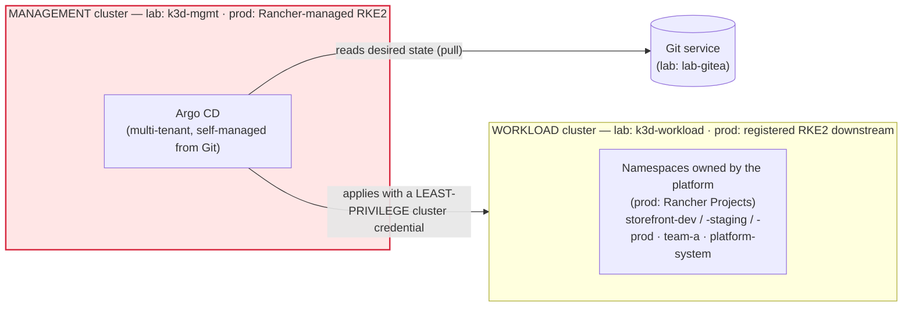
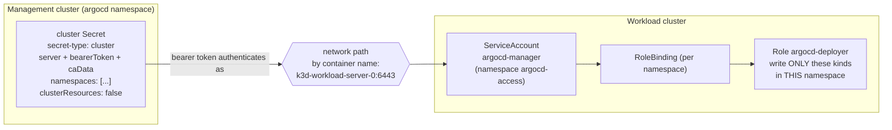
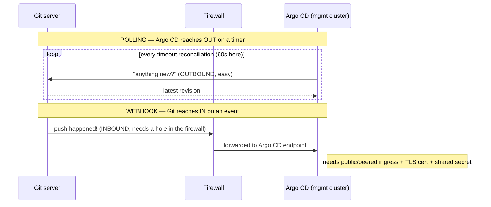

# Production-Oriented Configuration

> **Day 1 · Session 3 · Concept guide · ~60 minutes**
> **Argo CD version this course targets: `v3.5.2`** (Helm chart `10.8.4`).
> **What you need open:** nothing is required — this is a read-and-think session. There is one optional, read-only `helm template` exercise at the end (Section 8) that changes nothing on any cluster. **Lab 2** is where you actually connect a repository and register a workload cluster; this session gives you the mental model that makes Lab 2 make sense.

**Where this sits in the course.** Session 1 gave you the *shape* of the platform (Argo CD on an isolated management cluster, reaching out to a registered workload cluster). Session 2 opened the box and named every *component* and the two *status axes*. This session answers the next question a platform engineer asks: **how do you actually stand this thing up for production, and how do you onboard repositories and clusters without handing out the keys to everything?** By the end you will be able to defend three decisions to a security reviewer: which install model, how much high availability, and exactly how much power Argo CD gets on the clusters it deploys to.

---

## 1. Why this matters

Picture a security review, three months after your team put Argo CD into production. The reviewer pulls up how Argo CD talks to each workload cluster, and finds this: the credential Argo CD uses to deploy to the production cluster is bound to **`cluster-admin`** — the Kubernetes role that can do *anything* to *any* resource in *any* namespace.

The reviewer asks one question: *"If someone compromised the Argo CD management cluster, what could they do to production?"*

The honest answer is: **everything.** Delete every namespace. Read every Secret. Install a backdoor. Because Argo CD, holding a `cluster-admin` credential, is a single set of credentials with unlimited power over every cluster it manages. That is the blast radius Session 1 warned you about (V-01, the red cluster) — and here it is, concrete, on an audit finding.

How did it get that way? Almost certainly because someone ran the friendly onboarding command, `argocd cluster add`, which **creates a `cluster-admin` ServiceAccount by default**. It worked on the first try, the application deployed, and nobody looked again. The convenient path and the audit-failing path were the same path.

This session is about *not* being in that room. Three decisions decide whether you pass that review:

1. **Which install model** you run (and why a multi-tenant install fits a platform team).
2. **How much high availability** you build, component by component.
3. **How little power** Argo CD needs on each workload cluster — and how to grant exactly that, declaratively, from Git, without ever committing a secret.

We also answer the quiet bootstrap question hiding under all of this: *Argo CD deploys everything from Git — so who deploys Argo CD?*

---

## 2. Plain-language mental model: who deploys the deployer?

Argo CD's whole pitch is that **everything is deployed from Git, declaratively, continuously**. Which raises an awkward chicken-and-egg problem: if Argo CD deploys everything from Git, what deploys *Argo CD*? Git cannot deploy itself onto an empty cluster; something has to run the very first install before any reconciliation loop exists.

The answer is unglamorous and worth saying out loud once so it never trips you up:

> **You install Argo CD imperatively exactly once. After that, Argo CD manages itself from Git like everything else.**

"Imperatively" means you run a command that *does* the install right now — here, a `helm install`. "Declaratively" means you write down the desired state in Git and let a controller converge onto it. Argo CD's own configuration (its Helm values, its projects, its repository and cluster connections) starts as that one imperative install, and from then on every change to Argo CD is a **commit**, applied by the same GitOps machinery Argo CD provides to everyone else. The deployer ends up deploying itself.

A useful picture: a timeline with **one imperative step at the far left** (the bootstrap `helm install`) and then **an unbroken chain of commits** stretching to the right (every change after that). The imperative step happens once, on day zero. Everything after is Git.

> **One honest caveat, stated once.** An Argo CD that manages itself can, in principle, sync a change that breaks its own controller — the platform can saw off the branch it is sitting on. That is a real hazard, and it is an argument for *staged, careful* self-management (test upgrades on a non-production Argo CD first), not an argument against self-management. Session 7 returns to this when we talk about upgrades.

> **What this course actually does.** So that a broken commit during the Capstone can never brick the classroom platform, this course does **not** wire Argo CD to fully self-manage. Instead, a wrapper script named `apply-argocd-config` runs the `helm upgrade --install` for you and stands in for "the platform pipeline that manages Argo CD declaratively." You get the production *pattern* without the production *foot-gun*. When this guide says "self-management," picture that wrapper as the pipeline.

---

## 3. Vocabulary, grounded before we use it

Every term below gets a plain-language definition first, then its role. These are the words this file **introduces to the whole course**; later guides use them freely.

- **multi-tenant install vs. Argo CD Core.** Two shapes of the same product. A **multi-tenant** install includes the API (application programming interface) server, the web UI (user interface), single sign-on, and the RBAC (Role-Based Access Control) layer — everything needed for *many teams to safely share one Argo CD and see their own apps*. **Argo CD Core** strips all of that away: no API server, no UI, no SSO — a lean controller for *one team* that drives everything through the CLI (command-line interface) and Git. The difference is about **who needs to see**, not about which is "more secure."

- **HA (high availability).** Running Argo CD so that the failure of a single pod or node does not take the platform down. It is not one switch; each component achieves availability differently (Section 5, V-10).

- **declarative setup / self-management.** Storing Argo CD's *own* configuration (Helm values, projects, connections) in Git and letting Argo CD apply it, rather than clicking it into the UI. See the mental model in Section 2.

- **repository Secret.** A Kubernetes Secret in the `argocd` namespace, carrying the label `argocd.argoproj.io/secret-type: repository`, that tells Argo CD how to authenticate to **one** Git repository (URL, username, password or token). "Connecting a repository" is not a feature toggle — it is creating this object.

- **credential template (`repo-creds`).** A Kubernetes Secret labeled `argocd.argoproj.io/secret-type: repo-creds` that supplies credentials to **every** repository whose URL starts with a given prefix. One `repo-creds` entry for `http://lab-gitea:3000/course/` authenticates *all* repositories under that organization, so you do not write one repository Secret per repo.

- **cluster Secret.** A Kubernetes Secret labeled `argocd.argoproj.io/secret-type: cluster` that tells Argo CD how to reach and authenticate to **one** workload cluster (its API server URL, a bearer token, the cluster's CA (certificate authority) certificate, and — crucially — *which namespaces* Argo CD may touch). "Registering a cluster" means creating this object.

- **least privilege.** Granting an identity the **smallest** set of permissions it needs and no more. For Argo CD, this has a sharp and slightly surprising shape you will meet in Section 6: you can restrict what it may **write**, but not meaningfully what it may **read**.

- **SA (ServiceAccount).** A non-human identity inside a Kubernetes cluster that a program (here, Argo CD) authenticates as. Permissions are attached to it through Roles and RoleBindings.

- **webhook.** A message the Git server sends *to* Argo CD the instant something is pushed, so Argo CD can react immediately instead of waiting for its timer. It is an **inbound** connection into the management cluster.

- **polling.** Argo CD checking Git on a fixed timer to notice changes. It is an **outbound** connection from the management cluster to Git. The timer's length is set by `timeout.reconciliation`.

- **`timeout.reconciliation`.** The Argo CD setting (in the `argocd-cm` ConfigMap) that controls how often Argo CD re-checks each application on its own. Argo CD's product default is **180 seconds (3 minutes)**; this course tunes it to **`60s`** so the loop is observable within a lab.

- **`resource.respectRBAC`.** An Argo CD setting that makes the application controller **honor the Kubernetes RBAC of its own credential** — if the controller's ServiceAccount is not allowed to list a resource type, the controller does not try to track it, instead of flooding the logs with permission errors. This course sets it to `normal`. (Its exact modes are covered in Section 6.)

- **RKE2 (Rancher Kubernetes Engine 2).** The production Kubernetes distribution this course is modeled on, managed by **Rancher** (a Kubernetes management platform). Your lab's two k3d clusters stand in for RKE2 clusters (V-01).

- **ACE (authorized cluster endpoint).** A Rancher feature that lets a client reach a downstream RKE2 cluster's API server **directly**, without routing through the Rancher proxy — useful precisely when Rancher itself is unavailable. Covered conceptually in Section 5.

- **CRD (Custom Resource Definition).** A way to teach Kubernetes a new kind of object. Installing Argo CD adds CRDs for `Application`, `AppProject`, and `ApplicationSet` (you met these in Session 2).

- **OIDC (OpenID Connect) / IdP (identity provider).** OIDC is the standard protocol Argo CD uses to delegate login to an external **identity provider** (your company's Okta, Entra ID, Google, and so on). This course runs with the built-in Dex SSO helper **disabled** and a local admin account instead; Session 6 covers OIDC properly.

- **TLS (Transport Layer Security) / DNS (Domain Name System).** TLS is the encryption that puts the "s" in "https". DNS is the naming system that turns a hostname into an address. Both appear in the install decision checklist (Section 6).

---

## 4. What we are deciding (the three decisions)

Before the diagrams, hold the shape of the session. Everything below answers one of three production questions:

| Decision | The question it answers | Where it lands |
|---|---|---|
| **Install model** | Who needs to *see* their applications — one automation user, or many teams? And how much availability do we build? | V-10 (Section 5), install walkthrough (Section 6.2) |
| **Onboarding** | How do we connect repositories and register clusters *declaratively*, from Git, without committing secrets? | V-11, V-13 (Section 5), anatomy walkthrough (Section 6.5) |
| **Least privilege** | Exactly how much power does Argo CD get on each workload cluster? | V-11 (Section 5), least-privilege walkthrough (Section 6.5) |

And running underneath all three: **how does Argo CD find out about changes** — polling or webhooks — and what does each cost your network (V-12)?

---

## 5. Visuals

Five pictures carry this session. Read each one *before* the debrief under it, and try to answer its prediction question in your head first.

### V-10 · The installation decision — multi-tenant vs. core, standard vs. HA

**Predict first:** A platform team will run one Argo CD that a dozen application teams need to *see the status of* their own apps in. Automation-only, or something with a UI and per-team access? And does that choice affect how you handle high availability?

Argo CD's install choice is really **two independent choices** laid on a grid.

| | **Standard (non-HA)** — one replica per component | **High availability (HA)** — redundancy per component |
|---|---|---|
| **Multi-tenant** (API server + UI + SSO + RBAC) | Many teams share one Argo CD; a single pod of each component. Fine for labs and small platforms. **← this course** | Many teams share one Argo CD, and no single pod failure takes it down. The production target for a shared internal platform. |
| **Core** (controller only; CLI + Git) | One team, automation-only, no UI. Lean. | One team, automation-only, made resilient. Rare, but valid. |

**What to notice:**

1. **Multi-tenant vs. Core is a question about *who needs to see*.** Core drops the API server, UI, SSO, and RBAC. That is perfect when a *single* team drives everything through the CLI and Git and nobody else ever asks "is my app deployed?" The moment *other* people — application teams — need to answer that question *themselves*, without a platform engineer in the loop, you need the multi-tenant install's UI and per-team RBAC. This course models a platform team serving many app teams, so **multi-tenant is the right answer, and the reason is self-service, not features.** (Core is a legitimate, secure choice for automation-only environments — it is not the "lite" version.)

2. **HA is not one switch — it is per component, because each component fails differently:**
   - **API server** — stateless. Scale it for *availability* (more replicas behind a load balancer). If it is down: you cannot see or click, but **reconciliation keeps running**.
   - **repo-server** — stateless. Scale it for *rendering throughput*. If it is down: nothing renders; cached applications look fine until they need re-rendering.
   - **application controller** — scales by **sharding clusters** across replicas (each replica owns some clusters). If it is down: **nothing reconciles at all**. (The sharding algorithm is a Session 7 topic; here, only remember it shards *by cluster*.)
   - **Redis** — a genuine stateful HA topology of its own (a replicated set with failover). Redis is a **cache**, but an HA Argo CD still wants Redis to survive a node loss so the cache does not cold-start under load.

3. **This course runs the top-left cell** (multi-tenant, standard/non-HA) on your VM, and the instructor demonstrates the HA shape on a separate three-node `ha-demo` cluster (Section 6.4). You run the simple thing; you *watch* the resilient thing.

### V-01 · How the lab maps to a Rancher/RKE2 production platform

**Predict first:** In production, does Argo CD run *on* the cluster where your apps run, or somewhere else? And if the Rancher management platform goes down for maintenance, can Argo CD still reach the workload clusters?



Plain-text fallback:

```text
  [ Git service ] <--- pull --- ( MANAGEMENT cluster: runs Argo CD )   <-- most sensitive
                                            |
                                            | applies (least-privilege credential)
                                            v
                                 ( WORKLOAD cluster: runs your apps )
                                   namespaces owned by the platform
```

| In your lab | Stands in for, in production |
|---|---|
| `k3d-mgmt` (management cluster) | A **Rancher-managed RKE2 management cluster** running Argo CD |
| `k3d-workload` (workload cluster) | A **registered RKE2 downstream workload cluster** |
| Pre-created workload namespaces | Namespaces **owned by Rancher Projects** (the platform, not the app team, creates them) |
| `lab-gitea` | Your organization's Git service |

**What to notice — Rancher proxy URL vs. authorized cluster endpoint (ACE):**

1. **Management and workload are separate on purpose** (Session 1's red cluster). Argo CD never runs on the cluster it deploys to.
2. In a Rancher world you can reach a downstream cluster's API in two ways. The **Rancher proxy URL** routes API calls *through* the Rancher server — convenient, but it means **Argo CD depends on Rancher being up** to reach the workload cluster. The **authorized cluster endpoint (ACE)** exposes the downstream cluster's own API server so a client can reach it **directly**, bypassing the Rancher proxy — which keeps Argo CD working even during a Rancher outage. ACE must be enabled deliberately; it is not on by default.
3. The Argo CD-specific recommendation (proxy vs. ACE vs. a direct API endpoint) is a **trade-off to reason about, not a one-size rule** — it depends on your network and your tolerance for a Rancher dependency. This is exactly why your lab's cluster Secret points at the workload API server *directly* (`https://k3d-workload-server-0:6443`) rather than through any proxy.

> **Why there are no Rancher screenshots in this guide.** This course provisions k3d clusters, not a real Rancher install, so there is no Rancher UI to capture. Fabricating a Rancher screen is forbidden. Rancher is taught here through diagrams and the mapping table only.

### V-11 · The cluster-registration trust chain

**Predict first:** When Argo CD applies a Deployment to the workload cluster, *what identity* is it acting as over there, and *what stops it* from also deleting a namespace it was never meant to touch?



Plain-text fallback:

```text
 cluster Secret (mgmt)  --bearer token-->  network (k3d-workload-server-0:6443)
       |                                            |
       | namespaces: [ ... ]                        v
       | clusterResources: false          ServiceAccount argocd-manager  (argocd-access)
                                                    |
                                          RoleBinding (in each allowed namespace)
                                                    |
                                          Role argocd-deployer  (write only named kinds)
```

**What to notice:**

1. **Read the chain left to right.** The **cluster Secret** on the management cluster carries a **bearer token**. That token authenticates Argo CD as one specific **ServiceAccount** — `argocd-manager`, living in a dedicated namespace `argocd-access` — on the workload cluster. That ServiceAccount is granted power only through **per-namespace RoleBindings** to a **Role** (`argocd-deployer`) that permits writing only a named list of resource kinds. There is **no ClusterRoleBinding granting write** anywhere in the chain.
2. **Two independent brakes limit the blast radius.** The cluster Secret's `namespaces:` field and `clusterResources: false` limit what Argo CD *asks* to do; the per-namespace Roles limit what the cluster *lets* it do. Both point at the same small set of namespaces. Belt and braces.
3. **The network path is by name.** Argo CD reaches the workload API server as `k3d-workload-server-0:6443` over the shared container network — *not* a `localhost` address. Hold that detail; it is the whole reason `argocd cluster add` fails here (Section 9).

### V-12 · Webhook vs. polling — a question about network *direction*

**Predict first:** Your Git server is on-premises and the management cluster sits in a locked-down private subnet. Which is cheaper to operate: polling Git on a timer, or configuring a webhook?



**What to notice:**

1. **The trade is about direction, not speed.** Polling is an **outbound** connection from the management cluster to Git — almost always allowed by default. A webhook is an **inbound** connection from Git into the management cluster — which typically means a firewall change, a reachable ingress, a TLS certificate, and a shared secret to authenticate the webhook. Many mature, locked-down platforms deliberately **keep polling and shorten the interval instead**, because the network cost of inbound is real.
2. **Shortening the poll interval is not free.** A shorter timer multiplies repo-server work across *every* application. This course runs `60s`; a large platform that dropped everyone to `10s` could overwhelm the repo-server. That tension is a Session 7 topic (repo-server pressure).
3. **The latency you trade is concrete.** With `60s` polling, a pushed change is noticed within up to a minute. A webhook makes it near-instant. Whether that minute matters is a real engineering decision — not an automatic "webhooks win."

### V-13 · What goes in Git vs. what gets injected — commit the pointer, never the payload

**Predict first:** GitOps says "everything in Git." Security says "no secrets in Git." Both are non-negotiable. How can both be true at once?

They are both satisfied by splitting a secret into two parts and putting each where it belongs.

| Belongs in **Git** (declarative, safe to commit) | Injected **at apply time** (never committed) |
|---|---|
| The *reference*: "this app needs a Secret named `db-password` in namespace `storefront-prod`" | The *value* of that Secret (the actual password) |
| The cluster Secret's **shape** (URL, namespaces, `clusterResources: false`) as a `*.template.yaml` with `<TOKEN>`, `<CA_DATA>` placeholders | The real bearer token and CA data, substituted from a per-VM credential file |
| The repository Secret's **shape** (URL, username) as a template with a `<PASSWORD>` placeholder | The real Git password/token |
| AppProjects, Applications, ApplicationSets, Helm values | Argo CD's admin password (injected as a bcrypt hash at install) |
| A Rancher cluster's **ID / logical name** (it is a pointer, not a credential) | The Rancher/cluster **bearer token** that ID is used with |

**What to notice:**

1. **The rule fits in five words: commit the pointer, never the payload.** The *reference* to a secret is declarative and lives in Git; the *value* is injected at apply time by a secret manager (External Secrets, Sealed Secrets, SOPS, a CSI (Container Storage Interface) driver — named as categories, not endorsed). Git stays complete; the secret stays out of it.
2. **This is why every secret in the course repos is a `*.template.yaml` with placeholders.** The repository, cluster, and credential-template Secrets exist in Git only as *shapes*. Lab 2 renders the real values from per-VM credential files that are never committed. You are looking at the working example of B3.9.
3. **A secret in Git is exposed *retroactively and permanently*** — Git history is the point of Git, so a committed secret is not leaked only once; rotating it does not un-commit it. Session 6 revisits this at governance depth.

---

## 6. Worked walkthrough

Now we put the decisions on the real environment. We do five things: (a) settle the install-time checklist, (b) run the imperative install, (c) find the one wide-open door a fresh install ships with, (d) narrate the HA install on the instructor cluster, and (e) dissect the three onboarding objects — a repository Secret, a credential template, and a cluster Secret.

### 6.1 The install decision checklist (namespace, ingress, TLS, DNS, initial access)

Before any `helm install`, a platform team settles five infrastructure decisions. Rather than prose, read them as a checklist — each row is a decision, this course's choice, and the production consideration behind it.

| Decision | What it means | This course's choice | Production consideration |
|---|---|---|---|
| **Namespace** | Which Kubernetes namespace Argo CD runs in | `argocd` (created at install) | A dedicated namespace so RBAC, network policy, and quotas can be scoped to the platform |
| **Ingress / exposure** | How the UI and API are reached from outside the cluster | **NodePort** `30443`, surfaced as `https://localhost:8443` | Production usually uses an Ingress or LoadBalancer with a real DNS name; NodePort keeps the lab dependency-free |
| **TLS** | Whether the API/UI connection is encrypted | Argo CD's **self-signed** certificate; `server.insecure` stays **`false`** | Production terminates TLS with a CA-signed certificate (cert-manager, a cloud load balancer, or a corporate CA) |
| **DNS** | The hostname clients use | `localhost` (lab shortcut) | Production assigns a stable hostname (e.g. `argocd.example.com`) so certificates and SSO redirect URLs are stable |
| **Initial access** | How the first admin logs in | Local `admin` account; password **injected as a bcrypt hash** at install from a per-VM file (never committed) | Production disables routine admin use and logs in through SSO/OIDC (Session 6); the initial admin password is rotated or removed |

> **Read the "initial access" row against V-13.** The admin password is a payload, so it is *injected* at install time, not committed. The rest of Argo CD's configuration is a pointer/shape, so it *lives in Git*. That split is the whole philosophy in one table row.

### 6.2 Step (a) — the imperative install with Helm

The bootstrap install is a single Helm command against the **vendored** chart (a copy of `argo-cd 10.8.4` stored on the VM at `/opt/course/charts/`, so the lab works offline) with the course values file:

```bash
helm upgrade --install argocd /opt/course/charts/argo-cd-10.8.4.tgz \
  --namespace argocd --create-namespace \
  -f platform-config/argocd/values.yaml
```

`helm upgrade --install` means "install it if it is not there, upgrade it if it is" — the same command works for the first install and every change after, which is exactly what a self-managing pipeline wants.

In this course you do not run that command by hand. The wrapper `apply-argocd-config` runs it *and* does the two things that must never be committed to Git: it injects the admin password as a **bcrypt hash** (from the per-VM credential file) and pre-creates the `argocd-redis` Secret deterministically. That wrapper is our stand-in for "the platform pipeline that manages Argo CD" (Section 2).

The course values (`platform-config/argocd/values.yaml`) encode the decisions from V-10 and the checklist. The settings worth knowing by name:

| Setting (in the values file) | Value | What it does |
|---|---|---|
| Install model | multi-tenant, **non-HA** | one replica of each component (V-10, top-left) |
| `server.service` | NodePort, HTTPS `30443` | surfaced as `https://localhost:8443` |
| `server.insecure` | `false` | keep the API on real TLS |
| `dex.enabled` | `false` | no identity provider in the lab (local admin instead) |
| `configs.cm.timeout.reconciliation` | `60s` | poll each app about once a minute (lab deviation from the 180s default) |
| `configs.cm.resource.respectRBAC` | `normal` | the controller tracks only what its credential may list |
| `configs.cm.admin.enabled` | `true` | local admin stays on (Session 6 covers removing it) |

**You can look at Argo CD's own configuration surface in the UI** — this is the "self-management" story made visible. Log in at `https://localhost:8443`, then open **Settings** (the gear icon in the left sidebar).


<!-- CAPTURE-SPEC SS-S3-01
Source: live capture only, course Argo CD v3.5.2 at https://localhost:8443, checkpoint CP-baseline.
Steps: (1) log in as admin; (2) click the gear/Settings icon in the left sidebar; (3) land on Settings.
Capture: full page. Highlight the "Repositories", "Clusters", and "Projects" list entries.
Save to: courseware/assets/screenshots/day-1/s03-01-settings.png
-->

**What to notice (numbered, so the guide works even if the image has not been captured yet):**
1. Settings lists **Repositories**, **Clusters**, and **Projects** as first-class entries — the same objects this session teaches you to create declaratively. The UI is a *view* onto the labeled Secrets and AppProjects, not a separate source of truth.
2. Every item you can click here corresponds to a Kubernetes object in the `argocd` namespace. Editing in the UI edits that object; committing the same change to Git is the self-managed equivalent.
3. There is **no Dex / SSO** entry doing anything, because Dex is disabled — you log in with the local admin account.

### 6.3 Step (a, continued) — the one wide-open door a fresh install ships with

A brand-new Argo CD install is not empty of policy — it ships **one** AppProject, named `default`, created automatically. It is worth looking at, because it is **maximally permissive**:

```yaml
# The default AppProject, as shipped — every wildcard is a wide-open door.
spec:
  sourceRepos:
    - '*'                    # any Git repository
  destinations:
    - server: '*'            # any cluster
      namespace: '*'         # any namespace
  clusterResourceWhitelist:
    - group: '*'             # any API group
      kind: '*'              # any kind
```

An Application that names no project lands in `default`. So a fresh install *has* a project and *no boundary*: it is a door with a lock painted on it.

The documented first hardening step is to **empty** those allow-lists (`sourceRepos: []`, `sourceNamespaces: []`, `destinations: []`), which removes all permissions from `default` — you do not delete the project. You will *do* this hardening in Lab 5; here, only notice that it exists and that "we have a project" is not the same as "we have a guardrail." (Confirm the exact field set against the v3.5 project specification before treating it as a lab step.)

### 6.4 Step (b) — the narrated HA install (instructor demonstration)

The instructor runs the HA shape on a **separate three-node cluster** named `ha-demo`. Three nodes are required because the HA chart uses **pod anti-affinity** — it refuses to place two replicas of the same component on the same node, so redundancy is real and not cosmetic.

Turning on HA is a values change (a replicated Redis, more replicas of the stateless components, and — added for HA — HorizontalPodAutoscalers and a Redis config-init Job). Here is what the running platform looks like afterward. **This output is representative — captured from the instructor `ha-demo` cluster; confirm against the live demonstration:**

```text
# kubectl --context ha-demo -n argocd get pods
NAME                                                READY   STATUS      RESTARTS   AGE
argocd-application-controller-0                     1/1     Running     0          6m
argocd-applicationset-controller-6f7b9c8d4-abcde    1/1     Running     0          6m
argocd-applicationset-controller-6f7b9c8d4-fghij    1/1     Running     0          6m
argocd-redis-ha-haproxy-7c8d9f6b5-klmno             1/1     Running     0          6m
argocd-redis-ha-haproxy-7c8d9f6b5-pqrst             1/1     Running     0          6m
argocd-redis-ha-haproxy-7c8d9f6b5-uvwxy             1/1     Running     0          6m
argocd-redis-ha-server-0                            3/3     Running     0          6m
argocd-redis-ha-server-1                            3/3     Running     0          5m
argocd-redis-ha-server-2                            3/3     Running     0          5m
argocd-repo-server-84f5c6d7b-11111                  1/1     Running     0          6m
argocd-repo-server-84f5c6d7b-22222                  1/1     Running     0          6m
argocd-server-6d8f9b7c5-33333                       1/1     Running     0          6m
argocd-server-6d8f9b7c5-44444                       1/1     Running     0          6m
argocd-redis-ha-server-config-init-abcde            0/1     Completed   0          6m
```

**What to watch while it runs, mapped back to V-10:**

1. **Redis went from one pod to a replicated set.** `argocd-redis-ha-server-0/1/2` is a StatefulSet (three replicas, each `3/3` because each pod runs Redis plus its sentinel and metrics sidecars), fronted by **HAProxy** load-balancer pods. Redis is *still a cache* — but an HA cache that survives a node loss. **HA does not mean Redis suddenly stores durable state**; it means the cache does not cold-start when a node dies.
2. **The stateless components doubled.** Two `argocd-server` (API/UI) and two `argocd-repo-server` (rendering) pods now sit behind their Services. Anti-affinity forced them onto different nodes — the reason three nodes were needed.
3. **The application controller is still `-0`.** A single controller replica here owns the cluster's shard; HA scales the controller by **sharding clusters** across replicas, which only pays off once you manage *many* clusters. One demo cluster does not need a second controller shard.
4. **Contrast with your VM's non-HA install** from Session 2 — six pods, one of each component. Same product, different resilience. You run the six-pod version; you now know what the resilient version costs and buys.

> **Compare against your own cluster.** On your VM, `kubectl --context k3d-mgmt -n argocd get pods` shows exactly six pods (one per component). That is the standard install. Everything you learn in the labs works identically on the HA topology — HA changes *how many* of each component run, not *what* they do.

### 6.5 Step (c) — the anatomy of the three onboarding objects

Everything Argo CD "knows" about repositories and clusters is a **labeled Kubernetes Secret in the `argocd` namespace**. "Connecting a repo" and "registering a cluster" are not features — they are three shapes of Secret. Here is each one, from the real course templates, with the placeholders that prove no secret is committed.

**(1) A repository Secret** — how Argo CD authenticates to *one* private repository:

```yaml
apiVersion: v1
kind: Secret
metadata:
  name: repo-storefront-gitops
  namespace: argocd
  labels:
    argocd.argoproj.io/secret-type: repository   # <-- the label is what makes it a "repository"
type: Opaque
stringData:
  type: git
  url: http://lab-gitea:3000/course/storefront-gitops.git
  username: student
  password: <PASSWORD>                            # <-- injected in Lab 2; never committed
```

**(2) A credential template (`repo-creds`)** — one entry that authenticates *every* repo under a URL prefix, so you do not write one Secret per repository:

```yaml
apiVersion: v1
kind: Secret
metadata:
  name: course-repo-creds
  namespace: argocd
  labels:
    argocd.argoproj.io/secret-type: repo-creds    # <-- "repo-creds", not "repository"
type: Opaque
stringData:
  type: git
  url: http://lab-gitea:3000/course/              # <-- a PREFIX: matches every repo under /course/
  username: student
  password: <PASSWORD>
```

The only difference from a repository Secret is the **label** (`repo-creds`) and that the `url` is a **prefix**. That one change turns "credentials for this repo" into "credentials for this whole organization."

**(3) A cluster Secret** — how Argo CD reaches and is *limited on* the workload cluster. This is where least privilege lives:

```yaml
apiVersion: v1
kind: Secret
metadata:
  name: cluster-workload
  namespace: argocd
  labels:
    argocd.argoproj.io/secret-type: cluster       # <-- the label is what makes it a "cluster"
    cluster-role: workload
    region: lab
type: Opaque
stringData:
  name: workload
  server: https://k3d-workload-server-0:6443      # <-- reachable by CONTAINER NAME, not localhost
  namespaces: storefront-dev,storefront-staging,storefront-prod,team-a,platform-system
  clusterResources: "false"                        # <-- forbid cluster-scoped WRITES
  config: |
    {
      "bearerToken": "<TOKEN>",                    # <-- injected in Lab 2; never committed
      "tlsClientConfig": {
        "insecure": false,
        "caData": "<CA_DATA>"                      # <-- the workload cluster's CA cert
      }
    }
```

Two fields on this Secret are the entire least-privilege story on the Argo CD side:

- **`namespaces:`** lists exactly the namespaces Argo CD will operate in. An Application aimed anywhere else is refused.
- **`clusterResources: "false"`** forbids Argo CD from creating or modifying **cluster-scoped** resources (ClusterRoles, CRDs, namespaces themselves). It can only touch **namespaced** resources, inside the listed namespaces.

On the **other end** of the trust chain (V-11), the token belongs to the ServiceAccount `argocd-manager` in namespace `argocd-access`, and that ServiceAccount is granted power *only* through per-namespace RoleBindings to a Role named `argocd-deployer`. The Role permits writing a **named list of kinds** (Deployments, Services, ConfigMaps, Jobs, HorizontalPodAutoscalers, ServiceAccounts, NetworkPolicies, ResourceQuotas, LimitRanges) and nothing else — and there is **no ClusterRoleBinding granting write** anywhere.

Here is the surprising, audit-critical shape of that Role — and the sharpest single idea in this session:

```yaml
rules:
  - apiGroups: ["*"]
    resources: ["*"]
    verbs: ["get", "list", "watch"]        # READ everything (required — cannot be narrowed)
  - apiGroups: ["apps"]
    resources: ["deployments", "replicasets"]
    verbs: ["create", "update", "patch", "delete"]   # WRITE only named kinds (this is where you cut)
  # ... services, configmaps, jobs, hpas, networkpolicies, resourcequotas, limitranges ...
```

> **Least privilege for Argo CD means least *write* privilege.** You can genuinely restrict what Argo CD may **create, update, patch, and delete** — down to named namespaces and kinds. You *cannot* meaningfully restrict what it may **read**: `get`, `list`, and `watch` at broad scope are **required** for Argo CD to compute live state and health at all. A read-restricted Argo CD is a blind Argo CD. Say this out loud to your security reviewer *before* they say it to you: "read-everywhere is a requirement, not an oversight; the control is on writes." That sentence is the difference between the `cluster-admin` finding from Section 1 and a clean audit.

> **Where `resource.respectRBAC: normal` fits.** Because the credential can *read* broadly but the classroom cluster still has resource types the ServiceAccount may not list, `resource.respectRBAC: normal` tells the controller to **honor those RBAC boundaries quietly** — skip tracking what it may not list — rather than spamming permission errors. `normal` respects RBAC without an extra pre-flight permission check per resource; the stricter mode adds that check at a performance cost. (Confirm the exact `normal` vs. `strict` behavior against the v3.5 `argocd-cm` documentation before relying on the precise mechanism.)

You will *build* the cluster Secret and apply this exact RBAC in **Lab 2**. Here, you only need to be able to read the trust chain and defend it.

**Before Lab 2 registers the workload cluster, the Clusters view shows only the management cluster.** Open **Settings → Clusters**:


<!-- CAPTURE-SPEC SS-S3-02
Source: live capture only, course Argo CD v3.5.2 at https://localhost:8443, checkpoint CP-lab-02 (before E2 registers the workload cluster).
Steps: (1) log in as admin; (2) Settings (gear) -> Clusters.
Capture: full page. Highlight that only the "in-cluster" row is present (name/label cluster-role=management), and there is NO "workload" row yet.
Save to: courseware/assets/screenshots/day-1/s03-02-clusters-before-registration.png
-->

**What to notice (numbered):**
1. Only **one** cluster is listed: `in-cluster` (the management cluster itself), labeled `cluster-role=management`. The workload cluster is **absent** — it has not been registered.
2. `in-cluster` exists as an explicit, labels-only Secret **with no credentials**, because Argo CD uses its own in-cluster ServiceAccount for the management cluster. It is listed so label selectors can address or exclude it deliberately (you meet that use in Day 2's cluster generator).
3. After Lab 2's E2, a second row — `workload`, labeled `cluster-role=workload`, `region=lab` — will appear here. That single new row *is* "registering a cluster."

---

## 7. Quick Checks

Answer each in your head (or on paper) **before** opening the collapsed answer. These are decision and prediction questions, not vocabulary quizzes.

### S3-QC1 — Choose the install type and access method

A platform team will run **one** Argo CD that **twelve** application teams use. Each team must be able to open a UI and see their own applications' status without filing a ticket. The platform must survive the loss of any single node. It runs behind the corporate network with a real hostname.

Pick: (a) multi-tenant or Core? (b) standard or HA? (c) NodePort with a self-signed cert, or an Ingress with a CA-signed certificate and a DNS name?

<details>
<summary>Show answer and rationale</summary>

- **(a) Multi-tenant.** Twelve teams needing self-service visibility is the exact case Core cannot serve — Core has no UI and no per-team RBAC. The deciding factor is *who needs to see*, and here it is many people.
- **(b) HA.** "Survive the loss of any single node" is the definition of the requirement HA exists to meet. Expect replicated Redis, multiple API/repo-server replicas across nodes (anti-affinity), and controller sharding if they manage many clusters.
- **(c) Ingress + CA-signed certificate + DNS name.** NodePort and a self-signed cert are lab conveniences. A production platform with real users wants a stable hostname (for certificates and SSO redirect URLs) and a certificate their browsers trust.

**Rationale:** the three decisions are independent. This scenario is the top-right cell of V-10 (multi-tenant, HA), with the production rows of the Section 6.1 checklist. Your own lab is the *simpler* top-left cell on purpose.
</details>

### S3-QC2 — Sort configuration: commit to Git, or inject at deploy time?

For each item, say whether it belongs **in Git** or is **injected at apply time**:

- **A.** An AppProject that restricts which repos an app team may deploy from.
- **B.** The bearer token Argo CD uses to authenticate to the workload cluster.
- **C.** A Rancher downstream cluster's **ID / logical name**.
- **D.** The Gitea password for the `student` user.

<details>
<summary>Show answer and rationale</summary>

- **A — in Git.** An AppProject is declarative policy with no secret in it. Commit it.
- **B — injected.** A bearer token is a payload. It lives in Git *only* as a `<TOKEN>` placeholder in a `*.template.yaml`; the real value is injected from a per-VM credential file.
- **C — in Git.** A cluster ID or logical name is a **pointer**, not a credential. Committing "which cluster" is fine; committing "the token to reach it" is not.
- **D — injected.** A password is a payload. Never committed; substituted at apply time.

**Rationale:** every item sorts by one test — *is it a pointer or a payload?* (V-13). C is the deliberate trap: a Rancher cluster ID *feels* sensitive, but it identifies a cluster rather than granting access to it, so it is a pointer. The token you use *with* that ID is the payload.
</details>

### S3-QC3 — Webhooks vs. polling: which direction must the network allow?

Your Git server is on-premises. Your Argo CD management cluster is in a private subnet that freely makes **outbound** connections but blocks almost all **inbound** ones. You want change detection. Which approach costs less to operate, and what specifically would the other approach require?

<details>
<summary>Show answer and rationale</summary>

- **Polling costs less here.** Polling is an **outbound** connection from the management cluster to Git — already allowed. You get change detection with **zero** firewall work; you tune `timeout.reconciliation` to trade latency for repo-server load.
- **A webhook would require inbound access into the private subnet** — a firewall change, a reachable (public or peered) ingress for Argo CD's webhook endpoint, a TLS certificate for it, and a shared secret to authenticate the webhook. That is four pieces of work versus zero.

**Rationale:** the trade is about **direction, not speed** (V-12). "Webhooks are faster" is true and often irrelevant; the operational question is which direction your network already permits. Shortening the poll interval is the common answer in locked-down environments — with the caveat that it multiplies repo-server load (Session 7).
</details>

### S3-QC4 — Predict what an out-of-scope Application experiences

A cluster Secret registers a workload cluster with `namespaces: [a, b]` and `clusterResources: "false"`. A colleague creates an Application whose destination is namespace **`c`** on that cluster. Predict what happens when Argo CD tries to reconcile it.

<details>
<summary>Show answer and rationale</summary>

**Argo CD refuses to operate in namespace `c`.** The cluster Secret scopes Argo CD to namespaces `a` and `b` only, so a destination of `c` is outside what the credential is permitted to manage. The Application does not deploy into `c`; it surfaces an error rather than silently succeeding — Argo CD is not authorized there, and the namespace scoping is one of the two brakes (with `clusterResources: false`) that enforce least privilege.

A second, independent brake would also stop it even if the scope allowed `c`: on the workload cluster there is **no RoleBinding** for `argocd-manager` in namespace `c`, so Kubernetes RBAC would return a `403 Forbidden` on any write. Two brakes, same direction.

**Rationale:** this is the payoff of V-11 read backwards. "Least privilege" is not a slogan here — it produces a specific, predictable *refusal* for an out-of-scope target. You will see the exact error shapes (and the difference between an Argo CD-level denial and a Kubernetes `403`) in Lab 2 and again in Lab 5.
</details>

---

## 8. Try It Yourself (optional, ~5 minutes, read-only)

This changes **nothing** on any cluster. It renders the chart to plain YAML on your machine and counts objects, so you can *see* what HA adds without installing it.

1. Render the vendored chart with the **course (non-HA) values** and count the Kubernetes objects it would create:

   ```bash
   helm template argocd /opt/course/charts/argo-cd-10.8.4.tgz -n argocd \
     -f platform-config/argocd/values.yaml \
     | grep -cE '^kind:'
   ```

2. Now render the **same chart** with an **HA-style values** overlay (a replicated Redis and extra replicas) and count again. Create a tiny overlay first:

   ```bash
   cat > /tmp/ha-values.yaml <<'EOF'
   redis-ha:
     enabled: true
   server:
     replicas: 2
   repoServer:
     replicas: 2
   applicationSet:
     replicas: 2
   EOF

   helm template argocd /opt/course/charts/argo-cd-10.8.4.tgz -n argocd \
     -f /tmp/ha-values.yaml \
     | grep -cE '^kind:'
   ```

3. **Predict before you compare:** will HA add a *few* objects or *dozens*? Then look at the two numbers and, for the HA render, list the *new kinds* that were not in the non-HA render:

   ```bash
   helm template argocd /opt/course/charts/argo-cd-10.8.4.tgz -n argocd \
     -f /tmp/ha-values.yaml \
     | grep -E '^kind:' | sort | uniq -c | sort -rn
   ```

**Representative result — confirm on your own VM:** the non-HA render produces about **49** objects; the HA-style render produces about **74** — roughly **two dozen extra**. Most of the additions are the `redis-ha` StatefulSet and its HAProxy Service, the extra Roles/RoleBindings/ServiceAccounts/ConfigMaps it needs, a one-shot config-init **Job**, and **HorizontalPodAutoscaler** objects for the scalable components. That is HA made concrete: it is not "one bigger thing," it is *many small pieces of redundancy*, exactly the per-component picture from V-10.

> **Why `helm template` and not `helm install`?** `helm template` only *renders* — it never contacts a cluster and never creates anything. It is the safe way to inspect what a chart *would* do, and it is precisely how Argo CD's repo-server works (Session 4 develops this). Counting objects is a read-only thought experiment.

---

## 9. Common misconceptions

**"`argocd cluster add` is the production way to register a cluster."** It is the *convenient* way, and in production it is often the *wrong* way. By default `argocd cluster add` creates a ServiceAccount named `argocd-manager` and binds it to **`cluster-admin`** — the exact audit finding from Section 1. It also copies the *current kubeconfig's* server URL into the cluster Secret. In this course that URL would be a `localhost`/`127.0.0.1` address that only your laptop can reach — **Argo CD's pods cannot reach it**, because from inside the container network the workload API server is `k3d-workload-server-0:6443`, not `localhost`. So `argocd cluster add` here fails twice over: it grants far too much power *and* writes an address Argo CD cannot use. The declarative cluster Secret (Section 6.5) fixes both — least privilege *and* an in-network URL.

**"Kubernetes Secrets are encrypted, so committing one is fine."** No. A Kubernetes Secret is **base64-encoded, not encrypted** — base64 is a reversible text encoding anyone can decode in one command (`base64 -d`). A Secret's *value* is protected by cluster RBAC and (optionally) encryption-at-rest in etcd, **not** by the object being a `Secret`. Commit a Secret's real value to Git and you have published it in plaintext-equivalent form, permanently, into history. This is why every course Secret is a `*.template.yaml` with placeholders (V-13).

**"HA means more replicas of everything, including Redis state."** Two errors in one sentence. First, HA is **per component**, not a uniform multiplier — the application controller scales by *sharding clusters*, not by naive replication, so a single controller replica is normal even in HA (Section 6.4). Second, **Redis holds no durable state to replicate** — it is a cache. HA Redis exists so the cache *survives a node failure without a cold start*, not because Argo CD keeps important data there. Argo CD's real state is its Kubernetes objects (Applications, projects, Secrets); Redis is disposable (Session 2's key takeaway, Session 7's backup story).

---

## 10. Key takeaways

Memorize these five one-liners — they are this session compressed, and later guides assume you can repeat them to a colleague:

- **"Argo CD is installed imperatively exactly once. After that, it is commits all the way down."**
- **"Multi-tenant vs. Core is a question about who needs to *see*; HA is a question answered per component, not by one switch."**
- **"Least privilege for Argo CD means least *write* privilege. Read-everywhere is a requirement, not a setting — say so before your auditor does."**
- **"Webhooks vs. polling is a question about which *direction* the connection goes, not about which is faster."**
- **"Commit the pointer, never the payload — and a Kubernetes Secret is base64-encoded, not encrypted."**

And the **key outcome**: you can now defend a production Argo CD setup to a security reviewer — which install model and why, how much HA and where it pays off, and exactly how little power Argo CD needs on each workload cluster — and you can read a repository Secret, a credential template, and a cluster Secret as the three onboarding objects they are.

---

## 11. Transition — what's next

You have the production shape in your head: the install decisions (V-10, the Section 6.1 checklist), the onboarding objects (V-11, V-13), the least-privilege trust chain, and the network trade behind change detection (V-12). What you have not done yet is *build* any of it.

That is **Lab 2**. You will connect the private `storefront-gitops` repository by creating its repository Secret, apply the exact least-privilege RBAC you dissected in Section 6.5 on the workload cluster, register that cluster by building its cluster Secret (the `workload` row that will finally appear under Settings → Clusters), and create a first AppProject and Application declaratively — then confirm Argo CD can render and compare the target. Everything you read here becomes something you type there.
