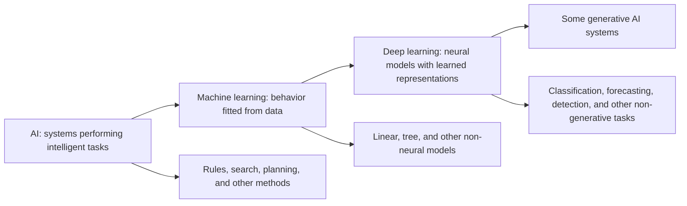
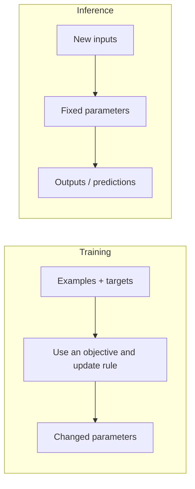
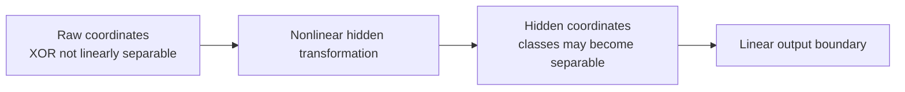
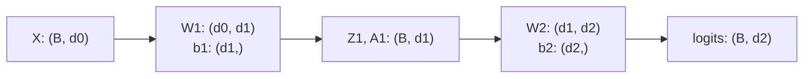

# Day 1 Student Guide: See It

## How Neural Networks Actually Work

**Big question:** How can simple mathematical operations produce intelligent-looking behavior?  
**Tangible outcome:** Build and investigate a forward-only NumPy network, then explain its correct and incorrect predictions from visible evidence.  
**Core memory:** **A neural network is a chain of adjustable transformations; a prediction is the trace those settings produce.**

Day 1 is about inference, not training. You will inspect fixed parameters, move boundaries, expose a linear model's limit, transform a representation, and trace one complete prediction. Day 2 will add the machinery that changes parameters.

Use the shared [glossary](../../shared/glossary.md) and [notation and style contract](../../shared/notation-and-style.md) when a term or shape needs clarification.

## Day 1 Objectives

By the end of the day, you should be able to:

| ID | Observable outcome |
|---|---|
| `OBJ-D1-01` | Place neural networks within AI, machine learning, deep learning, and generative AI; justify a neural or simpler baseline; distinguish training from inference. |
| `OBJ-D1-02` | Describe inputs, weights, biases, activations, layers, outputs, parameters, and hyperparameters. |
| `OBJ-D1-03` | Compute and geometrically interpret how one neuron transforms input into a prediction. |
| `OBJ-D1-04` | Determine whether one linear boundary can represent a stated classification pattern. |
| `OBJ-D1-05` | Explain why hidden layers need nonlinear activations to create nonlinear decision regions. |
| `OBJ-D1-06` | Trace one example and a batch through a dense network while reporting shapes, parameter count, outputs, and prediction. |
| `OBJ-D1-07` | Complete and investigate a vectorized, forward-only NumPy network using outputs, hidden representations, and decision regions. |

## Schedule: 450 Elapsed Minutes

| Time | Min | Core sequence |
|---|---:|---|
| 09:00-09:25 | 25 | `LESSON-D1-01`: landscape, model choice, training versus inference |
| 09:25-09:55 | 30 | `LESSON-D1-02`, `ACT-D1-01`: one neuron and boundary motion |
| 09:55-10:35 | 40 | `LAB-D1-01`: one-neuron boundary workshop |
| 10:35-10:50 | 15 | Protected break |
| 10:50-11:15 | 25 | `LESSON-D1-03`: logistic regression, linear limits, XOR |
| 11:15-12:00 | 45 | `LAB-D1-02`: the linear limit |
| 12:00-12:15 | 15 | `CHECK-D1-01`, `CHECK-D1-02` |
| 12:15-13:15 | 60 | Protected lunch |
| 13:15-13:45 | 30 | `LESSON-D1-04`, `ACT-D1-04`: layers, shapes, parameter count, outputs |
| 13:45-14:02 | 17 | `LESSON-D1-05`, `ACT-D1-03`: nonlinearity and activation roles |
| 14:02-14:42 | 40 | `LAB-D1-03`: shape and activation observatory |
| 14:42-14:57 | 15 | Protected break |
| 14:57-15:05 | 8 | `LESSON-D1-06`: forward-trace consolidation |
| 15:05-16:05 | 60 | `LAB-D1-04`: forward network mystery |
| 16:05-16:20 | 15 | `CHECK-D1-03`, `CHECK-D1-04`; bridge to Day 2 |
| 16:20-16:30 | 10 | Protected recovery, questions, and close |

The optional notes in this guide are reference material. They are not required to complete Day 1 checks.

---

# LESSON-D1-01 - Neural Networks in the AI Landscape

**Time:** 25 minutes  
**Primary objective:** `OBJ-D1-01`  
**Learning outcome:** Given a data/problem scenario, choose a credible first model family and distinguish what happens during training from what happens during inference.

## Why This Matters

"Use AI" is not a model specification. An engineer must decide what behavior is needed, what evidence is available, how costly mistakes are, and whether added model complexity earns its data, compute, latency, and debugging cost.

Start with nested toolboxes as an orientation, not a rigid taxonomy:



**Observe:** Neural networks occupy a region of the landscape; they are not synonyms for AI or machine learning.  
**Do not infer:** Every category has a perfectly sharp border, or every generative system uses the same architecture.

## A Practical Model-Choice Lens

Neural networks are especially useful when the model must learn a representation from complex raw inputs or nonlinear interactions. A simpler model may be preferable when data are limited and structured, interpretability or latency constraints dominate, or a fast baseline is needed.

| Scenario property | What it suggests | Question before adding complexity |
|---|---|---|
| Small tabular dataset with named features | Start with a credible linear/tree baseline | What representation must a neural model learn that the baseline cannot express? |
| Images, audio, or text with large raw input spaces | Learned representations may be valuable | Is there enough valid data and a realistic evaluation path? |
| Strict latency, memory, or audit constraints | Model size and transparency matter | What is the simplest model that meets the required evidence threshold? |
| High-cost errors | Stronger evaluation and controls are required | Which errors matter, and how will they be surfaced? |

Data type alone does not settle the choice. Structured data can benefit from neural networks, and unstructured data does not excuse skipping a baseline.

## The Supervised-Learning Cast

- An **example** contains input values.
- A **feature** is one input dimension.
- A **target** is the desired outcome paired with an example.
- A **prediction** is the model's output after a stated decision rule.
- **Parameters** are adjustable values inside the model, such as weights and biases.
- **Hyperparameters** are settings selected outside parameter fitting, such as hidden width or a configured threshold.

### Training versus inference



Day 1 stays on the inference side. Some supplied parameters were fitted beforehand, but your forward code will not change them.

## Worked Decision Example

A team has 2,000 rows of numeric machine summaries and a binary maintenance target. They need a result tomorrow. A sensible first step is a transparent supervised baseline with a valid split. This does not declare neural networks unnecessary. It creates evidence: what the simple model captures, where it fails, and whether a richer representation might justify its cost.

For image defects represented as raw pixels, a neural model may be a stronger candidate because useful features such as local patterns are not already supplied as named columns. The same engineering questions still apply: valid labels, baseline, held-out evidence, resource constraints, and consequential error types.

## Prediction and Discussion

For each case, choose a first baseline and defend it with two facts:

1. Fifty thousand labeled product images with varying lighting.
2. Eight hundred rows with six numeric business features and a tight audit deadline.
3. A model already meets quality requirements, but the serving budget is cut in half.

Then ask: **What new evidence would make you change your choice?**

## Common Misconceptions

| Misconception | Correction |
|---|---|
| "Modern AI means the largest neural model." | Model choice begins with the task, evidence, and constraints. |
| "A neural network is intelligent because its output looks useful." | A forward pass is a trace through parameters and transformations. Use evidence before anthropomorphic language. |
| "Training and inference are the same code path." | Both use a forward pass, but only training adds an objective and a mechanism for changing parameters. |
| "Important tasks require complex models." | Importance increases the evaluation burden; it does not remove the need for a credible simple baseline. |

## Engineering Connection

One neuron and a much larger neural system are not architecturally equivalent. They do share enduring categories: inputs, parameters, activations, objectives, updates, and evaluation. Day 1 isolates the forward mechanics so later complexity has a stable foundation.

**Check your understanding:** Explain why "deep learning is a subset of machine learning" does not imply "deep learning is the best choice for every machine-learning problem."

**Transition:** Model choice tells us when a neural model might be worth testing. Next, make its smallest unit visible.

---

# LESSON-D1-02 - Start with One Neuron

**Time:** 30 minutes  
**Objectives:** `OBJ-D1-02`, `OBJ-D1-03`  
**Learning outcome:** Compute one neuron's output and predict how weights and bias alter its 2D decision boundary.

## Mental Model Before Math

A neuron produces a score from weighted evidence, adds an adjustable offset, and transforms the result. A weight says how strongly and in which direction one input contributes. A bias shifts the starting offset. Neither is an explanation by itself; both operate as a system.

The visible boundary is where positive and negative weighted evidence exactly cancel.

## Formal Model

For one example with feature vector $x$:

$$
z = w \cdot x + b = \sum_j w_jx_j + b
$$

For a binary probability-shaped output:

$$
p = \sigma(z) = \frac{1}{1+e^{-z}}, \qquad \hat{y}=\mathbb{1}[p\ge0.5]
$$

Because $\sigma(0)=0.5$, the `0.5` boundary is:

$$
w\cdot x+b=0
$$

> The sigmoid makes the transition gradual, but the `0.5` boundary of one affine score remains linear.

## Worked Example

Let $x=(2,-1)$, $w=(0.8,0.5)$, and $b=-0.2$.

$$
z=(0.8)(2)+(0.5)(-1)-0.2=0.9
$$

Then $p=\sigma(0.9)\approx0.711$, so the stated `0.5` rule predicts class `1`.

This calculation separates three objects:

1. `z = 0.9` is a raw score/logit.
2. `p approximately 0.711` is a probability-shaped output.
3. class `1` is the thresholded prediction.

Do not call all three "the prediction" without saying which representation you mean.

## Geometry in Two Dimensions

For $w_2\ne0$:

$$
x_2=-\frac{w_1}{w_2}x_1-\frac{b}{w_2}
$$

This exposes a line, but use it carefully:

- the full weight vector determines boundary orientation;
- bias translates the boundary while weights are fixed;
- score sign determines the side;
- score magnitude controls how far sigmoid moves from `0.5`;
- scaling all weights and bias by the same positive factor leaves the boundary fixed while changing off-boundary probabilities.

### Purposeful visual recommendation

Use three synchronized panels: parameter controls, six fixed probe probabilities, and a contour plot with ghosted prior boundary.

**Observe:** orientation, location, and probability shading are related but distinct.  
**Do not infer:** each weight is a pure rotation knob, or sharper probabilities are automatically better calibrated.

## ACT-D1-01 Launch

Open [courseware/day-1/challenges/day-1-challenges.md](../challenges/day-1-challenges.md#act-d1-01---boundary-motion-prediction) and complete `ACT-D1-01` before the instructor moves any control.

**Commit:** Sketch three isolated parameter changes.  
**Observe:** old/new contours plus one fixed probe.  
**Return with:** one changed quantity, one invariant, and one revised prediction.

## LAB-D1-01 - One-Neuron Boundary Workshop

**Notebook:** [courseware/day-1/labs/LAB-D1-01-neuron-boundary.ipynb](../labs/LAB-D1-01-neuron-boundary.ipynb)  
**Time:** 40 minutes  
**Objectives:** `OBJ-D1-01`, `OBJ-D1-02`, `OBJ-D1-03`  
**Why this lab exists:** Parameter names become useful only when you can predict and observe what they do.

### Before launch

- Confirm you can run NumPy and matplotlib cells.
- Keep the supplied point identities fixed across plots.
- Read all TODOs before implementing any one function.
- Do not change more than one parameter in a comparison unless a prompt explicitly asks for common scaling.
- Open [ACT-D1-02 - Be the Neural Network](../challenges/day-1-challenges.md#act-d1-02---be-the-neural-network) when the notebook reaches its manual-search checkpoint.

### Prediction to commit

For isolated changes to `w1`, `w2`, and `b`, predict boundary orientation, location, and one probe probability. Also predict what common positive scaling of `w` and `b` will leave invariant.

### Evidence to observe

- weighted-sum and probability shapes;
- probability values remain in `[0, 1]`;
- the `0.5` contour agrees with `w dot x + b = 0`;
- ghosted old/new boundaries;
- six fixed probe probability changes;
- the attempt history from `ACT-D1-02`.

### Observation lens

Ask after each run:

1. What changed geometrically?
2. What changed numerically?
3. What stayed invariant?
4. Did finite-sample accuracy hide a meaningful boundary or probability change?

### Return and debrief

Bring back one screenshot or sketch and your parameter log. Be ready to explain:

- which setting moved location without changing orientation;
- how common scaling can preserve a boundary;
- why one-variable experiments are easier to interpret;
- why manual search becomes impractical as parameter count grows.

## Misconception Clinic

- **"Bias means unfairness."** Here, bias is an additive mathematical offset. Social or statistical bias is a separate concept.
- **"A high probability proves confidence is reliable."** Sigmoid creates a probability-shaped value; calibration requires external evidence.
- **"A wrong prediction means the code is broken."** A valid computation can produce a wrong decision under its fixed parameters.

**Transition:** A one-neuron boundary can be useful. Let it succeed before asking what it cannot represent.

---

# LESSON-D1-03 - From Logistic Regression to the Linear Limit

**Time:** 25 minutes  
**Objectives:** `OBJ-D1-04`, `OBJ-D1-05`  
**Learning outcome:** Use a boundary plot to decide whether one linear separator is sufficient and explain why XOR demands a changed representation.

## A Single Logistic Neuron

A binary logistic-regression model can be viewed as one sigmoid neuron: an affine score, sigmoid conversion, and threshold. It can express a useful linear boundary and graded probability-shaped outputs. It cannot bend its threshold boundary merely by training longer.

That limitation is easiest to see only after a success case.

| Dataset pattern | Can one line separate it? | What the model can adjust |
|---|---|---|
| Two clusters on opposite sides | Often yes | Boundary orientation and location |
| Alternating XOR corners | No in raw 2D space | Still only orientation and location of one line |

## XOR as a Representation Test

Consider four corner types:

| `x1` | `x2` | XOR target |
|---:|---:|---:|
| low | low | `0` |
| low | high | `1` |
| high | low | `1` |
| high | high | `0` |

Try to draw one line with both `1` corners on one side and both `0` corners on the other. Every attempted cut isolates one corner incorrectly or groups an alternating pair.

**Diagnosis:** This is a representational limitation, not evidence that the optimizer simply needs more time.

## Why Hidden Units Help

Hidden units can create intermediate coordinates. If those coordinates transform the alternating corners into a representation where the classes are separable, the output layer can use a simple boundary there.



**Observe:** the point identities stay the same while their coordinates change.  
**Do not infer:** each hidden coordinate has a stable human-readable concept, or adding units guarantees useful parameters.

## Predict Before the Reveal

Rank expected performance for:

1. logistic regression on separable blobs;
2. logistic regression on balanced XOR;
3. a fixed nonlinear hidden transform followed by a linear output;
4. the same layered shapes with identity activations.

For each, write whether the expected issue is representation, parameter choice, or neither. Do not inspect accuracy first.

## LAB-D1-02 - The Linear Limit

**Notebook:** [courseware/day-1/labs/LAB-D1-02-linear-limit.ipynb](../labs/LAB-D1-02-linear-limit.ipynb)  
**Time:** 45 minutes  
**Objectives:** `OBJ-D1-04`, `OBJ-D1-05`  
**Why this lab exists:** Hidden nonlinear transformations should answer a visible limitation, not appear as arbitrary complexity.

### Launch instructions

1. Commit expected outcomes for separable and XOR data before fitting.
2. Reveal decision regions before aggregate accuracy when the notebook sequence permits.
3. Keep the same data and parameter shapes for nonlinear versus identity comparisons.
4. Track the same anchor points between raw and hidden-space plots.

### Evidence to observe

- a useful linear boundary on separable data;
- a still-linear region on XOR after fitting;
- raw-space and hidden-space coordinates with preserved point colors;
- nonlinear versus identity hidden activation results;
- whether longer fitting changes the boundary family or only its placement.

### Observation lens

Do not ask only "Did accuracy rise?" Ask:

- What family of boundary remains possible?
- Did the representation change?
- Is the output boundary complicated, or did hidden coordinates make a simple boundary useful?
- What competing explanation could produce the same aggregate score?

### Return and debrief

Bring back one raw/hidden-space comparison. Explain:

1. why one neuron succeeds on the first dataset;
2. why it fails structurally on XOR;
3. why identity-activated layers do not fix the limitation;
4. which evidence earns the addition of nonlinearity.

## Midday Checks

Complete:

- [CHECK-D1-01 - Model Choice and Boundary Evidence](../assessments/day-1-checks.md#check-d1-01---model-choice-and-boundary-evidence)
- [CHECK-D1-02 - Shape and Parameter Ticket](../assessments/day-1-checks.md#check-d1-02---shape-and-parameter-ticket)

For `CHECK-D1-01`, defend a model decision and a boundary prediction. For `CHECK-D1-02`, write shapes before calculating parameter counts.

Use the exact noon allocation: 8 minutes for all of `CHECK-D1-01`, including Scenario B.4; 5 minutes for the unscored `CHECK-D1-02` commitment; and 2 minutes for collection. Submit D1-01 and a snapshot of the preserved D1-02 state through the cohort's **Day 1 Checks** participant submission channel announced at session start. If the cohort uses paper, hand the same artifact to the instructor and keep the D1-02 working copy.

`CHECK-D1-02` is a diagnostic prediction at noon, not a scored pre-test. Keep your first response. You will revise it in a second color after `LAB-D1-03`, once layer shapes and semantic invariants have been taught and observed, then submit both states through the same channel.

## Common Misconceptions

| Misconception | Evidence-based correction |
|---|---|
| "More epochs will eventually bend the line." | Plot the boundary family after additional fitting; it remains linear. |
| "Sigmoid makes the boundary nonlinear." | Inspect the `0.5` contour: it is still where the affine score is zero. |
| "A hidden layer automatically solves XOR." | Replace the activation with identity or use unsuitable fixed parameters; useful nonlinearity and parameter values both matter. |
| "XOR proves simple models are useless." | The same one-neuron family succeeds on the separable case and remains a valuable baseline. |

## Engineering Connection

The distinction between **representation failure** and **optimization failure** matters in real debugging. Changing the learning procedure cannot make a model family express a boundary it does not contain. Conversely, sufficient capacity does not prove the current parameters are good.

**Transition:** Hidden transformations introduce matrices, shape contracts, and parameter counts. Make those visible before assembling the full network.

---

# LESSON-D1-04 - Build a Network from Layers

**Time:** 30 minutes  
**Objectives:** `OBJ-D1-02`, `OBJ-D1-06`  
**Learning outcome:** Determine dense-layer matrix shapes, bias shapes, activation shapes, output design, and trainable parameter count.

## From One Neuron to a Layer

A layer applies many neuron-like computations together. Under the course's batch-first convention:

$$
X_{(B,d_{in})}W_{(d_{in},d_{out})}+b_{(d_{out},)}=Z_{(B,d_{out})}
$$

Then an activation produces $A=g(Z)$ with the same shape as $Z$ for elementwise functions.

Think of a layer as a shape-constrained transformation. Every multiplication makes a claim that two dimensions match; every output width defines the next layer's input width.

## Generic Shape Map



**Observe:** the batch dimension passes through; feature width changes at each layer.  
**Do not infer:** batch size contributes trainable parameters.

## Worked Parameter Count

For a dense layer, count weights plus biases:

$$
d_{in}d_{out}+d_{out}
$$

For a separate worked example, `3 -> 5 -> 2`:

$$
(3\times5+5)+(5\times2+2)=20+12=32
$$

Changing `B` from `5` to `500` changes activation/data shapes, not this count.

## Architecture Vocabulary

- **Input layer:** diagram label for incoming values; it usually has no trainable parameters itself.
- **Hidden layer:** an intermediate parameterized transformation and activation.
- **Output layer/head:** final transformation selected for the task.
- **Width:** number of units in a layer.
- **Depth:** successive parameterized transformations; state the counting convention when needed.
- **Dense/fully connected:** each input dimension can contribute to each output unit.

## Output Design by Task

| Task | Typical output representation in this course | Decision |
|---|---|---|
| Regression | One or more unrestricted numeric outputs | Interpret directly in target units |
| Binary classification | One logit converted by sigmoid | Apply a stated threshold |
| Multiclass classification | One logit per class converted together by softmax | Choose a class, often by largest probability-shaped output |

Output design must match the task. A three-class softmax does not normalize across examples; it normalizes class scores within each example.

## ACT-D1-04 Launch

Complete [ACT-D1-04 - Shape Relay](../challenges/day-1-challenges.md#act-d1-04---shape-relay).

**Commit before code:** every object shape and the total parameter count.  
**Evidence:** matrix contraction, bias broadcasting, class-axis normalization.  
**Return with:** one shape-correct but semantically wrong operation.

# LESSON-D1-05 - Activation Functions and Nonlinearity

**Time:** 17 minutes, 13:45-14:02  
**Objective:** `OBJ-D1-05`  
**Learning outcome:** Explain why stacked affine layers collapse to one affine map and compare activation behavior by mechanism and layer role.

## The Limitation of Stacking Only Linear Operations

Suppose two layers use identity activations:

$$
Z_1=XW_1+b_1
$$

$$
Z_2=Z_1W_2+b_2=X(W_1W_2)+(b_1W_2+b_2)
$$

The product and combined bias form another affine transformation. Adding more identity-activated dense layers changes the parameterization, but not the family of boundary.

### Mental model

Nonlinearity is like adding a hinge before a straight cut. The analogy is bounded: feature space is not literal paper, and a ReLU network is piecewise linear rather than a physical fold.

## Activation Behaviors

| Activation | Mathematical behavior | Useful Day 1 question | Failure signal to inspect |
|---|---|---|---|
| Sigmoid | maps scalar to `(0, 1)` | Is this a binary output role? | extreme inputs compress near endpoints |
| Tanh | maps scalar to `(-1, 1)` | Would zero-centered bounded output help this comparison? | extreme inputs compress near endpoints |
| ReLU | `max(0, z)` | Does the hidden path need a simple nonlinearity? | current negative inputs produce zero output |
| Softmax | normalizes a logit vector across classes | Is this a mutually exclusive multiclass output? | wrong axis breaks per-example totals |

These four functions are the core D1-03 activation work. Hidden layers need a nonlinear transformation to escape one composed affine map; output activation is task-specific. Softmax couples class outputs and is not an elementwise hidden activation in this Day 1 design. Sigmoid can create a binary output, but its probability-shaped value is not automatically calibrated.

**Optional extension:** Leaky ReLU retains a configured small negative slope. Its implementation, plot comparison, and slope experiment are not required for the D1-03 core path or checks.

## ACT-D1-03 Launch

Complete [ACT-D1-03 - Activation Card Sort](../challenges/day-1-challenges.md#act-d1-03---activation-card-sort).

**Core commitment:** match sigmoid, tanh, ReLU, and softmax to curve/behavior, layer role, and failure symptom.  
**Optional extension:** add Leaky ReLU only after the four core functions are complete.  
**Reveal:** revise with visible mechanism evidence, not prevalence claims.  
**Return with:** one hidden/output-role distinction and one testable invariant.

## Misconception Clinic

| Misconception | Correction |
|---|---|
| "Adding layers always adds nonlinearity." | Replace activations with identity and collapse the algebra. |
| "A zero ReLU output proves a permanently dead unit." | Inspect other examples and parameter states before diagnosing a persistent dead region. |
| "Softmax is one independent sigmoid per class." | Change one logit and observe that all outputs move through the shared denominator. |
| "One activation is universally best." | Evaluate mathematical behavior, layer role, data, and evidence. |

**Engineering connection:** Activation ranges and all-zero or saturated patterns are useful debugging evidence. They describe the current computation; they do not by themselves establish a root cause.

**Transition:** Use these mechanisms and role distinctions as pre-run hypotheses in the shape and activation observatory.

## LAB-D1-03 - Shape and Activation Observatory

**Notebook:** [courseware/day-1/labs/LAB-D1-03-shapes-activations.ipynb](../labs/LAB-D1-03-shapes-activations.ipynb)  
**Time:** 40 minutes  
**Objectives:** `OBJ-D1-02`, `OBJ-D1-05`, `OBJ-D1-06`  
**Why this lab exists:** Correct array shapes are necessary, but values, ranges, axes, and activation behavior determine whether the computation means what you intended.

### Launch instructions

1. Fill every expected-shape/range field before running its cell.
2. Implement the dense step using `X @ W + b` under the shared orientation.
3. Keep the core sigmoid, tanh, and ReLU comparisons on the same input range and aligned axes; treat Leaky ReLU as optional extension work.
4. Use per-example row sums as the softmax invariant.

### Prediction to commit

- every array shape and the parameter count for the notebook architecture;
- which extreme inputs compress under sigmoid/tanh;
- what strongly negative ReLU pre-activations produce;
- what correct and wrong-axis softmax row sums should do.

### Evidence to observe

- hidden and output shapes match your committed table and the matrix contract;
- activation curves beside actual before/after values;
- row-sum invariant for softmax;
- a wrong-axis result that runs but violates per-example semantics;
- all-zero ReLU output for the deliberately negative case.

### Observation lens

- Which failures crash, and which produce plausible-looking arrays?
- Does a zero activation occur for one example, all current examples, or every possible input?
- What information is compressed by saturation?
- Which invariant catches an axis error that shape assertions miss?

### Return and debrief

Bring your completed shape/range table. Explain why shape correctness is necessary but not sufficient, and identify one activation behavior that matters differently in a hidden layer and an output layer.

Then return to [CHECK-D1-02](../assessments/day-1-checks.md#check-d1-02---shape-and-parameter-ticket). Revise your noon prediction in a second color, cite one lab observation that caused a correction, and submit both states.

## Common Misconceptions

- **"More examples mean more parameters."** Examples occupy the batch dimension; parameter matrices define feature transformations.
- **"Broadcasting creates a bias for every row."** One bias vector is reused across rows; parameter count is unchanged.
- **"If code runs, the axis must be right."** Wrong-axis softmax can produce the expected shape and invalid per-example totals.
- **"The input layer is another trainable matrix."** It is usually a label for supplied values, not a parameterized operation.

**Transition:** We now have layer shapes, nonlinear activation behavior, and semantic invariants. Carry that evidence into one complete forward trace.

---

# LESSON-D1-06 - Forward Propagation with NumPy

**Time:** 8 minutes, 14:57-15:05  
**Objectives:** `OBJ-D1-06`, `OBJ-D1-07`  
**Learning outcome:** Trace a single example and a batch through a small network, then use internal and boundary evidence to explain a prediction.

## Forward Propagation as a Flight Data Recorder

A forward pass is not a leap from input to answer. It is an ordered trace:

```mermaid
flowchart LR
    X[Input X] --> Z1[Z1 = XW1 + b1]
    Z1 --> A1[A1 = g1(Z1)]
    A1 --> Z2[Z2 = A1W2 + b2]
    Z2 --> P[Probability = sigmoid(Z2)]
    P --> Y[Thresholded prediction]
```

At each arrow, ask:

1. What is the expected shape?
2. What value range or invariant should hold?
3. Which fixed parameters are used?
4. What evidence would distinguish an implementation failure from a wrong model decision?

## One Example, Then a Batch

For a separate `3 -> 4 -> 2` worked network:

| Stage | One example | Batch of `B` examples |
|---|---|---|
| input | `(3,)` | `(B, 3)` |
| hidden pre-activation | `(4,)` | `(B, 4)` |
| hidden activation | `(4,)` | `(B, 4)` |
| output logits | `(2,)` | `(B, 2)` |
| output activation | `(2,)` | `(B, 2)` |

The batch computation applies the same per-example transformation with an added first dimension. Bias vectors broadcast across rows.

## Worked Trace Pattern

Do not memorize particular values. Use this audit pattern:

| Stage | Question | Evidence |
|---|---|---|
| `X` | Is the feature order and batch orientation correct? | shape and named columns |
| `Z1` | Did matrix multiplication and bias addition satisfy the contract? | shape, finite values |
| `A1` | Did the activation preserve shape and expected range? | min/max, zero fraction, sample row |
| `Z2` | Is this a raw score or already normalized output? | value and output-layer definition |
| `P` | Are values in `[0, 1]`? | range assertion |
| prediction | Which threshold or class rule was applied? | explicit rule and result |

An internal trace can explain how fixed values produced this output. It cannot tell you why training found the parameters, whether outputs are calibrated, or whether a hidden projection is a complete causal explanation.

## Shape Failure versus Model Failure

- A transposed matrix may stop the computation with a dimension mismatch. This is an implementation/interface failure.
- A complete, shape-valid trace may disagree with the target. This is a model prediction error under the current parameters and decision rule.
- A shape-valid trace may also be semantically wrong, such as softmax across the batch axis. Invariants are needed in addition to shape checks.

## LAB-D1-04 - Build a Network That Thinks Forward

**Notebook:** [courseware/day-1/labs/LAB-D1-04-forward-network-mystery.ipynb](../labs/LAB-D1-04-forward-network-mystery.ipynb)  
**Time:** 60 minutes  
**Objectives:** `OBJ-D1-06`, `OBJ-D1-07`  
**Why this lab exists:** Correct and incorrect model outputs should both be explainable as evidence-bearing traces through fixed transformations.

### Launch instructions

1. Work from a clean kernel; the notebook defines its own functions and fixed parameters.
2. Before the reveal, select two probe examples you expect to fail from raw geometry and state what evidence would support that prediction.
3. Complete forward steps in order and keep the canonical parameters unchanged.
4. Use a copy for the requested perturbation experiment.
5. Reveal evidence in sequence: raw geometry, probabilities, decision region, hidden representation, trace table.

### Prediction to commit

- two likely failure probes;
- hidden shape and output shape;
- whether hidden coordinates will make class separation clearer than raw input for every point or only most points;
- one local effect of perturbing a chosen copied weight or bias.

### Evidence to observe

- hidden and final output shapes match the architecture and your committed predictions;
- probabilities in `[0, 1]`;
- fixed-parameter decision region;
- six named probe rows, including correct and incorrect cases;
- raw-space and hidden-space plots with preserved point identities;
- a deliberate transpose error and its shape evidence.

### Four-panel evidence board

| Panel | Question | Interpretation limit |
|---|---|---|
| Raw data and probes | Where do overlap/noise make a failure plausible? | Raw proximity does not determine the learned boundary alone. |
| Decision region | Which side contains each probe? | A 2D region does not explain training history. |
| Hidden representation | Did most classes become easier to separate? | A 2D projection may omit relationships in six dimensions. |
| Trace table | Which intermediate values led to the output? | Description of this trace is not complete causal interpretability. |

### Observation lens

For every wrong probe:

1. What did you predict before the reveal?
2. Which evidence changed or strengthened your story?
3. Is the failure an implementation error, a fixed-parameter decision error, or a semantic invariant failure?
4. What can the trace explain, and what would require training evidence?

### Return and debrief

Bring the six-probe evidence table and one annotated plot. Explain one correct and one incorrect case using a parameter/activation/threshold statement. Avoid "the network knows" or "the network got confused."

Then answer: **What would need to exist for the incorrect example to change future parameters?**

## End-of-Day Checks

Complete:

- [CHECK-D1-03 - Diagnose the Linear Limit](../assessments/day-1-checks.md#check-d1-03---diagnose-the-linear-limit)
- [CHECK-D1-04 - Explain a Mystery Forward Prediction](../assessments/day-1-checks.md#check-d1-04---explain-a-mystery-forward-prediction)

`CHECK-D1-04` is the Day 2 readiness gate. Your answer should distinguish a complete but wrong prediction from a failed computation and name what learning must add.

Complete the marked live-core items during the 15-minute block. The follow-up evidence items are consolidation work and do not displace the Day 2 bridge.

Complete `CHECK-D1-03` item 5 and `CHECK-D1-04` items 2 and 5 as one five-minute consolidation. Submit it through the **Day 1 Checks** participant submission channel before Day 2 at 09:00. Bring access to your submitted response; one item will be sampled in the Day 2 opening retrieval.

## Day 1 Takeaways

1. Neural networks are one model family. A simple, valid baseline is often the right first source of evidence.
2. A neuron computes an affine score and activation; its weights and bias determine a boundary and off-boundary outputs.
3. A single linear boundary cannot represent alternating XOR classes in raw space.
4. Stacked affine layers remain affine unless nonlinear activations change the representation.
5. Dense networks are shape-constrained matrix transformations; batch size changes data shapes, not parameter count.
6. Forward propagation is auditable. Fixed parameters produce both correct and incorrect outputs through the same trace.

## Bridge to Day 2

Today you manually changed settings or inspected parameters fitted elsewhere. The final mystery creates the next question:

> When a network makes a mistake, how can it measure that mistake, determine which parameters should change, and update them automatically?

Day 2 adds an error signal, gradients, backpropagation, and an update rule. Bring your `LAB-D1-04` trace: it becomes the forward half of the learning loop.

## Optional Reference: Output and Activation Nuance

This section is not part of the live core.

- A binary task may use one logit plus sigmoid; later framework code may combine a raw logit with a numerically stable loss rather than applying sigmoid inside the model.
- Multilabel outputs can use independent sigmoid values because labels need not be mutually exclusive; this differs from a single softmax distribution.
- Leaky ReLU retains a configured negative slope, but a prevalence or "best default" claim is version/context sensitive and unnecessary for Day 1 reasoning.
- Hidden activation inspection is descriptive evidence. Any named modern interpretability method or current tooling claim requires separate verification and a clear limitation statement.