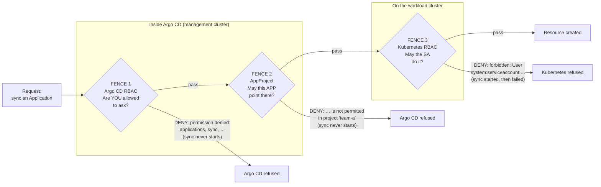
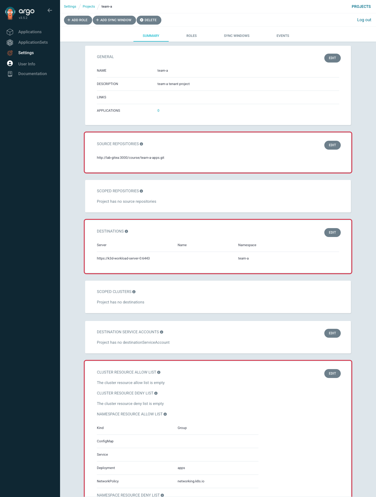
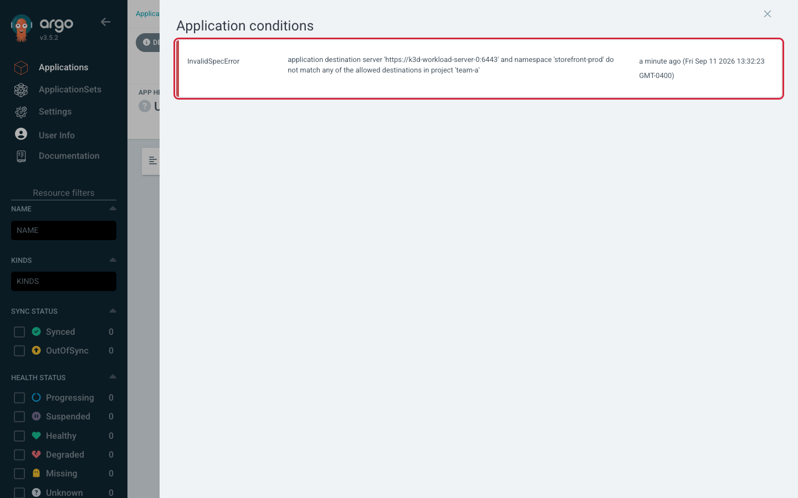
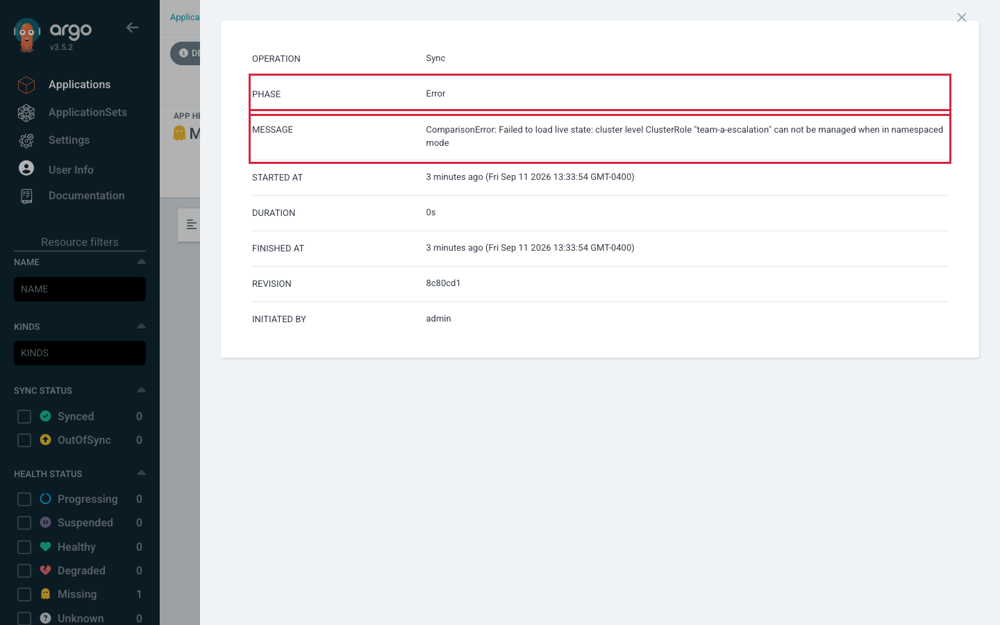
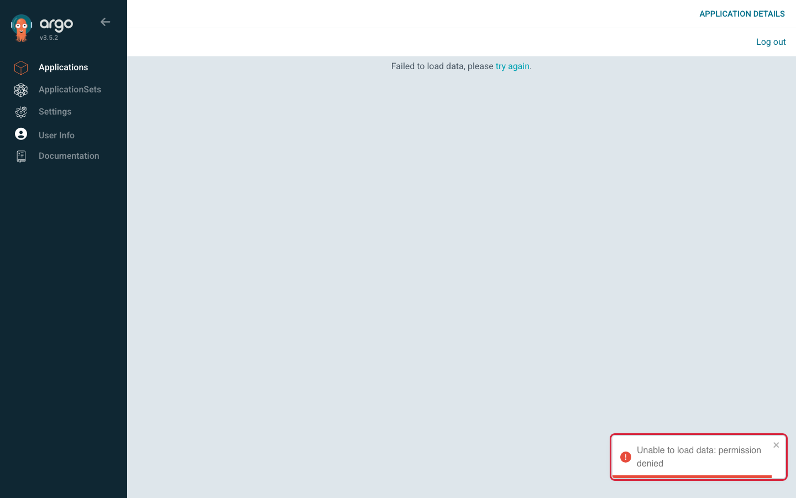

# Lab 5 — Enforce Platform Guardrails

> **Day 2 · Lab 5 · Hands-on lab guide · ~45 minutes**
> **Argo CD version this course targets: `v3.5.2`** (Helm chart `10.8.4`, Kubernetes `v1.35`; the repo-server renders charts with **Helm v4.2.1**).
> **Scaffolding level: G2 (reduced).** Every *new* idea in this lab — how an AppProject fences an Application, how an Argo CD RBAC policy line is written, how to tell an Argo CD denial from a Kubernetes denial — is explained in full **before** you use it. What is *no longer* re-explained is the mechanics you already own from Day 1 and Lab 4: logging in, finding an Application, reading a diff, running `argocd app …` and `kubectl --context …`. From here on you will often **write a manifest or a policy line yourself** before the guide confirms one correct shape.
> **What you need open before you start:**
> - your SSH (Secure Shell) session to the VM (virtual machine), from the student setup guide,
> - a browser with the Argo CD tunnel running (`https://localhost:8443`), logged in as `admin`,
> - the `argocd` command line, already logged in as `admin` (confirm with `argocd account get-user-info`),
> - a terminal where you can `git` against your own clone of the `platform-config` repository.

---

## 1. Why this matters

A guardrail you have never tried to break is not a guardrail — it is a hope.

When you add a restriction to a platform, nothing lights up green to tell you it works. Configuring an AppProject to forbid a destination produces *no* feedback at all until the day someone points an Application at the wrong place. The only evidence a fence exists is **an attempt that was refused**, and the only evidence it is a *good* fence is that the refusal **said something useful** — it named the rule and the offending value, so the person who hit it can fix their own mistake without paging you.

So this lab is built around that idea. You will fence in a brand-new tenant — **team-a** — and then genuinely try to walk through the fence three different ways. Each attempt is refused by a *different* system, with *different* error text, logged in a *different* place, fixed by a *different* team. The whole skill of the lab is reading past the red badge to the **layer that actually said no**.

That skill is exactly what the Day 2 Capstone grades hardest: when an Application is stuck, "permission denied" is not a diagnosis. "*Which* permission system denied it" is.

By the end you will be able to:

- build a restrictive AppProject and prove each restriction by trying to violate it;
- tell, from an error message alone, whether **Argo CD** refused the request or **Kubernetes** refused it — the outline's explicit "compare an Argo CD authorization failure with a Kubernetes authorization failure";
- grant a tenant the *least* privilege that still lets it work, and unit-test that grant **before** shipping it;
- and protect Applications from unintended deletion as a governance boundary, not only a blast-radius control.

---

## 2. Learning objectives

By the end of this lab you will be able to:

1. **Create a restricted AppProject** for team-a from a specification — one source repository, one destination, no cluster-scoped resources, and a deliberately short list of allowed namespaced kinds — and write the Argo CD RBAC policy that lets a team account use it (outline bullet **L5.1**).
2. **Permit an approved source, namespace, and workload cluster** by creating a real Application that reaches `Synced`/`Healthy` *because* it lands inside every fence (**L5.2**).
3. **Block an unauthorized destination and a cluster-scoped resource**, predicting and then observing exactly which fence refuses each one (**L5.3**).
4. **Compare an Argo CD authorization failure with a Kubernetes authorization failure** — trigger both minutes apart, then say for each: who denied it, where it was logged, which configuration fixes it, and who owns that configuration (**L5.4**).
5. **Protect generated Applications from unintended deletion** at the governance layer — an Argo CD RBAC denial on `delete`, plus the finalizer and cascade behavior that make deletion dangerous in the first place (**L5.5**).

These map to course outcomes **O6** (apply synchronization, promotion, RBAC, and AppProject guardrails) and **O7** (diagnose failures — here, authorization failures specifically).

---

## 3. Prerequisites and what earlier guides established

**You should have completed:**

- **All of Day 1 (Labs 1–3) and Lab 4.** You can read the two status axes (`Synced`/`OutOfSync` and `Healthy`/`Degraded`), write and apply an `Application`, trace a change through Git, and run `argocd app …` and `kubectl --context …` without a script. This lab does **not** re-teach any of that.
- **Guide 06 — Security, Multi-Tenancy, and Governance** (`06-security-multitenancy-governance.md`). This lab turns that concept guide into muscle memory. You will lean on its central claim the entire time:

  > **There are three independent fences a request passes through, and they fail differently. If the sync never started, it was Argo CD (fence 1 or 2). If the sync started and then failed, it was Kubernetes (fence 3).**

**Acronyms and terms this lab uses, expanded once here:**

- **RBAC (Role-Based Access Control):** any permission system that attaches permissions to *roles*, then assigns roles to *subjects* (people, groups, accounts). Both Argo CD and Kubernetes use RBAC — which is exactly why they get confused, so this guide always says **which** RBAC it means.
- **AppProject:** a Kubernetes Custom Resource (a **CRD** — Custom Resource Definition — that Argo CD installed) that fences *what an Application may point at*: which source repositories, which cluster/namespace destinations, and which resource kinds. It is **fence 2**.
- **`policy.csv` / policy line:** Argo CD's own RBAC rules, written as CSV (Comma-Separated Values) text in a ConfigMap named `argocd-rbac-cm`. A *permission* line has the shape `p, <subject>, <resource>, <action>, <object>, <allow|deny>`. A *group binding* line has the shape `g, <subject>, <role>`. This is **fence 1**.
- **ServiceAccount (SA):** a non-human identity inside Kubernetes that a program uses to authenticate to a cluster. Argo CD acts on the workload cluster as **one** ServiceAccount — `argocd-manager` in the `argocd-access` namespace — for *every* Application. Kubernetes RBAC (**fence 3**) governs what that ServiceAccount may do.
- **local account:** an account defined inside Argo CD itself (no external identity provider). In this lab the local account **`team-a-dev`** stands in for "a member of an SSO (Single Sign-On) group." It can log in, but has **no permissions at all** until you grant them in Exercise 1.
- **NetworkPolicy (NP):** a namespaced Kubernetes object that restricts pod-to-pod network traffic. It matters here because the team-a AppProject *allows* it but the workload cluster's Kubernetes RBAC *forbids* it for team-a's ServiceAccount — that gap is the heart of Exercise 4.
- **finalizer / cascade:** a `resources-finalizer.argocd.argoproj.io` finalizer on an Application tells Argo CD "before you delete this Application object, delete the Kubernetes resources it created too." That is *cascading deletion* — and it is why an accidental Application delete is not a paperwork error, it is an outage.
- **JWT (JSON Web Token):** a signed, self-contained credential string. Mentioned only in the optional stretch (project-role tokens for automation).

> **Refresher — two clusters, always name the context (home: Lab 1).** Your VM runs two clusters. `k3d-mgmt` is the **management cluster** where Argo CD and every `Application`/`AppProject` object lives (namespace `argocd`). `k3d-workload` is the **separate workload cluster** where team-a's app will run. Every `kubectl` command in this lab names its context with `--context k3d-mgmt` or `--context k3d-workload`. A surprising result is a wrong-context result until proven otherwise.

> **Refresher — Kubernetes RBAC verbs and `kubectl auth can-i` (home: Lab 2; full in Guide 06).** Kubernetes decides "may this subject take this verb on this resource in this namespace?" You can ask the cluster that question directly, without changing anything, with `kubectl auth can-i <verb> <resource> -n <namespace> --as=<user>`. The `--as` flag *impersonates* another identity for the check — you will use it to ask, as the workload ServiceAccount, "may I create a NetworkPolicy here?" The answer is a plain `yes` or `no`.

---

## 4. Mental model recap (short — Guide 06 taught this)

Hold one picture in your head for the whole lab: a single request — "sync this Application" — walking toward the cluster, past **three fences in order**. Each fence is a *different guard* asking a *different question*, and each refuses with a *different error signature*.



Three things to carry from this diagram, because the exercises are built on them:

1. **Fences 1 and 2 live inside Argo CD.** They refuse *before any sync operation runs*. In the UI you never see a partial change — the request is turned away at the door.
2. **Fence 3 lives on the workload cluster.** It refuses *after the sync has started*, so you see a sync that began and then failed with a `forbidden` message naming a ServiceAccount.
3. **Same red badge, three different systems.** The single most useful question you can ask about any denial is: **did the sync start?** If no, it was Argo CD. If yes-then-failed, it was Kubernetes.

---

## 5. Environment check — confirm you are starting from "healthy"

Your starting state is checkpoint **`CP-lab-05`**: Lab 4's `storefront` ApplicationSet (three generated Applications, `Synced`/`Healthy`) and the `platform-root` App-of-Apps with its three children are all running. Two AppProjects exist — `storefront` and `platform`. Crucially, **team-a does not exist yet**: no `team-a` project, and the `team-a-dev` account can log in but has zero permissions. You are about to build team-a's entire fence from scratch.

### 5.1 Run the verifier (it changes nothing)

In your SSH session:

```bash
reset-lab.sh CP-lab-05 --verify-only
```

The `--verify-only` flag prints a PASS/FAIL table **without changing anything**.

**Expected output** *(representative — confirm against the live classroom environment):*

```text
==> Verification for CP-lab-05
  PASS  Application storefront-dev-workload Synced/Healthy
  PASS  Application storefront-staging-workload Synced/Healthy
  PASS  Application storefront-prod-workload Synced/Healthy
  PASS  Application platform-root Synced/Healthy
  PASS  Application platform-quotas Synced/Healthy
  PASS  Application platform-netpol Synced/Healthy
  PASS  Application platform-agent Synced/Healthy
  PASS  Application hello-reconcile absent
  PASS  Application storefront-dev absent
  PASS  ApplicationSet storefront present
  PASS  AppProject storefront present
  PASS  AppProject platform present
  PASS  Secret in-cluster present
  PASS  Secret repo-storefront-gitops present
  PASS  Secret cluster-workload present
  PASS  Secret course-repo-creds present
  PASS  workload namespace storefront-prod present
  PASS  workload SA argocd-manager present
  PASS  workload RoleBinding argocd-deployer (storefront-prod) present

PASS CP-lab-05 is in the expected state.
```

If any row says **FAIL**, run `reset-lab.sh CP-lab-05` (without `--verify-only`) to restore the checkpoint. **Warning:** a full reset discards any lab work you have not committed and pushed.

Notice what the verifier does **not** list: there is no `AppProject team-a` and no `team-a-dev` RBAC. That absence is the correct starting state — you will create both.

### 5.2 Confirm the starting picture in the UI

In the Argo CD UI, open **Settings → Projects**. You should see exactly two projects — `storefront` and `platform` — plus the built-in `default`. There is **no** `team-a`.


**What to notice:**
1. Three project rows: `default`, `platform`, `storefront`. No `team-a` yet.
2. The `default` project still exists and is permissive — you are not touching it in this lab.
3. This empty-of-team-a state is what you are about to change in Exercise 1.

<!-- CAPTURE-SPEC: SS-L5-01 — Argo CD Settings → Projects list, environment check. State: checkpoint CP-lab-05 (reset-lab.sh CP-lab-05), logged in as admin, route /settings/projects. Highlight: rows for default, platform, storefront; NO team-a row. Fidelity: full page. Argo CD v3.5.2. -->

---

## 6. Guided walkthrough — how a fence and a policy are written and applied

This is a short walkthrough (G2). It shows you the **two mechanisms** you will use in the exercises, demonstrated on the *existing* platform configuration so nothing here changes state. In the exercises you apply the same two mechanisms to team-a yourself.

### 6.1 Where the two Argo CD fences are configured

Both fences you can control live in the `platform-config` repository, and both are applied by the platform tooling — not typed directly into the cluster. That is the point of GitOps governance: the fence is itself reviewed, versioned, and reversible.

**Fence 2 — the AppProject — is a YAML file per project.** Look at how an existing project is shaped. In your clone of `platform-config`:

```bash
cat platform-config/projects/storefront.yaml
```

You will see the fields that matter for this lab: `sourceRepos` (which Git repositories an Application may deploy *from*), `destinations` (which `server` + `namespace` pairs it may deploy *to*), `clusterResourceWhitelist` (which **cluster-scoped** kinds it may create), and `namespaceResourceWhitelist` (which **namespaced** kinds it may create). An empty `clusterResourceWhitelist: []` means "**no** cluster-scoped resources at all." A `namespaceResourceWhitelist` that lists some kinds and omits others means "only the listed kinds are allowed."

> **Refresher — cluster-scoped vs namespaced kinds.** A **namespaced** resource lives inside one namespace (a `Deployment`, a `Service`, a `NetworkPolicy`). A **cluster-scoped** resource has no namespace and affects the whole cluster (a `ClusterRole`, a `Namespace`, a `CustomResourceDefinition`). `clusterResourceWhitelist` governs the second group; `namespaceResourceWhitelist` governs the first.

**Fence 1 — Argo CD RBAC — is a block of policy lines** inside the Argo CD Helm values. Look at where it lives:

```bash
grep -n -A6 "rbac:" platform-config/argocd/values.yaml
```

**Expected output** *(representative):*

```text
  rbac:
    # No permissions by default. Anonymous users see nothing.
    policy.default: ""
    policy.csv: ""
```

`policy.csv` is empty today, which is why `team-a-dev` can log in but see nothing. You will fill it in Exercise 1.

### 6.2 How a values change becomes live Argo CD configuration

Editing `values.yaml` does nothing on its own. The platform tooling applies it with one wrapper script that stands in for "the pipeline that manages Argo CD declaratively":

```bash
apply-argocd-config.sh
```

That script runs `helm upgrade --install` with the course values, which rewrites the `argocd-rbac-cm` ConfigMap (among others) and rolls the affected components. After it finishes, your policy lines are live. You do **not** edit `argocd-rbac-cm` by hand — you edit the values file and re-apply.

### 6.3 The two tools that read a fence's verdict

You do not have to *guess* what a fence will decide. Two read-only commands ask each fence directly.

**Argo CD RBAC (fence 1)** — ask whether a subject may take an action, with `argocd admin settings rbac can`. It answers `Yes` or `No`. It can test a **policy file offline**, *before* you deploy it — this is what "policy as code" actually means:

```bash
# Ask a scratch policy file, changing nothing on the cluster:
argocd admin settings rbac can team-a-dev sync applications 'team-a/team-a-guestbook' --policy-file /tmp/my-policy.csv
```

> **Watch the argument order — it is a genuine trap.** In a `policy.csv` *line*, the order is `p, subject, resource, action, object`. In the `rbac can` *command*, the order is `can <subject> <action> <resource> <object>`. Resource and action swap places. Read each carefully.

**Kubernetes RBAC (fence 3)** — ask whether the workload ServiceAccount may create a kind, with `kubectl auth can-i … --as`:

```bash
kubectl --context k3d-workload auth can-i create deployments.apps -n team-a \
  --as=system:serviceaccount:argocd-access:argocd-manager
```

**Expected output:**

```text
yes
```

That `yes` is fence 3 telling you the workload ServiceAccount is allowed to create Deployments in `team-a`. Hold onto that command — in Exercise 4 you will ask it the *same* question about a NetworkPolicy and get a very different answer.

---

## 7. Exercises

Work these in order; each builds on the last. Three of them (E3, E4, E5) follow the same shape — the **Guardrail-Bypass-Attempt**: *predict which fence will refuse, try the blocked action, confirm it was refused, then explain which layer said no and why.* The learning is in the error text, not in the success.

> **The rhythm, stated once:** for every attempt — **(1) predict** which fence refuses and what the message will say, **(2) try** it, **(3) read** the actual message and confirm which fence it names. A prediction you wrote down and then contradicted is worth more than three you got right.

---

### Exercise 1 — Build team-a's fence and grant its account (10 min · foundational)

**Goal.** Create the `team-a` AppProject from the specification below, and write the Argo CD RBAC policy that lets the `team-a-dev` account use it — with the **least** privilege that still works. You write both files; the guide gives you the spec and the *shape*, not the finished answer.

**Starter state.** `platform-config` is at `CP-lab-05`. There is no `projects/team-a.yaml` and `configs.rbac.policy.csv` is empty. The tenant repository `team-a-apps` already exists in Gitea with a `guestbook/` app and two `attempts/` manifests you will use later.

**Part A — the AppProject.** Create `platform-config/projects/team-a.yaml`. Start from this skeleton and fill it in from the spec table — the field *names* and nesting are yours to get right:

```yaml
apiVersion: argoproj.io/v1alpha1
kind: AppProject
metadata:
  name: team-a
  namespace: argocd
spec:
  description: team-a tenant project
  # TODO(E1a): fill in from the spec table below:
  #   sourceRepos, destinations, clusterResourceWhitelist, namespaceResourceWhitelist
```

| Fence field | What team-a is allowed | How to get the value |
|---|---|---|
| `sourceRepos` | **only** the team-a tenant repo | `http://lab-gitea:3000/course/team-a-apps.git` |
| `destinations` | **only** the `workload` cluster, namespace `team-a` | get the cluster's `server` URL from `argocd cluster list` (it is the registered `workload` cluster) |
| `clusterResourceWhitelist` | **nothing** cluster-scoped | an empty list |
| `namespaceResourceWhitelist` | `ConfigMap`, `Service`, `Deployment`, and `NetworkPolicy` — and **nothing else** (so `ResourceQuota` and `LimitRange` are denied by omission) | the four kinds above, each as a `group` + `kind` pair |

Apply it and confirm the project exists:

```bash
kubectl --context k3d-mgmt apply -f platform-config/projects/team-a.yaml
argocd proj get team-a
```

**Part B — the RBAC grant.** Team-a needs to **see** and **sync** its own Applications — nothing more. It must *not* be able to delete, override, or touch any other project. Edit `platform-config/argocd/values.yaml` so `policy.csv` is a block scalar, then add your lines:

```yaml
  rbac:
    policy.default: ""
    policy.csv: |
      # TODO(E1b): grant role:team-a the least privilege it needs on team-a/*,
      # then bind the team-a-dev account to that role.
      # Permission line shape:  p, <role>, applications, <action>, <project>/<app-glob>, allow
      # Group binding shape:     g, <subject>, <role>
```

Before you apply, **unit-test the policy** (I-L5-03). Paste your two-or-three lines into a scratch file and ask fence 1 directly:

```bash
# Write your candidate lines into /tmp/my-policy.csv first, then:
argocd admin settings rbac can team-a-dev sync applications 'team-a/team-a-guestbook' --policy-file /tmp/my-policy.csv   # expect: Yes
argocd admin settings rbac can team-a-dev delete applications 'team-a/team-a-guestbook' --policy-file /tmp/my-policy.csv # expect: No
```

Only when the offline test matches your intent, paste the lines into `values.yaml` and apply for real:

```bash
apply-argocd-config.sh
```

**Output shape of a correct result.** `argocd proj get team-a` shows one source repo, one destination, an empty cluster-resource allow-list, and exactly four allowed namespaced kinds. `argocd admin settings rbac can team-a-dev sync applications 'team-a/team-a-guestbook'` prints `Yes`; the same command with `delete` prints `No`.



**What to notice:**
1. **Sources** lists exactly one repository, `team-a-apps.git`.
2. **Destinations** lists exactly one row — the `workload` cluster, namespace `team-a`.
3. The cluster-resource allow-list is empty; the namespaced allow-list has four kinds and no more.

<!-- CAPTURE-SPEC: SS-L5-02 — Argo CD project detail for team-a. State: after E1 apply of projects/team-a.yaml, route /settings/projects/team-a. Highlight: Sources = one team-a-apps repo; Destinations = one workload/team-a row; empty cluster-resource allow-list; four namespaced kinds. Fidelity: full page. Argo CD v3.5.2. -->

**Difficulty:** medium. **Time:** 10 min.

**Hints (use only if stuck; each is more specific than the last).**
- *Hint 1:* `clusterResourceWhitelist: []` on one line is the whole "no cluster-scoped resources" rule. For `namespaceResourceWhitelist`, each entry is a `- group: …` / `kind: …` pair — a core kind like `ConfigMap` uses `group: ""`.
- *Hint 2:* "Least privilege" here is **two** actions: `get` and `sync`. Do **not** add `delete`, `override`, `create`, or `*`. The account also needs the `g,` binding line, or the permission lines apply to a role nobody holds.
- *Hint 3:* If `rbac can … sync` prints `No`, check your object field: it is `<project>/<app>` — for team-a's apps that is `team-a/*`, not `*` alone. If `delete` prints `Yes`, you granted too much (probably `*` as the action).

---

### Exercise 2 — Prove the happy path: deploy team-a's app (5 min · easy application)

**Goal.** Create an Application that lands **inside every fence** and therefore reaches `Synced`/`Healthy`. This is the positive control: before you prove the fences *block* things, prove they *let the right thing through*.

**Starter state.** The `team-a` project and `role:team-a` grant from Exercise 1 are live. The `team-a-apps` repo has a `guestbook/` directory (a small `podinfo` Deployment and Service targeting namespace `team-a`).

**What to write.** An `Application` (you have written these since Lab 2) with:

| Field | Value |
|---|---|
| `metadata.name` | `team-a-guestbook` |
| `spec.project` | `team-a` |
| `spec.source` | repo `team-a-apps.git`, `path: guestbook`, `targetRevision: main` |
| `spec.destination` | the `workload` cluster, `namespace: team-a` |
| `spec.syncPolicy` | automated is fine (or sync it manually once) |

Apply it against the management cluster, then sync and watch:

```bash
kubectl --context k3d-mgmt apply -f platform-config/applications/team-a-guestbook.yaml
argocd app sync team-a-guestbook
argocd app get team-a-guestbook
```

**Output shape of a correct result.** `argocd app get team-a-guestbook` reports `Sync Status: Synced` and `Health Status: Healthy`, with the guestbook `Deployment` and `Service` listed in namespace `team-a`. Because this Application obeys all three fences — approved repo, approved destination, only namespaced kinds the ServiceAccount can create — nothing refuses it.

**Difficulty:** easy. **Time:** 5 min.

**Hints.**
- *Hint 1:* If Argo CD rejects the Application on creation with "*not permitted in project*", your `source`, `destination`, or a kind does not match the fence you built in E1 — read the message; it names which.
- *Hint 2:* If it stays `OutOfSync`/`Missing`, you probably have not synced it yet, or `path` does not point at `guestbook`. Confirm with `argocd app get team-a-guestbook` and read the `source` block.

---

### Exercise 3 — Bypass attempt: a wrong destination and a cluster-scoped kind (8 min · diagnosis)

**Goal.** Trigger **two** refusals that both come from **the same fence — the AppProject (fence 2)** — and confirm from the message that Argo CD refused *before any sync ran*.

**Starter state.** Everything from E1–E2 is live and healthy.

**Part A — an unauthorized destination.** **Predict first (write it down):** if you create an Application in project `team-a` whose destination namespace is `storefront-prod` (which the team-a fence does *not* permit), which fence refuses it, and does any sync start?

Create a throwaway Application — same `team-a` project, but point its destination at `storefront-prod` instead of `team-a`. Apply it and read the condition:

```bash
kubectl --context k3d-mgmt apply -f /tmp/team-a-wrong-dest.yaml
argocd app get team-a-wrong-dest
```

**Part B — a cluster-scoped resource.** The `team-a-apps` repo ships a deliberate attempt manifest at `attempts/cluster-scoped/clusterrole.yaml` — a **`ClusterRole`**, which is cluster-scoped. **Predict first:** the team-a project's `clusterResourceWhitelist` is empty. What happens when you try to sync an Application whose path is `attempts/cluster-scoped`?

Point a throwaway Application (still project `team-a`, destination `team-a`) at `path: attempts/cluster-scoped`, apply, sync, and read the result:

```bash
kubectl --context k3d-mgmt apply -f /tmp/team-a-clusterrole.yaml
argocd app sync team-a-clusterrole ; argocd app get team-a-clusterrole
```

**Output shape of a correct result.** Both attempts are refused by the AppProject with a message that contains **`is not permitted in project "team-a"`** — Part A names the destination, Part B names the `ClusterRole` kind. In both cases **no sync operation ran**; the offending resource was never created on the workload cluster (confirm with `kubectl --context k3d-workload get clusterrole team-a-escalation` → `NotFound`).



**What to notice:**
1. The condition text contains `is not permitted in project "team-a"` and names the destination.
2. The Sync Status never becomes a running operation — it is refused up front.
3. This is fence 2 (the AppProject), not fence 3 (Kubernetes).

<!-- CAPTURE-SPEC: SS-L5-03 — Argo CD Application condition, destination rejected. State: E3 part A, throwaway Application in project team-a targeting namespace storefront-prod, route /applications/team-a-wrong-dest. Highlight: condition/error text "... is not permitted in project team-a" naming the destination. Fidelity: panel. Argo CD v3.5.2. -->



**What to notice:**
1. The message names the `ClusterRole` kind and `is not permitted in project "team-a"`.
2. The cluster-scoped resource was never created on the workload cluster.
3. Same fence (2), different rule — the empty `clusterResourceWhitelist`, not the destination.

<!-- CAPTURE-SPEC: SS-L5-04 — Argo CD sync result, cluster-scoped kind blocked. State: E3 part B, throwaway Application in project team-a with path attempts/cluster-scoped, after sync attempt, route /applications/team-a-clusterrole. Highlight: message naming ClusterRole "... is not permitted in project team-a". Fidelity: panel. Argo CD v3.5.2. -->

**Difficulty:** medium. **Time:** 8 min.

**Hints.**
- *Hint 1:* You do not need to hand-write two full Application manifests from scratch — copy your E2 `team-a-guestbook.yaml` twice and change only the one field each part needs (the destination namespace in A; the `path` in B).
- *Hint 2:* Read the *condition*, not only the badge — `argocd app get <name>` prints a `Conditions` section; the useful sentence is there.
- *Hint 3:* Clean up the throwaways when done (`argocd app delete team-a-wrong-dest --cascade=false`), so they do not clutter your checkpoint.

---

### Exercise 4 — The centerpiece: Argo CD denial vs Kubernetes denial (12 min · hardest)

**Goal.** Trigger **two denials from two different systems**, minutes apart, and complete a comparison table. This is the outline's explicit bullet — *compare an Argo CD authorization failure with a Kubernetes authorization failure* — and it is the whole reason this lab exists.

**Starter state.** E1–E2 live. You will act partly as `admin` and partly as `team-a-dev`.

**Part A — an Argo CD RBAC denial (fence 1).** Log in to the `argocd` CLI **as `team-a-dev`** (a different, far less privileged identity):

```bash
argocd login localhost:8443 --username team-a-dev --insecure
```

> At the `Password:` prompt, type the value from `~/course/credentials/team-a-dev.txt`. **Never** echo a credential into a shared terminal or paste it into this guide.

**Predict first:** `team-a-dev` was granted `get` and `sync` on `team-a/*` only. What happens when this identity tries to sync a *storefront* Application — `storefront-prod-workload`? Which fence refuses, and does a sync start?

```bash
argocd app sync storefront-prod-workload
```

**Part B — a Kubernetes RBAC denial (fence 3).** Log back in as `admin`. The `team-a-apps` repo ships `attempts/network-policy/netpol.yaml` — a **NetworkPolicy** in namespace `team-a`. The team-a AppProject **allows** `NetworkPolicy` (it is in the namespaced allow-list), and Argo CD RBAC allows admin to sync. So both Argo CD fences pass — **yet the sync will still fail.** Why? Because the workload cluster's least-privilege ServiceAccount (`argocd-deployer-team`, which backs `argocd-manager` in `team-a`) was never granted verbs on NetworkPolicies.

Ask fence 3 directly, first, before syncing anything:

```bash
kubectl --context k3d-workload auth can-i create networkpolicies.networking.k8s.io -n team-a \
  --as=system:serviceaccount:argocd-access:argocd-manager
```

**Expected output** *(verified against the live environment):*

```text
no
```

Now make an Application (project `team-a`, destination `team-a`, `path: attempts/network-policy`) and sync it as `admin`:

```bash
kubectl --context k3d-mgmt apply -f /tmp/team-a-netpol.yaml
argocd app sync team-a-netpol ; argocd app get team-a-netpol
```

**Output shape of a correct result.** Two visibly different denials:

- **Part A** refuses with an Argo CD **permission denied** on `applications, sync, storefront/…` — **no sync operation ever starts.** That is fence 1.
- **Part B** *starts* a sync and then **fails** with a Kubernetes `forbidden` error naming `system:serviceaccount:argocd-access:argocd-manager` and the `networkpolicies` resource. That is fence 3.

Then complete this table (fill the four columns for each row):

| Attempt | Who denied it? | Where is it logged? | Which config fixes it? | Who owns that config? |
|---|---|---|---|---|
| A: team-a-dev syncs storefront | ? | ? | ? | ? |
| B: NetworkPolicy in team-a | ? | ? | ? | ? |

Finally, the question that makes it stick: **for each denial, which team do you page?**



**What to notice:**
1. The notification/CLI error says `permission denied` and names `applications, sync, storefront/…`.
2. No sync operation appears — the request was refused at the door.
3. This is Argo CD's own RBAC (fence 1), fixed in `argocd-rbac-cm` / `policy.csv`.

<!-- CAPTURE-SPEC: SS-L5-05 — Argo CD sync denied, as team-a-dev. State: E4 part A, logged in AS team-a-dev, attempt to sync storefront-prod-workload, route /applications/storefront-prod-workload. Highlight: permission-denied notification naming applications, sync, storefront/*. Fidelity: full page. Argo CD v3.5.2. Auth: team-a-dev. -->


**What to notice:**
1. The sync **started** and then failed — a running operation with an error, not an up-front refusal.
2. The message contains `forbidden` and names `system:serviceaccount:argocd-access:argocd-manager` and `networkpolicies`.
3. This is Kubernetes RBAC (fence 3), fixed on the *workload* cluster — not in Argo CD at all.

<!-- CAPTURE-SPEC: SS-L5-06 — Argo CD sync result, Kubernetes forbidden. State: E4 part B, admin syncs team-a-netpol (path attempts/network-policy), route /applications/team-a-netpol sync result. Highlight: "forbidden ... system:serviceaccount:argocd-access:argocd-manager" for networkpolicies in namespace team-a. Fidelity: panel. Argo CD v3.5.2. -->

**Difficulty:** hard. **Time:** 12 min.

**Hints.**
- *Hint 1:* The one-question test: **did the sync start?** Part A never starts (Argo CD refused you). Part B starts and fails (Kubernetes refused the ServiceAccount). Put that answer in the "who denied it" column.
- *Hint 2:* "Which config fixes it" is different for each: Part A is `policy.csv` in the Argo CD values (owned by the platform team who run Argo CD); Part B is a Kubernetes `Role`/`RoleBinding` on the workload cluster (owned by whoever administers that cluster). They can be *different people*.
- *Hint 3:* If Part B does **not** fail — if the NetworkPolicy actually applies — then the team-a `Role` was widened; re-run the `kubectl auth can-i … --as` check, which should print `no`, and re-confirm you are syncing the `attempts/network-policy` path into namespace `team-a`.

---

### Exercise 5 — Protect Applications from unintended deletion (6 min · governance)

**Goal.** Make an accidental *delete* impossible for the team role, and understand *why* an accidental Application delete is so dangerous — the finalizer and cascade. This revisits the deletion protection you met in Lab 4, but as a **governance** boundary (who may cause a deletion at all) rather than a blast-radius control.

**Starter state.** E1–E2 live. `team-a-dev` currently has `get` and `sync` only.

**Part A — confirm the role already cannot delete.** Because you granted least privilege in E1, the team role never received `delete`. Verify it — as `team-a-dev` this is already a `No`:

```bash
argocd admin settings rbac can team-a-dev delete applications 'team-a/team-a-guestbook'
```

**Part B — add an explicit deny (defense in depth).** A future engineer might one day widen `role:team-a` with an over-broad `allow`. An **explicit `deny`** protects production regardless, because in Argo CD RBAC **a `deny` always beats an `allow`.** Add one line to `policy.csv` (shape only — you choose the object scope that protects the storefront apps):

```text
p, role:team-a, applications, delete, <project>/*, deny
```

Apply with `apply-argocd-config.sh`, then prove the deny wins even if you *also* add a temporary broad allow to your scratch policy file and re-test with `rbac can`.

**Part C — inspect the finalizer and explain the cascade.** Look at the finalizer on a real Application:

```bash
kubectl --context k3d-mgmt -n argocd get application team-a-guestbook \
  -o jsonpath='{.metadata.finalizers}' ; echo
```

**Output shape of a correct result.** Part A prints `No`. After Part B, `rbac can team-a-dev delete applications 'storefront/storefront-prod-workload'` prints `No` *even when your scratch file also contains a broad allow* — proving deny precedence. Part C shows a finalizer array containing `resources-finalizer.argocd.argoproj.io`. In two or three sentences, write **why** that finalizer makes a delete dangerous: deleting the Application object triggers Argo CD to cascade-delete every Kubernetes resource the Application created, so an accidental Application delete is an accidental *workload* delete.


**What to notice:**
1. The delete is refused with `permission denied` on `applications, delete`.
2. The account can still `get` and `sync` — least privilege, not no privilege.
3. The explicit `deny` line means even a future broad `allow` cannot re-enable delete.

<!-- CAPTURE-SPEC: SS-L5-07 — Argo CD delete denied, as team-a-dev. State: E5, logged in AS team-a-dev, attempt to delete team-a-guestbook (or storefront app), route /applications. Highlight: permission-denied notification naming applications, delete. Fidelity: panel. Argo CD v3.5.2. Auth: team-a-dev. -->

**Difficulty:** medium. **Time:** 6 min.

**Hints.**
- *Hint 1:* Remember the deny is `p, role:team-a, applications, delete, <scope>, deny`. Scope it to the apps you most want protected (the `storefront/*` production apps are the obvious target).
- *Hint 2:* To *see* deny precedence, add both `p, role:team-a, applications, *, storefront/*, allow` **and** your `deny` line to a scratch file, then run `rbac can … delete … --policy-file` — it should still print `No`. That is the deny winning.
- *Hint 3:* If `metadata.finalizers` prints nothing, the Application may not have been created with the finalizer; add `metadata.finalizers: [resources-finalizer.argocd.argoproj.io]` to team-a-guestbook and re-apply, then re-check.

---

## 8. Troubleshooting

| Likely failure | Likely cause | Fix |
|---|---|---|
| `team-a-dev` logs in but the Applications list is empty and every action fails | The RBAC grant from E1 was not applied, or `policy.csv` is still empty. `team-a-dev` has **no** permissions until you grant them. | Confirm `argocd admin settings rbac can team-a-dev get applications 'team-a/*'` prints `Yes`; if `No`, re-check your `policy.csv` lines and re-run `apply-argocd-config.sh`. |
| An Application is refused with "*is not permitted in project team-a*" and you did **not** expect it | Fence 2 (the AppProject) — the `source`, `destination`, or a resource `kind` is outside team-a's allow-lists. **No sync ran.** | Read which the message names (repo / destination / kind), then either fix the Application to stay inside the fence or, if the need is legitimate, widen the project deliberately. |
| A NetworkPolicy sync **starts** and then fails with `forbidden` | Fence 3 (Kubernetes RBAC), **not** the AppProject — the AppProject *allows* NetworkPolicy, but the workload ServiceAccount `argocd-manager` has no verbs on it in `team-a`. | This is fixed on the **workload** cluster (a `Role`/`RoleBinding`), never in Argo CD. Confirm with `kubectl --context k3d-workload auth can-i create networkpolicies.networking.k8s.io -n team-a --as=system:serviceaccount:argocd-access:argocd-manager`. |
| `rbac can` gives the "wrong" answer | The command's argument order is `can <subject> <action> <resource> <object>` — resource and action are swapped relative to a `policy.csv` line. | Re-run with the correct order; double-check the object is `<project>/<app>`. |
| `apply-argocd-config.sh` succeeds but the policy seems unchanged | You edited `values.yaml` but did not save, or edited a different clone than the script reads. | Re-`grep` the `rbac:` block in the file the script uses, then re-apply. |

---

## 9. Checkpoint / validation — did every denial land in the layer you predicted?

You have built one fence and tried to walk through it four ways. The checkpoint is not "did anything turn green" — it is **"did each refusal come from the layer I predicted, with a message that named the rule?"** Fill in the *Observed* column from your own run:

| Attempt | Predicted layer | Expected message contains | Observed message | Match? |
|---|---|---|---|---|
| E3-A wrong destination | Fence 2 · AppProject | `is not permitted in project "team-a"` | | |
| E3-B cluster-scoped ClusterRole | Fence 2 · AppProject | `ClusterRole … is not permitted in project "team-a"` | | |
| E4-A team-a-dev syncs storefront | Fence 1 · Argo CD RBAC | `permission denied: applications, sync, storefront/…` | | |
| E4-B NetworkPolicy in team-a | Fence 3 · Kubernetes RBAC | `forbidden … system:serviceaccount:argocd-access:argocd-manager` | | |
| E5 team-a-dev deletes | Fence 1 · Argo CD RBAC | `permission denied: applications, delete` | | |

You have passed this lab when:

1. `team-a-guestbook` is `Synced`/`Healthy` (the happy path works — the fence is not only a wall).
2. All five attempts above were refused, and each **Observed** message names the **Predicted** layer.
3. `argocd admin settings rbac can team-a-dev sync applications 'team-a/team-a-guestbook'` prints `Yes` and the same with `delete` prints `No`.

> **Self-check without a solution file:** every criterion above is a `Yes`/`No`, a status, or a message string you can read yourself. If a denial landed in a *different* layer than you predicted, that mismatch is the most valuable thing you will learn today — go back and re-read the message with the "did the sync start?" question in hand.

---

## 10. Key takeaways

- **A guardrail you have never tried to break is a guardrail you do not have.** The proof a fence works is a refused attempt, and the proof it is a *good* fence is a refusal that names the rule.
- **Three fences, three systems, three error signatures.** Argo CD RBAC ("are you allowed to ask?"), the AppProject ("may this app point there?"), and Kubernetes RBAC ("may the ServiceAccount do it?"). Two live in Argo CD; one lives on the workload cluster.
- **The one-question diagnosis:** *did the sync start?* If no, it was Argo CD (fence 1 or 2). If yes-then-failed with `forbidden`, it was Kubernetes (fence 3). Same red badge, different team to page.
- **`argocd admin settings rbac can … --policy-file` is a unit test for your permission model.** Write it before your users find the bug — that is what "policy as code" means in practice.
- **Least privilege plus an explicit `deny` protects deletion two ways:** the role never had `delete`, and even a future over-broad `allow` cannot re-enable it, because a `deny` always wins. The finalizer is *why* it matters: deleting an Application cascade-deletes its workloads.

---

## 11. Optional stretch challenge (clearly optional)

Do any of these only if you have time; none is required to pass.

1. **Lock the ApplicationSet controller (blast-radius governance).** Set `applicationsetcontroller.policy: create-update` in the Argo CD values and re-apply. This is a *controller-wide* lock: unlike Lab 4's per-ApplicationSet `applicationsSync`, once the controller policy is set, per-ApplicationSet overrides are disabled by default (verified from the controller source). **Predict first:** after this, can a single ApplicationSet still opt into `create-delete`? Confirm, then revert with a reset.
2. **Add a deny sync window on `storefront-prod`.** Attach a `syncWindows` entry to the `storefront` project that *denies* syncs on a schedule (leave `manualSync` off). Observe that automated sync is blocked during the window and the window row appears on the project. This is the auditable "change freeze as configuration" from Guide 06.
3. **Issue a project-role JWT for automation.** Define a `role` inside the `team-a` project (`spec.roles`) scoped to `sync` only, then mint a token with `argocd proj role create-token team-a <role>`. This is the safe alternative to the broad admin token in Guide 06's opening story — a credential that can do exactly one project's syncs and nothing else. **Never** print or commit the token value.

---

## 12. Transition — from fences to failures

You have now built and *felt* every boundary a platform team owns: what a tenant may deploy, from where, to where, and who may cause a deletion. You can read any authorization denial down to the exact fence that produced it.

That reading skill is about to become the core of the whole course. **Session 7 — Reliability, Troubleshooting, and Lifecycle Operations** (`07-reliability-troubleshooting-lifecycle.md`) formalizes the repeatable troubleshooting method you have been building since Lab 1 — validate the source, validate rendering, compare live state, inspect the sync, inspect the component — and adds high availability, observability, backup, and upgrades.

Then the **Capstone** hands you a platform with *several* connected failures at once, and one of them is an authorization denial exactly like the ones you triggered here — except this time, nobody tells you which fence it is. The habit you built today, *did the sync start?*, is how you will find it.
