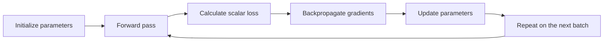

# Day 2 Student Guide: Train It

## How Neural Networks Learn

**Big question:** When a neural network makes a mistake, how does it know what to change?  
**Tangible outcome:** Train the same small model from scratch and in PyTorch, then diagnose broken training evidence before changing code.  
**Core memory:** **Forward propagation makes the prediction; backpropagation carries sensitivity backward; the optimizer turns that sensitivity into a parameter change.**

Day 1 made a prediction trace visible while parameters stayed fixed. Day 2 wraps that trace in a repeated experiment: measure a scalar loss, calculate how each parameter affects it, update parameters, and inspect whether the evidence changed as predicted.

Use the shared [glossary](../../shared/glossary.md), [notation and style contract](../../shared/notation-and-style.md), and [environment guide](../../shared/environment.md). Day 2 keeps the same batch-first convention: examples are rows.

## Day 2 Objectives

| ID | Observable outcome |
|---|---|
| `OBJ-D2-01` | Sequence initialization, forward pass, loss, backward pass, update, and repetition; distinguish training from inference and epoch from iteration. |
| `OBJ-D2-02` | Match MSE, binary cross-entropy, or categorical cross-entropy to a task/output and explain why loss and accuracy can move differently. |
| `OBJ-D2-03` | Use slope and update direction to diagnose crawl, convergence, oscillation, or divergence. |
| `OBJ-D2-04` | Trace local derivative times upstream gradient through a tiny graph and validate selected gradients numerically. |
| `OBJ-D2-05` | Convert a one-example computation to a batch, label tensor dimensions, explain broadcasting, and repair shape mismatches. |
| `OBJ-D2-06` | Implement and investigate a complete NumPy training loop for a small network. |
| `OBJ-D2-07` | Express the same workflow with PyTorch modules, autograd, loss, optimizer, gradient reset, and train/evaluation modes. |
| `OBJ-D2-08` | Diagnose training failures from curves, metrics, shapes, activation summaries, gradient evidence, and mode state. |

## Schedule: 450 Elapsed Minutes

| Time | Min | Core sequence |
|---|---:|---|
| 09:00-09:20 | 20 | `LESSON-D2-01`: Day 1 retrieval and complete learning loop |
| 09:20-09:45 | 25 | `LESSON-D2-02`, `ACT-D2-01`: loss, accuracy, gradient descent, learning rate |
| 09:45-10:25 | 40 | `LAB-D2-01`: loss landscapes and learning-rate roulette |
| 10:25-10:40 | 15 | Protected break |
| 10:40-11:10 | 30 | `LESSON-D2-03`, `ACT-D2-02`: computational graph and chain rule |
| 11:10-11:55 | 45 | `LAB-D2-02`: backpropagation gradient check |
| 11:55-12:05 | 10 | `CHECK-D2-01`, `CHECK-D2-02` |
| 12:05-13:05 | 60 | Protected lunch |
| 13:05-13:25 | 20 | `LESSON-D2-04`, `ACT-D2-03`: batching, vectorization, broadcasting |
| 13:25-14:35 | 70 | `LESSON-D2-05`, `LAB-D2-03`: complete NumPy training |
| 14:35-14:50 | 15 | Protected break |
| 14:50-15:10 | 20 | `LESSON-D2-06`: NumPy/PyTorch side-by-side reveal |
| 15:10-16:05 | 55 | `LESSON-D2-07`, `LAB-D2-04`, `ACT-D2-04`: evidence-first break/fix |
| 16:05-16:20 | 15 | `LESSON-D2-08`, `CHECK-D2-03`, `CHECK-D2-04`: transfer and exit |
| 16:20-16:30 | 10 | Protected recovery, questions, and close |

The optional/reference notes do not displace the live path. Long symbolic derivations, reinforcement-learning implementation, optimizer internals, distributed training, and hardware internals are outside Day 2 core scope.

---

# LESSON-D2-01 - The Complete Learning Loop

**Time:** 20 minutes  
**Objective:** `OBJ-D2-01`  
**Learning outcome:** Reconstruct the Day 1 forward trace, place it inside the six-stage training loop, and distinguish batches, iterations, epochs, training, and inference.

## Opening Retrieval: Bring Day 1 Forward

Open the five-minute Day 1 consolidation you submitted before 09:00. The instructor will sample one response from:

- `CHECK-D1-03` item 5: evidence that would support or disconfirm the nonlinearity explanation;
- `CHECK-D1-04` item 2: the hidden unit with nonzero activation;
- `CHECK-D1-04` item 5: a copied-parameter perturbation and its predicted local effect.

Do not improve the answer before the sample. Mark what your Day 1 self claimed, then add a second-color annotation after discussion.

Reconstruct the forward trace from memory:

$$
X \rightarrow Z_1 \rightarrow A_1 \rightarrow Z_2 \rightarrow p \rightarrow \hat{y}
$$

For each stage, state one shape, range, or invariant. Then answer: **Which arrow changed a parameter on Day 1?**

## The Productive Gap

A complete forward pass can disagree with the target and still be computationally valid. Learning needs three new capabilities:

1. a scalar signal that measures the current mismatch;
2. sensitivities that connect the signal to every trainable parameter;
3. a rule that uses those sensitivities to update parameters.



**Observe:** the Day 1 forward trace remains intact inside the loop.  
**Do not infer:** the model decides what the objective should value, or every update improves every metric.

## Batch, Iteration, and Epoch

- A **batch** is the group of examples processed together for one loop pass.
- An **iteration** or **step** is one parameter-update cycle.
- An **epoch** is one pass through the training set under the stated batching policy.
- **Full-batch** training uses the full training set per update.
- **Stochastic** training uses one example per update.
- **Mini-batch** training uses a subset larger than one and smaller than the full set.

If `800` training examples are divided into batches of `100`, one epoch contains eight iterations when all batches are used once. Changing batch size changes the number of updates per epoch and the shape of example-carrying arrays; it does not change stored parameter shapes.

## Training Loop versus Inference Loop

| Training | Inference/evaluation forward use |
|---|---|
| has targets and a loss | can produce outputs without targets |
| records or calculates gradients | does not need parameter gradients |
| updates parameters | keeps parameters fixed |
| repeats over training batches | runs on requested inputs |

Evaluation adds targets and metrics to judge fixed model outputs, but it does not update parameters.

## Checkpoint

Without using framework method names, explain why each stage must precede the next. Then identify which stages would disappear when the same fitted model is used only for inference.

**Misconception:** "An epoch is one update."  
**Correction:** Count batches first. An epoch can contain many update steps.

**Transition:** The loop needs a scalar objective before it can calculate useful sensitivities.

---

# LESSON-D2-02 - Loss, Gradient Descent, and Learning Rate

**Time:** 25 minutes  
**Objectives:** `OBJ-D2-02`, `OBJ-D2-03`  
**Learning outcome:** Explain why training uses a scalar loss, match common losses to output designs, and predict update behavior from gradient sign and learning-rate scale.

## Why a Scalar Objective Matters

A network may make many outputs across many examples. An optimizer needs one differentiable quantity that summarizes the current objective. A **per-example loss** measures one example; an aggregated training loss combines losses across the batch or dataset under a stated reduction.

A loss is not a deployment verdict. It is a designed training signal.

## Loss and Metric Are Different Evidence

Accuracy discards how far a probability lies from the decision threshold. Binary cross-entropy remains sensitive to that probability. Two models can therefore make identical class decisions and have different losses.

### Visual recommendation: equal accuracy, different loss

Show two probability strips with the same thresholded classes but different distances from the correct side of `0.5`.

**Observe:** thresholding removes information about margin/confidence-shaped output.  
**Do not infer:** lower training loss guarantees better validation, calibration, fairness, or deployment value.

## Match the Loss to the Output Contract

| Task | Model output used by the loss | Introductory loss |
|---|---|---|
| Numeric regression | unrestricted numeric output | mean squared error |
| Binary classification | one raw logit per binary decision | binary cross-entropy with logits |
| Mutually exclusive multiclass classification | one raw logit per class | categorical cross-entropy over class logits |

The output/loss pairing is a contract. Do not apply sigmoid inside a binary PyTorch model when the next operation is `BCEWithLogitsLoss`; the loss accepts logits and combines sigmoid with BCE in a numerically stable operation.

## ACT-D2-01 Launch

Complete [ACT-D2-01 - Loss Ranking](../challenges/day-2-challenges.md#act-d2-01---loss-ranking-same-accuracy-different-signal) before calculating any loss.

**Commit:** rank prediction vectors and record accuracy.  
**Reveal:** classes first, then example losses, then mean loss.  
**Return with:** a corrected ranking and one limit of loss as evidence.

## From Sensitivity to an Update

A derivative describes local sensitivity: how a small parameter change would affect loss near the current value. The gradient collects this sensitivity for many parameters.

For parameter $\theta$ and learning rate $\eta$:

$$
\theta_{next}=\theta-\eta\frac{\partial L}{\partial\theta}
$$

- The gradient sign indicates local slope; subtracting the gradient gives the local descent direction.
- Gradient magnitude and learning rate together determine the step size.
- A tiny learning rate may make too little progress in a fixed budget.
- A useful rate can reduce loss steadily.
- A larger rate may cross the minimum and still converge if crossings shrink.
- An excessive rate can make distance and loss grow.

These labels describe observed behavior on a particular objective. No numeric learning rate is universally "small" or "large."

## LAB-D2-01 - Loss Landscapes and Learning-Rate Roulette

**Notebook:** [LAB-D2-01-loss-learning-rate.ipynb](../labs/LAB-D2-01-loss-learning-rate.ipynb)  
**Time:** 40 minutes  
**Objectives:** `OBJ-D2-02`, `OBJ-D2-03`  
**Why this lab exists:** It makes scalar loss, local slope, and update size visible as trajectories rather than labels to memorize.

### Before launch

1. Retrieve your `ACT-D2-01` ranking.
2. Predict the first three steps for every learning-rate card.
3. State how you will distinguish oscillatory convergence from divergence.
4. Keep axes aligned so rapid growth cannot be hidden by rescaling.

### Experiment and observe

- compare equal-accuracy prediction vectors using BCE;
- implement a finite BCE calculation for extreme probabilities;
- trace fixed-budget parameter updates on a one-dimensional objective;
- compare position, loss, and distance to the optimum;
- classify each full path only after inspecting the evidence.

### Diagnose

For each path, cite:

1. update direction;
2. whether the path crosses the minimum;
3. whether crossing distance shrinks or grows;
4. whether the final value alone would tell the same story as the trajectory.

### Post-lab debrief

- Why can equal accuracy hide different loss?
- Why is oscillation not automatically divergence?
- Which failure came from objective implementation rather than learning rate?
- What evidence would you need before transferring a numeric rate to another model?

**Takeaway:** Loss gives gradient descent a scalar signal; learning rate controls how strongly each local sensitivity changes parameters.

---

# LESSON-D2-03 - Computational Graphs and Backpropagation

**Time:** 30 minutes  
**Objective:** `OBJ-D2-04`  
**Learning outcome:** Trace forward values and backward sensitivities through a tiny graph, then use finite differences to test selected analytic gradients.

## Intuition Before Chain-Rule Notation

Imagine nudging one parameter by a very small amount and observing the loss change. The ratio

$$
\frac{\text{small change in loss}}{\text{small change in parameter}}
$$

approximates local sensitivity. Repeating that perturbation for every parameter would be expensive. Backpropagation reuses local derivative work across a computational graph.

## One Tiny Graph

Let:

$$
u=2w, \qquad q=u+1, \qquad L=q^2
$$

At $w=1$, the forward values are $u=2$, $q=3$, and $L=9$.

Backward, each node combines:

$$
\text{upstream gradient}\times\text{local derivative}
$$

The path from loss to `w` is:

$$
\frac{\partial L}{\partial w}
=
\frac{\partial L}{\partial q}
\frac{\partial q}{\partial u}
\frac{\partial u}{\partial w}
$$

Work from right to left in the forward computation and from loss back toward parameters in the gradient computation. Predict signs before multiplying exact values.

### Visual recommendation: dual trace

Use the same graph twice: forward values above each edge and backward sensitivities below it.

**Observe:** the upstream signal changes as local derivatives are applied.  
**Do not infer:** gradients are causal blame, global feature importance, or guarantees about every metric.

## Branches Add Contributions

If one value influences loss through two paths, its total gradient adds the contributions from both paths. Backpropagation is efficient because shared intermediate derivatives can be reused instead of recomputing every full path independently.

## ACT-D2-02 Launch

Complete [ACT-D2-02 - Learning-Rate Trajectory and Gradient Sign](../challenges/day-2-challenges.md#act-d2-02---learning-rate-trajectory-and-gradient-sign).

**Commit:** first-step direction and chain-rule signs.  
**Reveal:** one step or local derivative at a time.  
**Return with:** one evidence-based revision and one additional check for an ambiguous curve.

## Gradient Checking

For a selected parameter $\theta$, a centered finite-difference estimate is:

$$
g_{numeric}
\approx
\frac{L(\theta+\epsilon)-L(\theta-\epsilon)}{2\epsilon}
$$

Compare it with the analytic backpropagation gradient. Agreement supports the derivative implementation for that point and parameter. It does **not** prove that the data, objective, architecture, or evaluation is valid.

Very large $\epsilon$ makes the estimate less local. Extremely small $\epsilon$ can expose floating-point cancellation. The lab supplies a calibrated value for its small float64 graph.

## LAB-D2-02 - Backpropagation and Gradient Check

**Notebook:** [LAB-D2-02-backprop-gradient-check.ipynb](../labs/LAB-D2-02-backprop-gradient-check.ipynb)  
**Time:** 45 minutes  
**Objectives:** `OBJ-D2-04`, reinforcement of `OBJ-D2-02` and `OBJ-D2-03`  
**Why this lab exists:** An independently calculated numerical gradient turns the backward pass into a falsifiable claim.

### Before launch

- retrieve your sign predictions from `ACT-D2-02`;
- trace the fixed example forward before differentiating;
- predict signs for selected weights and biases;
- identify the path each selected parameter has to the loss.

### Experiment and observe

- cache forward values for a tiny `2 -> 2 -> 1` network;
- calculate selected local derivatives and upstream gradients;
- compare analytic and numeric values in a signed table;
- inspect the relative-error pattern from a sign bug and a missing local factor;
- test whether one small negative-gradient update lowers loss for the fixed example.

### Diagnose

When the check fails, ask whether the mismatch is:

- isolated to one parameter or shared across a layer;
- sign-only or magnitude-related;
- consistent with a missing activation derivative;
- small enough to be numerical approximation error.

### Post-lab debrief

- Why can one finite-difference perturbation test an entire chain?
- How do a sign bug and a missing factor leave different evidence?
- Why is finite difference useful for checking but inefficient as the training algorithm?
- What important claims remain untested after gradients agree?

## Midday Checks

Complete:

- [CHECK-D2-01 - Loop and Loss Contract](../assessments/day-2-checks.md#check-d2-01---loop-and-loss-contract)
- [CHECK-D2-02 - Learning Rate and Chain-Rule Trace](../assessments/day-2-checks.md#check-d2-02---learning-rate-and-chain-rule-trace)

Use 5 minutes for each check. Submit both through the cohort's **Day 2 Checks** participant channel before lunch. Preserve the responses for the afternoon PyTorch mapping.

**Transition:** Backpropagation gives each parameter a gradient. Now apply the same per-example computation across many examples without changing its meaning.

---

# LESSON-D2-04 - Vectorization, Tensors, and Mini-Batches

**Time:** 20 minutes  
**Objective:** `OBJ-D2-05`  
**Learning outcome:** Add a batch dimension to a one-example calculation, explain bias broadcasting, and distinguish mathematical vectorization from unsupported performance claims.

## The Same Function, More Examples

For one example:

$$
x_{(d_{in},)}W_{(d_{in},d_{out})}+b_{(d_{out},)}
\rightarrow z_{(d_{out},)}
$$

For a batch:

$$
X_{(B,d_{in})}W_{(d_{in},d_{out})}+b_{(d_{out},)}
\rightarrow Z_{(B,d_{out})}
$$

The bias vector is reused across rows through broadcasting. It does not become `B` independent trainable vectors.

## ACT-D2-03 Launch

Complete [ACT-D2-03 - Batch Shape Map](../challenges/day-2-challenges.md#act-d2-03---batch-shape-map).

**Commit:** all shapes for `B = 1`, `32`, and `1,024`.  
**Reveal:** dimension contraction and broadcast alignment.  
**Return with:** one invariant, one changing resource, and one unsupported performance claim.

## Why Vectorization Matters

A Python loop launches many individual interpreted operations. A vectorized array/tensor operation expresses the same structured work as larger kernels that optimized numerical libraries can execute efficiently. Accelerator hardware is effective for many neural-network workloads because matrix/tensor operations expose substantial parallel work.

This does not mean:

- arbitrary Python code becomes parallel;
- a GPU is required for this course;
- larger batches always train better;
- the largest batch always runs fastest;
- device movement and memory are free.

Performance is measured on a declared workload and device. Day 2's required path is CPU-capable.

## Common Shape Failures

| Evidence | Plausible issue | Discriminating check |
|---|---|---|
| matrix multiplication exception | inner dimensions disagree | print every operand shape and expected contract |
| loss runs with a warning or surprising shape | target/output broadcasting | assert exact output and target shapes before loss |
| output has expected shape but wrong semantics | axis or feature order wrong | test a semantic invariant on named examples |
| batch result differs from stacked single results | vectorization logic changed function | compare one row through both paths |

**Misconception:** "If shapes broadcast, the operation must be intended."  
**Correction:** Broadcasting proves compatibility, not semantic correctness.

**Transition:** The pieces now exist: loss, gradients, updates, and batches. Assemble them without framework automation.

---

# LESSON-D2-05 - Train a Network from Scratch

**Time:** integrated into the 70-minute major lab  
**Objective:** `OBJ-D2-06`  
**Learning outcome:** Implement a complete vectorized NumPy training loop and classify its evidence as optimization, representation, or generalization evidence.

## The Responsibility Checklist

A transparent training implementation must own every stage:

| Stage | Responsibility | Evidence before continuing |
|---|---|---|
| initialize | create scaled parameter arrays with correct shapes | shapes, finite values, recorded seed |
| forward/cache | calculate logits/probabilities and save needed intermediates | shape/range invariants |
| loss | produce a finite scalar from outputs and targets | initial-loss sanity band |
| backward | calculate one gradient per parameter | matching shapes, finite norms |
| update | apply the declared learning rate once | copied before/after parameter probe |
| mini-batch | visit training examples under stated policy | coverage and batch shapes |
| measure | record loss/accuracy and boundary evidence | aligned curves and fixed split |

Decreasing loss supports optimization progress. It does not alone prove nonlinear representational adequacy or generalization.

## LAB-D2-03 - Train a Neural Network with NumPy

**Notebook:** [LAB-D2-03-numpy-training.ipynb](../labs/LAB-D2-03-numpy-training.ipynb)  
**Time:** 70 minutes  
**Objectives:** `OBJ-D2-01`, `OBJ-D2-03`, `OBJ-D2-04`, `OBJ-D2-05`, `OBJ-D2-06`  
**Why this lab exists:** Building the complete loop once makes every later framework call accountable to a mechanic you have already inspected.

### Predict before building

Record:

- the expected initial BCE neighborhood for near-uninformative binary predictions;
- every parameter, activation, logit, output, and gradient shape for `2 -> 8 -> 1`;
- the expected early direction of loss;
- the expected boundary family with and without a hidden nonlinearity;
- one symptom of an excessively high learning rate.

### Experiment sequence

1. Verify the fixed, stratified training/validation split.
2. Initialize parameters and inspect shapes/scales.
3. Implement vectorized forward propagation and cache intermediates.
4. Implement finite, stable BCE for the NumPy path.
5. Implement vectorized gradients and compare every gradient shape with its parameter.
6. Apply one update and verify it changes a copied parameter in the expected direction.
7. Build the mini-batch iterator and full training loop.
8. Record aligned loss/accuracy curves and decision regions.
9. Run one controlled comparison: learning rate **or** hidden width, not both.

### Observe

- initial and final finite loss;
- train/validation trends rather than one final score;
- gradient norm behavior;
- nonlinear boundary formation;
- consistency between one-row and batch computations;
- whether the controlled change affects optimization speed, representational capacity, or both.

### Diagnose

Use this separation:

| Question | Evidence family |
|---|---|
| Are updates reducing the declared objective? | optimization: loss path, gradients, update direction |
| Can the architecture represent the needed boundary? | representation: nonlinearity and decision region |
| Does behavior transfer beyond training examples? | generalization: validation evidence |

### Post-lab debrief

- Which invariant caught the earliest defect?
- Which evidence showed optimization progress?
- Could loss decrease while a no-activation model remains representationally limited?
- What did your one-change experiment teach, and what alternative explanation remains?
- Which responsibilities would you want a framework to automate?

**Takeaway:** A training loop is a state machine that should emit evidence at every stage, not only a final score.

---

# LESSON-D2-06 - What PyTorch Automates

**Time:** 20 minutes  
**Objective:** `OBJ-D2-07`  
**Learning outcome:** Map each PyTorch 2.11 operation to a NumPy responsibility and accurately separate module mode from gradient recording.

## Side-by-Side Responsibility Map

| NumPy responsibility | PyTorch expression |
|---|---|
| store trainable arrays | parameters registered by `nn.Module` |
| forward calculations | `logits = model(X_batch)` |
| stable binary objective | `loss_fn = nn.BCEWithLogitsLoss()` |
| derivative bookkeeping | `loss.backward()` |
| parameter update | `optimizer.step()` |
| gradient reset | `optimizer.zero_grad(...)` |

The framework automates derivative bookkeeping and parameter management. It does not choose a valid task, data split, objective, metric, or diagnosis.

## PyTorch 2.11 Binary Training Pattern

```python
model.train()

for X_batch, y_batch in train_loader:
    optimizer.zero_grad()
    logits = model(X_batch)
    loss = loss_fn(logits, y_batch)
    loss.backward()
    optimizer.step()
```

The order is deliberate:

1. reset gradients from the previous iteration;
2. calculate current logits;
3. calculate scalar loss;
4. populate parameter gradients with `backward()`;
5. let the optimizer update parameters with `step()`.

`backward()` does not update parameters. `step()` uses already-computed gradients.

### Why logits go directly to the loss

`BCEWithLogitsLoss` combines sigmoid and BCE using a numerically stable formulation. Apply `torch.sigmoid(logits)` only when probability-shaped outputs are needed for interpretation or thresholding, not before this loss.

## Gradient Reset Detail

PyTorch 2.11 documents `set_to_none=True` as the default, so the lab's plain `optimizer.zero_grad()` call uses that behavior. It can reduce memory use and modestly improve performance, but `None` gradients behave differently from zero tensors: untouched parameters can remain `None`, manual gradient inspection must handle `None`, and optimizers distinguish a missing gradient from a zero gradient.

The course code sets the argument explicitly so the evidence is unambiguous. This is not a claim that one setting is universally best.

## Evaluation Has Two Independent Controls

```python
model.eval()

with torch.inference_mode():
    val_logits = model(X_val)
    val_loss = loss_fn(val_logits, y_val)
```

- `model.eval()` sets evaluation mode for modules whose behavior depends on mode, such as dropout or batch normalization.
- `torch.inference_mode()` prevents autograd recording and removes additional tracking overhead. Tensors created there cannot later participate in computations recorded by autograd.
- They are orthogonal. `model.eval()` does **not** disable gradient recording.
- Return to `model.train()` before the next training phase.

`torch.no_grad()` is also a valid gradient-disabling context and permits tensors created in the block to be used later in grad-recorded computation. Use the context that matches the surrounding data flow; the lab uses inference mode for isolated evaluation.

The small Day 2 network may not contain a mode-sensitive layer in every variant. The explicit transitions still make the intended state testable.

## Device and Performance Boundary

Moving a model and tensors to a device changes where computation occurs; every interacting tensor must be on a compatible device. CPU is the required baseline. An accelerator may help some workloads, but performance depends on operation size, data movement, device, and measurement method. Do not infer a speedup from device availability alone.

## Checkpoint

For each line in the training pattern, point to the corresponding NumPy function or array mutation from `LAB-D2-03`. Then answer separately:

1. Which line changes module behavior?
2. Which context disables gradient recording?
3. Which call computes gradients?
4. Which call updates parameters?

**Transition:** Framework brevity removes visible machinery. Diagnosis must put the evidence back on screen.

---

# LESSON-D2-07 - Evidence-First Training Diagnosis

**Time:** integrated into the 55-minute lab  
**Objective:** `OBJ-D2-08`  
**Learning outcome:** Move from a non-unique symptom to competing hypotheses, a cheap discriminating check, one repair, and before/after evidence.

## Symptoms Are Not Root Causes

| Symptom | Several plausible causes | Useful next evidence |
|---|---|---|
| loss near flat, accuracy near chance | low rate, missing nonlinearity, wrong output/loss, no useful signal | gradient norms, activation summaries, contract check |
| loss grows or becomes non-finite | excessive rate, unstable objective, invalid inputs, accumulated gradients | finite checks, update size, per-step gradient norms |
| training improves, evaluation is inconsistent | mode misuse, data mismatch, stochastic evaluation, state mutation | mode flags, repeated fixed-batch outputs, data path |
| shape exception | orientation or batch/feature mismatch | labeled shapes at the failing boundary |
| gradients grow across batches | missing reset or unstable dynamics | gradients immediately before/after reset |

The diagnostic pattern is:

> **symptom -> competing hypotheses -> cheapest discriminating check -> targeted repair -> matched before/after evidence -> mechanism explanation**

## LAB-D2-04 - PyTorch Autograd: Break It and Fix It

**Notebook:** [LAB-D2-04-pytorch-break-fix.ipynb](../labs/LAB-D2-04-pytorch-break-fix.ipynb)  
**Time:** 55 minutes  
**Objectives:** `OBJ-D2-01`, `OBJ-D2-02`, `OBJ-D2-05`, `OBJ-D2-07`, `OBJ-D2-08`  
**Why this lab exists:** Correct framework syntax is not proof of correct mechanics; mystery evidence tests whether your Day 2 mental model survived the abstraction jump.

### Before launch

- map reset, forward, loss, backward, and step to the NumPy loop;
- predict a broad baseline behavior range without demanding an exact score;
- state the expected logits/target shape contract;
- keep the same seed, data split, axes, and run budget for comparisons.

### ACT-D2-04 evidence gate

Open [ACT-D2-04 - Broken-Curve Detective](../challenges/day-2-challenges.md#act-d2-04---broken-curve-detective).

You must submit the evidence-only diagnosis before viewing faulty source code. Include two plausible causes and one check that separates them.

### Experiment sequence

1. Define a small `nn.Module` that emits binary logits.
2. Train a valid baseline using the documented loop order.
3. Evaluate with explicit mode and gradient-recording state.
4. Receive a mystery curve/evidence card.
5. Commit diagnosis, alternatives, and discriminating check.
6. Reveal one requested evidence item, then the relevant source fragment.
7. Make one repair and rerun under matched conditions.
8. Complete the before/after evidence board.

### Observe and diagnose

Look for:

- output/loss compatibility;
- missing nonlinear transformation;
- gradient state before and after reset;
- module mode and gradient-recording state as separate facts;
- activation and gradient summaries;
- shape agreement without unintended broadcasting.

### Post-lab debrief

- What did the framework automate, and what judgment remained yours?
- Which evidence eliminated a plausible alternative cause?
- Why was the curve insufficient by itself?
- Which invariant did the repair restore?
- What evidence could catch the same defect earlier in a larger run?

**Misconception:** "`model.eval()` means gradients are off."  
**Correction:** Check module mode and autograd recording independently.

**Takeaway:** A repair is defensible only when the symptom, discriminating check, violated invariant, and matched before/after evidence form one chain.

---

# LESSON-D2-08 - The Same Scientific Loop at Larger Scale

**Time:** inside the 16:05-16:20 transfer and exit block  
**Objectives:** `OBJ-D2-08` and transfer across `OBJ-D2-01` through `OBJ-D2-07`  
**Learning outcome:** Map the Day 2 evidence loop to representative modern model work without claiming that the classroom implementation is frontier-scale engineering.

## Bounded Modern-Engineering Connection

Representative training and model-improvement work can include different objectives, post-training stages, reward or grader signals, data pipelines, evaluation suites, behavior experiments, regression diagnosis, and resource constraints.

The transferable discipline is:

$$
\text{hypothesis}
\rightarrow
\text{controlled experiment}
\rightarrow
\text{measurement}
\rightarrow
\text{diagnosis}
\rightarrow
\text{next experiment}
$$

| Classroom evidence | Larger-system analogue | Question that transfers |
|---|---|---|
| scalar loss | training or post-training objective | What behavior does this objective reward? |
| validation check | evaluation or grader evidence | What important behavior can this measurement miss? |
| gradient/activation summary | training diagnostic | What observation separates implementation, data, and optimization causes? |
| controlled repair | model/data/training intervention | What changed, and what evidence would falsify improvement? |
| runtime/device record | resource evidence | Which workload, device, and measurement method produced this number? |

This course does not implement reinforcement learning, distributed training, or accelerator internals. Those topics remain conceptual/reference depth here. The small network demonstrates the scientific structure, not the scale or organizational complexity of frontier work.

## End-of-Day Checks

Complete:

- [CHECK-D2-03 - Batch Shape and Scratch-Training Evidence](../assessments/day-2-checks.md#check-d2-03---batch-shape-and-scratch-training-evidence)
- [CHECK-D2-04 - PyTorch Loop and Failure Diagnosis](../assessments/day-2-checks.md#check-d2-04---pytorch-loop-and-failure-diagnosis)

Use 3 minutes for the `LESSON-D2-08` transfer, 5 minutes for `CHECK-D2-03`, 5 minutes for the live core of `CHECK-D2-04`, and 2 minutes to submit through the **Day 2 Checks** participant channel. The marked transfer item is a five-minute consolidation due before Day 3 at 09:00.

`CHECK-D2-04` is the Day 3 readiness gate. Reopen the original `ACT-D2-04` evidence-only diagnosis before completing it.

## Day 2 Takeaways

1. Training repeats initialize/forward/loss/backward/update across batches and epochs; inference keeps parameters fixed.
2. Loss is a scalar optimization signal; metrics answer separate evaluation questions.
3. A gradient is local sensitivity. Learning rate scales the resulting update.
4. Backpropagation composes local derivatives with upstream gradients and reuses graph work efficiently.
5. A batch adds an example dimension without changing the per-example function or parameter count.
6. The NumPy loop exposes every responsibility that PyTorch later automates.
7. In PyTorch 2.11, logits feed `BCEWithLogitsLoss`; reset -> forward -> loss -> backward -> step is the core training order.
8. Evaluation mode and gradient disabling are independent controls.
9. Curves are evidence, not unique diagnoses. Ask for a discriminating check before changing code.

## Bridge to Day 3

Day 2 made one small network train and made common training failures visible. Day 3 asks a harder question:

> What happens when models become deeper, data pipelines become part of the evidence, and training success no longer guarantees generalization?

Bring your `ACT-D2-04` evidence board and `CHECK-D2-04` response. The Day 3 opening will sample whether you can distinguish an implementation or optimization failure from a model that is merely limited.

## Optional Reference: Inference Context and Optimizer Depth

This section is not part of the live core.

- `torch.no_grad()` disables backward graph recording but allows tensors created in the block to be used later in grad-recorded computations. The core lab's isolated evaluation uses `torch.inference_mode()`; both contexts remain independent of `model.eval()`.
- `torch.optim.SGD` and `torch.optim.Adam` apply different update rules, but both consume gradients calculated by backpropagation. Optimizer internals beyond this practical comparison are reference depth.
- Vanishing and exploding gradients receive only a preview today. Day 3 revisits optimization difficulty with depth and initialization.
- Device and performance details are workload-specific. CPU remains the required completion path; any accelerator claim requires measurement on a declared environment.