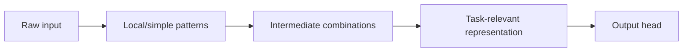
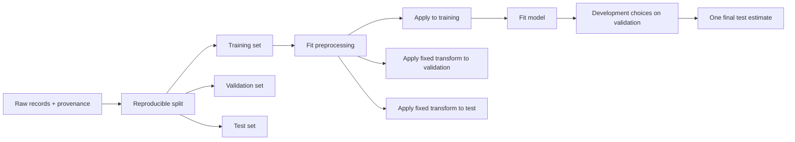
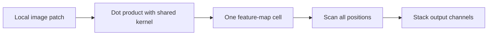
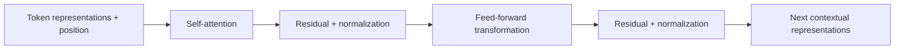
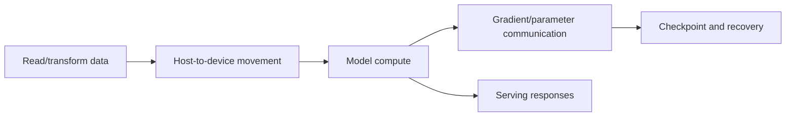

# Day 3 Student Guide: Scale It

## From Neural Networks to Modern Deep Learning

**Big question:** How do the fundamentals become the systems used in modern AI?  
**Tangible outcome:** Build a valid compact image workflow, expose a generalization failure, and compare scratch learning with reused pretrained representations.  
**Core memory:** **A stronger architecture cannot rescue invalid evidence.**

Day 2 made one small model train and turned failures into evidence. Day 3 adds depth, image structure, data provenance, generalization, reusable representations, and systems constraints. The fundamentals remain visible: inputs, parameters, activations, loss, gradients, updates, and evaluation.

Use the shared [glossary](../../shared/glossary.md), [notation and style contract](../../shared/notation-and-style.md), and [environment guide](../../shared/environment.md). Keep examples batch-first. For images, PyTorch uses `(B, C, H, W)`: batch, channel, height, width.

## Day 3 Objectives

| ID | Observable outcome |
|---|---|
| `OBJ-D3-01` | Compare depth, width, capacity, parameter count, feature reuse, and optimization risk without assuming deeper is better. |
| `OBJ-D3-02` | Construct reproducible train/validation/test handling with training-only learned preprocessing and identify leakage. |
| `OBJ-D3-03` | Explain CNN locality, kernels, stride, padding, channels, maps, pooling, sharing, receptive fields, and heads; inspect a compact classifier. |
| `OBJ-D3-04` | Use aligned curves to distinguish underfitting, overfitting, and unstable optimization. |
| `OBJ-D3-05` | Choose one regularization, early-stopping, augmentation, data, or capacity intervention and evaluate before/after evidence. |
| `OBJ-D3-06` | Compare scratch training, frozen feature extraction, and fine-tuning using quality, time, trainable parameters, and domain match. |
| `OBJ-D3-07` | Describe attention, Transformer structure, pretraining, fine-tuning, and foundation models conceptually while stating interpretation limits. |
| `OBJ-D3-08` | Explain memory, throughput, communication, checkpointing, utilization, latency, reliability, and pipeline constraints at scale. |

## Schedule: Exactly 450 Elapsed Minutes

| Time | Min | Core sequence |
|---|---:|---|
| 09:00-09:15 | 15 | `LESSON-D3-01`, `ACT-D3-01`: Day 2 retrieval, depth, capacity, feature ladder |
| 09:15-09:35 | 20 | `LESSON-D3-02`: splits, transformations, imbalance, leakage |
| 09:35-10:20 | 45 | `LAB-D3-01`, `ACT-D3-02`: find the data leak |
| 10:20-10:35 | 15 | Protected break |
| 10:35-11:00 | 25 | `LESSON-D3-03`, `ACT-D3-03`: CNN mechanics and kernel prediction |
| 11:00-12:00 | 60 | `LAB-D3-02`: compact CNN and feature maps |
| 12:00-12:10 | 10 | `CHECK-D3-01` |
| 12:10-13:10 | 60 | Protected lunch |
| 13:10-13:25 | 15 | `LESSON-D3-04`, `LESSON-D3-05`: training evidence and generalization |
| 13:25-14:20 | 55 | `LAB-D3-03`: make it overfit, then rescue it |
| 14:20-14:35 | 15 | Protected break |
| 14:35-14:50 | 15 | `LESSON-D3-06`: transfer strategy and domain match |
| 14:50-15:45 | 55 | `LAB-D3-04`: transfer-learning race |
| 15:45-16:05 | 20 | `LESSON-D3-07`, `LESSON-D3-08`, `ACT-D3-04`: bounded attention and scale bridge |
| 16:05-16:20 | 15 | `CHECK-D3-02` through `CHECK-D3-04`: one five-minute minimum live response each |
| 16:20-16:30 | 10 | Protected recovery, questions, and close |

Total: `15+20+45+15+25+60+10+60+15+55+15+15+55+20+15+10 = 450` minutes.

## Scope Boundaries

| Label | Day 3 treatment |
|---|---|
| `CORE` | valid data pipeline, compact CNN, overfit/rescue comparison, frozen-feature transfer baseline, conceptual attention, systems trade-offs |
| `SHORTEN` | initialization catalogue, optimizer/scheduler survey, detailed receptive-field arithmetic, additional training-knob examples |
| `OPTIONAL` | partial unfreezing after the frozen baseline; **full fine-tuning is outside the core path** |
| `MOVE` | attention equations, Transformer implementation, distributed-training algorithms, mixed-precision implementation, model parallelism |

Do not spend protected breaks, lunch, or buffer on `OPTIONAL` or `MOVE` material.

---

# LESSON-D3-01 - Depth, Capacity, and Feature Reuse

**Time:** 15 minutes  
**Objective:** `OBJ-D3-01`  
**Learning outcome:** Explain what depth can add, what it costs, and which evidence distinguishes implementation/optimization failure from representation or data limitation.

## Opening Retrieval: Use the Day 2 Evidence Board

Open two artifacts without editing them first:

1. your `ACT-D2-04` evidence board;
2. your `CHECK-D2-04` Part C response.

Place the leading explanation from each artifact in this table:

| Category | Example evidence from Day 2 | What would disconfirm it? |
|---|---|---|
| implementation | missing reset, wrong mode, detached/frozen path, output/loss mismatch | violated code/state invariant is actually correct |
| optimization | update size, gradient flow, activation saturation, unstable path | optimization evidence is healthy under a controlled check |
| representation | effectively linear path or insufficient useful feature hierarchy | same valid pipeline and training produce the needed boundary/features |
| data/evaluation | weak signal, mismatch, leakage, invalid validation | provenance and clean held-out behavior support validity |

**Retrieval question:** If both training and validation remain near chance, why is "add layers" not yet a diagnosis?

## Intuitive Model: A Feature Ladder

A deep network can reuse intermediate representations:



Depth can make a useful hierarchy possible. Width gives a layer more channels or units in which to represent alternatives. **Capacity** describes the flexibility of the function family, not an automatic quality score.

The price can include:

- more parameters or operations;
- harder optimization and weak/exploding gradient flow;
- more opportunity to fit accidental training details;
- more memory and latency;
- greater need for valid data and controlled evaluation.

## Worked comparison

Suppose model S reaches train/validation accuracy `0.82/0.80`. Model D reaches `0.99/0.73` under the same valid split and run budget.

- Model D has demonstrated training fit, not superiority.
- The evidence is consistent with overfitting, but pipeline and run details still matter.
- More representational possibility did not guarantee better held-out behavior.

## ACT-D3-01 Launch

Complete [ACT-D3-01 - Feature Ladder Under a Budget](../challenges/day-3-challenges.md#act-d3-01---feature-ladder-under-a-budget).

**Commit:** layer placements, one depth risk, one budget choice, and disconfirming evidence.  
**Reveal:** plausible layer roles, not a universal dictionary of features.  
**Return with:** a corrected "can encode" statement.

**Misconception:** "A deeper model contains a shallow one, so it must perform at least as well."  
**Correction:** representational possibility, successful optimization, and valid generalization are separate claims.

**Modern connection:** Reusable backbones and foundation models depend on learned representations, but scale adds data, objective, infrastructure, and evaluation decisions. This small feature ladder is a mental model, not a claim that every hidden channel maps to a named human concept.

**Takeaway:** Depth can enable feature reuse; evidence decides whether the additional capacity was optimized and generalized.

**Transition:** Before choosing a stronger model, establish whether the evidence pipeline is valid.

---

# LESSON-D3-02 - Real-World Data Pipelines and Leakage

**Time:** 20 minutes before the lab  
**Objective:** `OBJ-D3-02`  
**Learning outcome:** Define a chain of custody for examples, fitted statistics, transformations, and development decisions.

## A pipeline is part of the model claim

A validation score is evidence only if validation stayed outside the fitting decisions that produced the model.



**Observe:** only training fits preprocessing state and parameters.  
**Do not infer:** this order guarantees representative data, correct labels, or deployment stability.

## Stateful versus stateless operations

| Operation | Learns state? | Valid ownership |
|---|---:|---|
| subtract a supplied constant | no | apply consistently as declared |
| estimate mean/std for scaling | yes | fit on training only |
| learn vocabulary/category mapping from observed data | yes | fit on training only unless fixed externally |
| random training augmentation | samples randomness | training only; validation/test use fixed evaluation transform |
| resize by a fixed rule | no learned state | apply consistently under the model contract |

## Splits and loaders

- **Training:** fits parameters and learned preprocessing.
- **Validation:** compares development choices; it can influence choices but not fit parameters/statistics directly.
- **Test:** limited final estimate after choices are fixed.
- **Stratification:** helps preserve class proportions; it does not prevent future-feature or entity leakage.
- **Shuffling:** changes order, not provenance.
- **DataLoader:** batches and optionally shuffles examples; it does not make a split valid by itself.

## Augmentation and normalization

Training augmentation creates plausible input variations to test whether the same label should survive a transformation. It belongs only on the training path. Validation/test should use a fixed evaluation transform so comparisons are stable.

Normalization learned from data must use training statistics. The same fitted transformation is then applied to validation/test. **Fitting on validation is leakage; applying a training-fitted transform is not.**

## Class imbalance

Stratification can preserve proportions, but accuracy may still hide a weak minority class. Day 4 develops consequence-aware metrics. Today, record class counts and inspect per-class behavior when a score looks implausible.

## Current torchvision dataset contract

FashionMNIST and CIFAR10 constructors use `root`, `train`, `transform`, and `download` (plus optional target transforms). Download must be an explicit, cache-aware choice:

```python
allow_download = False  # Change only after the cache/network preflight.

dataset = FashionMNIST(
    root=data_root,
    train=True,
    transform=train_transform,
    download=allow_download,
)
```

If data are already present under `root`, torchvision reuses them. Do not turn `download=True` into an unconditional setup step.

## Prediction before the lab

A simple model reports validation AUC near `1.0`. Rank these explanations before seeing code:

- genuinely strong signal;
- post-outcome feature;
- duplicate/entity contamination;
- preprocessing fitted before splitting;
- evaluation bug.

For the top two, request one discriminating evidence item.

## LAB-D3-01 - Find the Data Leak

**Notebook:** [LAB-D3-01-find-data-leak.ipynb](../labs/LAB-D3-01-find-data-leak.ipynb)  
**Time:** 45 minutes  
**Objectives:** `OBJ-D3-02`, reinforcement of `OBJ-D2-08`  
**Why this lab exists:** It makes a lower but valid score preferable to a near-perfect contaminated score.

### Before launch

1. Open [ACT-D3-02 - Leakage Accusation](../challenges/day-3-challenges.md#act-d3-02---leakage-accusation-chain-of-custody).
2. Preserve the metric-only prediction.
3. Request provenance before code.
4. Submit two hypotheses and one check before the source reveal.

### Experiment and observe

- inspect feature availability and creation time;
- identify a post-outcome target proxy;
- identify preprocessing fitted before the split;
- create reproducible stratified splits;
- fit transformations on training only;
- compare leaky and repaired evidence under the same simple model;
- inspect class proportions and loader shapes.

### Diagnose

For each leak, state:

1. what information crossed a decision boundary;
2. when it became available;
3. which score it contaminated;
4. which repair restores the intended ownership;
5. which validity question remains unanswered.

## LAB-D3-01 Debrief - A Lower Honest Score

- Why is the repaired score an evidence improvement even if it is lower?
- Why does training-only fit differ from applying the fitted transform to validation?
- Which feature would be unavailable at deployment time?
- What could still invalidate the repaired result: duplicates, shift, labels, or another proxy?

**Misconception:** "We dropped the target, so leakage is impossible."  
**Correction:** audit feature availability time, construction, entity overlap, and fitted-state ownership.

**Takeaway:** Data provenance and split boundaries determine whether a metric can support a model claim.

**Transition:** With valid evidence, architecture choices become interpretable. Images now supply a useful structural prior: locality.

---

# LESSON-D3-03 - CNN Mechanics: Locality and Shared Detectors

**Time:** 25 minutes  
**Objective:** `OBJ-D3-03`  
**Learning outcome:** Trace a convolutional shape path and explain why local connectivity and shared parameters suit images.

## Why not flatten immediately?

Flattening a `28 x 28` image into `784` unrelated positions discards the explicit neighborhood structure. A dense layer can learn spatial relationships, but every location can receive separate weights. A convolution adds a useful bias: nearby pixels interact through a small detector reused across space.

## The stencil mental model

A kernel slides over local patches. At each location it forms a weighted sum. One kernel produces one feature map; many learned kernels produce many output channels.



The hand-designed edge kernel is a teaching example. Learned filters are optimized from data and should not be assigned semantic names without tests.

## Terms and roles

| Term | Working meaning | Misconception boundary |
|---|---|---|
| kernel/filter | learned local weight pattern | not a separate kernel per location |
| feature map | spatial responses from one output channel | brightness is not a full prediction explanation |
| channel | one input or output feature plane | not the same as batch |
| stride | movement between kernel positions | larger stride reduces spatial sampling |
| padding | values added around the boundary | it changes output shape and edge context |
| pooling | fixed/local summary that reduces spatial size | not mandatory in every CNN |
| receptive field | input region that can influence a unit | grows through composed operations |
| head | final task-specific mapping from features to logits | not the pretrained representation itself |

## Worked shape example

For one spatial dimension:

$$
H_{out}=\left\lfloor\frac{H_{in}+2P-K}{S}\right\rfloor+1
$$

For input height `28`, kernel `3`, padding `1`, stride `1`:

$$
H_{out}=\left\lfloor\frac{28+2-3}{1}\right\rfloor+1=28
$$

Then `2 x 2` pooling with stride `2` reduces `28` to `14`. Track channels separately from spatial dimensions.

## ACT-D3-03 Launch

Complete [ACT-D3-03 - Kernel Reveal and Shape Trace](../challenges/day-3-challenges.md#act-d3-03---kernel-reveal-and-shape-trace).

**Commit:** output shape, one cell, sign pattern, and full CNN shape trace.  
**Reveal:** one patch calculation, then the full map.  
**Return with:** locality, sharing, and one interpretation limit.

## LAB-D3-02 - Compact CNN and Feature Maps

**Notebook:** [LAB-D3-02-cnn-feature-maps.ipynb](../labs/LAB-D3-02-cnn-feature-maps.ipynb)  
**Time:** 60 minutes  
**Objectives:** `OBJ-D3-01`, `OBJ-D3-03`  
**Why this lab exists:** It connects every image dimension and selected activation map to a trained classifier without treating internal brightness as a complete explanation.

### Before launch

- confirm whether Fashion-MNIST is cached before enabling download;
- predict every `(B, C, H, W)` shape;
- predict an edge-like response before training;
- state which early versus late map properties you expect;
- preserve the validation transform without training augmentation.

### Experiment and observe

- repair a deliberate flattened-dimension or channel-order mismatch using printed shapes;
- define and train a bounded two-block compact CNN;
- record training loss and validation accuracy;
- capture selected early and later activations;
- compare retained spatial detail and selectivity;
- inspect misclassified examples with true/predicted labels;
- remove temporary activation hooks after capture.

### Checkpoint

Before training, independently verify:

```text
(B, 1, 28, 28)
-> (B, 8, 28, 28)
-> (B, 8, 14, 14)
-> (B, 16, 14, 14)
-> (B, 16, 7, 7)
-> (B, 784)
```

## LAB-D3-02 Debrief - Maps Are Evidence, Not Verdicts

- What did parameter sharing buy relative to independent location weights?
- Which early maps retained spatial detail?
- Which later maps were more selective, and for which inspected inputs?
- Which statement is descriptive, and which would require an intervention?
- What do the most confident mistakes suggest without yet proving a cause?

Complete [CHECK-D3-01 - CNN Shape and Feature Evidence](../assessments/day-3-checks.md#check-d3-01---cnn-shape-and-feature-evidence) before lunch.

**Misconception:** "The brightest map explains the prediction."  
**Correction:** a map describes one internal response. Test its role by intervening on inputs or activations and account for later paths.

**Takeaway:** CNNs encode locality and parameter sharing; shape traces and controlled probes make their mechanics inspectable.

**Transition:** A model can train correctly and still fail on unseen examples. Curves separate fit from generalization.

---

# LESSON-D3-04 - Training Deep Networks: Read the Evidence

**Time:** shared 15-minute block with `LESSON-D3-05`  
**Objective:** `OBJ-D3-04`  
**Learning outcome:** Use aligned training/validation evidence to distinguish fit, generalization, and unstable optimization hypotheses.

## Learning curves are vital signs, not fingerprints

| Pattern | Training evidence | Validation evidence | Competing explanation to keep alive |
|---|---|---|---|
| underfitting | poor/plateaued | poor/plateaued | optimization or weak signal |
| overfitting | continues improving | stalls or worsens | split/mode/shift problem |
| unstable optimization | loss spikes or becomes non-finite | often unstable too | invalid inputs/objective or stochastic noise |
| healthy bounded run | both improve, then plateau | remains near training behavior | metric may still hide slices |

Keep axes, epoch budget, split, and evaluation cadence aligned. Smoothed curves can hide spikes.

## Training knobs are hypotheses

- **Learning rate:** changes update scale.
- **Batch size:** changes examples per update and resource behavior; it does not have one universal effect.
- **Epochs:** extend optimization opportunity and overfitting opportunity.
- **Initialization/normalization:** can affect activation and gradient flow.
- **Optimizer/schedule:** changes update dynamics.
- **Gradient clipping:** bounds selected gradient norms; it does not diagnose the cause.

`SHORTEN`: optimizer catalogue and scheduler mechanics. Preserve curve diagnosis and one controlled prediction.

### Predict before the run

For each change, state training and validation predictions separately:

- train 10 times longer on `320` examples;
- remove normalization;
- increase learning rate by `10x`;
- double batch size under a fixed epoch budget.

There may be several outcomes. State the mechanism and requested evidence rather than a universal rule.

**Misconception:** "Noisy loss means the learning rate is too high."  
**Correction:** request raw loss, update/gradient norms, batch size, and input validity before naming the cause.

**Transition:** Once the evidence indicates a generalization problem, choose a remedy whose mechanism predicts a visible before/after change.

---

# LESSON-D3-05 - Overfitting, Rescue, and Generalization

**Time:** shared 15-minute block plus 55-minute lab  
**Objectives:** `OBJ-D3-04`, `OBJ-D3-05`  
**Learning outcome:** Deliberately create a generalization gap, then test exactly one justified rescue.

## Generalization is the target

The **generalization gap** compares training and held-out behavior. A gap can be informative, but minimizing the gap alone is not the objective. A model with train/validation accuracy `0.52/0.51` has a small gap and poor performance.

## Remedy mechanisms

| Intervention | Hypothesis about unseen behavior | Evidence to inspect |
|---|---|---|
| more representative data | reduce reliance on idiosyncratic examples | validation and slice behavior under same model |
| data augmentation | enforce invariance to plausible transformations | train/validation curves; label validity |
| weight decay | discourage large parameter magnitudes under the optimizer rule | validation and parameter/update behavior |
| dropout | prevent brittle co-adaptation during training | train versus evaluation behavior, validation trend |
| smaller architecture | reduce capacity and resource use | absolute validation, not gap alone |
| early stopping | restore the checkpoint before validation deterioration | best checkpoint versus final checkpoint |

Regularization can hurt. A failed, controlled intervention is still useful evidence.

## LAB-D3-03 - Make It Overfit, Then Rescue It

**Notebook:** [LAB-D3-03-overfit-and-rescue.ipynb](../labs/LAB-D3-03-overfit-and-rescue.ipynb)  
**Time:** 55 minutes  
**Objectives:** `OBJ-D3-04`, `OBJ-D3-05`, reinforcement of `OBJ-D3-01`  
**Why this lab exists:** Creating the failure makes the train/validation signature memorable and gives every rescue a visible mechanism test.

### Predict before launch

1. Sketch training and validation curves for a high-capacity model on a tiny training subset.
2. Mark the expected onset of overfitting.
3. Choose exactly one rescue.
4. State how both training and validation curves should change if the hypothesis is right.
5. State a result that would reject the hypothesis.

### Experiment and observe

- run the high-capacity/tiny-data baseline;
- calculate the generalization gap and identify the best validation epoch;
- keep the seed, split, axes, and major run budget matched;
- apply one intervention only;
- overlay baseline and intervention curves;
- distinguish validation gain from training collapse;
- restore the best checkpoint when using early stopping.

### Core constraint

Do not combine all remedies. One major intervention preserves attribution. A rescue that fails to improve the score remains acceptable when the prediction, control, and interpretation are sound.

## LAB-D3-03 Debrief - Did the Rescue Test the Hypothesis?

- Which two observations establish the baseline failure?
- Did the intervention change the curve in the predicted direction?
- Did validation improve, or did training simply collapse?
- What competing explanation remains?
- What one next experiment would separate it?

Complete [CHECK-D3-03 - Diagnose and Rescue Generalization](../assessments/day-3-checks.md#check-d3-03---diagnose-and-rescue-generalization) during the exit block.

**Misconception:** "Dropout, weight decay, or augmentation always improves validation."  
**Correction:** every remedy is conditional on data, model, strength, and mechanism. Decide from matched evidence.

**Takeaway:** A rescue is an experiment about unseen behavior, not a ritual list of knobs.

**Transition:** Instead of learning every visual feature from the small target dataset, the next experiment reuses a representation learned elsewhere.

---

# LESSON-D3-06 - Transfer Learning Is Representation Reuse

**Time:** 15 minutes before the lab  
**Objective:** `OBJ-D3-06`  
**Learning outcome:** Choose among scratch training, frozen feature extraction, and fine-tuning based on data, domain, budget, and resource evidence.

## Three strategies

| Strategy | Trainable portion | Best reason to try | Main risk |
|---|---|---|---|
| scratch | all parameters start task-specific | enough representative data or severe domain mismatch | slow/weak learning under limited data |
| frozen feature extraction | new head; backbone fixed | limited data/time and useful source representation | representation mismatch; backbone inference cost |
| partial/full fine-tuning | selected or all pretrained parameters | stable baseline plus evidence that adaptation is needed | more compute, overfitting, catastrophic change |

**Transfer does not reuse answers.** A pretrained backbone supplies transformations that may be useful for the target task. A new head maps those features to new labels.

## Current torchvision MobileNet V3 Small contract

```python
from torchvision.models import mobilenet_v3_small, MobileNet_V3_Small_Weights

weights = MobileNet_V3_Small_Weights.DEFAULT
model = mobilenet_v3_small(weights=weights)
preprocess = weights.transforms()
```

As of the 2026-08-16 source check, `DEFAULT` aliases `IMAGENET1K_V1`. Aliases may change across torchvision versions. Record the resolved enum identity for reproducible artifacts. Use the weight object's `transforms()` contract rather than manually copying normalization constants. Do not use deprecated `pretrained=True`.

Downloading weights must be preflighted and cache-aware. A cached weight file or supplied precomputed embedding path is the core recovery route when network access is unavailable.

## A fair transfer comparison

Hold these constant where possible:

- training/validation/test split;
- target labels and sample count;
- comparison budget and stopping rule;
- evaluation metric;
- preprocessing contract appropriate to each model;
- timing method and device record.

Compare **pretrained/frozen** with **random/frozen** to isolate pretraining from freezing. A frozen random backbone is not transfer learning.

## Prediction before the race

Predict scratch versus frozen pretrained features for a small CIFAR10 subset. Include:

- validation quality;
- extraction/training time;
- trainable and total parameters;
- inference resource cost;
- one domain-mismatch warning.

## LAB-D3-04 - Transfer-Learning Race

**Notebook:** [LAB-D3-04-transfer-learning-race.ipynb](../labs/LAB-D3-04-transfer-learning-race.ipynb)  
**Time:** 55 minutes  
**Objectives:** `OBJ-D3-06`, reinforcement of `OBJ-D3-01`, `OBJ-D3-05`, `OBJ-D3-08`  
**Why this lab exists:** It tests whether representation reuse helps under this limited-data/time budget while making quality and resource trade-offs visible.

### Preflight

- confirm CIFAR10 cache before enabling `download`;
- confirm MobileNet weights cache before any network attempt;
- otherwise use the supplied precomputed embeddings/evidence route;
- record weight identity, transform contract, split identity, device, and cache status.

### Experiment and observe

- run the compact scratch baseline;
- construct MobileNet V3 Small with an explicit weight enum contract;
- freeze and verify the backbone, replace the head, and count trainable/total parameters;
- use `weights.transforms()` or the notebook's equivalent weight-bound contract;
- extract/cache features and train the head;
- compare validation quality, time, sample efficiency, and parameters;
- diagnose the random-frozen or wrong-transform variant if assigned.

### Scoreboard

| Evidence | Scratch | Frozen pretrained | What it can support |
|---|---:|---:|---|
| validation metric |  |  | held-out quality under this split |
| first extraction/training time |  |  | classroom workload timing only |
| cached rerun time |  |  | value of embedding reuse |
| trainable parameters |  |  | optimization burden |
| total parameters |  |  | model footprint, not peak memory alone |
| transform/weight identity |  |  | reproducibility and preprocessing validity |

## LAB-D3-04 Debrief - The Winner Is Conditional

- What representation was transferred?
- Which comparison isolates pretraining from freezing?
- Did the transforms match the selected weights?
- Did the race winner also win on trainable parameters and wall time?
- Could a larger pretrained backbone lose under serving latency or memory constraints?
- What evidence would justify partial unfreezing next?

**Misconception:** "Pretrained transfer always wins."  
**Correction:** benefit depends on source/target match, data, transforms, budget, and evaluation. Measure rather than promise.

**Scope:** frozen feature extraction is `CORE`; partial unfreezing is `OPTIONAL`; **full fine-tuning is outside the core path**.

**Takeaway:** Transfer is a conditional representation-reuse strategy, not a universal shortcut.

**Transition:** Modern language models also reuse pretrained representations, but their context mechanism is attention rather than a spatial convolution alone.

---

# LESSON-D3-07 - Attention, Transformers, and Foundation Models

**Time:** shared 20-minute bridge with `LESSON-D3-08`  
**Objective:** `OBJ-D3-07`  
**Learning outcome:** Explain attention as context-dependent relevance and place it within a conceptual Transformer/pretraining path without using attention as a complete causal explanation.

## Intuition before terminology

In the sentence "The dog chased the ball because it was rolling," the representation for **it** should combine context. Which tokens matter depends on the focus token and the learned task.

- A **query** expresses what the current representation seeks.
- A **key** expresses how each available representation can be matched.
- A **value** carries content to be mixed.
- **Self-attention** uses tokens from the same sequence as the contextual source.
- **Positional information** helps distinguish order.

No attention equations are required in the core path. `MOVE`: score/softmax equations, multi-head implementation, and complexity derivations.

## Conceptual Transformer block



Blocks still contain parameters, activations, loss, backpropagation, and optimizer updates. Pretraining learns broadly reusable representations from a large objective; task adaptation or prompting uses that capability in a new context. A **foundation model** is a broadly pretrained model adapted or used across downstream tasks. This course does not implement one.

## ACT-D3-04 Launch

Complete [ACT-D3-04 - Token Relevance, Missing Paths, and Scale](../challenges/day-3-challenges.md#act-d3-04---token-relevance-missing-paths-and-scale).

**Commit:** token relationships, Q/K/V roles, and an order prediction.  
**Reveal:** an illustrative token map, not a model-specific measurement.  
**Return with:** at least three omitted routes and a limitation sentence.

## Interpretation limit

Attention weights show one learned mixture pattern. Attention weights are not a complete causal explanation of a final prediction. Values, other heads/layers, residual paths, later transformations, and alternative patterns remain. A causal claim needs an intervention and broader evidence.

**Misconception:** "The largest attention weight tells us why the model answered."  
**Correction:** identify the exact operation it describes and list the omitted computational routes.

**Takeaway:** Attention builds context-dependent mixtures; it remains one component inside a larger trained system.

**Transition:** Larger models do not remove the fundamentals. They make resource movement, reliability, and serving constraints first-class.

---

# LESSON-D3-08 - Scale Changes the Engineering Problem

**Time:** shared 20-minute bridge with `LESSON-D3-07`  
**Objective:** `OBJ-D3-08`  
**Learning outcome:** Separate memory, throughput, latency, utilization, communication, reliability, and data-pipeline claims.

## The bottleneck can move



- **Memory:** limits parameters, activations, optimizer state, and batch size.
- **Throughput:** work completed per unit time, often under batching/concurrency.
- **Latency:** time for one request or operation, including waiting and overhead.
- **Utilization:** how much of a resource is productively busy; device availability does not prove it.
- **Communication:** moving gradients/parameters/data can become a bottleneck.
- **Checkpointing:** saves recoverable state but adds storage and I/O cost.
- **Reliability:** failures become likely enough to plan for at longer durations and larger fleets.
- **Data pipeline:** accelerators can wait while input work is late.

A GPU does not automatically improve utilization or latency. Small operations, tiny batches, data waits, transfers, synchronization, or memory pressure can dominate. Measure an end-to-end declared workload.

## Resource trade-off

Return to the A/B table in `ACT-D3-04`. Identify:

1. which configuration serves a strict batch-1 latency target;
2. which serves an offline throughput target under memory limit;
3. which missing measure could reverse the decision.

`MOVE`: distributed algorithms, collective communication implementation, model/data parallel code, mixed precision, and quantization. They remain reference depth for later study, not Day 3 implementation outcomes.

**Misconception:** "More accelerators make training proportionally faster."  
**Correction:** added compute also adds communication, coordination, input, and reliability costs; speedup must be measured.

**Modern connection:** Current large training and serving systems manage quality together with memory, throughput, latency, recovery, and cost. The classroom charts expose the decision dimensions without claiming production-scale equivalence.

**Takeaway:** Scale turns model computation into a systems bottleneck hunt.

---

# End-of-Day Checks and Day 4 Bridge

Complete:

- [CHECK-D3-02 - Repair a Leaked Pipeline](../assessments/day-3-checks.md#check-d3-02---repair-a-leaked-pipeline)
- [CHECK-D3-03 - Diagnose and Rescue Generalization](../assessments/day-3-checks.md#check-d3-03---diagnose-and-rescue-generalization)
- [CHECK-D3-04 - Transfer, Attention, and Scale Decision](../assessments/day-3-checks.md#check-d3-04---transfer-attention-and-scale-decision)

Use the final 15-minute assessment block: spend exactly five minutes on each minimum live response and submit each to **Day 3 Checks** before moving on. Spend five additional minutes total on the clearly marked consolidation additions; they are due before Day 4 at **09:00** and must be appended in the same thread without replacing the live responses. At Day 4 opening, retrieve your original response and consolidation before reviewing sample evidence chains.

## Day 3 Takeaways

1. Depth can enable reusable feature hierarchies, but deeper does not automatically mean better.
2. Validation evidence is trustworthy only when provenance, split, and fitted-state ownership are valid.
3. CNNs reuse local detectors across space and produce inspectable channel/spatial shape traces.
4. Learning curves support hypotheses; they rarely identify one cause alone.
5. A regularization or data remedy is one controlled experiment about unseen behavior.
6. Pretrained transfer is conditional on domain, transforms, data, budget, and resources.
7. Attention weights are not complete causal explanations.
8. Scale adds memory, throughput, latency, communication, checkpointing, reliability, and pipeline constraints.

## Bridge to Day 4

Day 3 made a workflow more modern and more complex. Day 4 asks the engineering question that follows:

> The model trained successfully, but is it actually good, and what should change next?

Bring one Day 3 evidence chain in this form:

> **Claim -> evidence -> limitation -> highest-information next experiment**

## Optional and Moved Reference Route

This section is not part of the live core.

- `OPTIONAL`: unfreeze one final backbone block only after a valid frozen-feature baseline; lower the adaptation learning rate and compare under the same split. Full fine-tuning remains outside core.
- `SHORTEN`: initialization families, optimizer/scheduler catalogue, extra augmentation variants, and detailed receptive-field arithmetic.
- `MOVE`: attention equations and implementation, distributed-training algorithms, mixed precision, model parallelism, quantization, and deep interpretability methods.
- Any extension still requires a pre-run prediction, valid comparison, resource record, and explanation of what the evidence cannot establish.