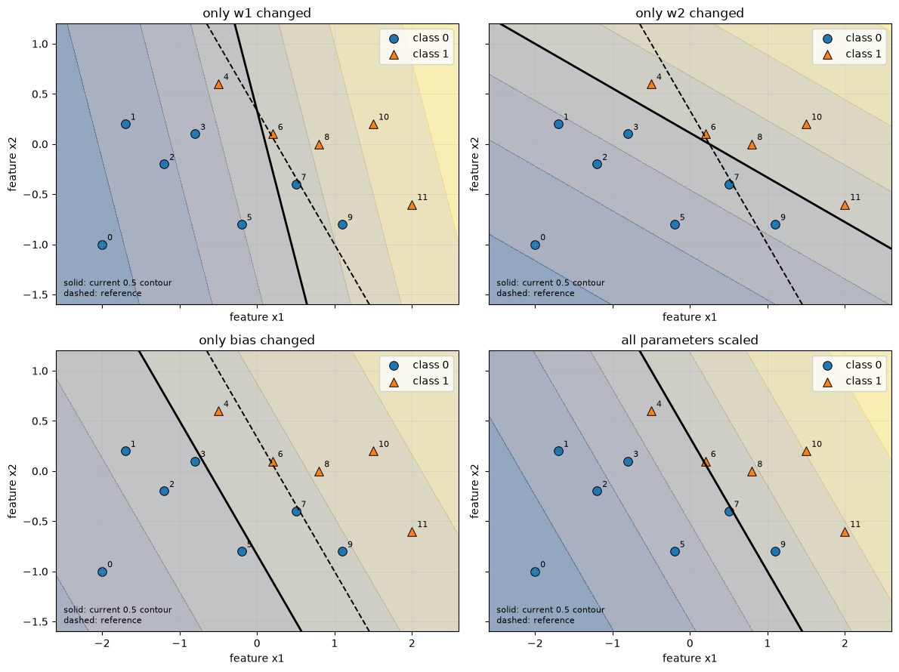
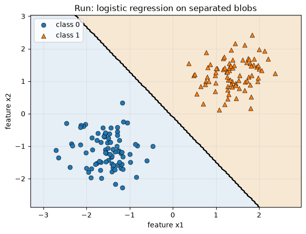
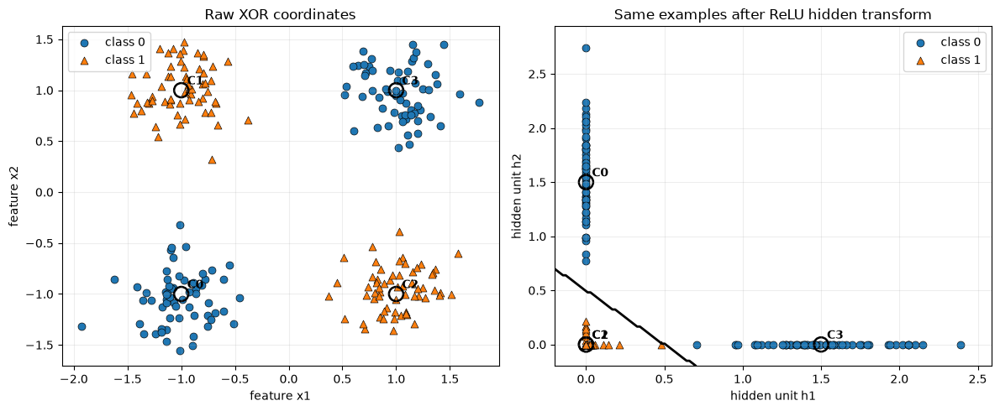
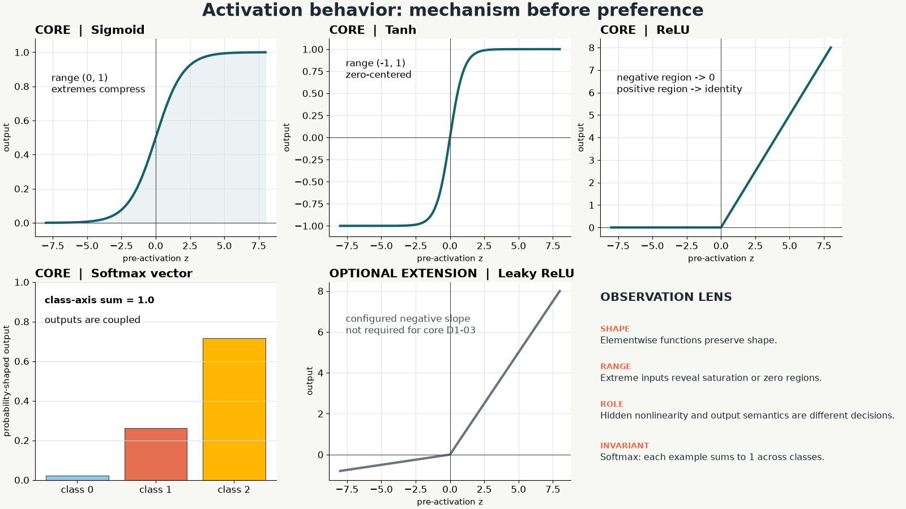
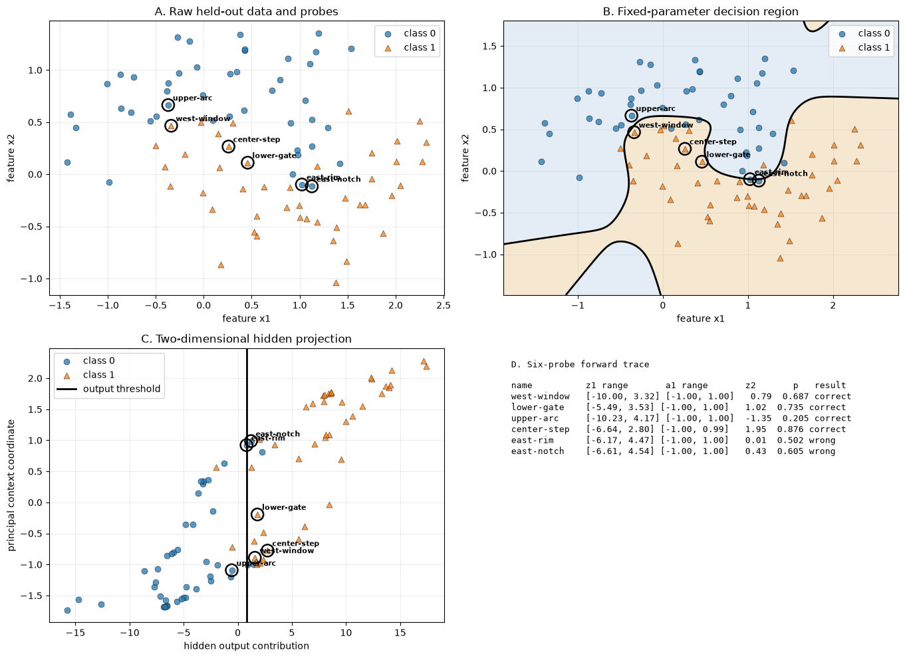

<!-- This editable source contains instructor speaker notes. Export participant decks without notes. -->

# 01 | Day 1: See It

## How can simple operations produce intelligent-looking behavior?

**Retrieve:** In one sentence, what do you currently think a neural network does?

<!--
Speaker notes: Give 45 silent seconds. Save responses; revisit on slide 31. Do not correct vocabulary yet.
Visual direction: Full-width question with a small blank trace line: input -> ? -> output. No decorative AI imagery.
Alt text: The Day 1 question above an incomplete input-to-output path.
-->

---

# 02 | Today's Investigation

**Choose it -> Move it -> Break its limit -> Transform it -> Trace it**

| Morning | Afternoon |
|---|---|
| model choice | layers and shapes |
| one-neuron geometry | activation behavior |
| linear success and XOR | forward network mystery |

**Outcome:** Explain one correct and one incorrect prediction from evidence.

<!--
Speaker notes: Preview four labs and protected breaks without reading the full timetable. Emphasize fixed parameters; training begins Day 2.
Visual direction: One horizontal investigation path, with four lab markers and no dense prose.
Alt text: Day 1 progresses from model choice and one neuron to hidden transformations and a complete forward trace.
-->

---

# 03 | Neural Networks Are One Toolbox

**AI** -> **machine learning** -> **deep learning** -> **some generative AI**

**AI** -> rules / search / planning

**Machine learning** -> linear / tree / other models

**Deep learning** -> classify / forecast / detect

**Prompt:** Where would a simple baseline live?

<!--
Speaker notes: Treat this as orientation, not strict ontology. Expected: inside ML but outside deep learning for common linear/tree baselines.
Visual direction: Nested/toolbox flow, not a historical timeline.
Alt text: AI includes machine learning and other methods; machine learning includes deep learning and simpler model families; only some deep learning is generative.
-->

---

# 04 | Choose the First Experiment

**Case A:** 1,800 labeled rows, 10 named numeric features, transparent result needed tomorrow.

**Case B:** 50,000 labeled product images under varied lighting.

For each:

1. Choose the simplest credible first model family.
2. Name evidence that would make you change course.

<!--
Speaker notes: Expected A: linear/tree baseline; B: neural representation learning is a strong candidate, still with a baseline. Reject absolute claims that structured data never benefits from neural networks.
Visual direction: Two scenario columns with data thumbnails: a table and an image grid.
Alt text: A small named-feature table is contrasted with a large raw-image collection for model-choice discussion.
-->

---

# 05 | Training Is Not Inference

**Training:** examples + targets -> changed parameters

**Inference:** new inputs + fixed parameters -> outputs

**Today:** fixed parameters, forward evidence.  
**Tomorrow:** objective, sensitivity, updates.

<!--
Speaker notes: Ask whether evaluation is inference. Expected: evaluation uses inference outputs plus targets/metrics; it is not synonymous with inference.
Visual direction: Separate training and inference with parameter handoff between them.
Alt text: Training uses examples and targets to change parameters; inference uses fixed parameters and new inputs to produce outputs.
-->

---

# 06 | One Neuron, Three Stages

$$
z=w\cdot x+b \quad\longrightarrow\quad p=\sigma(z) \quad\longrightarrow\quad \hat y=\mathbb{1}[p\ge0.5]
$$

| Object | Meaning |
|---|---|
| `w` | evidence multipliers |
| `b` | adjustable offset |
| `z` | raw score / logit |
| `p` | probability-shaped output |

**Boundary:** $w\cdot x+b=0$

<!--
Speaker notes: Work x=(2,-1), w=(0.8,0.5), b=-0.2: z=0.9, p about 0.711, class 1. Keep score, output, and decision distinct.
Visual direction: Three synchronized boxes, with the boundary equation below the score box.
Alt text: A neuron computes an affine score, converts it with sigmoid, then applies a class threshold.
-->

---

# 07 | ACT-D1-01: Predict Boundary Motion

Before any slider moves, sketch three cases:

1. increase `w1` only;
2. increase `w2` only;
3. increase `b` only.

For each, predict:

**orientation | location | one probe probability**

Mark the claim you trust least.

<!--
Speaker notes: Hold the reveal. Give 3 minutes individual, 2 minutes pair defense. A weight is not a pure rotation knob; bias with fixed weights preserves orientation.
Visual direction: Three blank mini-grids with the same starting boundary and probe point.
Alt text: Three identical coordinate grids await predictions for isolated changes to two weights and one bias.
-->

---

<!-- _class: visual-split -->

# 08 | Boundary Motion Evidence

**Ghost = before | solid = after**

- **orientation:** contour normal
- **location:** contour position
- **output:** fixed probe `p`
- **decision:** finite labels

**Counterexample:** positive common scaling can keep the boundary while changing probabilities.

<!--
Speaker notes: Reveal bias translation and common scaling. Do not call sharper sigmoid values better calibration.
Visual direction: One contour panel with ghosted and solid lines plus a probability strip for a fixed probe.
Asset path: `courseware/shared/assets/day-1/boundary-motion-overlay.png`, generated from the validated `LAB-D1-01` solution.
Alt text: Old and new boundaries and a fixed probe separate changes in orientation, location, probability, and class decision.
-->

---

# 09 | LAB-D1-01 Launch

## One-Neuron Boundary Workshop | 40 min

**Commit:** predict each isolated parameter effect.  
**Build:** weighted sum, sigmoid, threshold, contour.  
**Observe:** shapes, probe probabilities, old/new boundaries.  
**Return:** one changed quantity + one invariant.

`courseware/day-1/labs/LAB-D1-01-neuron-boundary.ipynb`

<!--
Speaker notes: Pair roles: driver and evidence lead. Require one-variable comparisons. Checkpoint at minute 17: ghosted old/new contour.
Visual direction: Four-step lab strip with a small boundary thumbnail at Observe.
Alt text: Lab 1 moves from prediction through one-neuron implementation to boundary and probability evidence.
-->

---

# 10 | ACT-D1-02: Be the Neural Network

Start: `w1=1`, `w2=0`, `b=0`

**Constraint:** at most three one-parameter changes.

Before each change, record:

- which point(s) should change class;
- why the score sign should change;
- what remains fixed.

**Score reasoning, not speed.**

<!--
Speaker notes: Embedded in Lab 1. Full point table is in the challenge brief. One valid change is w2=0.5; do not reveal until attempts are recorded.
Visual direction: Parameter attempt ledger beside six fixed labeled points.
Alt text: Six fixed points and a three-row attempt ledger constrain manual parameter search.
-->

---

# 11 | LAB-D1-01 Debrief

Bring one contour and one probe trace.

1. Which parameter change affected location without orientation?
2. What changed even when sample accuracy did not?
3. Why is a workable setting not unique?
4. What would automate this search?

**Bridge:** an objective + a parameter-change rule.

<!--
Speaker notes: Expected location answer: bias with weights fixed. Automation bridge is intentionally incomplete; Day 2 supplies loss/gradients/update.
Visual direction: Annotated old/new contour plus attempt history, no final magic weights on screen.
Alt text: A boundary comparison and attempt ledger support the lab debrief questions.
-->

---

<!-- _class: visual-split -->

# 12 | A Linear Boundary Succeeds

**Prediction:** Can one line separate these two clusters?

**Reveal:** decision region -> boundary -> accuracy

**Ask:** What did the score add beyond the picture?

<!--
Speaker notes: Establish trust before showing XOR. Expected: aggregate accuracy summarizes sample decisions but does not show boundary geometry or near-boundary uncertainty.
Visual direction: Two separable clusters; hide score until the third reveal frame.
Asset path: `courseware/shared/assets/day-1/linear-success-boundary.png`, generated from the validated `LAB-D1-02` solution.
Alt text: Two clusters lie on opposite sides of a straight decision boundary.
-->

---

# 13 | XOR: Draw One Separating Line

| Corner | Target |
|---|---:|
| low, low | `0` |
| low, high | `1` |
| high, low | `1` |
| high, high | `0` |

**Commit:** Can more epochs change the *kind* of boundary?

<!--
Speaker notes: Every learner attempts a line. Expected: no single raw-space line works; more fitting can move one line, not bend it.
Visual direction: Four alternating corner clusters with a blank overlay for attempted lines.
Alt text: XOR places class 1 on two diagonal corners and class 0 on the other two, preventing separation by one line.
-->

---

<!-- _class: visual-split -->

# 14 | XOR in Hidden Coordinates

**Raw XOR** -> **hidden transform** -> **simple cut**

Same points. New coordinates.

**Caveat:** hidden axes are not automatically human concepts.

<!--
Speaker notes: Preserve point colors/identities across both plots. Contrast identity activation, which leaves the composed family affine.
Visual direction: Linked raw/hidden scatterplots with thin connectors for four anchor points.
Asset path: `courseware/shared/assets/day-1/xor-raw-hidden-linked.png`, generated from the validated `LAB-D1-02` solution.
Alt text: The same colored XOR points move to hidden coordinates where a straight output boundary can separate classes.
-->

---

# 15 | LAB-D1-02 Launch

## The Linear Limit | 45 min

Rank expected performance:

1. logistic model on separable blobs;
2. logistic model on XOR;
3. fixed nonlinear hidden transform;
4. same stack with identity activations.

`courseware/day-1/labs/LAB-D1-02-linear-limit.ipynb`

<!--
Speaker notes: Require rank before run. Reveal region before accuracy. Keep data/parameters aligned for identity versus nonlinear comparison.
Visual direction: Four face-down result cards connected to one prediction ranking column.
Alt text: Four model and dataset combinations await a pre-run performance ranking.
-->

---

# 16 | LAB-D1-02 Debrief

Use one raw/hidden-space comparison.

- Why did one neuron succeed first?
- Why did it fail on XOR?
- Did the output boundary become complex, or did the representation change?
- What evidence rejects "train longer"?

**Key distinction:** representation limit vs. optimization problem.

<!--
Speaker notes: Accept feature engineering as another representation change. Reject claims that nonlinear capacity guarantees useful parameters.
Visual direction: Side-by-side separable, XOR-linear, and XOR-hidden panels on aligned axes.
Alt text: A linear classifier succeeds on separable data, fails on raw XOR, and a nonlinear hidden representation enables separation.
-->

---

# 17 | Midday Checks

## CHECK-D1-01

**8 min:** choose a first model and complete both boundary scenarios, including evidence probes.

## CHECK-D1-02

**5 min:** make an unscored shape/parameter prediction for `5 -> 6 -> 3`.

**2 min:** submit D1-01 + a snapshot of the D1-02 commitment. Keep the working copy for revision after `LAB-D1-03`.

<!--
Speaker notes: Run the exact 8 + 5 + 2 allocation. Scenario B.4 stays inside the first 8 minutes. Collect through the cohort's Day 1 Checks participant submission channel; for paper delivery, collect D1-01 plus a snapshot of the D1-02 state and return the D1-02 working copy. Do not reveal CHECK-D1-02 answers until after LAB-D1-03.
Visual direction: Two ticket panels: model/boundary and shape/parameter.
Alt text: A scored model-and-boundary check sits beside an unscored shape prediction that will be revised after the afternoon lab.
-->

---

# 18 | A Layer Is a Shape Contract

**`X (B,d0)`**  
-> `W1 (d0,d1) + b1 (d1,)`  
**`A1 (B,d1)`**  
-> `W2 (d1,d2) + b2 (d2,)`  
**`logits (B,d2)`**

$$
X_{(B,d_{in})}W_{(d_{in},d_{out})}+b_{(d_{out},)}
$$

<!--
Speaker notes: Ask which dimensions contract and where bias broadcasts. Color B as data, not trainable state. Keep the canonical activity's numeric shapes unrevealed until slide 20.
Visual direction: Generic dimension tiles; batch token flows through while widths change.
Alt text: A generic batch-first dense network shows weight, bias, activation, and logit shape relationships.
-->

---

# 19 | ACT-D1-04: Shape Relay

Fill before code:

`X | W1 | b1 | Z1 | A1 | W2 | b2 | logits | probabilities`

Then:

1. count trainable parameters;
2. change only `B: 5 -> 32`;
3. mark every shape that changes;
4. name one shape-correct semantic error.

<!--
Speaker notes: Expected total 67. Only example-carrying first dimensions change. Wrong-axis softmax is the signature semantic error.
Visual direction: Relay table with colored dimension tokens and a parameter counter.
Alt text: Teams predict every array shape, parameter count, and the effect of changing only batch size.
-->

---

# 20 | Parameters Are Not Examples

$$
(4\times8+8)+(8\times3+3)=67
$$

| Output task | Final representation |
|---|---|
| regression | numeric output |
| binary class | one logit -> sigmoid |
| 3-way class | three logits -> softmax |

**Prompt:** Which choice changes if `B` changes?

<!--
Speaker notes: Expected: none of the output semantics or parameters; only the number of example rows. Keep multilabel nuance optional.
Visual direction: Parameter counter remains fixed while batch tiles expand.
Alt text: Dense-layer parameter count stays 67 as batch size changes; output design depends on task.
-->

---

# 21 | More Linear Layers Are Still Linear

$$
(XW_1+b_1)W_2+b_2
=X(W_1W_2)+(b_1W_2+b_2)
$$

**Identity activations:** one composed affine map.

**Question:** What must change to alter the representational family?

<!--
Speaker notes: Expected: add a nonlinear transformation, not merely more parameters or epochs.
Visual direction: Two layer boxes visually collapse into one equivalent affine box.
Alt text: Algebra shows two identity-activated dense layers combine into one affine transformation.
-->

---

<!-- _class: visual-split -->

# 22 | Activation Evidence

- **sigmoid:** `(0,1)`, saturates
- **tanh:** `(-1,1)`, saturates
- **ReLU:** negative -> `0`
- **softmax:** coupled class vector

**Optional:** Leaky ReLU keeps a negative slope.

<!--
Speaker notes: Do not make current prevalence claims. Pair function plots with actual pre/post values on aligned x axes.
Visual direction: Four core mathematically labeled small multiples; softmax shown as a vector transform rather than a scalar curve. Leaky ReLU may appear only as an optional extension.
Asset path: `courseware/shared/assets/day-1/activation-small-multiples.png`, generated from the validated `LAB-D1-03` solution.
Alt text: Sigmoid, tanh, and ReLU scalar plots plus a vector softmax panel expose ranges, saturation, and negative-input behavior; Leaky ReLU is labeled optional.
-->

---

# 23 | ACT-D1-03: Activation Card Sort

Match four core functions before labels appear:

**function | curve | behavior | layer role | failure symptom**

Then write an executable invariant for:

- sigmoid;
- ReLU;
- softmax.

Revise one match after the reveal and cite evidence.

**Optional:** add the Leaky ReLU card.

<!--
Speaker notes: Core matches are in the instructor guide. Use sigmoid, tanh, ReLU, and softmax for the required path. Offer Leaky ReLU only when time permits. Reward mechanism language. Ask why softmax outputs are coupled.
Visual direction: Four core function cards and shuffled behavior/role cards, plus a visually separate optional Leaky ReLU card; no answer alignment on prompt slide.
Alt text: Four core activation names and shuffled behavior cards await an evidence-based matching decision; Leaky ReLU is a separate optional card.
-->

---

# 24 | LAB-D1-03 Launch

## Shape and Activation Observatory | 40 min

Before each revealing cell, write:

**expected shape | expected range | invariant**

Watch for:

- saturation and zero regions;
- correct softmax row sums;
- wrong-axis output that still looks plausible.

`courseware/day-1/labs/LAB-D1-03-shapes-activations.ipynb`

<!--
Speaker notes: Learners now have the nonlinearity mechanism and activation-role distinctions needed for the lab. Checkpoint minute 31: row sums.
Visual direction: Three-column prediction ledger beside activation and softmax thumbnails.
Alt text: Lab 3 treats shape, range, and semantic invariants as pre-run hypotheses.
-->

---

# 25 | LAB-D1-03 Debrief

1. Why can wrong-axis softmax run?
2. Which invariant catches it?
3. What did extreme inputs do to sigmoid/tanh?
4. Does one zero ReLU output prove permanent failure?

**Necessary:** shape correctness  
**Not sufficient:** semantic correctness

<!--
Speaker notes: Expected invariant: each example's class-axis sum is 1. One zero does not establish a permanently dead unit.
Visual direction: Correct and wrong-axis probability matrices with row-sum strips.
Alt text: Two same-shaped softmax outputs differ because only one has per-example rows summing to one.
-->

---

# 26 | Forward Propagation Is a Trace

**X** -> **Z1** -> **A1** -> **logit Z2** -> **sigmoid P** -> **class**

At every arrow:

**shape? range? invariant? fixed parameter?**

<!--
Speaker notes: Reveal one named probe stage at a time. Contrast one example shapes with batch-first shapes. A trace explains this computation, not how parameters were learned.
Visual direction: Flight-data-recorder style stages with a shape/range slot under each.
Alt text: A forward pass records input, hidden pre-activation, hidden activation, output logit, probability, and class decision.
-->

---

# 27 | LAB-D1-04 Launch

## Build a Network That Thinks Forward | 60 min

**Before reveal:** choose two likely failure probes.

Predict evidence in:

1. raw geometry;
2. probabilities;
3. decision region;
4. hidden representation.

Use a **copy** for parameter perturbation.

`courseware/day-1/labs/LAB-D1-04-forward-network-mystery.ipynb`

<!--
Speaker notes: Preserve canonical parameters. Pair roles swap after shape checkpoint. Reveal evidence in the listed order.
Visual direction: Four face-down evidence panels with six named probe markers.
Alt text: Lab 4 asks learners to predict failures before revealing raw, probability, boundary, and hidden evidence.
-->

---

<!-- _class: visual-split -->

# 28 | Forward Evidence Board

- **raw:** plausible failure?
- **region:** which side?
- **hidden:** easier separation?
- **trace:** values -> output?

**Limit:** evidence describes this trace, not full cause.

<!--
Speaker notes: Keep the two mystery failures hidden until predictions are committed. A 2D projection omits relationships in six hidden dimensions.
Visual direction: Four aligned panels with the same probe colors and names.
Asset path: `courseware/shared/assets/day-1/forward-evidence-board.png`, generated from the validated `LAB-D1-04` solution.
Alt text: Raw data, decision region, hidden projection, and a trace table provide complementary evidence for the same probes.
-->

---

# 29 | LAB-D1-04 Debrief

Choose one correct and one incorrect probe.

For each:

1. cite an activation or logit;
2. cite the boundary/threshold evidence;
3. classify model error vs. implementation failure;
4. state what the trace cannot explain.

Replace **"the network knows"** with a parameter-and-activation statement.

<!--
Speaker notes: Expected Day 2 bridge: error signal, parameter sensitivity, update rule. Contrast the transpose exception with a full wrong trace.
Visual direction: Two evidence rows, correct and incorrect, with citations to the four-panel board.
Alt text: A correct and incorrect probe are explained using intermediate values, boundaries, and failure classification.
-->

---

# 30 | Exit Checks

## CHECK-D1-03

Diagnose XOR and the "more identity layers" proposal.

## CHECK-D1-04

Explain a wrong-but-complete forward trace and distinguish it from a shape failure.

**Readiness gate:** What must learning add?

**Due before Day 2 at 09:00:** five-minute consolidation: D1-03 item 5 + D1-04 items 2 and 5.

<!--
Speaker notes: Individual work. Live timing is 6 minutes for D1-03 items 1-4, 7 minutes for D1-04 items 1, 3, 4, and 6, and 2 minutes for the Day 2 bridge. The three marked consolidation items are submitted through the Day 1 Checks participant submission channel before Day 2 at 09:00; sample one response in the Day 2 opening retrieval. Expected: loss/error signal plus sensitivity/update mechanism. Use the separate solution key for scoring.
Visual direction: Two diagnostic tickets connected by an arrow to the Day 2 question.
Alt text: Two exit checks assess nonlinearity and forward-trace diagnosis, with three marked items due as a five-minute consolidation before Day 2.
-->

---

# 31 | Rebuild Your Day 1 Model

Complete aloud:

> A neural network is a chain of __________ transformations.

> A prediction is __________.

> Hidden layers need __________ to escape one affine map.

> A wrong output can still come from a __________ computation.

<!--
Speaker notes: Expected: adjustable; the trace those settings produce; nonlinearity; valid/complete. Compare with slide 1 responses.
Visual direction: Four sentence strips with a faint Day 1 arc behind them.
Alt text: Four retrieval sentences summarize transformations, traces, nonlinearity, and valid wrong predictions.
-->

---

# 32 | Tomorrow: Make the Parameters Move

**Day 1:** input -> forward trace -> prediction

**Day 2 adds:**

$$
\text{prediction}\rightarrow\text{error signal}\rightarrow\text{sensitivity}\rightarrow\text{parameter update}\rightarrow\text{repeat}
$$

**Exit prompt:** Which Day 1 artifact should become the first half of that loop?

<!--
Speaker notes: Expected: the LAB-D1-04 forward trace/cache. Do not teach gradient details in the buffer.
Visual direction: Reuse the forward trace, then add a lightly outlined return loop without revealing formulas.
Alt text: The Day 1 forward path becomes the first half of a Day 2 feedback loop that adds error, sensitivity, and updates.
-->