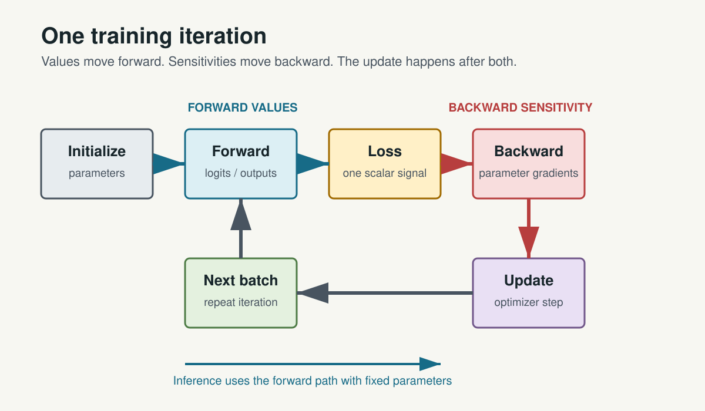
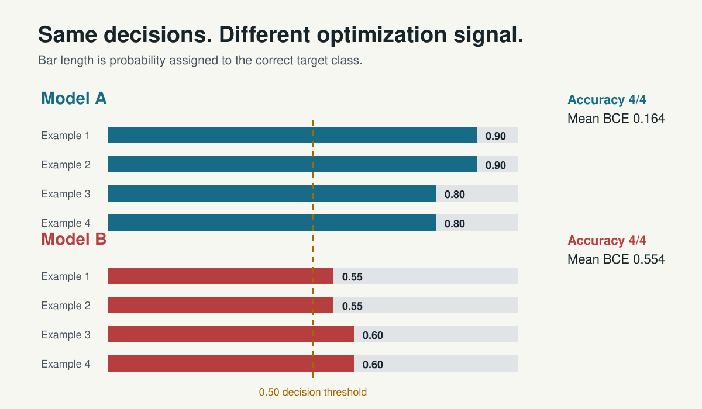
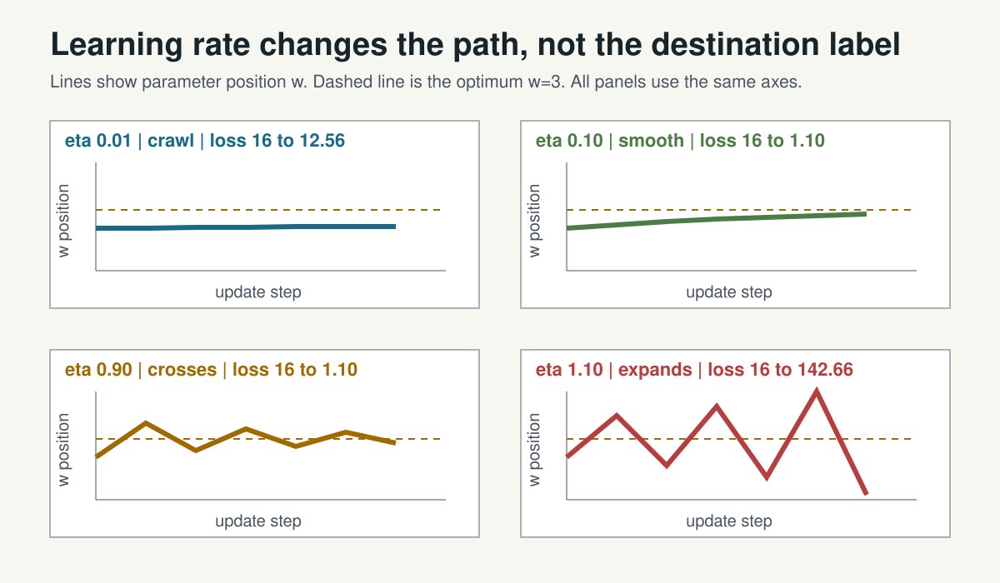
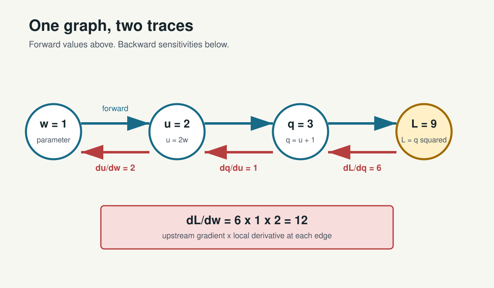
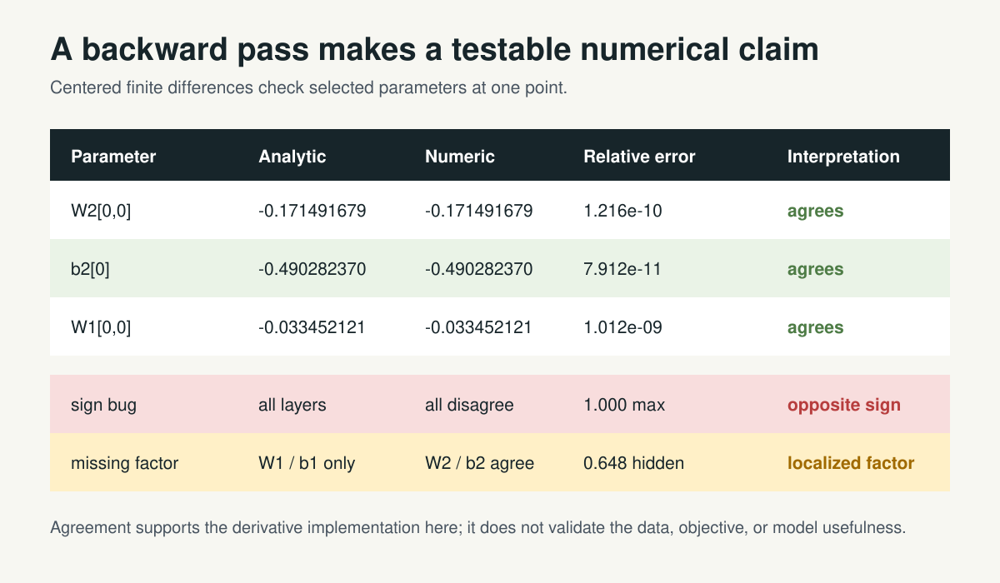
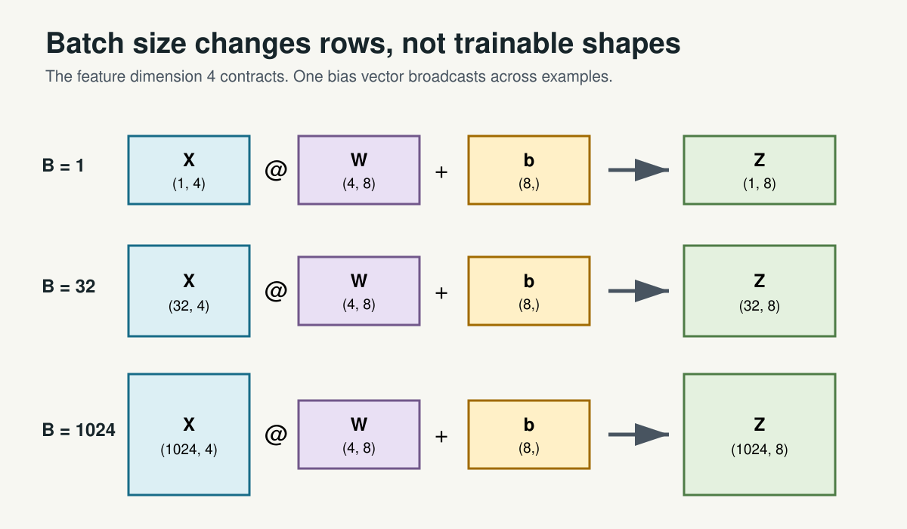
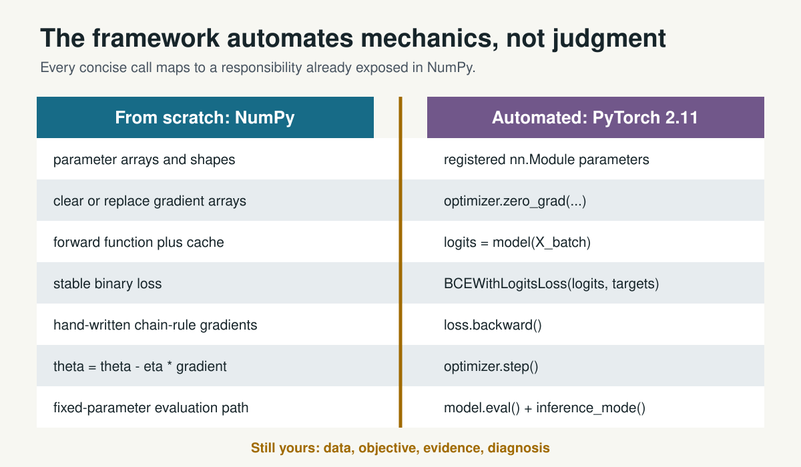
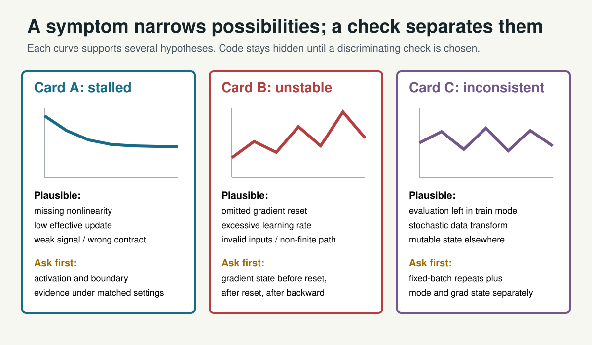

<style>
section {
  font-family: "Aptos", "Helvetica Neue", sans-serif;
}
section h1 {
  font-size: 42px;
}
section h2 {
  font-size: 29px;
}
img.asset {
  display: block;
  max-height: 430px;
  max-width: 100%;
  margin: 12px auto 0;
}
section.compact {
  font-size: 23px;
}
.post-gate-banner {
  display: inline-block;
  margin: 0 0 8px;
  padding: 7px 14px;
  border: 3px solid #B73E3E;
  background: #F8DDDD;
  color: #7F2525;
  font-size: 20px;
  font-weight: 700;
  letter-spacing: 0;
}
</style>

<!-- This editable source contains instructor speaker notes. Export participant decks without notes. -->

# 01 | Day 2: Train It

## When a neural network makes a mistake, how does it know what to change?

**Retrieve:** Open your submitted Day 1 consolidation. Do not edit it yet.

<!--
Speaker notes: Give 30 seconds to open the artifact. State that one prior response will be sampled before revision. The opening is retrieval, not a recap lecture.
Visual direction: Full-width question with a faint Day 1 forward trace ending at a wrong prediction.
Alt text: The Day 2 question appears above a Day 1 forward trace whose final prediction disagrees with its target.
-->

---

# 02 | Sample the Submitted Evidence

The instructor will sample one response:

- `CHECK-D1-03` item 5: support/disconfirm nonlinearity;
- `CHECK-D1-04` item 2: nonzero hidden activation;
- `CHECK-D1-04` item 5: copied-parameter perturbation.

**After discussion:** annotate in a second color. Preserve the first state.

<!--
Speaker notes: Choose one actual submission. Ask what evidence the learner cited. Do not improve wording before sampling. Collect one revised sentence after discussion.
Visual direction: Three retrieval cards pointing to one preserved response and one second-color annotation.
Alt text: Three possible Day 1 consolidation prompts feed a preserve-then-revise retrieval routine.
-->

---

# 03 | Rebuild the Forward Trace

$$
X \rightarrow Z_1 \rightarrow A_1 \rightarrow Z_2 \rightarrow p \rightarrow \hat{y}
$$

For each stage, state one:

**shape | range | invariant**

**Question:** Which arrow changed a parameter on Day 1?

<!--
Speaker notes: Expected answer: none. Ask for batch-first shapes and output ranges. Keep the fixed-parameter language from Day 1.
Visual direction: Six-stage trace with blank evidence tags beneath each stage.
Alt text: The Day 1 forward stages are shown with blank fields for a shape, range, or invariant; no stage changes parameters.
-->

---

# 04 | The Forward Trace Becomes a Loop



<!--
Speaker notes: Reveal initialize, forward, and loss first. Add backward and update only after learners name the missing capabilities. Emphasize that the objective is designed by people, not chosen by the model.
Visual direction: Use the full asset; trace blue forward arrows, red backward arrows, then the gray repeat loop.
Asset path: `courseware/shared/assets/day-2/training-loop-dual-trace.svg`.
Alt text: Six stages form a repeated training loop, while inference uses only the forward path with fixed parameters.
-->

---

# 05 | Batch, Iteration, Epoch

**960 training examples | batch size 64**

- batch: examples processed together;
- iteration: one update cycle;
- epoch: one pass through the training set.

**Commit:** How many updates occur in one epoch?

Training adds loss, backward, and update. Inference does not.

<!--
Speaker notes: Expected update count is 15. Ask whether evaluation can calculate loss while keeping parameters fixed. Correct the misconception that one epoch is one update.
Visual direction: Tile 960 examples into 15 equal groups, with one update marker under each group.
Alt text: Nine hundred sixty examples are divided into fifteen batches of sixty-four, producing fifteen update iterations in one epoch.
-->

---

# 06 | Loss Gives Error a Scalar Form

One model can produce many mistakes across many examples.

**Loss compresses the declared training objective into a scalar that gradients can act on.**

Loss is not:

- the same as accuracy;
- a deployment cost by default;
- proof of generalization.

<!--
Speaker notes: Ask what information must be compressed and what is lost. Introduce per-example versus reduced batch loss without deriving full negative log likelihood.
Visual direction: Many output-target differences flow into one scalar, with a caution label that the scalar reflects a chosen objective.
Alt text: Multiple prediction-target differences are reduced into one scalar loss, which reflects a designed objective rather than every deployment concern.
-->

---

# 07 | ACT-D2-01: Rank Before Calculating

Targets: `[1, 0, 1, 0]`

| Model | Probabilities for class `1` |
|---|---|
| A | `[.90, .10, .80, .20]` |
| B | `[.55, .45, .60, .40]` |
| C | `[.90, .10, .49, .20]` |
| D | `[.90, .10, .01, .20]` |

**Commit:** loss rank, accuracy, least-certain comparison.

<!--
Speaker notes: Collect the snapshot before revealing any loss. Reveal thresholded classes first, one example loss second, and means last. Full timing and answers are in the challenge key.
Visual direction: Four probability strips remain face-down except for values and a visible 0.5 threshold.
Alt text: Four binary probability vectors await a pre-calculation ranking by expected cross-entropy loss and accuracy.
-->

---

# 08 | Equal Accuracy, Different Loss



<!--
Speaker notes: Ask what accuracy discarded. Then reveal the counterintuitive C-versus-B ordering from the activity: lower accuracy can still have lower mean loss. Do not call lower loss calibration.
Visual direction: Use the asset bars and fixed 0.5 threshold; point to identical decisions before loss values.
Asset path: `courseware/shared/assets/day-2/equal-accuracy-different-loss.svg`.
Alt text: Equal class decisions hide different target-class probabilities and therefore different binary cross-entropy losses.
-->

---

# 09 | Match Output and Loss

| Task | Model emits | Introductory loss |
|---|---|---|
| regression | numeric output | MSE |
| binary class | one raw logit | BCE with logits |
| multiclass | one logit per class | cross-entropy |

**PyTorch 2.11:** logits go directly to `BCEWithLogitsLoss`.

Sigmoid is for later interpretation or thresholding.

<!--
Speaker notes: State the verified 2.11 contract: combined sigmoid and BCE for numerical stability; target and input shapes match. Ask why applying sigmoid before this loss is a mismatch.
Visual direction: Three task-output-loss lanes; highlight raw logits entering each classification loss.
Alt text: Regression maps numeric output to MSE, binary logits to BCEWithLogitsLoss, and multiclass logits to cross-entropy.
-->

---

# 10 | Gradient Descent Uses Local Sensitivity

$$
\theta_{next}=\theta-\eta\frac{\partial L}{\partial\theta}
$$

- gradient sign: local slope; subtract it for descent;
- gradient magnitude + learning rate: update size.

**Predict:** crawl, smooth convergence, oscillatory convergence, or divergence?

<!--
Speaker notes: Keep the current point and objective fixed. Substitute a negative gradient and ask the direction before showing paths. Numeric learning-rate labels are local to the objective.
Visual direction: One loss bowl with a current point and four hidden first-step arrows of different lengths.
Alt text: A parameter update subtracts the learning rate times local gradient, producing four possible path regimes to predict.
-->

---

# 11 | LAB-D2-01 Launch

## Loss Landscapes and Learning-Rate Roulette | 40 min

**Predict:** BCE ranking and first three steps.  
**Experiment:** finite loss and four fixed-budget paths.  
**Observe:** position, loss, distance to optimum.  
**Diagnose:** path from sign and update size.

`courseware/day-2/labs/LAB-D2-01-loss-learning-rate.ipynb`

<!--
Speaker notes: Pair driver and evidence lead. Require fixed axes and a prediction before each path. Checkpoints: finite extreme loss by minute 14, all trajectory predictions by minute 20.
Visual direction: Four-step lab strip ending in aligned position/loss/distance evidence.
Alt text: Lab 1 moves from loss and trajectory predictions to finite calculations, aligned path evidence, and mechanism diagnosis.
-->

---

# 12 | LAB-D2-01 Debrief: Read the Path



<!--
Speaker notes: Ask which labels require the whole position path rather than the last loss. The 0.90 position alternates while loss decreases; the 1.10 position alternates while loss increases. Preserve the caveat that numeric thresholds belong to this classroom objective.
Visual direction: Compare parameter position against the fixed optimum; use title-reported loss only as a separate progress summary.
Asset path: `courseware/shared/assets/day-2/learning-rate-trajectories.svg`.
Alt text: Four learning-rate paths distinguish insufficient progress, smooth convergence, contracting oscillation, and expanding divergence.
-->

---

# 13 | A Derivative Is Local Sensitivity

Before notation, nudge one parameter:

$$
\text{local sensitivity}
\approx
\frac{\text{small loss change}}{\text{small parameter change}}
$$

**Predict sign before magnitude.**

Backpropagation avoids separately perturbing every parameter.

<!--
Speaker notes: Demonstrate one small perturbation. Ask whether a positive parameter nudge raised or lowered loss. Then introduce derivative notation as compression of that observation.
Visual direction: Two nearby parameter positions with a measured loss difference and a sign label.
Alt text: A small parameter perturbation and resulting loss change motivate derivative sign and magnitude before formal notation.
-->

---

# 14 | Backpropagation Reuses Local Work



<!--
Speaker notes: Reveal forward values first. Ask for each backward sign before revealing values. State that gradients are sensitivities, not moral responsibility or complete causal explanation.
Visual direction: Follow blue arrows left to right, then red arrows right to left. Keep every numeric derivative visible.
Asset path: `courseware/shared/assets/day-2/computational-graph.svg`.
Alt text: A four-node graph carries values forward and multiplies upstream gradients by local derivatives backward.
-->

---

# 15 | ACT-D2-02: Sign Before Arithmetic

$$
\frac{\partial L}{\partial w}
=
\frac{\partial L}{\partial a}
\frac{\partial a}{\partial w}
$$

| Upstream | Local | Product sign |
|---:|---:|---|
| positive | positive | ? |
| positive | negative | ? |
| negative | negative | ? |

**Then:** sketch the first three learning-rate steps.

<!--
Speaker notes: Collect sign predictions before values. Reopen the learning-rate sketch to connect gradient sign with movement. Expected signs are in the challenge key; do not reveal all at once.
Visual direction: Three empty sign cells beside a small loss path sketch area.
Alt text: Three upstream-gradient and local-derivative sign combinations await multiplication before exact values are calculated.
-->

---

# 16 | Gradient Checking Makes It Falsifiable



<!--
Speaker notes: Ask what the two faulty patterns suggest before naming them. Agreement supports local implementation at this point; it does not validate objective, data, or usefulness.
Visual direction: Reveal the three agreement rows, then the sign-bug row, then the missing-factor row.
Asset path: `courseware/shared/assets/day-2/gradient-check-table.svg`.
Alt text: A signed analytic-versus-numerical table distinguishes correct gradients, opposite signs, and a structured scale error.
-->

---

# 17 | LAB-D2-02 Launch

## Backpropagation and Gradient Check | 45 min

**Predict:** selected gradient signs.  
**Build:** forward cache and local derivatives.  
**Compare:** analytic vs. finite difference.  
**Diagnose:** sign bug or missing factor.  
**Verify:** one small descent update lowers loss.

`courseware/day-2/labs/LAB-D2-02-backprop-gradient-check.ipynb`

<!--
Speaker notes: Require analytic entries before numerical reveal. Pair roles switch after the first table. Keep finite differences as checker, not training algorithm.
Visual direction: Five-stage lab sequence centered on a signed comparison table.
Alt text: Lab 2 predicts signs, builds a tiny backward pass, compares it numerically, diagnoses defects, and tests one descent update.
-->

---

# 18 | LAB-D2-02 Debrief

1. Why does one perturbation test an entire path?
2. What pattern suggests a missing local derivative?
3. When can epsilon mislead the check?
4. What remains unvalidated after gradients agree?

**Must say:** derivative correctness is not model usefulness.

<!--
Speaker notes: Accept floating-point and too-large/nonlocal epsilon limits. Require a statement separating gradient correctness from data/objective validity.
Visual direction: Four debrief questions surround one analytic/numeric agreement cell.
Alt text: Four questions use the gradient table to separate derivative verification from broader model validity.
-->

---

# 19 | Midday Checks

## `CHECK-D2-01` | 5 min

Sequence the loop; repair logits/loss pairing.

## `CHECK-D2-02` | 5 min

Diagnose two learning-rate paths; trace one chain-rule calculation.

**Submit before lunch through Day 2 Checks.**

<!--
Speaker notes: Use exactly five minutes each. Do not debrief publicly before collection. Record whether learners place backward before step and whether they multiply local derivatives.
Visual direction: Two assessment tickets: loop/loss and trajectory/gradient.
Alt text: Two five-minute checks assess training-loop and loss contracts, then learning-rate and chain-rule reasoning.
-->

---

# 20 | ACT-D2-03: Add the Batch Dimension

Dense layer: `4 -> 8`

Fill shapes for `B = 1`, `32`, `1,024`:

`X | W | b | Z = X @ W + b | A`

Then mark:

- contracted dimension;
- example dimension;
- trainable shapes that change.

<!--
Speaker notes: Commit by 13:12 and collect by 13:23. Require a two-dimensional X for B=1 unless learners explicitly distinguish unbatched x.
Visual direction: Three blank rows with persistent W and b cards and expanding X/Z tiles.
Alt text: Three batch sizes await shape labels while the same weight and bias cards remain fixed.
-->

---

# 21 | Same Function, More Rows



<!--
Speaker notes: Ask why the bias does not add B times 8 parameters. Contrast hand-written elementwise broadcasting hazards with BCEWithLogitsLoss's stricter same-shape target contract.
Visual direction: Trace the feature dimension 4 contracting in each row; point to unchanged W and b.
Asset path: `courseware/shared/assets/day-2/batch-shape-map.svg`.
Alt text: Expanding batch rows change X and Z first dimensions while W and b trainable shapes remain unchanged.
-->

---

# 22 | Vectorization Is a Computational Form

**Same per-example function**

Python loop -> batched matrix/tensor operation

Vectorized work can map efficiently to optimized kernels and parallel hardware.

It does **not** imply:

- GPU required;
- largest batch always fastest;
- larger batch always learns better.

<!--
Speaker notes: Keep hardware conceptual. Ask what must be declared before a speed claim: workload, device, data movement, measurement. CPU is the required course path.
Visual direction: Many scalar forms stack into one matrix operation, followed by a measurement-needed badge.
Alt text: Repeated per-example calculations combine into one tensor operation, while a caution notes that performance remains workload and device dependent.
-->

---

# 23 | Scratch Training: Every Responsibility Is Visible

**initialize -> forward/cache -> loss -> backward -> update -> mini-batch -> measure**

At every stage ask:

- expected shape/range;
- finite value?
- current seed/split?
- evidence before continuing?

Decreasing loss is necessary evidence, not complete proof.

<!--
Speaker notes: Build a state machine from participant answers. Require one invariant per stage. Distinguish optimization, representation, and generalization evidence.
Visual direction: Seven-stage responsibility strip with an evidence checkpoint under each transition.
Alt text: Seven scratch-training responsibilities each emit a shape, finite-value, or provenance check before the loop continues.
-->

---

# 24 | LAB-D2-03 Launch

## Train a Neural Network with NumPy | 70 min

**Predict:** initial loss, all shapes, early trend, boundary family.  
**Build:** `2 -> 8 -> 1` forward/backward/update loop.  
**Observe:** curves, gradient norms, validation, boundary.  
**Compare:** one major change only.

`courseware/day-2/labs/LAB-D2-03-numpy-training.ipynb`

<!--
Speaker notes: Keep the responsibility checklist visible. Stop non-finite runs immediately. Optional width/activation sweep is the first cut; one controlled comparison only after baseline evidence.
Visual direction: A long lab track with seven responsibility checkpoints and one final comparison branch.
Alt text: Lab 3 builds a complete two-eight-one NumPy network, records evidence at every stage, and permits one controlled comparison.
-->

---

# 25 | Three Evidence Questions

| Question | Evidence |
|---|---|
| Is the objective decreasing? | loss, gradient, update path |
| Can the model represent the boundary? | nonlinearity, decision region |
| Does behavior transfer beyond training? | validation evidence |

**Counterexample:** loss can decrease while a no-activation model remains linear.

<!--
Speaker notes: Use the no-activation run as the counterexample. Ask teams to classify one observation in each evidence family and name one alternative explanation.
Visual direction: Three columns labeled optimization, representation, and generalization; the same loss curve cannot fill all three.
Alt text: Optimization, representation, and generalization require different evidence; a decreasing loss alone occupies only the first column.
-->

---

# 26 | LAB-D2-03 Debrief

Bring:

- one invariant that caught a defect;
- one curve supporting optimization progress;
- one boundary supporting or weakening representation;
- one validation observation;
- one result from your controlled change.

**What should a framework automate next?**

<!--
Speaker notes: Stop coding for the final four minutes. Require mechanism and remaining uncertainty. The framework question launches the reveal without implying that APIs remove the math.
Visual direction: Five evidence artifacts feed a question mark labeled framework automation.
Alt text: A shape invariant, curve, boundary, validation result, and controlled comparison prepare the transition from NumPy mechanics to framework automation.
-->

---

# 27 | PyTorch Automates the Mechanics You Exposed



<!--
Speaker notes: Trace each row before moving on. Ask which responsibilities remain human: data, objective, evidence, mode transitions, and diagnosis.
Visual direction: Read across each responsibility row; end at the bottom statement that judgment remains explicit.
Asset path: `courseware/shared/assets/day-2/numpy-pytorch-side-by-side.svg`.
Alt text: Seven NumPy responsibilities map one-to-one to concise PyTorch calls, while data, objective, evidence, and diagnosis remain explicit.
-->

---

# 28 | PyTorch 2.11 Training Order

```python
model.train()
for X_batch, y_batch in train_loader:
    optimizer.zero_grad()
    logits = model(X_batch)
    loss = loss_fn(logits, y_batch)
    loss.backward()
    optimizer.step()
```

**Probe:** When do gradients exist? When do parameters change?

<!--
Speaker notes: Verify against official PyTorch 2.11 optimizer docs. Inspect a parameter before backward, after backward, and after step. Qualify set_to_none: explicit inspection contract, None differs from zero, no universal performance claim.
Visual direction: Highlight one line at a time and map it to the NumPy responsibility strip.
Alt text: A PyTorch binary training loop resets gradients, computes logits and loss, backpropagates gradients, then updates parameters.
-->

---

# 29 | Evaluation Mode Is Not Gradient Disabling

```python
model.eval()
with torch.inference_mode():
    val_logits = model(X_val)
```

| Control | What it changes |
|---|---|
| `model.eval()` | behavior of mode-sensitive modules |
| `torch.inference_mode()` | autograd recording and extra tracking in the block |

**They are orthogonal. Return to `model.train()` before training.**

<!--
Speaker notes: Verified against PyTorch 2.11 autograd mechanics. Print `model.training` and `torch.is_grad_enabled()` separately. State that `torch.no_grad()` is the valid alternative when outputs need later use in grad-recorded computations; inference-mode tensors have stronger reuse restrictions.
Visual direction: Two independent switches feed one validation forward pass; neither switch visually controls the other.
Alt text: Evaluation mode and inference mode are independent switches: one changes selected module behavior, while the other disables autograd recording and extra tracking for isolated evaluation.
-->

---

# 30 | LAB-D2-04 Launch

## PyTorch Autograd: Break It and Fix It | 55 min

1. Build a valid logits-based baseline.
2. Record mode and gradient state.
3. Receive mystery evidence.
4. Diagnose before source reveal.
5. Repair one cause under matched conditions.

`courseware/day-2/labs/LAB-D2-04-pytorch-break-fix.ipynb`

<!--
Speaker notes: Pair roles and assign one mystery card. The evidence-only gate must be accepted before faulty source. Check baseline by minute 19 and gate by minute 33.
Visual direction: Five-stage gated workflow; a lock separates mystery evidence from source code.
Alt text: Lab 4 builds a valid PyTorch baseline, records state, diagnoses mystery evidence behind a source-code gate, and makes one matched repair.
-->

---

# 31 | ACT-D2-04: Evidence Before Code

Submit before source access:

1. two observations;
2. two plausible causes;
3. cheapest discriminating check;
4. expected confirming result;
5. disconfirming result;
6. repair category.

**A curve is not a unique fingerprint.**

<!--
Speaker notes: This is the evidence-only commitment gate. Keep slide 31 projected and reject a cause-only guess. Reveal exactly one requested evidence item before source. Do not advance to slide 32 until every ACT-D2-04 diagnosis is submitted and accepted. Score the check choice and revision quality, not diagnosis speed.
Visual direction: Six evidence fields appear before a locked source-code panel.
Alt text: Six evidence and hypothesis fields must be completed before a locked faulty-code panel can be opened.
-->

---

# 32 | Three Curves, More Than Three Causes

<div class="post-gate-banner">POST-GATE REVEAL</div>



<!--
Speaker notes: POST-GATE REVEAL. Assign A, B, or C at the lab launch so each team receives mystery evidence before diagnosis. Keep this slide's causes, checks, and source guidance hidden until all ACT-D2-04 diagnoses have been submitted and accepted. Then ask which observation is fact and which phrase is inference. Do not map each curve to a single answer; use the listed check to separate alternatives.
Visual direction: Use the full three-card asset and cover the bottom evidence request until teams propose one.
Asset path: `courseware/shared/assets/day-2/broken-curves-evidence.svg`.
Alt text: Stalled, unstable, and inconsistent training evidence each support multiple hypotheses, requiring a discriminating check before repair.
-->

---

# 33 | Repair Evidence + Exit Gate

**LAB-D2-04 debrief:**

symptom -> alternatives -> check -> fault -> repair -> before/after -> why

**Final 15 minutes**

- bounded modern-engineering transfer: 3 min;
- `CHECK-D2-03`: 5 min;
- `CHECK-D2-04`: 5 min;
- submit: 2 min.

Part C is due before Day 3 at 09:00.

<!--
Speaker notes: Require matched axes, seed, data, and budget for before/after evidence. Assign the five-minute transfer item and remind learners to reopen their original ACT-D2-04 gate response.
Visual direction: An evidence-board arrow leads directly into two timed exit tickets and a Day 3 retrieval marker.
Alt text: A complete repair evidence chain feeds two timed exit checks, followed by a five-minute transfer item due before Day 3.
-->

---

# 34 | Training Is a Repeated Experiment

**predict -> measure -> calculate sensitivity -> adjust -> repeat**

The same scientific loop appears in larger training, post-training, evaluation, data, behavior, and efficiency work.

**Boundary:** no RL implementation, distributed training, or hardware internals today.

## Day 3 bridge

Can a stronger model rescue invalid data and validation evidence?

<!--
Speaker notes: Connect loss to an objective signal and checks to evaluation evidence without implying classroom scale equals frontier work. Close with the Day 3 question and remind learners to bring ACT-D2-04 and CHECK-D2-04 Part C.
Visual direction: One hypothesis-experiment-measurement-diagnosis loop points toward a data-provenance diagram labeled Day 3.
Alt text: The Day 2 training experiment loop transfers conceptually to larger model work and then points to Day 3's question about trustworthy data and validation.
-->