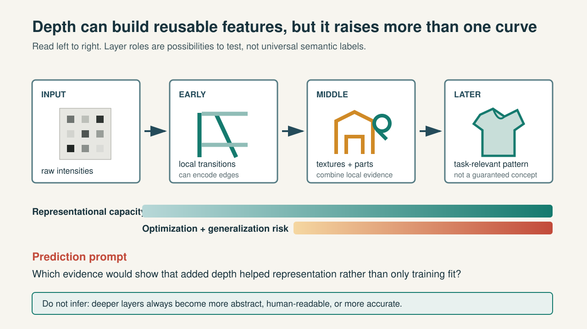
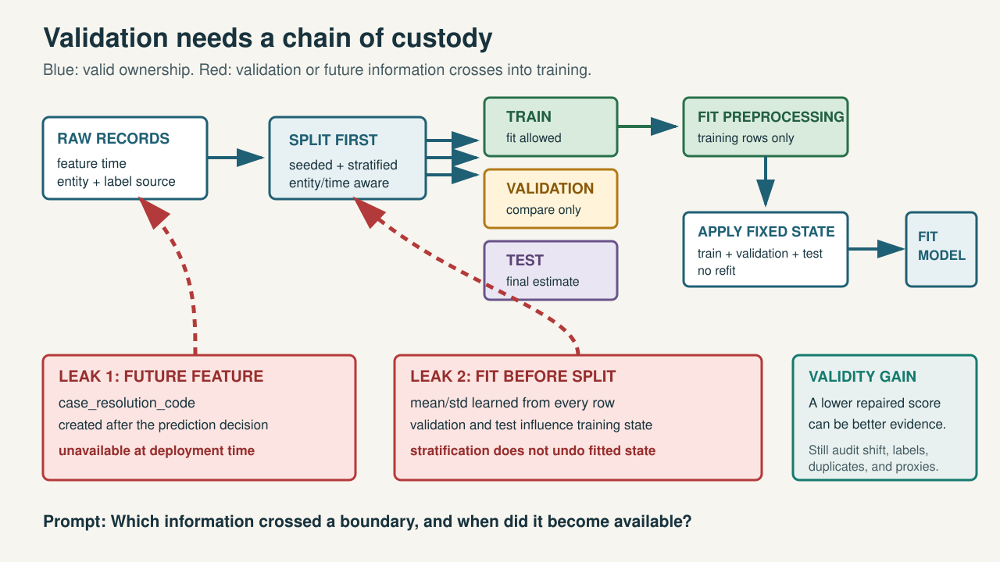
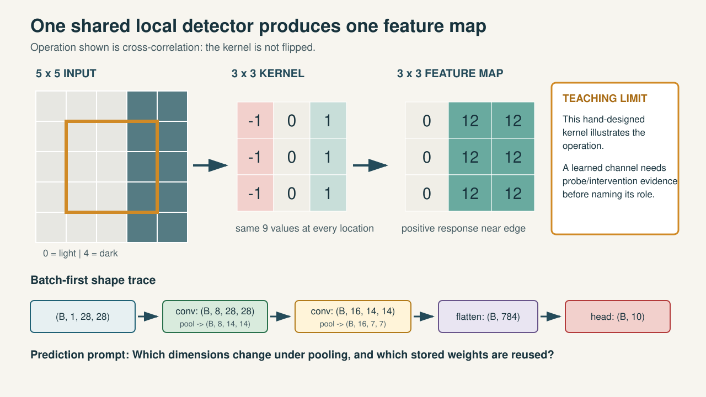
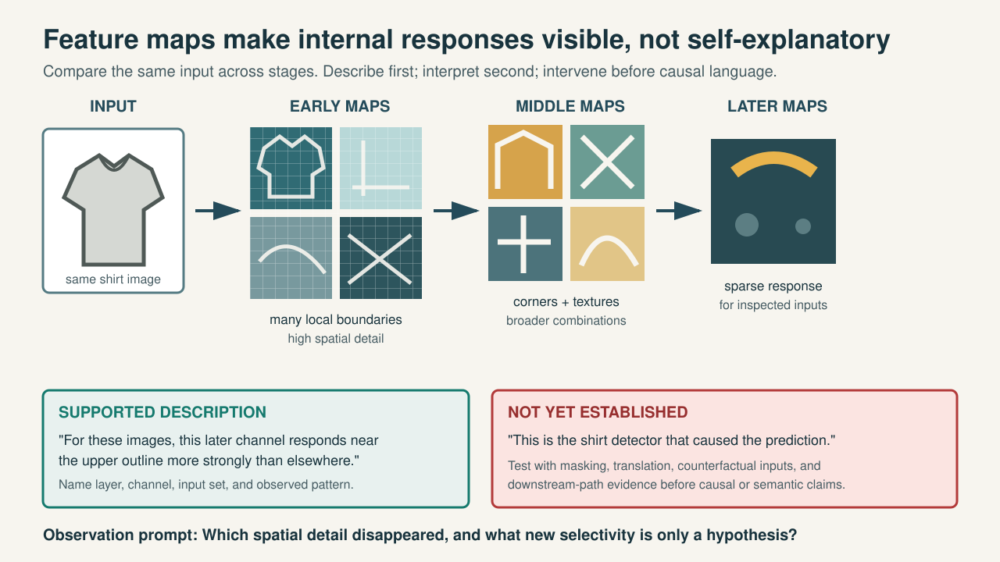
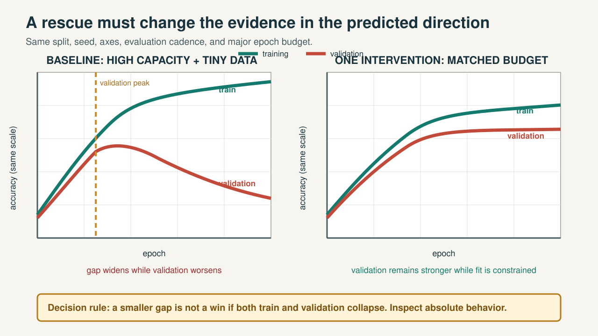
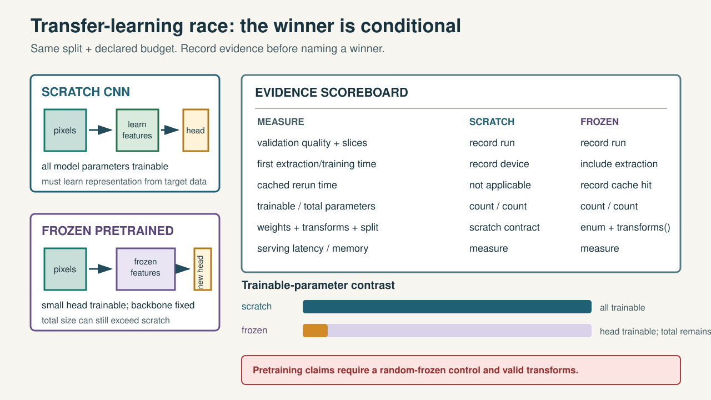
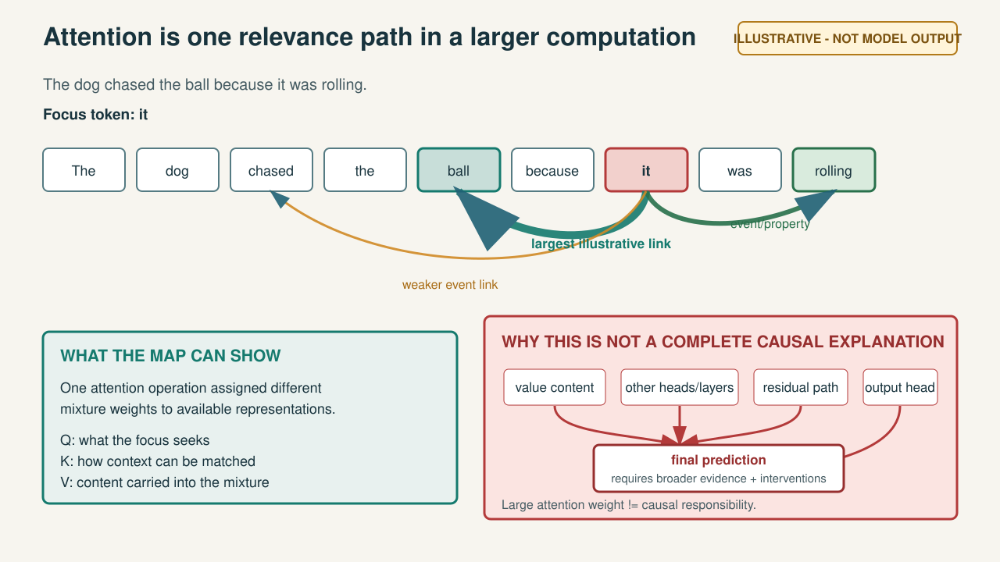
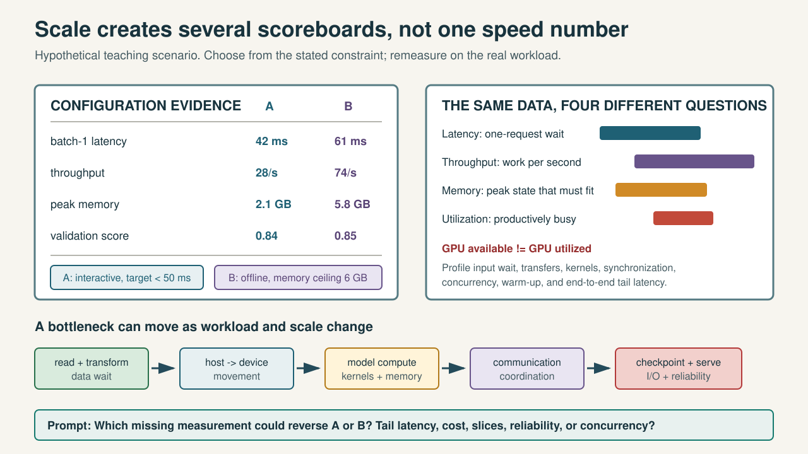

<style>
section {
  font-family: "Aptos", "Helvetica Neue", sans-serif;
  color: #18333D;
  background: #F7F5EF;
}
section h1 { font-size: 40px; color: #18333D; }
section h2 { font-size: 28px; color: #244B5A; }
section.compact { font-size: 22px; }
section.tight { font-size: 20px; }
img.asset {
  display: block;
  max-height: 425px;
  max-width: 100%;
  margin: 10px auto 0;
}
img.transfer-asset { max-height: 290px; }
.gate {
  display: inline-block;
  padding: 6px 12px;
  border: 3px solid #B33A3A;
  background: #FBE4E1;
  color: #972F2F;
  font-size: 19px;
  font-weight: 700;
}
.scope {
  display: inline-block;
  padding: 5px 10px;
  border: 2px solid #B27A19;
  background: #FFF4D9;
  color: #7B5311;
  font-size: 18px;
  font-weight: 700;
}
</style>

<!-- Editable instructor source. Export participant decks without speaker notes. Do not render the PDF until the slide validation phase. -->

# 01 | Day 3: Scale It

## How do the fundamentals become the systems used in modern AI?

**Retrieve:** Open your `ACT-D2-04` evidence board and `CHECK-D2-04` response. Do not edit them yet.

<!--
Speaker notes: Give 30 seconds to open actual Day 2 artifacts. State that today's first decision is whether evidence points to implementation/optimization, representation, or data/evaluation.
Visual direction: Large question above four evidence-category labels; keep the Day 2 artifacts visually foregrounded.
Alt text: The Day 3 question appears above a prompt to retrieve the Day 2 broken-curve evidence board and readiness response before revision.
-->

---

# 02 | Sort the Day 2 Evidence

| Category | Example evidence |
|---|---|
| implementation | reset, mode, detached/frozen path, output/loss contract |
| optimization | update size, gradient flow, activation saturation |
| representation | effectively linear path, missing useful hierarchy |
| data/evaluation | weak signal, mismatch, leakage, invalid validation |

**Commit:** Where does your leading Day 2 explanation belong? What would disconfirm it?

<!--
Speaker notes: Sample one real ACT-D2-04 sentence and one CHECK-D2-04 Part C response. Facts can support several categories; do not force a unique label before the requested evidence is considered.
Visual direction: Four columns receive evidence cards from the retrieved artifacts.
Alt text: A four-column table separates implementation, optimization, representation, and data or evaluation evidence, with a disconfirmation prompt.
-->

---

# 03 | The Day 3 Investigation

**depth -> valid data -> CNN mechanics -> training evidence -> rescue -> transfer -> attention -> systems scale**

At every step:

**predict -> observe -> diagnose -> explain why -> state the limit**

<span class="scope">CORE: valid image workflow and evidence</span>

<!--
Speaker notes: Preview the causal arc, not a topic catalogue. State that attention equations, distributed algorithms, and full fine-tuning are outside the core path.
Visual direction: One horizontal investigation path with the evidence loop beneath it.
Alt text: Day 3 progresses from depth and valid data through CNNs, generalization, transfer, attention, and scale, repeating an evidence loop at each stage.
-->

---

# 04 | Depth Can Reuse Features



<!--
Speaker notes: Ask what additional depth can reuse before naming hierarchy. Point to separate capacity and risk bars. Correct 'always detects' to 'can encode.'
Visual direction: Reveal the four stages first, then the two independent bars.
Asset path: courseware/shared/assets/day-3/feature-ladder.svg.
Alt text: A feature ladder shows possible reuse across depth while capacity and optimization or generalization risk rise on separate bars.
-->

---

# 05 | ACT-D3-01: Feature Ladder Under a Budget

Place each card at input, early, middle, or later:

- raw intensity;
- local transitions;
- textures/corners;
- sleeve/sole/collar arrangements.

Then choose: **add blocks | widen | audit the pipeline first**

**Commit one expected observation and one rejection result.**

<!--
Speaker notes: Collect original placements and budget choice. Multiple placements can be defensible. Score observable support and disconfirming evidence, not a memorized layer dictionary.
Visual direction: Four movable cards and three constrained choices; no answer positions shown.
Alt text: Four candidate representations await placement on a feature ladder, followed by a one-choice architecture or pipeline decision under a fixed budget.
-->

---

# 06 | A Validation Score Has a Chain of Custody

For every feature or statistic, ask:

1. When was it available?
2. Which records created it?
3. Which split owned the fitted state?
4. Which decision used the result?

**High score = clue, not proof of validity or leakage.**

<!--
Speaker notes: Draw the valid path without red leak arrows. Have learners label training, validation, and test ownership before showing the asset.
Visual direction: Four provenance questions surround a covered pipeline diagram.
Alt text: Four chain-of-custody questions ask about feature availability, source records, fitted-state ownership, and downstream decisions before a pipeline reveal.
-->

---

# 07 | ACT-D3-02: Leak Accusation Before Code

Evidence: validation AUC `0.997`; a simple model nearly matches a larger one.

Submit before source access:

- two facts;
- two plausible explanations;
- one discriminating check;
- confirming and weakening evidence;
- first feature to quarantine.

**A near-perfect score is not a unique fingerprint.**

<!--
Speaker notes: This is the evidence-only gate. Reveal provenance only after the metric-only commitment. Do not reveal the complete pipeline or repair order yet.
Visual direction: A metric card and six empty response fields sit before a locked code panel.
Alt text: A suspicious validation score leads to an evidence-only leakage gate requiring facts, alternatives, a check, and disconfirming evidence before code access.
-->

---

# 08 | LAB-D3-01 Launch

## Find the Data Leak | 45 min

**Predict:** why the score is implausible.  
**Inspect:** feature availability and fitted-state ownership.  
**Repair:** split, training-only preprocessing, deployment-valid features.  
**Compare:** leaky versus valid evidence under the same simple model.

`courseware/day-3/labs/LAB-D3-01-find-data-leak.ipynb`

<!--
Speaker notes: Require two independent leak paths. Checkpoints: first gate by minute 20, repair order by minute 35, lower-score explanation by minute 45. Use generated-data fallback only after preserving predictions.
Visual direction: Four-stage investigation with a lock between inspect and code reveal.
Alt text: Lab 1 moves from a suspicious-score prediction to provenance inspection, two repairs, and a matched comparison of contaminated and valid evidence.
-->

---

# 09 | LAB-D3-01 Debrief: Lower Can Be Better

<div class="gate">POST-GATE REVEAL</div>



<!--
Speaker notes: Reveal only after ACT-D3-02 is accepted. Ask what crossed each boundary and when. A lower repaired score is a validity gain, not proof that every data risk is gone.
Visual direction: Trace blue ownership first, then the two red leak arrows, then the validity-gain box.
Asset path: courseware/shared/assets/day-3/data-provenance-leak-pipeline.svg.
Alt text: The valid training-owned preprocessing path is contrasted with a future-feature leak and a scaler fitted before the split.
-->

---

# 10 | Why Images Reward Locality

Flatten first:

- every location can receive independent weights;
- neighborhood structure is no longer explicit.

Convolve first:

- small local interactions;
- the same detector is reused across positions;
- channels keep spatial response maps.

**Question:** What does sharing buy, and what does it assume?

<!--
Speaker notes: Do not claim dense models cannot learn image structure. The point is the inductive bias and parameter reuse. Ask what happens when an object shifts.
Visual direction: Contrast an all-to-all flattened grid with one small stencil scanning several positions.
Alt text: A flattened image with independent connections is contrasted with a local kernel reused across spatial positions.
-->

---

# 11 | ACT-D3-03: Predict the Kernel Map

Input has `0` values on the left and `4` values on the right.

```text
-1  0  1
-1  0  1
-1  0  1
```

Stride `1`, padding `0`.

**Commit:** output shape, top-left value, largest-response location, and sign pattern.

<!--
Speaker notes: State that the operation is framework-style cross-correlation, so the kernel is not flipped. Collect the sketch before calculating one patch.
Visual direction: Show the input and kernel, but keep the output map covered.
Alt text: A vertical edge kernel and a five-by-five light-to-dark image await a prediction of the three-by-three response map.
-->

---

# 12 | One Patch, One Map, One Shape Trace



<!--
Speaker notes: Reveal one patch first, then the full map, then the CNN shape trace. Ask which dimensions pooling changes and which kernel values are reused.
Visual direction: Read top left to right, then the lower batch-first shape path.
Asset path: courseware/shared/assets/day-3/kernel-feature-map-shape-trace.svg.
Alt text: The kernel arithmetic produces positive responses near the transition, and the lower trace preserves batch and channel labels through two conv-pool blocks.
-->

---

# 13 | LAB-D3-02 Launch

## Compact CNN and Feature Maps | 60 min

**Preflight:** cache first; download only by explicit opt-in.  
**Predict:** every `(B, C, H, W)` shape.  
**Repair:** flattened dimension or channel order from printed evidence.  
**Observe:** curves, selected maps, and misclassified examples.  
**Limit:** map brightness is descriptive, not causal proof.

`courseware/day-3/labs/LAB-D3-02-cnn-feature-maps.ipynb`

<!--
Speaker notes: Confirm validation uses fixed evaluation transforms. Require shape repair before training. Stop at the tested runtime ceiling and use the matched checkpoint/map fallback if needed.
Visual direction: Five lab stages with a cache decision before the first run.
Alt text: Lab 2 begins with cache-aware data access, predicts and repairs shapes, trains a compact CNN, and interprets maps with an explicit causal limitation.
-->

---

# 14 | Early Detail, Later Selectivity



<!--
Speaker notes: Have learners describe the same input across layers before reading the supported/unsupported boxes. Ask for one mask or translation intervention.
Visual direction: Compare the input and maps first; reveal the interpretation boxes last.
Asset path: courseware/shared/assets/day-3/cnn-map-hierarchy.svg.
Alt text: Feature maps progress from detailed local responses to sparse later responses, while a caveat distinguishes description from claiming a named detector or cause.
-->

---

# 15 | LAB-D3-02 Debrief: Describe Before Naming

Bring one example of each:

- a shape invariant that repaired the model;
- an early map observation;
- a later map observation;
- a confident mistake;
- an interpretation you would test with an intervention.

**What did sharing buy? What remains unexplained?**

<!--
Speaker notes: Keep true/predicted labels visible for mistakes. Reject 'this is the sleeve neuron' unless phrased as a hypothesis with a probe. Confirm temporary hooks were removed.
Visual direction: Five evidence cards feed a description-versus-explanation divider.
Alt text: Five lab artifacts support a debrief separating shape mechanics, descriptive internal responses, mistakes, and untested causal interpretations.
-->

---

# 16 | CHECK-D3-01 | 10 min

Trace:

`(B,1,28,28) -> conv -> pool -> conv -> pool -> flatten`

Then explain:

- parameter sharing;
- what batch size changes;
- one supported feature-map claim;
- one input intervention;
- why deeper does not automatically mean better.

**Submit before lunch.**

<!--
Speaker notes: Use all ten minutes and collect before discussion. Record channel/spatial confusion and map-as-cause claims for afternoon routing.
Visual direction: One shape ticket and one evidence-interpretation ticket.
Alt text: A ten-minute check assesses CNN shape tracing, sharing, batch invariance, feature-map interpretation, intervention design, and the limits of depth.
-->

---

# 17 | Curve Detective: Evidence Before Labels

For each hidden run, cite two observations:

- training trend;
- validation trend;
- gap direction;
- spikes or non-finite values;
- evaluation cadence and axes.

Then propose: **underfit | overfit | unstable optimization | another pipeline/mode explanation**

<!--
Speaker notes: Do not reveal configurations yet. Require two observations and one competing explanation. A curve is a vital sign, not a unique fingerprint.
Visual direction: Four covered curve cards share identical axes.
Alt text: Four hidden learning-curve cards await evidence-based classification while keeping a competing pipeline or mode explanation alive.
-->

---

# 18 | A Remedy Is a Mechanism Hypothesis

| Intervention | Expected evidence |
|---|---|
| more representative data | validation improves under same model |
| augmentation | plausible invariance, train-only transforms |
| weight decay / dropout | constrained fit with useful validation retained |
| smaller model | lower capacity and resource use; absolute validation matters |
| early stopping | best checkpoint beats final checkpoint |

**One major intervention. One rejection criterion.**

<!--
Speaker notes: Ask what each intervention changes directly. Show the small-gap/both-at-chance counterexample. Combining remedies destroys attribution in the core exercise.
Visual direction: Mechanism cards point to expected train and validation changes.
Alt text: Five rescue options are tied to observable held-out effects, followed by a constraint to change one major factor and define rejection evidence.
-->

---

# 19 | LAB-D3-03 Launch

## Make It Overfit, Then Rescue It | 55 min

1. Draw the expected failure.
2. Run high capacity on tiny data.
3. Mark overfit onset.
4. Choose one rescue.
5. Predict both curves.
6. Compare on aligned axes.
7. Accept or reject the mechanism.

`courseware/day-3/labs/LAB-D3-03-overfit-and-rescue.ipynb`

<!--
Speaker notes: An intentional failure counts only when evidence distinguishes it from optimization failure. Accept a clean negative rescue result. Stop all-remedies branches before compute.
Visual direction: Seven gated stages; a single branch leaves the baseline.
Alt text: Lab 3 deliberately creates overfitting, commits one rescue and predicted curves, then evaluates aligned before-and-after evidence.
-->

---

<!-- _class: tight -->

# 20 | Baseline and Rescue Must Share Axes

<span class="scope">ILLUSTRATIVE CURVES - NOT VALIDATED RUN OUTPUT</span>



**A justified intervention may miss its criterion. Reject it when it does, as the validated dropout run was rejected.**

<!--
Speaker notes: These curves are illustrative, not the validated dropout output. Reveal baseline first and ask for onset. Reveal the illustrative rescue only after participants commit expected train and validation changes. The validated dropout run missed its criterion and was correctly rejected. Point to absolute validation, not gap alone.
Visual direction: Keep the illustrative label and rejection rule visible. Compare left and right at the same epoch and vertical level.
Asset path: courseware/shared/assets/day-3/overfit-rescue-aligned-curves.svg.
Alt text: Illustrative aligned curves contrast widening overfit with a successful rescue shape; visible text says a real single intervention may fail its criterion and should then be rejected, as the validated dropout run was.
-->

---

# 21 | LAB-D3-03 Debrief: Did the Mechanism Appear?

Complete the chain:

**baseline evidence -> intervention -> predicted change -> observed change -> interpretation -> next check**

Ask:

- Did validation improve or did training collapse?
- Which alternative survives?
- What result would make you reverse the diagnosis?

<!--
Speaker notes: A failed intervention can be the strongest discussion artifact if controls and rejection evidence were clear. Preserve one next experiment without running it.
Visual direction: Six linked evidence boxes ending in an unexecuted next check.
Alt text: The debrief links baseline evidence, one intervention, prediction, observation, interpretation, and a falsifiable next check.
-->

---

# 22 | Transfer Reuses a Representation, Not Answers

| Strategy | Trainable portion | Conditional value |
|---|---|---|
| scratch | all parameters | enough target data or strong domain mismatch |
| frozen features | new head | limited data/time, useful source representation |
| fine-tune | selected/all pretrained parameters | stable baseline plus evidence adaptation is needed |

<span class="scope">CORE: frozen features</span> <span class="scope">OPTIONAL: partial unfreezing</span>

**Full fine-tuning is outside the core path.**

<!--
Speaker notes: Separate pretraining from freezing. Ask whether a random frozen backbone is transfer learning. Keep full fine-tuning implementation outside the live path.
Visual direction: Three strategy lanes with distinct trainable regions and one explicit core boundary.
Alt text: Scratch, frozen-feature, and fine-tuning strategies are compared by trainable parameters and conditional value, with frozen features marked core and full fine-tuning outside core.
-->

---

# 23 | Current Torchvision Weight Contract

```python
from torchvision.models import mobilenet_v3_small, MobileNet_V3_Small_Weights

weights = MobileNet_V3_Small_Weights.DEFAULT
model = mobilenet_v3_small(weights=weights)
preprocess = weights.transforms()
```

`DEFAULT` currently aliases `IMAGENET1K_V1`; aliases may change.

**Record the resolved enum. Do not use deprecated `pretrained=True`.**

<!--
Speaker notes: Source-checked 2026-08-16 against official stable torchvision docs. Explain that weight-specific transforms are part of the representation contract and cache identity. Downloads remain opt-in and cache-aware.
Visual direction: Highlight the weight enum, model constructor, and transforms call as one reproducibility contract.
Alt text: Current MobileNet V3 Small code passes an explicit weights enum and derives preprocessing from the weight object, with a warning that DEFAULT aliases may change.
-->

---

<!-- _class: tight -->

# 24 | LAB-D3-04 Launch: Choose the Source Mode

## Transfer-Learning Race | 55 min

| Canonical branch | Recovery branch |
|---|---|
| CIFAR-10 scratch vs frozen MobileNet V3 Small | packaged Fashion-MNIST images vs fresh head on surrogate features |
| `MobileNet_V3_Small_Weights.DEFAULT` | `transfer_surrogate_fashion_subset.npz` |
| `weights.transforms()` | `transfer_surrogate_embeddings.npz`, label-blind, 256-wide |
| pretrained/frozen vs random/frozen control | freeze reasoning and scoreboard practice only |

<div class="gate">RECOVERY: NOT CIFAR-10 | NOT MOBILENET OUTPUT | NOT CANONICAL METRICS/RUNTIME | NOT PROOF TRANSFER WINS</div>

`courseware/day-3/labs/LAB-D3-04-transfer-learning-race.ipynb`

<!--
Speaker notes: Select and announce one branch before results. Canonical uses CIFAR-10, the explicit MobileNet weight enum, and weight-bundled transforms. Recovery uses the packaged Fashion-MNIST image/label subset and label-blind 256-wide surrogate features; it is not a generic pretrained fallback. Never mix source modes or silently use random weights.
Visual direction: Two visibly separate source-mode lanes sit above a full-width recovery claim-limit gate.
Alt text: Lab 4 visibly branches canonical CIFAR-10 with explicit MobileNet weights and bundled transforms from packaged Fashion-MNIST images and label-blind 256-wide surrogate recovery features, with four recovery claim limits.
-->

---

<!-- _class: tight -->

# 25 | Score Within the Declared Source Mode

**Canonical:** CIFAR-10 + explicit MobileNet weights + weight-bundled transforms.  
**Recovery:** packaged Fashion-MNIST images + label-blind 256-wide surrogate features.



<div class="gate">RECOVERY: NOT CIFAR-10 | NOT MOBILENET OUTPUT | NOT CANONICAL METRICS/RUNTIME | NOT PROOF TRANSFER WINS</div>

<!--
Speaker notes: Use the asset as a schema only. On the canonical branch, fill it with CIFAR/MobileNet evidence. On recovery, fill it with the packaged surrogate evidence and preserve the four claim limits; the visual's pretrained labels do not rename surrogate features.
Visual direction: Keep both source-mode labels and the full four-part recovery boundary visible above and below the scoreboard.
Asset path: courseware/shared/assets/day-3/transfer-scoreboard.svg.
Alt text: A source-mode-labeled scoreboard separates quality, timing, trainable parameters, total size, preprocessing identity, and serving cost; the recovery route is visibly not CIFAR-10, not MobileNet output, not canonical metrics or runtime, and not proof that transfer wins.
-->

---

<!-- _class: tight -->

# 26 | LAB-D3-04 Debrief: Bound the Claim

**Canonical CIFAR/MobileNet:** What did pretraining, random/frozen, and `weights.transforms()` establish?

**Recovery surrogate:** What did fresh-head training, freeze reasoning, and the scoreboard establish?

<div class="gate">NOT CIFAR-10 | NOT MOBILENET OUTPUT | NOT CANONICAL METRICS/RUNTIME | NOT PROOF TRANSFER WINS</div>

For either branch: **What evidence would reverse the choice? What serving constraint could change it?**

<!--
Speaker notes: Debrief only the branch that ran. A canonical result may support a bounded transfer comparison. A recovery result cannot establish CIFAR behavior, MobileNet behavior, canonical metrics/runtime, or transfer advantage. If scratch wins in either branch, treat it as evidence rather than forcing an outcome.
Visual direction: Two branch-specific questions converge on a prominent four-part recovery claim boundary and a conditional next-decision prompt.
Alt text: Canonical and recovery debrief questions remain separate; the recovery route is visibly bounded as not CIFAR-10, not MobileNet output, not canonical metrics or runtime, and not proof that transfer wins.
-->

---

# 27 | ACT-D3-04: Predict Token Relevance

> The dog chased the ball because it was rolling.

Focus token: **it**

Before the map:

- rank three relevant tokens/phrases;
- draw relationship arrows;
- state Q/K/V roles without equations;
- predict what missing token order would cost.

<!--
Speaker notes: Collect the token ranking and least-certain relation. There is no model-specific correct map because the later visual is explicitly illustrative.
Visual direction: Sentence tokens appear with an empty space for learner arrows; no weights shown.
Alt text: A sentence with focus token it awaits predicted context relationships, conceptual query-key-value roles, and an order-information consequence.
-->

---

# 28 | Q, K, V: Three Roles in Context Mixing

- **Query:** what the current representation seeks.
- **Key:** how an available representation can be matched.
- **Value:** content carried into the weighted mixture.
- **Position:** information that helps distinguish order.

**Self-attention:** context is drawn from representations in the same sequence.

<span class="scope">MOVE: attention equations and implementation</span>

<!--
Speaker notes: Keep this conceptual. Do not equate queries and keys with literal words; they are learned vectors. Equations and multi-head implementation are moved reference depth.
Visual direction: Four role cards feed one contextual representation without formulas.
Alt text: Query, key, value, and positional information are described as conceptual roles that combine sequence context without attention equations.
-->

---

# 29 | Attention Weights Are Not a Complete Causal Explanation

<div class="gate">POST-PREDICTION REVEAL</div>



<!--
Speaker notes: Require at least three omitted routes. State the exact limitation sentence aloud. A large weight describes one operation's mixture relation; causal claims require interventions and broader evidence.
Visual direction: Reveal the token links, then the omitted-route panel. Keep the illustrative label visible.
Asset path: courseware/shared/assets/day-3/token-relevance-limitation.svg.
Alt text: The token relevance pattern is placed inside a larger computation with values, other heads, residual paths, and later transformations, limiting causal interpretation.
-->

---

# 30 | Transformer and Foundation-Model Connection

**token + position -> self-attention -> residual/normalization -> feed-forward -> residual/normalization**

Pretraining learns broadly reusable representations. Adaptation uses them for downstream contexts.

The same fundamentals remain:

**inputs | parameters | activations | loss | gradients | optimization | evaluation**

**Boundary:** conceptual connection, not foundation-model implementation mastery.

<!--
Speaker notes: Map each Day 1-2 fundamental to the block. State that the course does not implement large-scale pretraining, RL, or a foundation model.
Visual direction: A simple Transformer block sits above the recurring fundamentals row.
Alt text: A conceptual Transformer block and pretraining path are mapped back to inputs, parameters, activations, loss, gradients, optimization, and evaluation.
-->

---

# 31 | Scale Turns Compute into a Bottleneck Hunt

Potential bottlenecks:

**read/transform -> transfer -> compute -> communication -> checkpoint -> serve**

Scale adds:

- memory pressure;
- coordination and communication;
- long-run failure/recovery;
- data-pipeline stalls;
- latency and throughput objectives.

<span class="scope">MOVE: distributed algorithms and mixed-precision implementation</span>

<!--
Speaker notes: Ask which stage is idle when another stalls. Do not imply a serial production architecture; the pipeline is a bottleneck reasoning aid.
Visual direction: Six stages show an idle/busy timeline, with bottleneck location able to move.
Alt text: A six-stage model system pipeline highlights data, transfer, compute, communication, checkpoint, and serving as moving bottlenecks.
-->

---

# 32 | Latency, Throughput, Memory, Utilization



<!--
Speaker notes: Round 1 uses the interactive 50 ms target; round 2 uses offline throughput under 6 GB. Ask for one missing measure that could reverse each choice. GPU availability is not utilization evidence.
Visual direction: Read the evidence table, make scenario choices, then trace the bottleneck pipeline.
Asset path: courseware/shared/assets/day-3/memory-throughput-latency.svg.
Alt text: The same two configurations produce different winners under latency and throughput constraints, while an end-to-end pipeline shows why utilization requires profiling.
-->

---

# 33 | The Engineering Decision Is Conditional

Configuration A can win **latency**.  
Configuration B can win **throughput**.  
Neither wins every workload.

Before claiming a GPU or larger system helped, record:

- workload and device;
- warm-up and repeats;
- latency distribution and throughput;
- peak memory;
- input/transfer/compute timeline;
- quality and consequential slices.

<!--
Speaker notes: Ask learners to name a dominated option only if all relevant constraints are present. Avoid production cost claims from classroom wall time.
Visual direction: A and B occupy different points on a multi-objective frontier; no universal crown appears.
Alt text: Two configurations occupy different resource-quality trade-off positions, followed by the measurements needed for a defensible hardware claim.
-->

---

<!-- _class: tight -->

# 34 | Exit Checks: Five-Minute Minimums

## `CHECK-D3-02` | 5 min

Name both leaks, give the repaired order, and explain why the lower honest score is better evidence.

## `CHECK-D3-03` | 5 min

Diagnose from two observations; choose one rescue with mechanism, confirming evidence, and rejection evidence.

**Submit each live response to Day 3 Checks before moving on.**

<!--
Speaker notes: Collect individually through Day 3 Checks. D3-02's shuffle/stratification limit and remaining validity question move to consolidation. D3-03's competing explanation and absolute-behavior gap caveat move to consolidation.
Visual direction: Two five-minute minimum-response tickets distinguish live evidence from later concise additions.
Alt text: Two five-minute live checks require a valid two-leak repair and one falsifiable generalization rescue, with only clearly marked diagnostic depth deferred.
-->

---

<!-- _class: tight -->

# 35 | CHECK-D3-04: Five-Minute Live Gate

Live: choose a strategy using data, domain, time, and trainable parameters; name the random-frozen control; then correct:

1. "The largest attention weight caused the prediction."
2. "Moving to a GPU guarantees utilization and lower latency."

**Five-minute consolidation due in Day 3 Checks before Day 4 at 09:00:** add switch/serving limits, a second omitted attention route, and:

**claim -> evidence -> limitation -> highest-information next experiment**

<!--
Speaker notes: Stop the live response at five minutes and collect it. Learners append, never replace, the five-minute consolidation before 09:00. At Day 4 opening, retrieve three anonymized chains and have learners reopen their original response before revision.
Visual direction: A live five-minute gate feeds a separately labeled deadline, collection channel, and Day 4 evidence chain.
Alt text: The live gate collects constrained transfer, attention, and GPU reasoning; a separate five-minute consolidation is due in Day 3 Checks before 09:00 and is retrieved at Day 4 opening.
-->

---

# 36 | The Fundamentals Do Not Disappear at Scale

1. Depth can reuse features; deeper is not automatically better.
2. Valid pipelines make scores interpretable.
3. CNNs expose locality, sharing, and shape.
4. Generalization needs held-out evidence and controlled rescue.
5. Transfer is conditional.
6. Attention weights are not complete causal explanations.
7. Scale adds memory, throughput, latency, communication, and reliability.

## Day 4: What should we improve next, and what evidence justifies it?

<!--
Speaker notes: Close without adding optional material. Remind participants to bring CHECK-D3-04 Part C. The protected final ten minutes remain recovery and questions.
Visual direction: Seven Day 3 claims converge on the Day 4 experiment-decision question.
Alt text: Seven Day 3 takeaways connect depth, validity, CNNs, generalization, transfer, attention limits, and systems constraints to Day 4 evidence-driven decisions.
-->