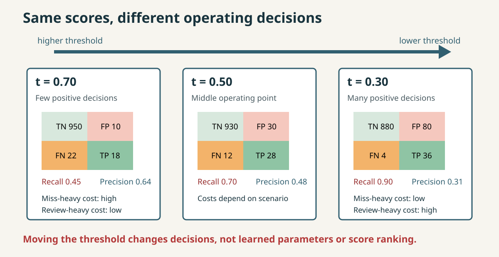
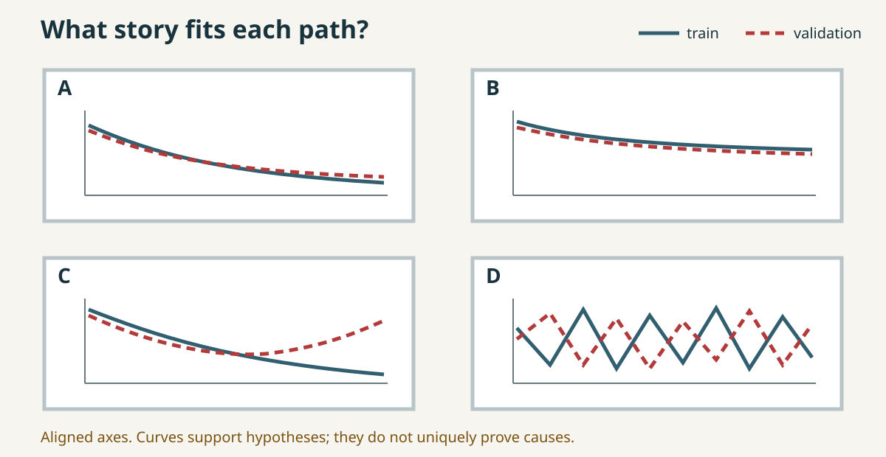
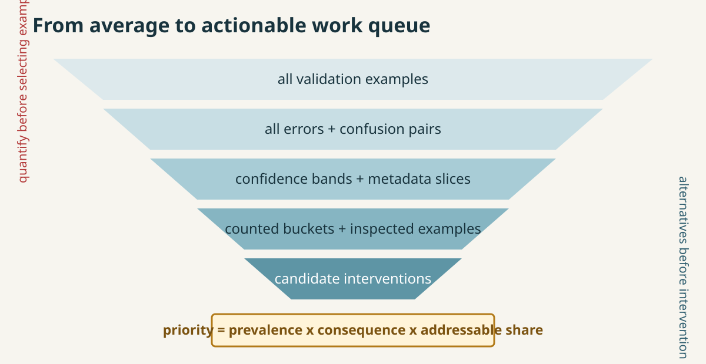
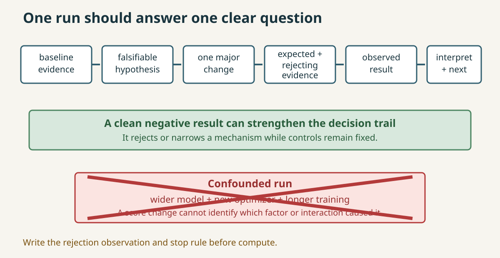
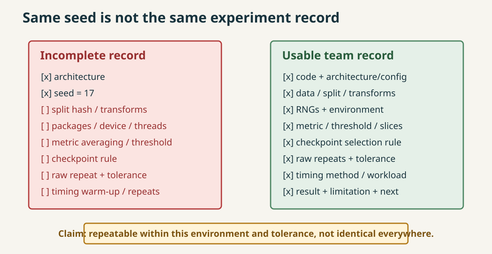
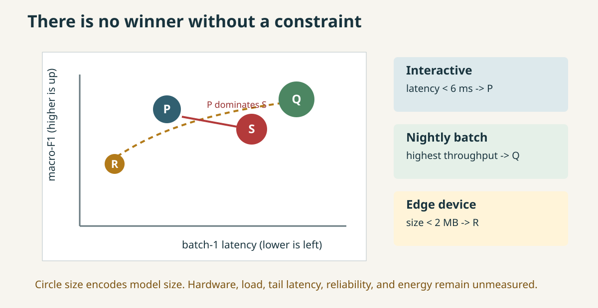
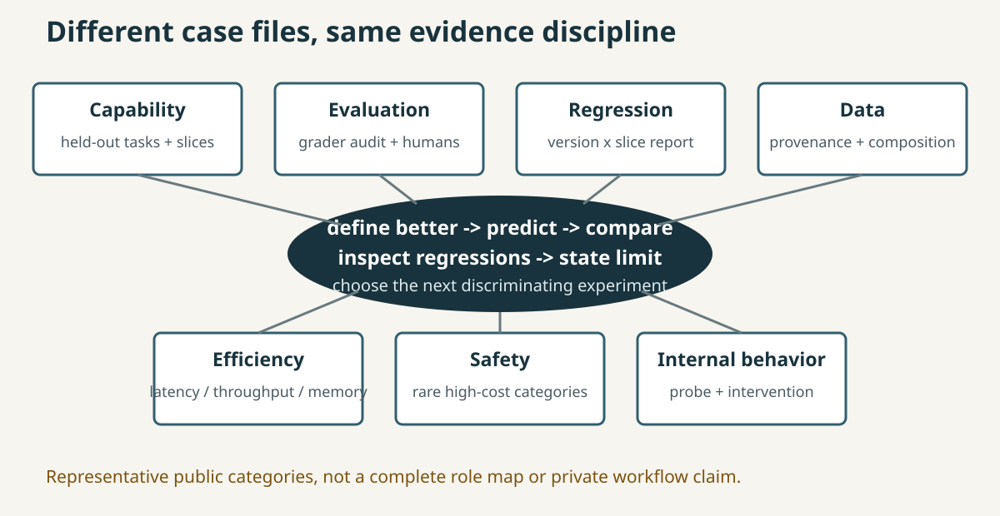
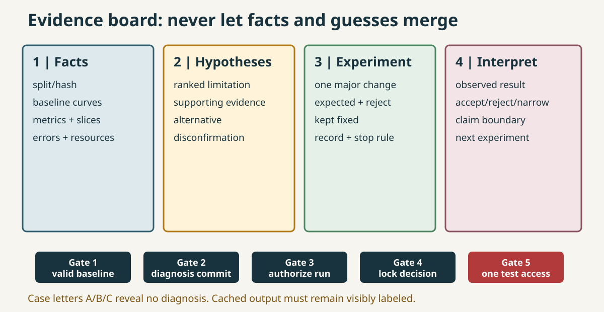
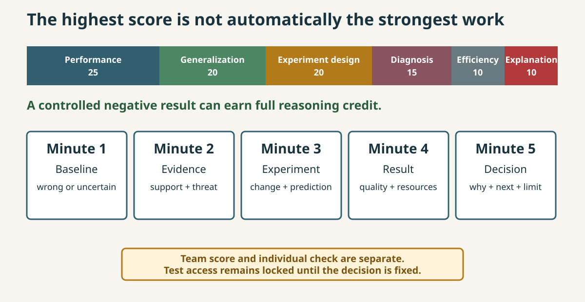

<!-- Editable instructor source. Export participant decks without speaker notes. The delivery PDF is render-validated; rerender after source changes. -->

# 01 | Day 4: Think Like an ML Engineer

## The model trained. Is it good, and what should improve next?

**Retrieve:** your original Day 3 live response and appended consolidation in **Day 3 Checks**.

<!--
Speaker notes: Give learners one minute to open the actual artifacts without editing them. State that Day 4 evaluates decisions, not ownership of a favorite metric or model.
Visual direction: The question sits above a four-link claim/evidence/limitation/experiment chain.
Alt text: The Day 4 question asks whether a trained model is good and what should improve, followed by a prompt to retrieve the original Day 3 evidence chain.
-->

---

# 02 | Which Link Fails First?

Compare three anonymized Day 3 consolidation chains:

1. bounded claim + real limitation + discriminating experiment;
2. limitation that cannot threaten the claim;
3. next experiment that changes too many things.

**Revise only the failed link in your own chain.**

<!--
Speaker notes: Project the three selected chains. Ask what evidence would make each claim less likely. Do not reward longer responses; reward sharper discrimination.
Visual direction: Three horizontal chains use one broken-link marker each, without revealing a preferred model result.
Alt text: Three anonymized evidence chains differ in limitation quality and experiment focus; learners identify and repair only the first failed link.
-->

---

# 03 | Today's Evidence Arc

**consequence -> metric/threshold -> curves -> slices -> one experiment -> reproducibility -> resources -> transfer -> defense**

At every step:

**claim -> evidence -> alternative -> decision -> next discriminating check**

450 minutes: protected breaks, lunch, and final buffer

<!--
Speaker notes: Preview the causal arc, not a catalogue. State that ROC mechanics, mixed-precision implementation, quantization, model parallelism, and deep safety/interpretability systems will not displace the core investigation.
Visual direction: One horizontal arc with the reusable evidence loop beneath it.
Alt text: Day 4 progresses from consequences and threshold decisions through diagnosis, controlled experiments, resources, transfer, and a final defense.
-->

---

# 04 | Start with the Consequence

Before a metric, ask:

1. What decision will be made?
2. Which class is positive?
3. Who experiences false positives and false negatives?
4. What evidence would change the operating point?

**Accuracy can be correct and still answer the wrong question.**

<!--
Speaker notes: Use a rare urgent-routing example. Ask learners to name both affected parties before showing any formula.
Visual direction: Four consequence questions surround a covered metric panel.
Alt text: Four questions place decision, positive class, affected parties, and operating evidence before metric selection.
-->

---

# 05 | Confusion Matrix = Consequence Map

|  | Predicted negative | Predicted positive |
|---|---:|---:|
| Actual negative | `TN` | `FP` |
| Actual positive | `FN` | `TP` |

$$
\text{precision}=\frac{TP}{TP+FP},\qquad
\text{recall}=\frac{TP}{TP+FN}
$$

**Rows are true labels; columns are predicted labels.**

<!--
Speaker notes: Label axes before calculating. Ask what condition makes precision undefined and how an explicit zero_division policy should expose rather than hide no-positive behavior.
Visual direction: A 2x2 matrix labels stakeholders or consequences beside FP and FN cells.
Alt text: A confusion matrix uses actual-label rows and predicted-label columns, with precision and recall formulas tied to false-positive and false-negative consequences.
-->

---

# 06 | Move the Threshold, Move the Decision

<!--
Speaker notes: Reveal high, middle, then low threshold. Require benefit and harm before each reveal. Emphasize that the scores and model parameters remain fixed.
Visual direction: Animate or step through the three columns left to right when the presentation system permits.
Asset path: courseware/shared/assets/day-4/threshold-confusion-cost.svg.
Alt text: Three threshold operating points show false negatives falling and false positives rising while two consequence models favor different decisions.
-->

---

# 07 | ACT-D4-01: Cost Council

Scenario A:

$$
\text{cost}=5(FP)+250(FN)
$$

Commit before the reveal:

- threshold direction;
- expected benefit and harm;
- minimum metric/count set;
- evidence that would reverse the decision.

Then the cost ratio changes.

<!--
Speaker notes: Collect original votes. After moving the threshold, replace Scenario A with the review-heavy scenario. Credit revision quality, not consistency with the first guess.
Visual direction: A cost card changes while the underlying sorted score strip remains fixed.
Alt text: A cost council commits to threshold direction and evidence under a miss-heavy cost model before the cost ratio changes.
-->

---

# 08 | F1 Is a Choice, Not a Universal Answer

$$
F_1=2\frac{\text{precision}\cdot\text{recall}}{\text{precision}+\text{recall}}
$$

F1 weights precision and recall equally.

It does **not** encode:

- a 50:1 error cost;
- review capacity;
- delayed or uneven harm;
- stakeholder policy.

<!--
Speaker notes: Hold predictions fixed and change costs. Ask whether the same F1 and threshold remain sufficient. Accept F-beta or constrained rules when tied to the scenario.
Visual direction: One unchanged F1 value sits above two different cost cards and different recommendations.
Alt text: The same F1 value can support different operating decisions because F1 does not contain stakeholder costs or operational constraints.
-->

---

# 09 | PR and ROC: Overview, Not an Operating Answer

- Precision-recall: how positive-decision quality and coverage trade over thresholds.
- ROC: true-positive rate versus false-positive rate over thresholds.
- ROC AUC: ranking summary across thresholds.

AUC does not choose a deployment threshold.

**The operating point still needs consequences and constraints.**

<!--
Speaker notes: Keep mechanics bounded. Do not derive curve construction. Ask which curve is often more revealing when positives are rare, then return to the decision rather than declaring a universal winner.
Visual direction: Two small curve silhouettes lead to a separate threshold-and-cost decision box.
Alt text: Precision-recall and ROC summarize threshold behavior, while a separate consequence box determines the operating threshold.
-->

---

# 10 | LAB-D4-01: Accuracy Is Not Enough

**Predict:** majority-baseline minority recall and threshold direction.  
**Observe:** accuracy beside recall/F1, confusion counts, PR point, and cost.  
**Decide:** an operating point for each scenario.  
**Debrief:** what changed when the threshold moved, and what did not?

`courseware/day-4/labs/LAB-D4-01-accuracy-is-not-enough.ipynb`

<!--
Speaker notes: The participant notebook passed local CPU validation with notes. Keep the recommendation and mechanism debrief central; use participant-safe cached evidence only after one bounded recovery attempt. Do not claim hosted Colab validation.
Visual direction: Four lab phases surround a locked notebook icon; no expected answer values shown.
Alt text: The first lab moves from a majority-baseline prediction through threshold evidence to a scenario-specific operating recommendation and mechanism debrief.
-->

---

# 11 | ACT-D4-02: Mystery Curves

<!--
Speaker notes: Hide all configuration labels. For every card require two observations, one competing explanation, and one requested evidence reveal.
Visual direction: Display all cards on aligned axes; reveal configuration clues one at a time only after commitments.
Asset path: courseware/shared/assets/day-4/mystery-curves.svg.
Alt text: Four unlabeled curve cards support hypotheses about healthy training, underfitting, overfitting, and optimization failure but do not uniquely prove causes.
-->

---

# 12 | Diagnose the Relationship, Not One Number

| Evidence | Leading family | Do not conclude yet |
|---|---|---|
| train + validation weak, smooth plateau | high bias / underfit | exact cause |
| strong train, validation worsens | high variance / overfit | split is valid |
| oscillation/divergence | optimization or implementation | more capacity helps |
| stable improvement, modest gap | healthy relative to current evidence | every slice is healthy |

**A small gap can still mean both are bad.**

<!--
Speaker notes: Ask learners to correct 'high validation error means overfitting.' Require absolute train behavior and trajectory before labels.
Visual direction: Evidence rows point to hypothesis families, while a right column blocks overconfident conclusions.
Alt text: A diagnostic matrix distinguishes weak fit, widening generalization gap, unstable optimization, and healthy relative behavior while listing what each pattern cannot establish.
-->

---

# 13 | LAB-D4-02: Model Detective

**Curves -> confusion pairs -> confidence -> slices -> selected errors -> one next experiment**

Before the configuration reveal:

- diagnose from two observations;
- name an alternative;
- request one discriminating evidence card.

`courseware/day-4/labs/LAB-D4-02-model-detective.ipynb`

<!--
Speaker notes: The participant notebook passed local CPU validation with notes. Do not let selected error images replace counts, and do not claim hosted Colab validation.
Visual direction: A locked configuration sits behind a sequence of evidence panels.
Alt text: The model-detective lab moves from hidden curves through quantified local evidence to one falsifiable next experiment.
-->

---

# 14 | Error Analysis Is a Funnel

<!--
Speaker notes: Ask at which stage cherry-picking becomes possible. Emphasize that bucket overlap must be explicit and visual examples require prevalence counts.
Visual direction: Reveal each funnel band only after learners state what information the previous aggregate hides.
Asset path: courseware/shared/assets/day-4/error-funnel.svg.
Alt text: Error analysis progressively adds localization and quantification before interventions are prioritized by prevalence, consequence, and likely addressability.
-->

---

# 15 | Largest Bucket Is Not Automatically First

| Bucket | Count | Cost | Addressable share |
|---|---:|---:|---:|
| faint digits | 24 | 3 | 0.50 |
| `3 -> 8` | 31 | 1 | 0.60 |
| suspected labels | 8 | 8 | 0.75 |

**Choose a priority rule. Then state what would falsify the intervention mechanism.**

<!--
Speaker notes: Let teams compute a rough expected-value proxy. Accept different priorities when cost, fixability, and uncertainty are explicit. State that the proxy does not prove cause.
Visual direction: Three bucket cards change order when sorting by count, weighted cost, or expected addressable value.
Alt text: Three error buckets rank differently by count, consequence, and estimated addressability, requiring an explicit prioritization rule.
-->

---

# 16 | Before Lunch: Individual Evidence

## `CHECK-D4-01` | 5-minute live minimum

Accuracy risk -> threshold benefit/harm -> AUC correction + reversing assumption.

## `CHECK-D4-02` | 5-minute live minimum

Curve diagnosis + alternative -> quantified slice priority -> action + rejection evidence.

**Append marked consolidation in Day 4 Checks by 16:30.**

<!--
Speaker notes: Collect each live minimum after exactly five minutes in Day 4 Checks. Do not let teams submit one shared response. Learners append the marked metric-set and gap-correction depth by 16:30 without replacing the live state. Use results to choose the afternoon remediation opener.
Visual direction: Two five-minute tickets show distinct metric and diagnosis evidence chains.
Alt text: Two individual readiness checks assess consequence-aware thresholding and curve-plus-slice diagnosis before lunch.
-->

---

# 17 | One Experiment Should Teach One Thing

<!--
Speaker notes: Contrast the chain with a run that changes width, optimizer, and duration. Require expected and rejection observations before compute.
Visual direction: Build the top chain left to right, then reveal the crossed-out confounded branch.
Asset path: courseware/shared/assets/day-4/experiment-chain.svg.
Alt text: A one-change evidence chain preserves attribution, while simultaneous width, optimizer, and training-duration changes make a score delta uninterpretable.
-->

---

# 18 | A Negative Result Can Be Excellent

A strong negative result:

- preserves the baseline and controls;
- tests a plausible mechanism;
- observes the declared rejection evidence;
- removes or narrows an explanation;
- chooses a sharper next experiment.

Information gained is an outcome.

<!--
Speaker notes: Ask learners for an example where no metric gain prevents a large wasted search. Contrast with an unexplained positive delta.
Visual direction: A hypothesis branch closes cleanly while the remaining branch becomes the next experiment.
Alt text: A controlled negative result closes one plausible explanation and focuses the next experiment even without a metric improvement.
-->

---

# 19 | Reproducibility Has a Boundary

<!--
Speaker notes: Current PyTorch guidance does not promise identical results across releases, platforms, or CPU/GPU. Ask which missing field invalidates a comparison even when seeds match.
Visual direction: Compare the two records, then reveal the environment-and-tolerance claim boundary.
Asset path: courseware/shared/assets/day-4/reproducibility-record.svg.
Alt text: A usable experiment record extends far beyond a seed and states repeatability only within a recorded environment and tolerance.
-->

---

# 20 | Timing Is an Experiment Too

Record:

- hardware, software, threads/device;
- input shape and batch/load;
- warm-up and repeats;
- median and useful tail statistic;
- synchronization for asynchronous accelerator work.

**GPU available != GPU utilized != lower end-to-end latency.**

<!--
Speaker notes: Explain that CUDA work may be asynchronous and naive wall timing can measure launch rather than completion. Keep implementation details out of scope; focus on measurement validity.
Visual direction: An end-to-end timeline separates input, transfer, launch, compute, synchronization, and output.
Alt text: A timing checklist qualifies performance claims by environment, workload, warm-up, repeated statistics, and accelerator synchronization.
-->

---

# 21 | Quality Lives on a Resource Frontier

<!--
Speaker notes: Ask learners to identify the dominated point before scenarios. Then switch from interactive to nightly batch to edge constraints and require a new choice.
Visual direction: Reveal points first, dominance second, and scenario cards last.
Asset path: courseware/shared/assets/day-4/quality-resource-pareto.svg.
Alt text: The preferred model changes between interactive latency, batch throughput, and edge size constraints even when measured quality is similar.
-->

---

# 22 | ACT-D4-03: Constraint Changes the Winner

Round 1: batch-1 latency `< 6 ms`  
Round 2: highest nightly throughput  
Round 3: model size `< 2 MB`, macro-F1 `>= 0.920`

For each:

**choice + evidence + concession + missing measurement**

<!--
Speaker notes: Require one dominated option and one factor that could overturn a choice. Treat quality differences inside tolerance as ties.
Visual direction: A scenario switch changes the highlighted point without moving any measured model point.
Alt text: Three deployment constraints select different models and require an explicit quality concession and missing measurement.
-->

---

# 23 | LAB-D4-03: You Get One Experiment

**Before:** hypothesis, one major change, expected/rejecting evidence, stop rule.  
**During:** fixed split/seed policy/metric; bounded run.  
**After:** complete record, repeated result, quality/resource comparison, next experiment not run.

`courseware/day-4/labs/LAB-D4-03-one-experiment.ipynb`

<!--
Speaker notes: The participant notebook passed local CPU validation with notes, including its controlled negative-result path. Do not present planning metric bands as execution evidence or claim hosted Colab validation. Score a clean null result above a confounded gain.
Visual direction: Three columns separate precommitment, controlled execution, and interpretation.
Alt text: The one-experiment lab gates compute behind a falsifiable record and ends with repeatability plus quality-resource interpretation.
-->

---

# 24 | Transfer the Loop, Not the Scale Claim

For a new problem:

1. define "better";
2. choose held-out evidence and slices;
3. predict what should change;
4. inspect regressions and alternatives;
5. price resources;
6. state the claim boundary;
7. choose the next experiment.

<!--
Speaker notes: State that the next cases are representative public categories, not a private workflow map. Ask which step the classroom digits task can and cannot rehearse.
Visual direction: The seven-step loop repeats around different evidence objects.
Alt text: A reusable evaluation loop maps a defined improvement claim to held-out evidence, regressions, resources, limitations, and a next experiment.
-->

---

# 25 | Seven Representative Case Files

<!--
Speaker notes: Spend about one minute per paired category, not one minute per implementation. Ask what evidence could falsify improvement in each.
Visual direction: Reveal each evidence object, then connect all cards to the same loop.
Asset path: courseware/shared/assets/day-4/frontier-case-cards.svg.
Alt text: Capability, evaluation, regression, data, efficiency, safety, and internal-behavior work use different evidence objects but the same hypothesis-and-comparison discipline.
-->

---

# 26 | ACT-D4-04: Is It Better at Coding?

Design evidence for:

- held-out tasks and meaningful slices;
- executable grader **and its exploit path**;
- blinded human sample **and disagreement rule**;
- contamination control;
- unacceptable regression gate.

Then respond to an adversarial reveal.

<!--
Speaker notes: Reveal either a security-slice regression, grader exploit, contamination clue, or systematic reviewer disagreement. Require the team to narrow the claim or change the evaluation.
Visual direction: A broad claim enters five evidence gates before a bounded decision exits.
Alt text: A coding-capability claim passes through held-out tasks, grader audit, human review, contamination checks, and a regression policy before it can be supported.
-->

---

# 27 | Scope Boundaries Protect the Investigation

SHORTEN ROC mechanics and extended taxonomy

MOVE / reference

- mixed-precision implementation;
- quantization;
- model-parallel/distributed implementation;
- deep interpretability methods;
- complete safety engineering systems.

**Representative category != complete practice.**

<!--
Speaker notes: Name the topics without teaching them. Explain that adding implementation detail would remove capstone diagnosis and defense time.
Visual direction: Core evidence loop remains centered while moved topics sit in a clearly labeled reference rail.
Alt text: Advanced implementation topics are preserved as references outside the live path so controlled investigation and defense remain intact.
-->

---

# 28 | Capstone Brief: Routing-Code Digits

You inherit:

- a fixed train/validation/test manifest;
- one anonymous case `A`, `B`, or `C`;
- baseline curves, metrics, errors, and resource evidence;
- a fixed run budget;
- one final test authorization.

**Small digits make evidence visible; they do not create production realism.**

<!--
Speaker notes: State that scikit-learn digits contains 1,797 8x8 images. Case letters carry no diagnosis. Do not reveal profile intent.
Visual direction: A routing-code image strip leads to a sealed anonymous case file and fixed evidence budget.
Alt text: The capstone supplies a small fixed digits case, anonymous letter, existing evidence, limited compute, and locked final test access.
-->

---

# 29 | Capstone Contract

- one primary experiment;
- one major factor changed;
- evidence and rejection criterion before compute;
- test locked until the decision is fixed;
- optional follow-up only if authorized;
- cached outputs visibly labeled;
- negative results preserved.

Do not spend interpretation time buying another run.

<!--
Speaker notes: Ask teams to repeat the test-lock rule. Explain that declining an optional run can be an efficiency strength.
Visual direction: Seven contract clauses surround one limited experiment token and one locked test token.
Alt text: The capstone contract limits teams to one controlled primary run and one authorized test access while preserving negative and cached evidence.
-->

---

# 30 | The Evidence Board Has Four Lanes

<!--
Speaker notes: Facts cannot include causal language. Hypotheses must include alternatives. Interpretation occurs before test access. Walk teams through the five gates without profile hints. The team board and defense exclude individual_transfer; each learner completes CHECK-D4-04 separately after the defense.
Visual direction: Reveal lanes left to right, then gates below. Keep Gate 5 red and locked until authorization.
Asset path: courseware/shared/assets/day-4/capstone-evidence-board.svg.
Alt text: A four-lane evidence board prevents facts, hypotheses, experiment records, and interpretations from merging, while five gates protect the test policy.
-->

---

# 31 | Anonymous Means Anonymous

Your case is only:

# `A` | `B` | `C`

Do not infer meaning from:

- letter;
- color;
- filename;
- variable name;
- another team's intervention.

**Score the evidence chain, not hidden-answer matching.**

<!--
Speaker notes: Assign cases evenly and confirm team roles. If learners hunt for a key, restate that multiple diagnoses and interventions can be defensible.
Visual direction: Three identical sealed folders differ only by a neutral letter.
Alt text: Three visually identical sealed case folders labeled A, B, and C emphasize that case identity does not reveal a diagnosis.
-->

---

# 32 | Capstone Rubric: 100 Points

<!--
Speaker notes: Read the weights once. Point out that 55% of points lie outside performance/generalization and that controlled negative results can earn full reasoning credit.
Visual direction: Reveal rubric weights before the five-minute defense sequence.
Asset path: courseware/shared/assets/day-4/capstone-rubric-defense.svg.
Alt text: The rubric balances model results with experiment design, diagnosis, efficiency, and explanation rather than ranking teams by accuracy alone.
-->

---

# 33 | Five-Minute Defense

1. What was wrong or uncertain?
2. What evidence supports **and threatens** the diagnosis?
3. What one factor changed, and what was predicted?
4. What happened to quality, generalization, slices, and resources?
5. Why, what can you claim, and what comes next?

**Peers submit one skeptical question.**

<!--
Speaker notes: Hold each team to one minute per stage. The 20-minute block supports four sequential defenses; larger cohorts use preassigned parallel panels or timed recordings with the same rubric, skeptical-question rule, and separate individual checks. Ask one question about disconfirmation, test policy, negative result, or resource portability. Do not reveal case diagnoses between defenses.
Visual direction: A five-segment timer advances through baseline, evidence, experiment, result, and decision.
Alt text: The defense uses five one-minute stages to connect baseline uncertainty through evidence, experiment, result, and a calibrated next decision.
-->

---

# 34 | Finish Individually, Leave with the Loop

## `CHECK-D4-03` | 5-minute live minimum

Two inference blockers -> one-change expected/rejecting evidence -> calibrated quality claim.

## `CHECK-D4-04` | 5-minute live minimum

Bounded claim -> two alternatives -> decision -> supporting/rejecting next evaluation -> individual transfer.

**Final loop:** consequence -> evidence -> alternative -> one experiment -> interpretation -> resource cost -> honest claim

<!--
Speaker notes: Collect individual live minima separately from team rubric scores. Learners append the marked D4-03 record/resource consolidation by 16:30 without replacing the live state; D4-04 has no team or consolidation substitute. Use the remaining buffer only for closing retrieval, a must-land correction, or clean close. End with the four-day journey from forward mechanics to a defended engineering decision.
Visual direction: Two individual tickets converge on the final evidence loop; no new topic follows.
Alt text: Two final individual checks assess experiment discipline and transfer before the course closes on an evidence-driven decision loop.
-->
